# [ AI 기반 주차난 해결 서비스 SmartPark ]

## 소프트웨어설계서

문서번호 : [최수연]소프트웨어설계서\_260523_Doc-001  
프로젝트명 : AI 기반 주차난 해결 서비스  
서비스명 : SmartPark  
소속 : 소프트웨어학과  
팀명 : SmartPark  
팀원 : 2023121183 최수연  
GitHub Public Repository 링크 : https://github.com/csy5271abcd/software-engineering-ai-parking-service  
문서 위치 : `docs/design/과제5.소프트웨어설계서.md`

---

# 제/개정 이력

| 버전 | 날짜       | 작성자 | 제/개정사항                          | 비고         |
| ---- | ---------- | ------ | ------------------------------------ | ------------ |
| 1.0  | 2026.05.23 | 최수연 | SmartPark 소프트웨어설계서 최초 작성 | 과제5 산출물 |

---

# 목차

1. 서론  
   1.1 목적 및 범위  
   1.2 대상 시스템 개요  
   1.3 용어 정의  
   1.4 참조 문서

2. 소프트웨어 아키텍처  
   2.1 전체 시스템 구조  
   2.2 정적 구조  
   2.3 동적 구조  
   2.4 패키지/모듈 개요  
   2.5 소프트웨어 아키텍처 요약

3. 모듈/패키지 설계  
   3.1 SDD-M-001 : Mobile App Module  
   3.2 SDD-M-002 : Auth Module  
   3.3 SDD-M-003 : Parking Search Module  
   3.4 SDD-M-004 : Parking Management Module  
   3.5 SDD-M-005 : Session & NFC Module  
   3.6 SDD-M-006 : Payment Module  
   3.7 SDD-M-007 : Congestion Analysis Module  
   3.8 SDD-M-008 : Admin Module  
   3.9 SDD-M-009 : External API Module  
   3.10 모듈 간 협력 요약

4. 인터페이스 설계  
   4.1 외부 시스템 인터페이스  
   4.2 내부 API 인터페이스  
   4.3 사용자 인터페이스

5. 데이터 설계  
   5.1 데이터 설계 개요  
   5.2 주요 엔티티 설계  
   5.3 테이블 구조  
   5.4 데이터 관계  
   5.5 상태값 설계  
   5.6 데이터 설계 요약

6. 구현 기술 설계  
   6.1 프론트엔드 구현 기술  
   6.2 백엔드 구현 기술  
   6.3 데이터베이스 구현 기술  
   6.4 AI 혼잡도 분석 구현 기술  
   6.5 외부 API 연동 기술  
   6.6 형상관리 및 배포 환경

7. 요구사항 추적표  
   7.1 요구사항 추적표 개요  
   7.2 추적 대상 모듈  
   7.3 기능 요구사항 목록  
   7.4 요구사항-모듈 추적표  
   7.5 요구사항-화면-API-데이터 추적표  
   7.6 요구사항-테스트 관점 추적표  
   7.7 요구사항 추적 요약

8. 참고문헌 및 부록  
   8.1 참고문헌  
   8.2 GitHub Repository 링크  
   8.3 이미지 파일 목록  
   8.4 주요 API 목록  
   8.5 주요 오류 코드  
   8.6 GitHub 반영 기준

---

# 1. 서론

## 1.1 목적 및 범위

본 문서는 SmartPark의 **AI 기반 주차난 해결 서비스**에 대한 소프트웨어 설계 사항을 정의하기 위해 작성되었다. SmartPark는 사용자의 현재 위치 또는 목적지를 기준으로 주변 주차 가능 공간을 탐색하고, 주차장의 이용 가능 여부, 요금, 운영 시간, 거리, 혼잡도 정보를 제공하는 스마트 주차 서비스이다. 또한 개인 및 상가 주차 공간 등록, NFC 기반 주차 이용 시작·종료, 이용 시간 기반 결제, AI 또는 규칙 기반 혼잡도 분석 기능을 통해 사용자가 실제 주차 가능성이 높은 공간을 선택할 수 있도록 지원한다.

본 소프트웨어설계서는 앞서 작성한 프로젝트 정의서, 프로젝트 관리 계획서, 요구사항 정의서, 요구사항 분석서를 기반으로 SmartPark 시스템을 실제 구현 가능한 구조로 구체화하는 것을 목적으로 한다. 요구사항 분석서에서 도출한 Actor, Use Case, 주요 클래스, CRC 카드, 동적 분석, 인터페이스 분석 결과를 바탕으로 시스템 아키텍처, 모듈 구조, 인터페이스, 데이터 구조, 구현 기술, 요구사항 추적 관계를 설계한다.

본 문서의 작성 목적은 다음과 같다.

| 구분                | 내용                                                                                                                 |
| ------------------- | -------------------------------------------------------------------------------------------------------------------- |
| 설계 기준 정의      | SmartPark 시스템을 구성하는 주요 모듈, 패키지, 클래스, 데이터 구조를 정의한다.                                       |
| 구현 구조 구체화    | React Native 모바일 앱, Spring Boot 백엔드, MySQL 데이터베이스, Python AI 분석 모듈의 역할과 연결 구조를 구체화한다. |
| 인터페이스 명확화   | 모바일 앱, 백엔드 API, 외부 지도 API, 결제 API, NFC 태그, AI 분석 모듈 간 연동 방식을 정의한다.                      |
| 데이터 설계         | 사용자, 공급자, 주차장, 주차 공간, 주차 세션, 결제, 신고, 혼잡도 예측 데이터의 저장 구조를 정의한다.                 |
| 추적성 확보         | 기능 요구사항, Use Case, 모듈, 화면, API, 데이터 간의 연결 관계를 정리한다.                                          |
| 후속 구현 기준 제공 | 프론트엔드, 백엔드, AI 분석 모듈 구현 및 테스트 단계에서 기준 문서로 활용한다.                                       |

본 문서의 범위는 SmartPark의 MVP 수준에서 구현 가능한 핵심 기능을 중심으로 한다. 다만 향후 서비스 확장 가능성을 고려하여 관리자 기능, 신고 처리, 정산, 운영 통계, AI 혼잡도 고도화와 같은 확장 기능도 설계 범위에 포함한다.

본 문서에서 다루는 주요 설계 범위는 다음과 같다.

| 설계 범위           | 내용                                                                                               |
| ------------------- | -------------------------------------------------------------------------------------------------- |
| 소프트웨어 아키텍처 | 전체 시스템 구조, 정적 구조, 동적 구조, 패키지/모듈 개요                                           |
| 모듈/패키지 설계    | 모바일 앱, 인증, 주차장 탐색, 주차장 관리, NFC 세션, 결제, 혼잡도 분석, 관리자, 외부 API 모듈 설계 |
| 인터페이스 설계     | 외부 시스템 인터페이스, 내부 REST API, 사용자 인터페이스 설계                                      |
| 데이터 설계         | 주요 엔티티, 테이블 구조, 데이터 관계, 상태값 설계                                                 |
| 구현 기술 설계      | 프론트엔드, 백엔드, 데이터베이스, AI 분석, 외부 API, 형상관리 기술 설계                            |
| 요구사항 추적       | 기능 요구사항과 설계 요소 간의 추적 관계 정리                                                      |

## 1.2 대상 시스템 개요

SmartPark는 도심 및 주거 지역에서 발생하는 주차 공간 부족 문제를 해결하기 위한 AI 기반 스마트 주차 플랫폼이다. 기존 지도 서비스나 주차장 검색 서비스가 주차장의 위치와 기본 정보 제공에 집중했다면, SmartPark는 사용자가 실제로 주차할 수 있는 가능성을 높이는 데 초점을 둔다.

SmartPark의 핵심 기능은 다음과 같다.

| 기능 ID | 기능명                                | 설명                                                                               |
| ------- | ------------------------------------- | ---------------------------------------------------------------------------------- |
| F-01    | 현재 위치 기반 주변 주차장 조회       | 사용자의 현재 위치를 기준으로 주변 주차장을 지도와 목록에 표시한다.                |
| F-02    | 목적지 기반 주차장 검색               | 목적지명 또는 주소를 입력하여 목적지 주변 주차장을 검색한다.                       |
| F-03    | 주차장 상세 정보 확인                 | 주차장의 위치, 요금, 운영 시간, 사진, 이용 가능 여부, 혼잡도를 확인한다.           |
| F-04    | 곧 비워질 자리 안내                   | 출차 예정 시간이 등록된 주차 공간을 곧 이용 가능한 공간으로 표시한다.              |
| F-05    | 개인/상가 주차 공간 등록              | 공급자가 공유 가능한 주차 공간의 위치, 사진, 이용 조건을 등록한다.                 |
| F-06    | 이용 가능 시간 및 요금 설정           | 공급자가 공유 가능한 시간대와 요금 정책을 설정한다.                                |
| F-07    | NFC 기반 주차 이용 시작/종료          | NFC 태그를 통해 주차 이용 시작과 종료를 기록한다.                                  |
| F-08    | 이용 시간 기반 결제 및 결제 내역 저장 | 이용 시간을 기준으로 요금을 계산하고 결제 내역을 저장한다.                         |
| F-09    | AI/규칙 기반 혼잡도 분석 및 추천      | 시간대, 지역, 과거 이용 데이터 등을 기반으로 주차장 혼잡도와 추천 점수를 계산한다. |
| F-10    | 관리자 주차장 등록 승인/반려          | 운영 관리자가 공급자의 주차장 등록 신청을 승인 또는 반려한다.                      |
| F-11    | 신고 및 분쟁 관리                     | 이용자와 공급자가 신고를 등록하고 관리자가 처리할 수 있도록 한다.                  |
| F-12    | 결제 오류 및 환불 관리                | 결제 실패, 중복 결제, 환불 요청을 관리한다.                                        |
| F-13    | 운영 통계 확인                        | 주차장 이용률, 결제, 신고, 혼잡도 등 운영 통계를 확인한다.                         |

SmartPark 시스템은 다음 구성 요소로 이루어진다.

| 구성 요소                        | 설명                                                                                                                   |
| -------------------------------- | ---------------------------------------------------------------------------------------------------------------------- |
| React Native 모바일 앱           | 일반 이용자와 공급자가 주차장 검색, 상세 조회, NFC 이용, 결제, 등록 기능을 사용하는 클라이언트 애플리케이션이다.       |
| React 관리자 화면 또는 관리자 웹 | 서비스 운영 관리자가 등록 승인, 신고 처리, 결제 오류, 운영 통계를 관리하는 화면이다.                                   |
| Spring Boot 백엔드 서버          | 모바일 앱과 관리자 화면의 요청을 처리하고, 비즈니스 로직, 인증, 주차장 조회, 세션, 결제, 신고, 관리자 기능을 제공한다. |
| MySQL 데이터베이스               | 사용자, 공급자, 주차장, 주차 공간, 이용 세션, 결제, 신고, 혼잡도 예측 결과를 저장한다.                                 |
| Python AI 분석 모듈              | 주차장 이용 데이터, 시간대, 지역 특성 등을 기반으로 혼잡도와 추천 점수를 계산한다.                                     |
| Naver Maps API                   | 지도 표시, 장소 검색, 주소 변환, 경로 안내 기능을 제공한다.                                                            |
| 결제 API                         | 주차 이용 요금 결제 승인, 실패, 환불 처리를 수행한다.                                                                  |
| NFC 태그                         | 주차 공간의 이용 시작과 종료를 확인하기 위한 물리적 인증 수단이다.                                                     |

SmartPark의 기본 동작 흐름은 다음과 같다.

```text
사용자 앱 실행
→ 현재 위치 또는 목적지 입력
→ 주변 주차장 조회
→ 주차장 상세 정보 및 혼잡도 확인
→ 주차장 선택
→ NFC 기반 이용 시작
→ 이용 종료
→ 요금 계산 및 결제
→ 이용 내역 저장
```

공급자 흐름은 다음과 같다.

```text
공급자 로그인
→ 주차 공간 등록
→ 이용 가능 시간 및 요금 설정
→ 관리자 승인 대기
→ 승인 후 사용자 검색 결과에 노출
→ 이용 내역 및 정산 확인
```

관리자 흐름은 다음과 같다.

```text
관리자 로그인
→ 승인 대기 주차장 확인
→ 등록 정보 검토
→ 승인/반려/보완 요청 처리
→ 신고 및 결제 오류 처리
→ 운영 통계 확인
```

## 1.3 용어 정의

본 문서에서 사용하는 주요 용어와 약어는 다음과 같다.

| 용어                  | 설명                                                                                                 |
| --------------------- | ---------------------------------------------------------------------------------------------------- |
| SmartPark             | AI 기반 주차난 해결 서비스를 제공하는 본 프로젝트의 서비스명이다.                                    |
| 이용자                | 주차 공간을 검색하고 실제로 주차장을 이용하는 일반 사용자이다.                                       |
| 일반 운전자           | 현재 위치 또는 목적지 주변에서 주차 공간을 찾는 사용자이다.                                          |
| 일정 기반 방문 운전자 | 병원 예약, 회의, 공연 등 정해진 도착 시간이 있는 사용자이다.                                         |
| 공급자                | 개인 또는 상가/건물의 유휴 주차 공간을 SmartPark에 등록하고 공유하는 사용자이다.                     |
| 관리자                | SmartPark 서비스 운영, 주차장 등록 승인, 신고 처리, 결제 오류 관리 등을 담당하는 사용자이다.         |
| 주차장                | 여러 개의 주차 공간을 포함하는 주차 시설 또는 공유 가능한 주차 장소이다.                             |
| 주차 공간             | 실제 차량 1대가 주차할 수 있는 개별 공간이다.                                                        |
| 곧 비워질 자리        | 현재 사용 중이지만 출차 예정 시간이 등록되어 일정 시간 내 이용 가능할 것으로 예상되는 주차 공간이다. |
| 혼잡도                | 특정 주차장 또는 지역의 주차 가능성이 낮아지는 정도를 나타내는 지표이다.                             |
| 추천 점수             | 거리, 요금, 이용 가능 여부, 혼잡도 등을 종합하여 산출한 주차장 추천 기준 점수이다.                   |
| AI 혼잡도 분석        | 시간대, 지역 특성, 과거 이용 데이터, 출차 예정 정보 등을 바탕으로 주차장 혼잡도를 예측하는 기능이다. |
| NFC                   | Near Field Communication의 약자로, 근거리 무선 통신을 통해 태그를 인식하는 기술이다.                 |
| NFC 태그              | 주차 이용 시작 또는 종료를 확인하기 위해 주차 공간에 부착되는 태그이다.                              |
| Geocoding             | 주소 또는 장소명을 위도/경도 좌표로 변환하는 기능이다.                                               |
| Reverse Geocoding     | 위도/경도 좌표를 주소 정보로 변환하는 기능이다.                                                      |
| Directions5           | 출발지와 목적지 사이의 경로 정보를 제공하는 Naver Maps API의 길찾기 기능이다.                        |
| Naver Maps API        | 지도 표시, 주소 변환, 경로 안내 등 위치 기반 기능을 제공하는 외부 지도 API이다.                      |
| 결제 API              | 주차 이용 요금을 결제하기 위해 외부 결제 대행 서비스와 연동하는 인터페이스이다.                      |
| 주차 세션             | 사용자의 주차 이용 시작부터 종료까지의 이용 기록이다.                                                |
| 정산                  | 공급자에게 주차 이용 수익을 지급하기 위해 결제 금액을 계산하고 처리하는 과정이다.                    |
| 신고                  | 이용자 또는 공급자가 잘못된 주차 정보, 결제 문제, 이용 분쟁 등을 운영자에게 접수하는 기능이다.       |
| REST API              | HTTP 메서드를 활용하여 클라이언트와 서버가 데이터를 주고받는 API 설계 방식이다.                      |
| DTO                   | Data Transfer Object의 약자로, 계층 간 데이터 전달을 위해 사용하는 객체이다.                         |
| Entity                | 데이터베이스 테이블과 매핑되는 도메인 객체이다.                                                      |
| Repository            | 데이터베이스에 접근하여 데이터를 조회, 저장, 수정, 삭제하는 계층이다.                                |
| Service               | 비즈니스 로직을 처리하는 계층이다.                                                                   |
| Controller            | 클라이언트 요청을 받아 Service 계층으로 전달하고 응답을 반환하는 계층이다.                           |
| MVP                   | Minimum Viable Product의 약자로, 핵심 기능을 검증하기 위한 최소 기능 제품이다.                       |
| SDD                   | Software Design Description의 약자로, 소프트웨어 설계 내용을 설명하는 문서이다.                      |

## 1.4 참조 문서

본 소프트웨어설계서는 다음 문서를 기반으로 작성한다.

| 문서명                                          | 설명                                                                               | 활용 내용                                     |
| ----------------------------------------------- | ---------------------------------------------------------------------------------- | --------------------------------------------- |
| `[최수연]시스템정의서_260313_Doc-001.pdf`       | SmartPark의 시스템명, 시스템 설명, 운영 환경, 주요 기능을 정의한 문서              | 시스템 개요와 핵심 기능 도출                  |
| `[최수연]프로젝트관리계획서_260413_Doc-001.pdf` | 개발 계획, 일정, 개발 환경, 산출물 관리 기준을 정의한 문서                         | 프로젝트 범위, 일정, 개발 환경 확인           |
| `과제3.요구사항정의서.md`                       | 기능 요구사항, 비기능 요구사항, 인터페이스 요구사항, 데이터 요구사항을 정리한 문서 | 설계 대상 요구사항 기준                       |
| `과제4.요구사항분석서.md`                       | Actor, Use Case, 정적 분석, CRC 카드, 동적 분석, 인터페이스 분석을 정리한 문서     | 모듈, 클래스, 데이터, 동적 흐름 설계 기준     |
| `PERSONA.md`                                    | SmartPark의 주요 사용자 유형과 대표 페르소나를 정의한 문서                         | 사용자 유형 및 화면 설계 근거                 |
| `USER_JOURNEY.md`                               | 일반 이용자, 공급자, 관리자 관점의 서비스 이용 흐름을 정리한 문서                  | 사용자 흐름과 화면 흐름 설계 근거             |
| `SERVICE_SCENARIO.md`                           | 실제 서비스 이용 상황과 예외 흐름을 시나리오 단위로 정리한 문서                    | 패키지 행위와 예외 흐름 설계 근거             |
| `COMPETITOR_ANALYSIS.md`                        | 기존 주차 서비스와 SmartPark의 차별성을 분석한 문서                                | 차별 기능과 설계 우선순위 도출                |
| `BUSINESS_MODEL.md`                             | 목표 시장, 가치 제안, 수익 모델, 운영 구조를 정리한 문서                           | 결제, 정산, 공급자, 관리자 기능 설계 근거     |
| `PRD.md`                                        | SmartPark 제품 요구사항과 MVP 범위를 정리한 문서                                   | 제품 목표, 기능 범위, MVP 기준 확인           |
| `FEATURE_SPEC.md`                               | 기능별 상세 동작, 입력값, 출력값, 예외 상황, API 후보를 정리한 문서                | API, 모듈, 멤버함수 설계 근거                 |
| `SCREEN_STRUCTURE.md`                           | React Native 앱의 화면 구조와 네비게이션을 정리한 문서                             | 사용자 인터페이스 및 화면-API 연결 설계 근거  |
| `CLAUDE.md`                                     | React Native 프론트엔드 작업 지침 문서                                             | 프론트엔드 화면 및 컴포넌트 설계 기준         |
| `CODEX.md`                                      | Spring Boot 백엔드 및 문서화 작업 지침 문서                                        | 백엔드 계층 구조, API, 데이터베이스 설계 기준 |
| `PROJECT_RULES.md`                              | 프로젝트 코드, 문서, 폴더, commit/tag 규칙을 정의한 문서                           | 문서 작성 및 형상관리 기준                    |
| `FOLDER_STRUCTURE.md`                           | 저장소 폴더 구조와 각 폴더의 역할을 설명한 문서                                    | 산출물 위치 및 파일 관리 기준                 |
| `configuration_management_plan.md`              | 형상관리, 변경통제, 버전관리, 기록유지 방법을 정의한 문서                          | 변경 이력, GitHub 관리 기준                   |
| `README.md`                                     | SmartPark 프로젝트 개요, 기술 스택, 저장소 구조를 정리한 문서                      | 프로젝트 소개 및 전체 구조 참고               |

---

# 2. 소프트웨어 아키텍처

본 장에서는 SmartPark 시스템의 전체 소프트웨어 구조를 정의한다.  
소프트웨어 아키텍처는 시스템을 구성하는 주요 컴포넌트, 각 컴포넌트 간의 관계, 데이터 흐름, 외부 시스템 연동 구조를 설명하기 위한 설계 항목이다.

SmartPark는 React Native 기반 모바일 앱, Spring Boot 기반 백엔드 서버, MySQL 데이터베이스, Python 기반 AI 혼잡도 분석 모듈, Naver Maps API, 결제 API, NFC 태그를 연동하는 구조로 설계한다. 사용자는 모바일 앱을 통해 주차장을 조회하고, 백엔드 서버는 주차장 정보, 이용 세션, 결제, 신고, 혼잡도 정보를 처리한다. AI 분석 모듈은 주차장 이용 데이터와 시간대 정보를 기반으로 혼잡도 및 추천 점수를 계산하며, 계산 결과는 데이터베이스 또는 API를 통해 앱 화면에 제공된다.

## 2.1 전체 시스템 구조

SmartPark의 전체 시스템은 사용자 인터페이스 계층, 애플리케이션 서버 계층, 데이터 저장 계층, 외부 연동 계층, AI 분석 계층으로 구분한다.

| 계층                   | 구성 요소                            | 설명                                                                              |
| ---------------------- | ------------------------------------ | --------------------------------------------------------------------------------- |
| 사용자 인터페이스 계층 | React Native 모바일 앱, 관리자 화면  | 일반 이용자, 공급자, 관리자가 시스템 기능을 사용하는 화면을 제공한다.             |
| 애플리케이션 서버 계층 | Spring Boot 백엔드 서버              | 인증, 주차장 조회, 주차 공간 등록, 이용 세션, 결제, 신고, 관리자 기능을 처리한다. |
| 데이터 저장 계층       | MySQL 데이터베이스                   | 사용자, 주차장, 주차 공간, 주차 세션, 결제, 신고, 혼잡도 예측 결과를 저장한다.    |
| AI 분석 계층           | Python AI/규칙 기반 혼잡도 분석 모듈 | 시간대, 지역, 과거 이용 데이터 등을 기반으로 혼잡도와 추천 점수를 계산한다.       |
| 외부 연동 계층         | Naver Maps API, 결제 API, NFC 태그   | 지도, 장소 검색, 경로 안내, 결제 승인, 주차 이용 인증 기능을 제공한다.            |

전체 구조는 다음과 같이 표현할 수 있다.

```text
일반 운전자 / 공급자 / 관리자
        ↓
React Native 모바일 앱 또는 관리자 화면
        ↓
Spring Boot 백엔드 서버
        ↓
MySQL 데이터베이스
        ↑
Python AI 혼잡도 분석 모듈

Spring Boot 백엔드 서버
        ↔ Naver Maps API
        ↔ 결제 API
        ↔ NFC 태그 인식 정보
```

위 구조에서 Spring Boot 백엔드 서버는 시스템의 중심 컴포넌트이다. 모바일 앱은 사용자 입력과 결과 표시를 담당하고, 백엔드 서버는 비즈니스 로직을 처리한다. MySQL 데이터베이스는 서비스 운영에 필요한 주요 데이터를 저장하며, Python AI 분석 모듈은 주차장별 혼잡도와 추천 점수를 계산한다. 외부 API는 지도, 경로, 결제, NFC 인증 기능을 보조한다.

### 2.1.1 전체 시스템 구조 이미지

아래 위치에는 SmartPark의 전체 시스템 아키텍처 이미지를 삽입한다.

```md
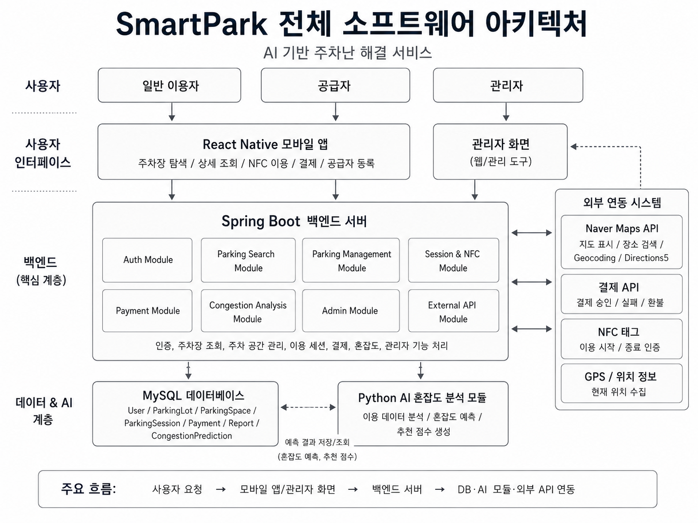
```

## 2.2 정적 구조

정적 구조는 SmartPark 시스템을 구성하는 주요 패키지와 클래스가 어떤 관계를 가지는지 나타낸다.
SmartPark는 기능 책임을 명확히 분리하기 위해 프론트엔드, 백엔드, AI 분석 모듈, 외부 API 연동 모듈을 구분하여 설계한다.

### 2.2.1 패키지 구조

SmartPark의 주요 패키지는 다음과 같이 구성한다.

| 패키지명                    | 주요 역할                                    | 주요 구성 요소                                                  |
| --------------------------- | -------------------------------------------- | --------------------------------------------------------------- |
| Mobile App Package          | 모바일 앱 화면, 네비게이션, 사용자 입력 처리 | HomeMapScreen, SearchScreen, ParkingDetailScreen, PaymentScreen |
| Auth Package                | 회원가입, 로그인, 권한 관리                  | User, AuthService, AuthController, TokenProvider                |
| Parking Search Package      | 현재 위치 및 목적지 기반 주차장 조회         | ParkingSearchService, ParkingLotRepository, PlaceSearchClient   |
| Parking Management Package  | 주차장 등록, 주차 공간 관리, 공급자 운영     | ParkingLot, ParkingSpace, Provider, Availability, PricePolicy   |
| Session & NFC Package       | NFC 기반 이용 시작/종료 및 주차 세션 관리    | ParkingSession, NfcTag, SessionService                          |
| Payment Package             | 이용 시간 기반 요금 계산 및 결제 처리        | Payment, PricePolicy, PaymentService, PaymentApiClient          |
| Congestion Analysis Package | 혼잡도 분석 결과 조회 및 추천 점수 제공      | CongestionPrediction, CongestionService, AiAnalysisClient       |
| Admin Package               | 주차장 승인, 신고 처리, 운영 통계 관리       | ApprovalReview, Report, AdminService                            |
| External API Package        | 지도, 결제, AI 등 외부 시스템 연동           | NaverMapsClient, PaymentApiClient, AiAnalysisClient             |
| Database Package            | 데이터 저장 및 조회                          | MySQL, Repository, Entity                                       |

### 2.2.2 주요 클래스 구조

SmartPark의 주요 클래스는 요구사항 분석서에서 도출한 도메인 객체를 기반으로 설계한다.

| 클래스명             | 설명                                                 | 관련 모듈                                       |
| -------------------- | ---------------------------------------------------- | ----------------------------------------------- |
| User                 | 사용자 계정과 역할 정보를 관리한다.                  | Auth Module                                     |
| DriverProfile        | 일반 운전자의 차량 정보와 결제 선호 정보를 관리한다. | Auth Module, Session Module                     |
| Provider             | 주차 공간 공급자 정보를 관리한다.                    | Parking Management Module                       |
| ParkingLot           | 주차장의 기본 정보, 위치, 승인 상태를 관리한다.      | Parking Management Module                       |
| ParkingSpace         | 개별 주차 공간의 상태와 NFC 연결 정보를 관리한다.    | Parking Management Module, Session & NFC Module |
| Availability         | 주차장의 이용 가능 요일과 시간대를 관리한다.         | Parking Management Module                       |
| PricePolicy          | 주차장 이용 요금 계산 기준을 관리한다.               | Payment Module                                  |
| NfcTag               | 주차 공간과 연결된 NFC 태그 정보를 관리한다.         | Session & NFC Module                            |
| ParkingSession       | 주차 이용 시작, 종료, 이용 상태를 관리한다.          | Session & NFC Module                            |
| Payment              | 결제 금액, 결제 상태, 결제 결과를 관리한다.          | Payment Module                                  |
| Settlement           | 공급자 정산 정보를 관리한다.                         | Payment Module                                  |
| Report               | 신고 및 분쟁 정보를 관리한다.                        | Admin Module                                    |
| ApprovalReview       | 주차장 등록 승인 및 반려 정보를 관리한다.            | Admin Module                                    |
| CongestionPrediction | 주차장별 혼잡도와 추천 점수를 관리한다.              | Congestion Analysis Module                      |
| Notification         | 승인, 결제, 신고 처리 결과 알림을 관리한다.          | Mobile App Module, Admin Module                 |

### 2.2.3 정적 구조 이미지

아래 위치에는 SmartPark의 패키지 또는 클래스 구조 이미지를 삽입한다.

```md
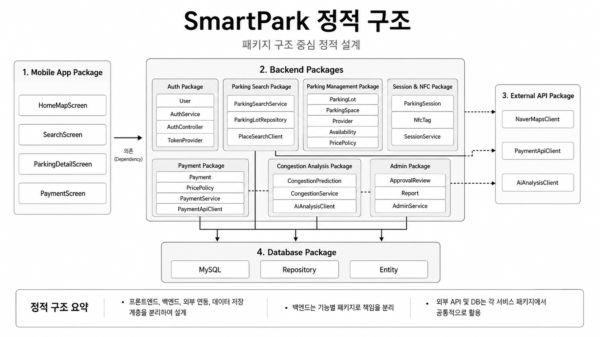
```

## 2.3 동적 구조

동적 구조는 사용자의 요청이 시스템 내부에서 어떤 순서로 처리되는지 설명한다.
SmartPark의 핵심 동적 흐름은 주차장 탐색, 주차장 상세 확인, NFC 기반 주차 이용 시작/종료, 결제, 혼잡도 분석 결과 제공으로 구성된다.

### 2.3.1 현재 위치 기반 주차장 조회 흐름

```text
사용자
→ 모바일 앱 실행
→ 현재 위치 권한 확인
→ 현재 위치 좌표 수집
→ 백엔드 서버에 주변 주차장 조회 요청
→ MySQL에서 주차장 목록 조회
→ AI 혼잡도 예측 결과 조회
→ 주차장 목록과 지도 마커 데이터 반환
→ 모바일 앱에 지도 및 목록 표시
```

| 단계 | 처리 내용                                       | 담당 구성 요소               |
| ---: | ----------------------------------------------- | ---------------------------- |
|    1 | 사용자가 앱을 실행한다.                         | Mobile App                   |
|    2 | 앱이 위치 권한을 확인하고 현재 좌표를 수집한다. | Mobile App, GPS              |
|    3 | 앱이 주변 주차장 조회 API를 호출한다.           | Mobile App                   |
|    4 | 백엔드가 좌표와 검색 반경을 검증한다.           | Spring Boot Backend          |
|    5 | 주차장 데이터를 조회한다.                       | Parking Search Module, MySQL |
|    6 | 주차장별 혼잡도 결과를 조회한다.                | Congestion Analysis Module   |
|    7 | 주차장 목록과 지도 마커 데이터를 반환한다.      | Backend API                  |
|    8 | 앱이 지도와 바텀시트 목록에 결과를 표시한다.    | Mobile App                   |

### 2.3.2 목적지 기반 주차장 검색 흐름

```text
사용자 목적지 입력
→ 모바일 앱이 목적지 검색 요청
→ 백엔드가 Naver Maps API에 장소/주소 검색 요청
→ 목적지 좌표 반환
→ 목적지 주변 주차장 조회
→ 혼잡도 및 추천 점수 결합
→ 추천 주차장 목록 반환
```

| 단계 | 처리 내용                                                      | 담당 구성 요소             |
| ---: | -------------------------------------------------------------- | -------------------------- |
|    1 | 사용자가 목적지명 또는 주소를 입력한다.                        | Mobile App                 |
|    2 | 목적지 검색 API를 호출한다.                                    | Mobile App                 |
|    3 | 백엔드가 Naver Maps API에 장소 검색 또는 Geocoding을 요청한다. | External API Module        |
|    4 | 목적지 좌표를 반환받는다.                                      | Naver Maps API             |
|    5 | 목적지 좌표 기준 주변 주차장을 조회한다.                       | Parking Search Module      |
|    6 | 혼잡도와 추천 점수를 결합한다.                                 | Congestion Analysis Module |
|    7 | 추천 주차장 목록을 반환한다.                                   | Backend API                |

### 2.3.3 NFC 기반 주차 이용 및 결제 흐름

```text
사용자 주차장 도착
→ NFC 태그 인식
→ 태그 유효성 검증
→ 주차 세션 생성
→ 이용 종료 시 NFC 재인식
→ 세션 종료 시간 기록
→ 이용 시간 계산
→ 결제 API 승인 요청
→ 결제 결과 저장
→ 결제 완료 화면 표시
```

| 단계 | 처리 내용                                              | 담당 구성 요소        |
| ---: | ------------------------------------------------------ | --------------------- |
|    1 | 사용자가 주차 공간의 NFC 태그를 인식한다.              | Mobile App, NFC Tag   |
|    2 | 앱이 태그 코드를 백엔드에 전달한다.                    | Mobile App            |
|    3 | 백엔드가 태그와 주차 공간의 유효성을 검증한다.         | Session & NFC Module  |
|    4 | 이용 시작 시 주차 세션을 생성한다.                     | ParkingSession        |
|    5 | 이용 종료 시 세션 종료 시간을 기록한다.                | Session & NFC Module  |
|    6 | 이용 시간과 요금 정책을 기준으로 결제 금액을 계산한다. | Payment Module        |
|    7 | 결제 API에 결제 승인을 요청한다.                       | Payment API           |
|    8 | 결제 결과를 저장하고 사용자에게 반환한다.              | Payment Module, MySQL |

### 2.3.4 AI/규칙 기반 혼잡도 분석 흐름

```text
주차장 이용 데이터 수집
→ 시간대/지역/이용 가능 수/이용 이력 분석
→ 규칙 기반 또는 AI 모델 기반 혼잡도 계산
→ 혼잡도 등급과 추천 점수 생성
→ MySQL에 예측 결과 저장
→ 백엔드 API가 혼잡도 결과 조회
→ 앱 화면에 혼잡도와 추천 사유 표시
```

| 단계 | 처리 내용                                             | 담당 구성 요소             |
| ---: | ----------------------------------------------------- | -------------------------- |
|    1 | 주차장 정보와 주차 세션 데이터를 수집한다.            | MySQL                      |
|    2 | 시간대, 요일, 지역 특성, 과거 이용 데이터를 분석한다. | Python AI Module           |
|    3 | 혼잡도 점수와 혼잡도 등급을 계산한다.                 | Congestion Analysis Module |
|    4 | 추천 점수와 추천 사유를 생성한다.                     | Congestion Analysis Module |
|    5 | 예측 결과를 MySQL에 저장한다.                         | AI Module, MySQL           |
|    6 | 백엔드가 주차장 조회 시 혼잡도 결과를 함께 조회한다.  | Spring Boot Backend        |
|    7 | 앱 화면에 혼잡도와 추천 정보를 표시한다.              | Mobile App                 |

### 2.3.5 동적 구조 이미지

아래 위치에는 SmartPark의 주요 동적 흐름 이미지를 삽입한다.

```md
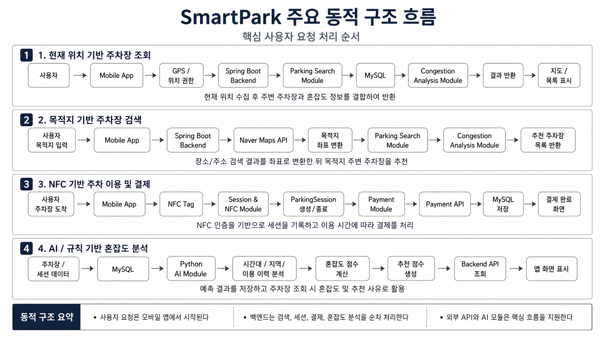
```

## 2.4 패키지/모듈 개요

SmartPark 시스템은 기능 책임을 기준으로 9개의 주요 모듈로 구분한다.
각 모듈은 3장 모듈/패키지 설계에서 `모듈 설명`, `구성 클래스 설계`, `패키지 행위`, `멤버함수 설계` 형식으로 상세히 설명한다.

| 모듈 ID   | 모듈명                     | 주요 책임                                                  | 관련 기능                    |
| --------- | -------------------------- | ---------------------------------------------------------- | ---------------------------- |
| SDD-M-001 | Mobile App Module          | 사용자 화면, 네비게이션, 입력값 처리, API 호출, 결과 표시  | F-01 ~ F-13                  |
| SDD-M-002 | Auth Module                | 회원가입, 로그인, 사용자 역할, 인증 처리                   | F-01, F-10                   |
| SDD-M-003 | Parking Search Module      | 현재 위치/목적지 기반 주차장 조회, 필터링, 정렬            | F-01, F-02, F-03             |
| SDD-M-004 | Parking Management Module  | 주차장 등록, 주차 공간 관리, 운영 시간, 요금 정책 관리     | F-05, F-06, F-10             |
| SDD-M-005 | Session & NFC Module       | NFC 태그 검증, 주차 이용 시작/종료, 세션 상태 관리         | F-07                         |
| SDD-M-006 | Payment Module             | 이용 시간 계산, 결제 요청, 결제 내역 저장, 환불 관리       | F-08, F-12                   |
| SDD-M-007 | Congestion Analysis Module | 혼잡도 예측, 추천 점수 계산, 추천 사유 제공                | F-04, F-09                   |
| SDD-M-008 | Admin Module               | 주차장 승인/반려, 신고 처리, 결제 오류, 운영 통계 관리     | F-10, F-11, F-12, F-13       |
| SDD-M-009 | External API Module        | Naver Maps API, 결제 API, AI 분석 모듈 등 외부 시스템 연동 | F-01, F-02, F-07, F-08, F-09 |

### 2.4.1 모듈 간 관계

각 모듈은 독립적으로 동작하지 않고, 사용자 요청 흐름에 따라 서로 협력한다.

| 요청 흐름                  | 관련 모듈                                                                                       |
| -------------------------- | ----------------------------------------------------------------------------------------------- |
| 회원가입/로그인            | Mobile App Module, Auth Module                                                                  |
| 현재 위치 기반 주차장 조회 | Mobile App Module, Parking Search Module, Congestion Analysis Module, External API Module       |
| 목적지 기반 주차장 검색    | Mobile App Module, Parking Search Module, External API Module, Congestion Analysis Module       |
| 주차장 상세 정보 확인      | Mobile App Module, Parking Search Module, Parking Management Module, Congestion Analysis Module |
| 주차 공간 등록             | Mobile App Module, Auth Module, Parking Management Module, Admin Module                         |
| 이용 가능 시간/요금 설정   | Mobile App Module, Parking Management Module                                                    |
| NFC 기반 이용 시작/종료    | Mobile App Module, Session & NFC Module, Payment Module                                         |
| 결제 처리                  | Mobile App Module, Session & NFC Module, Payment Module, External API Module                    |
| AI 혼잡도 분석             | Congestion Analysis Module, Parking Search Module, MySQL Database                               |
| 관리자 승인/신고 처리      | Admin Module, Parking Management Module, Payment Module, Report                                 |

### 2.4.2 패키지/모듈 개요 이미지

```md
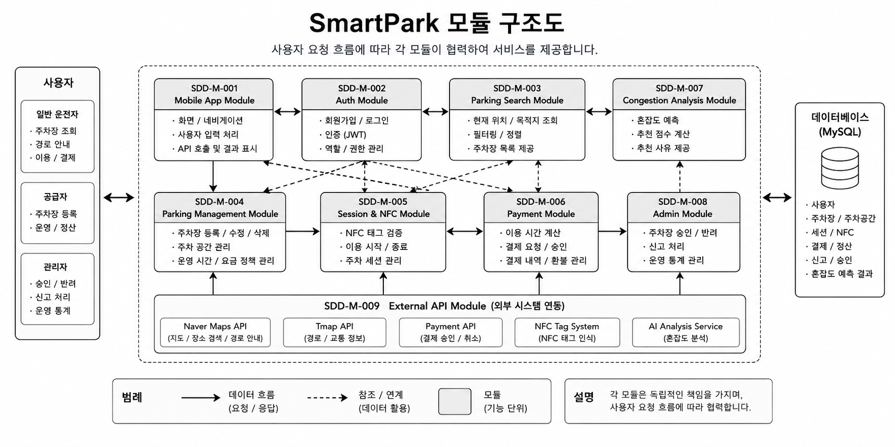
```

## 2.5 소프트웨어 아키텍처 요약

본 장에서는 SmartPark 시스템의 전체 소프트웨어 구조를 사용자 인터페이스 계층, 애플리케이션 서버 계층, 데이터 저장 계층, AI 분석 계층, 외부 연동 계층으로 구분하여 설계하였다.

| 설계 항목        | 핵심 내용                                                                                          |
| ---------------- | -------------------------------------------------------------------------------------------------- |
| 전체 시스템 구조 | React Native 앱, Spring Boot 서버, MySQL, Python AI 모듈, 외부 API로 구성한다.                     |
| 정적 구조        | 기능 책임에 따라 Auth, Parking, Session, Payment, Congestion, Admin, External API 모듈로 분리한다. |
| 동적 구조        | 주차장 조회, 목적지 검색, NFC 이용, 결제, 혼잡도 분석의 처리 흐름을 정의한다.                      |
| 패키지/모듈 개요 | 9개 주요 모듈을 정의하고 각 모듈의 책임과 관련 기능을 연결한다.                                    |
| 후속 설계 연결   | 본 장의 모듈 구조는 3장 모듈/패키지 설계의 기준으로 활용한다.                                      |

이후 3장에서는 본 장에서 정의한 9개 모듈을 기준으로 각 모듈의 설명, 구성 클래스, 패키지 행위, 멤버함수 설계를 상세히 작성한다.

# 3. 모듈/패키지 설계

SmartPark 시스템은 사용자 요청 흐름과 기능 책임을 기준으로 주요 모듈을 분리하여 설계한다. 각 모듈은 독립적인 책임을 가지며, 모바일 앱, 백엔드 서버, 데이터베이스, 외부 API, AI 혼잡도 분석 모듈과 협력하여 서비스를 제공한다.

본 장에서는 SmartPark 시스템을 구성하는 모듈을 식별하고, 각 모듈의 설명, 구성 클래스, 패키지 행위, 멤버함수 설계를 정리한다. 특히 3.1절에서는 사용자가 직접 상호작용하는 React Native 기반 모바일 앱 모듈을 상세히 설계한다.

| 모듈 ID   | 모듈명                     | 주요 책임                                         |
| --------- | -------------------------- | ------------------------------------------------- |
| SDD-M-001 | Mobile App Module          | 사용자 화면, 입력 처리, API 호출, 결과 표시       |
| SDD-M-002 | Auth Module                | 회원가입, 로그인, 사용자 인증 및 권한 관리        |
| SDD-M-003 | Parking Search Module      | 현재 위치/목적지 기반 주차장 조회                 |
| SDD-M-004 | Parking Management Module  | 주차장 등록, 주차 공간, 운영 시간, 요금 정책 관리 |
| SDD-M-005 | Session & NFC Module       | NFC 태그 검증, 주차 이용 시작/종료, 세션 관리     |
| SDD-M-006 | Payment Module             | 요금 계산, 결제 승인, 결제 내역 저장              |
| SDD-M-007 | Congestion Analysis Module | 혼잡도 예측, 추천 점수, 추천 사유 제공            |
| SDD-M-008 | Admin Module               | 주차장 승인, 신고 처리, 결제 오류, 운영 통계 관리 |
| SDD-M-009 | External API Module        | 지도 API, 결제 API, NFC, AI 모듈 연동             |

---

## 3.1 SDD-M-001 : Mobile App Module

### 3.1.1 모듈 설명

Mobile App Module은 SmartPark 사용자가 직접 상호작용하는 React Native 기반 모바일 애플리케이션 모듈이다. 본 모듈은 사용자의 현재 위치 기반 주차장 조회, 목적지 기반 검색, 주차장 목록 및 상세 정보 확인, NFC 기반 이용 시작/종료, 결제 요청, 공급자 주차 공간 등록, 마이페이지 조회 기능을 제공한다.

Mobile App Module은 사용자의 입력을 수집하고, 백엔드 API 또는 외부 연동 결과를 화면에 표시하는 역할을 담당한다. 실제 주차장 조회, 인증, 결제, 혼잡도 분석과 같은 핵심 비즈니스 로직은 백엔드 모듈에서 처리되며, 모바일 앱은 사용자가 이해하기 쉬운 화면 흐름으로 결과를 제공한다.

| 항목          | 내용                                                                                                                                                 |
| ------------- | ---------------------------------------------------------------------------------------------------------------------------------------------------- |
| 모듈 ID       | SDD-M-001                                                                                                                                            |
| 모듈명        | Mobile App Module                                                                                                                                    |
| 모듈 유형     | 사용자 인터페이스 모듈                                                                                                                               |
| 주요 역할     | 화면 표시, 사용자 입력 처리, 네비게이션 제어, API 호출, 결과 표시                                                                                    |
| 구현 기술     | React Native                                                                                                                                         |
| 관련 사용자   | 일반 운전자, 일정 기반 방문 운전자, 공급자                                                                                                           |
| 관련 Use Case | U-01, U-02, U-03, U-04, U-05, U-06, U-07, U-08, U-09                                                                                                 |
| 관련 모듈     | Auth Module, Parking Search Module, Parking Management Module, Session & NFC Module, Payment Module, Congestion Analysis Module, External API Module |

---

### 3.1.2 구성 클래스 설계

#### (1) CM-001 : SplashScreen

| 구분          | 내용                                                                                                                     |
| ------------- | ------------------------------------------------------------------------------------------------------------------------ |
| 클래스 타입   | Boundary                                                                                                                 |
| 관련 Use Case | U-01                                                                                                                     |
| 설명          | 앱 실행 시 초기 로딩 화면을 표시하고, 로그인 상태와 기본 권한 상태를 확인한 뒤 적절한 화면으로 이동한다.                 |
| 멤버 변수     | - isLoading<br>- isLoggedIn<br>- hasLocationPermission                                                                   |
| 멤버 함수     | + checkLoginStatus()<br>+ navigateInitialScreen()                                                                        |
| 관계성        | Generalization(a-kind-of) : 없음<br>Aggregation(has-parts) : 없음<br>Other Associations : Auth Module, Mobile Navigation |

#### (2) CM-002 : LoginScreen

| 구분          | 내용                                                                                                                     |
| ------------- | ------------------------------------------------------------------------------------------------------------------------ |
| 클래스 타입   | Boundary                                                                                                                 |
| 관련 Use Case | U-01                                                                                                                     |
| 설명          | 사용자가 이메일과 비밀번호를 입력하여 SmartPark 서비스에 로그인할 수 있도록 한다.                                        |
| 멤버 변수     | - email<br>- password<br>- loginError<br>- isSubmitting                                                                  |
| 멤버 함수     | + requestLogin()                                                                                                         |
| 관계성        | Generalization(a-kind-of) : 없음<br>Aggregation(has-parts) : LoginForm, SubmitButton<br>Other Associations : Auth Module |

#### (3) CM-003 : SignUpScreen

| 구분          | 내용                                                                                                                      |
| ------------- | ------------------------------------------------------------------------------------------------------------------------- |
| 클래스 타입   | Boundary                                                                                                                  |
| 관련 Use Case | U-01                                                                                                                      |
| 설명          | 신규 사용자가 계정을 생성하고 일반 이용자 또는 공급자 역할을 선택할 수 있도록 한다.                                       |
| 멤버 변수     | - email<br>- password<br>- userRole<br>- signUpForm                                                                       |
| 멤버 함수     | + requestSignUp()                                                                                                         |
| 관계성        | Generalization(a-kind-of) : 없음<br>Aggregation(has-parts) : SignUpForm, RoleSelector<br>Other Associations : Auth Module |

#### (4) CM-004 : HomeMapScreen

| 구분          | 내용                                                                                                                                                                                                         |
| ------------- | ------------------------------------------------------------------------------------------------------------------------------------------------------------------------------------------------------------ |
| 클래스 타입   | Boundary                                                                                                                                                                                                     |
| 관련 Use Case | U-02, U-03, U-04, U-05                                                                                                                                                                                       |
| 설명          | 사용자의 현재 위치를 기준으로 지도 화면과 주변 주차장 마커, 하단 주차장 목록을 표시한다.                                                                                                                     |
| 멤버 변수     | - currentLocation<br>- parkingLots<br>- selectedParkingLotId<br>- filterOption<br>- mapRegion                                                                                                                |
| 멤버 함수     | + requestLocationPermission()<br>+ loadNearbyParkingLots()<br>+ renderMapMarkers()<br>+ selectParkingLot()<br>+ openParkingDetail()                                                                          |
| 관계성        | Generalization(a-kind-of) : 없음<br>Aggregation(has-parts) : ParkingBottomSheet, ParkingCard, CongestionBadge<br>Other Associations : Parking Search Module, Congestion Analysis Module, External API Module |

#### (5) CM-005 : DestinationSearchScreen

| 구분          | 내용                                                                                                                                                    |
| ------------- | ------------------------------------------------------------------------------------------------------------------------------------------------------- |
| 클래스 타입   | Boundary                                                                                                                                                |
| 관련 Use Case | U-03                                                                                                                                                    |
| 설명          | 사용자가 목적지명 또는 주소를 입력하여 목적지 주변 주차장을 검색할 수 있도록 한다.                                                                      |
| 멤버 변수     | - keyword<br>- searchResults<br>- selectedDestination<br>- recentSearches                                                                               |
| 멤버 함수     | + searchDestination()<br>+ selectDestination()                                                                                                          |
| 관계성        | Generalization(a-kind-of) : 없음<br>Aggregation(has-parts) : SearchBar, SearchResultList<br>Other Associations : Parking Search Module, NaverMapsClient |

#### (6) CM-006 : ParkingListScreen

| 구분          | 내용                                                                                                                                                |
| ------------- | --------------------------------------------------------------------------------------------------------------------------------------------------- |
| 클래스 타입   | Boundary                                                                                                                                            |
| 관련 Use Case | U-02, U-03, U-04                                                                                                                                    |
| 설명          | 조회된 주차장 목록을 거리, 요금, 혼잡도, 이용 가능 여부 기준으로 비교할 수 있도록 표시한다.                                                         |
| 멤버 변수     | - parkingLots<br>- filterOption<br>- sortOption<br>- selectedCategory                                                                               |
| 멤버 함수     | + applyFilter()<br>+ sortParkingLots()                                                                                                              |
| 관계성        | Generalization(a-kind-of) : 없음<br>Aggregation(has-parts) : ParkingCard, FilterChip, SortOptionModal<br>Other Associations : Parking Search Module |

#### (7) CM-007 : ParkingDetailScreen

| 구분          | 내용                                                                                                                                                                                                |
| ------------- | --------------------------------------------------------------------------------------------------------------------------------------------------------------------------------------------------- |
| 클래스 타입   | Boundary                                                                                                                                                                                            |
| 관련 Use Case | U-04, U-05, U-08                                                                                                                                                                                    |
| 설명          | 사용자가 선택한 주차장의 상세 정보, 요금, 운영 시간, 혼잡도, 이용 가능 여부, 경로 안내 정보를 확인할 수 있도록 한다.                                                                                |
| 멤버 변수     | - parkingLotId<br>- parkingDetail<br>- congestionInfo<br>- routeInfo                                                                                                                                |
| 멤버 함수     | + loadParkingDetail()<br>+ requestRoute()<br>+ openNfcScan()                                                                                                                                        |
| 관계성        | Generalization(a-kind-of) : 없음<br>Aggregation(has-parts) : ParkingInfoCard, CongestionBadge, RouteButton<br>Other Associations : Parking Search Module, Session & NFC Module, External API Module |

#### (8) CM-008 : NfcScanScreen

| 구분          | 내용                                                                                                                                   |
| ------------- | -------------------------------------------------------------------------------------------------------------------------------------- |
| 클래스 타입   | Boundary                                                                                                                               |
| 관련 Use Case | U-08                                                                                                                                   |
| 설명          | 사용자가 NFC 태그를 인식하여 주차 이용을 시작하거나 종료할 수 있도록 한다.                                                             |
| 멤버 변수     | - tagCode<br>- scanStatus<br>- sessionStatus<br>- errorMessage                                                                         |
| 멤버 함수     | + scanNfcTag()                                                                                                                         |
| 관계성        | Generalization(a-kind-of) : 없음<br>Aggregation(has-parts) : NfcGuideView, ScanResultView<br>Other Associations : Session & NFC Module |

#### (9) CM-009 : PaymentScreen

| 구분          | 내용                                                                                                                                                                |
| ------------- | ------------------------------------------------------------------------------------------------------------------------------------------------------------------- |
| 클래스 타입   | Boundary                                                                                                                                                            |
| 관련 Use Case | U-09                                                                                                                                                                |
| 설명          | 주차 이용 시간과 요금 정보를 확인하고 결제 요청을 수행하는 화면이다.                                                                                                |
| 멤버 변수     | - sessionId<br>- paymentAmount<br>- paymentMethod<br>- paymentStatus                                                                                                |
| 멤버 함수     | + requestPayment()                                                                                                                                                  |
| 관계성        | Generalization(a-kind-of) : 없음<br>Aggregation(has-parts) : PaymentSummaryCard, PaymentMethodSelector<br>Other Associations : Payment Module, Session & NFC Module |

#### (10) CM-010 : PaymentResultScreen

| 구분          | 내용                                                                                                                                       |
| ------------- | ------------------------------------------------------------------------------------------------------------------------------------------ |
| 클래스 타입   | Boundary                                                                                                                                   |
| 관련 Use Case | U-09                                                                                                                                       |
| 설명          | 결제 성공 또는 실패 결과를 사용자에게 표시하고, 이용 내역 화면으로 이동할 수 있도록 한다.                                                  |
| 멤버 변수     | - paymentId<br>- paymentStatus<br>- paidAmount<br>- paidAt                                                                                 |
| 멤버 함수     | + showPaymentResult()                                                                                                                      |
| 관계성        | Generalization(a-kind-of) : 없음<br>Aggregation(has-parts) : PaymentResultCard, MoveToHistoryButton<br>Other Associations : Payment Module |

#### (11) CM-011 : ProviderDashboardScreen

| 구분          | 내용                                                                                                                                                                                          |
| ------------- | --------------------------------------------------------------------------------------------------------------------------------------------------------------------------------------------- |
| 클래스 타입   | Boundary                                                                                                                                                                                      |
| 관련 Use Case | U-06, U-07                                                                                                                                                                                    |
| 설명          | 공급자가 등록한 주차장과 이용 가능 시간, 요금, 이용 현황을 확인하고 관리할 수 있도록 한다.                                                                                                    |
| 멤버 변수     | - providerId<br>- registeredParkingLots<br>- todayUsageList<br>- settlementSummary                                                                                                            |
| 멤버 함수     | + updateAvailability()                                                                                                                                                                        |
| 관계성        | Generalization(a-kind-of) : 없음<br>Aggregation(has-parts) : ProviderParkingCard, AvailabilityEditor, SettlementSummaryCard<br>Other Associations : Parking Management Module, Payment Module |

#### (12) CM-012 : ParkingRegisterScreen

| 구분          | 내용                                                                                                                                                                              |
| ------------- | --------------------------------------------------------------------------------------------------------------------------------------------------------------------------------- |
| 클래스 타입   | Boundary                                                                                                                                                                          |
| 관련 Use Case | U-06                                                                                                                                                                              |
| 설명          | 공급자가 주차장 위치, 사진, 주차 공간 수, 운영 시간, 요금 정책을 입력하여 주차 공간을 등록할 수 있도록 한다.                                                                      |
| 멤버 변수     | - parkingLotForm<br>- locationInfo<br>- pricePolicy<br>- availability                                                                                                             |
| 멤버 함수     | + submitParkingLot()                                                                                                                                                              |
| 관계성        | Generalization(a-kind-of) : 없음<br>Aggregation(has-parts) : ParkingRegisterForm, LocationInput, PricePolicyInput<br>Other Associations : Parking Management Module, Admin Module |

#### (13) CM-013 : MyPageScreen

| 구분          | 내용                                                                                                                                                                                      |
| ------------- | ----------------------------------------------------------------------------------------------------------------------------------------------------------------------------------------- |
| 클래스 타입   | Boundary                                                                                                                                                                                  |
| 관련 Use Case | U-01, U-09                                                                                                                                                                                |
| 설명          | 사용자 정보, 이용 내역, 결제 내역, 알림, 설정 정보를 확인할 수 있도록 한다.                                                                                                               |
| 멤버 변수     | - userInfo<br>- usageHistory<br>- paymentHistory<br>- notificationList                                                                                                                    |
| 멤버 함수     | + loadMyPageInfo()                                                                                                                                                                        |
| 관계성        | Generalization(a-kind-of) : 없음<br>Aggregation(has-parts) : UserInfoCard, UsageHistoryList, PaymentHistoryList<br>Other Associations : Auth Module, Payment Module, Session & NFC Module |

#### (14) CM-014 : ParkingCard

| 구분          | 내용                                                                                                                                  |
| ------------- | ------------------------------------------------------------------------------------------------------------------------------------- |
| 클래스 타입   | Boundary                                                                                                                              |
| 관련 Use Case | U-02, U-03, U-04                                                                                                                      |
| 설명          | 주차장 목록에서 개별 주차장의 이름, 거리, 요금, 이용 가능 상태, 혼잡도 정보를 카드 형태로 표시한다.                                   |
| 멤버 변수     | - parkingLotId<br>- name<br>- distance<br>- price<br>- congestionLevel                                                                |
| 멤버 함수     | + renderParkingInfo()<br>+ handleCardPress()                                                                                          |
| 관계성        | Generalization(a-kind-of) : 없음<br>Aggregation(has-parts) : CongestionBadge<br>Other Associations : HomeMapScreen, ParkingListScreen |

#### (15) CM-015 : CongestionBadge

| 구분          | 내용                                                                                                                                                   |
| ------------- | ------------------------------------------------------------------------------------------------------------------------------------------------------ |
| 클래스 타입   | Boundary                                                                                                                                               |
| 관련 Use Case | U-05, U-10                                                                                                                                             |
| 설명          | 주차장의 혼잡도 등급과 추천 점수를 시각적으로 표시한다.                                                                                                |
| 멤버 변수     | - congestionLevel<br>- recommendationScore<br>- badgeLabel                                                                                             |
| 멤버 함수     | + renderCongestionLevel()<br>+ getBadgeStyle()                                                                                                         |
| 관계성        | Generalization(a-kind-of) : 없음<br>Aggregation(has-parts) : 없음<br>Other Associations : Congestion Analysis Module, ParkingCard, ParkingDetailScreen |

#### (16) CM-016 : ParkingBottomSheet

| 구분          | 내용                                                                                                                              |
| ------------- | --------------------------------------------------------------------------------------------------------------------------------- |
| 클래스 타입   | Boundary                                                                                                                          |
| 관련 Use Case | U-02, U-03, U-04                                                                                                                  |
| 설명          | 지도 하단에서 주변 주차장 목록을 바텀시트 형태로 표시하고, 사용자가 주차장을 선택할 수 있도록 한다.                               |
| 멤버 변수     | - parkingLots<br>- selectedParkingLotId<br>- sheetPosition                                                                        |
| 멤버 함수     | + openSheet()<br>+ closeSheet()<br>+ selectParkingLotFromSheet()                                                                  |
| 관계성        | Generalization(a-kind-of) : 없음<br>Aggregation(has-parts) : ParkingCard<br>Other Associations : HomeMapScreen, ParkingListScreen |

---

### 3.1.3 패키지 행위

Mobile App Module의 패키지 행위는 사용자의 모바일 앱 이용 흐름을 중심으로 설계한다. 본 모듈은 사용자의 입력을 받아 화면 상태를 변경하고, 필요한 경우 백엔드 API를 호출하여 결과를 화면에 표시한다.

Mobile App Module의 주요 패키지 행위는 다음과 같다.

| 행위 ID | 패키지 행위                      | 관련 클래스                                    | 관련 Use Case |
| ------- | -------------------------------- | ---------------------------------------------- | ------------- |
| B-001   | 앱 초기 진입 및 로그인 상태 확인 | SplashScreen, LoginScreen                      | U-01          |
| B-002   | 현재 위치 기반 주차장 조회       | HomeMapScreen, ParkingBottomSheet, ParkingCard | U-02          |
| B-003   | 목적지 기반 주차장 검색          | DestinationSearchScreen, ParkingListScreen     | U-03          |
| B-004   | 주차장 상세 정보 확인            | ParkingDetailScreen, CongestionBadge           | U-04, U-05    |
| B-005   | NFC 기반 이용 시작/종료          | NfcScanScreen                                  | U-08          |
| B-006   | 주차 요금 결제 및 결과 확인      | PaymentScreen, PaymentResultScreen             | U-09          |
| B-007   | 공급자 주차 공간 등록            | ParkingRegisterScreen, ProviderDashboardScreen | U-06, U-07    |
| B-008   | 사용자 정보 및 이용 내역 확인    | MyPageScreen                                   | U-01, U-09    |

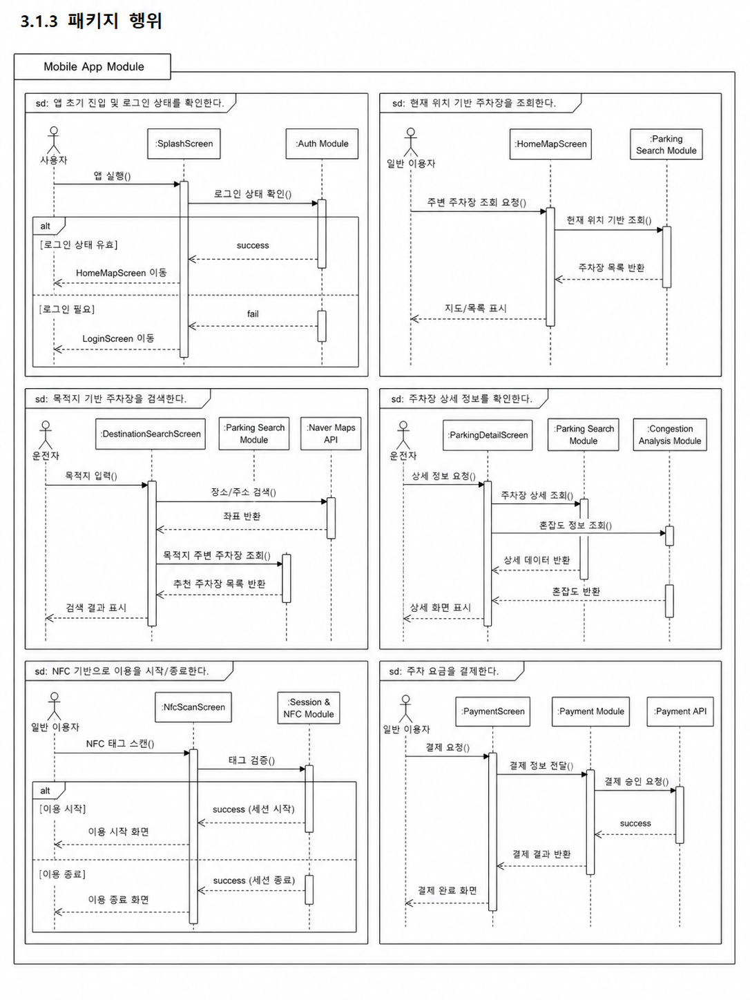

---

### 3.1.4 멤버함수 설계

#### (1) M-001 : checkLoginStatus()

| 구분           | 내용                                                                                                                                                             |
| -------------- | ---------------------------------------------------------------------------------------------------------------------------------------------------------------- |
| 소속 클래스    | CM-001 : SplashScreen                                                                                                                                            |
| 트리거 클래스  | CM-001 : SplashScreen                                                                                                                                            |
| 파라멘터       | 없음                                                                                                                                                             |
| 세부 처리 로직 | 앱 실행 시 로컬 저장소 또는 인증 상태를 확인한다. 유효한 로그인 정보가 존재하면 메인 화면으로 이동하고, 인증 정보가 없거나 만료된 경우 로그인 화면으로 이동한다. |

#### (2) M-002 : navigateInitialScreen()

| 구분           | 내용                                                                                                                                                                                                                      |
| -------------- | ------------------------------------------------------------------------------------------------------------------------------------------------------------------------------------------------------------------------- |
| 소속 클래스    | CM-001 : SplashScreen                                                                                                                                                                                                     |
| 트리거 클래스  | CM-001 : SplashScreen                                                                                                                                                                                                     |
| 파라멘터       | isLoggedIn, hasLocationPermission                                                                                                                                                                                         |
| 세부 처리 로직 | 로그인 상태와 위치 권한 상태를 기준으로 초기 이동 화면을 결정한다. 로그인된 사용자는 HomeMapScreen으로 이동하고, 로그인되지 않은 사용자는 LoginScreen으로 이동한다. 위치 권한이 없는 경우 권한 안내 화면을 먼저 표시한다. |

#### (3) M-003 : requestLogin()

| 구분           | 내용                                                                                                                                                      |
| -------------- | --------------------------------------------------------------------------------------------------------------------------------------------------------- |
| 소속 클래스    | CM-002 : LoginScreen                                                                                                                                      |
| 트리거 클래스  | CM-020 : AuthController                                                                                                                                   |
| 파라멘터       | email, password                                                                                                                                           |
| 세부 처리 로직 | 사용자가 입력한 이메일과 비밀번호를 Auth Module에 전달한다. 인증 성공 시 토큰을 저장하고 HomeMapScreen으로 이동한다. 인증 실패 시 오류 메시지를 표시한다. |

#### (4) M-004 : requestSignUp()

| 구분           | 내용                                                                                                                                                                                          |
| -------------- | --------------------------------------------------------------------------------------------------------------------------------------------------------------------------------------------- |
| 소속 클래스    | CM-003 : SignUpScreen                                                                                                                                                                         |
| 트리거 클래스  | CM-020 : AuthController                                                                                                                                                                       |
| 파라멘터       | email, password, userRole                                                                                                                                                                     |
| 세부 처리 로직 | 신규 사용자 정보를 Auth Module에 전달하여 회원가입을 요청한다. 회원가입 성공 시 로그인 화면 또는 메인 화면으로 이동하고, 이미 등록된 이메일이나 입력 오류가 있는 경우 오류 메시지를 표시한다. |

#### (5) M-005 : requestLocationPermission()

| 구분           | 내용                                                                                                                                                                |
| -------------- | ------------------------------------------------------------------------------------------------------------------------------------------------------------------- |
| 소속 클래스    | CM-004 : HomeMapScreen                                                                                                                                              |
| 트리거 클래스  | CM-004 : HomeMapScreen                                                                                                                                              |
| 파라멘터       | 없음                                                                                                                                                                |
| 세부 처리 로직 | 사용자의 현재 위치를 수집하기 위해 위치 권한을 확인한다. 권한이 허용된 경우 현재 좌표를 수집하고, 권한이 거부된 경우 권한 안내 또는 수동 위치 입력 흐름을 제공한다. |

#### (6) M-006 : loadNearbyParkingLots()

| 구분           | 내용                                                                                                                                                                                            |
| -------------- | ----------------------------------------------------------------------------------------------------------------------------------------------------------------------------------------------- |
| 소속 클래스    | CM-004 : HomeMapScreen                                                                                                                                                                          |
| 트리거 클래스  | CM-024 : ParkingSearchController                                                                                                                                                                |
| 파라멘터       | latitude, longitude, radius                                                                                                                                                                     |
| 세부 처리 로직 | 사용자의 현재 위치 좌표를 기준으로 주변 주차장 조회 API를 호출한다. 백엔드 서버로부터 주차장 목록, 지도 마커 정보, 이용 가능 상태, 혼잡도 정보를 전달받아 지도와 하단 바텀시트 목록에 표시한다. |

#### (7) M-007 : renderMapMarkers()

| 구분           | 내용                                                                                                                                  |
| -------------- | ------------------------------------------------------------------------------------------------------------------------------------- |
| 소속 클래스    | CM-004 : HomeMapScreen                                                                                                                |
| 트리거 클래스  | CM-004 : HomeMapScreen                                                                                                                |
| 파라멘터       | parkingLots                                                                                                                           |
| 세부 처리 로직 | 조회된 주차장 목록을 기반으로 지도 위에 주차장 마커를 표시한다. 주차장 상태, 선택 여부, 혼잡도 정보에 따라 마커 표시 방식을 구분한다. |

#### (8) M-008 : selectParkingLot()

| 구분           | 내용                                                                                                                                                        |
| -------------- | ----------------------------------------------------------------------------------------------------------------------------------------------------------- |
| 소속 클래스    | CM-004 : HomeMapScreen                                                                                                                                      |
| 트리거 클래스  | CM-014 : ParkingCard                                                                                                                                        |
| 파라멘터       | parkingLotId                                                                                                                                                |
| 세부 처리 로직 | 사용자가 지도 마커 또는 주차장 카드를 선택하면 해당 주차장을 선택 상태로 변경한다. 선택된 주차장의 요약 정보를 바텀시트 또는 카드 영역에 강조하여 표시한다. |

#### (9) M-009 : openParkingDetail()

| 구분           | 내용                                                                                                                                                  |
| -------------- | ----------------------------------------------------------------------------------------------------------------------------------------------------- |
| 소속 클래스    | CM-004 : HomeMapScreen                                                                                                                                |
| 트리거 클래스  | CM-007 : ParkingDetailScreen                                                                                                                          |
| 파라멘터       | parkingLotId                                                                                                                                          |
| 세부 처리 로직 | 사용자가 주차장 상세 보기 버튼을 선택하면 ParkingDetailScreen으로 이동한다. 이동 시 선택된 parkingLotId를 전달하여 상세 정보를 조회할 수 있도록 한다. |

#### (10) M-010 : searchDestination()

| 구분           | 내용                                                                                                                                                                |
| -------------- | ------------------------------------------------------------------------------------------------------------------------------------------------------------------- |
| 소속 클래스    | CM-005 : DestinationSearchScreen                                                                                                                                    |
| 트리거 클래스  | CM-062 : NaverMapsClient                                                                                                                                            |
| 파라멘터       | keyword                                                                                                                                                             |
| 세부 처리 로직 | 사용자가 입력한 목적지명 또는 주소를 기반으로 장소 검색을 요청한다. 검색 결과가 존재하면 목적지 후보 목록을 표시하고, 결과가 없으면 검색 결과 없음 상태를 표시한다. |

#### (11) M-011 : selectDestination()

| 구분           | 내용                                                                                                                                                  |
| -------------- | ----------------------------------------------------------------------------------------------------------------------------------------------------- |
| 소속 클래스    | CM-005 : DestinationSearchScreen                                                                                                                      |
| 트리거 클래스  | CM-025 : ParkingSearchService                                                                                                                         |
| 파라멘터       | destinationId, latitude, longitude                                                                                                                    |
| 세부 처리 로직 | 사용자가 목적지를 선택하면 해당 목적지 좌표를 기준으로 주변 주차장 검색 흐름을 실행한다. 검색 결과는 ParkingListScreen 또는 HomeMapScreen에 전달된다. |

#### (12) M-012 : applyFilter()

| 구분           | 내용                                                                                                                                           |
| -------------- | ---------------------------------------------------------------------------------------------------------------------------------------------- |
| 소속 클래스    | CM-006 : ParkingListScreen                                                                                                                     |
| 트리거 클래스  | CM-006 : ParkingListScreen                                                                                                                     |
| 파라멘터       | filterOption                                                                                                                                   |
| 세부 처리 로직 | 주차장 목록에 사용자가 선택한 필터 조건을 적용한다. 이용 가능 여부, 요금 범위, 거리, 주차장 유형, 혼잡도 조건에 맞는 주차장만 목록에 표시한다. |

#### (13) M-013 : sortParkingLots()

| 구분           | 내용                                                                                                                 |
| -------------- | -------------------------------------------------------------------------------------------------------------------- |
| 소속 클래스    | CM-006 : ParkingListScreen                                                                                           |
| 트리거 클래스  | CM-006 : ParkingListScreen                                                                                           |
| 파라멘터       | sortOption                                                                                                           |
| 세부 처리 로직 | 주차장 목록을 거리순, 요금순, 혼잡도 낮은 순, 추천 점수순으로 정렬한다. 정렬 결과는 목록 화면과 바텀시트에 반영된다. |

#### (14) M-014 : loadParkingDetail()

| 구분           | 내용                                                                                                                                                   |
| -------------- | ------------------------------------------------------------------------------------------------------------------------------------------------------ |
| 소속 클래스    | CM-007 : ParkingDetailScreen                                                                                                                           |
| 트리거 클래스  | CM-024 : ParkingSearchController                                                                                                                       |
| 파라멘터       | parkingLotId                                                                                                                                           |
| 세부 처리 로직 | 선택한 주차장의 상세 정보를 백엔드 서버에 요청한다. 응답 데이터에는 위치, 요금, 운영 시간, 이용 가능 공간 수, 혼잡도, 추천 사유, 사진 정보가 포함된다. |

#### (15) M-015 : requestRoute()

| 구분           | 내용                                                                                                                                                    |
| -------------- | ------------------------------------------------------------------------------------------------------------------------------------------------------- |
| 소속 클래스    | CM-007 : ParkingDetailScreen                                                                                                                            |
| 트리거 클래스  | CM-064 : DirectionsClient                                                                                                                               |
| 파라멘터       | currentLocation, parkingLotLocation                                                                                                                     |
| 세부 처리 로직 | 현재 위치와 선택한 주차장 위치를 기준으로 경로 안내를 요청한다. 지도 API 또는 외부 경로 API의 응답을 받아 예상 이동 시간과 경로 정보를 화면에 표시한다. |

#### (16) M-016 : openNfcScan()

| 구분           | 내용                                                                                                                   |
| -------------- | ---------------------------------------------------------------------------------------------------------------------- |
| 소속 클래스    | CM-007 : ParkingDetailScreen                                                                                           |
| 트리거 클래스  | CM-008 : NfcScanScreen                                                                                                 |
| 파라멘터       | parkingLotId, parkingSpaceId                                                                                           |
| 세부 처리 로직 | 사용자가 주차 이용 시작을 선택하면 NFC 인식 화면으로 이동한다. 이동 시 선택한 주차장과 주차 공간 정보를 함께 전달한다. |

#### (17) M-017 : scanNfcTag()

| 구분           | 내용                                                                                                                                                                                  |
| -------------- | ------------------------------------------------------------------------------------------------------------------------------------------------------------------------------------- |
| 소속 클래스    | CM-008 : NfcScanScreen                                                                                                                                                                |
| 트리거 클래스  | CM-041 : SessionController                                                                                                                                                            |
| 파라멘터       | tagCode                                                                                                                                                                               |
| 세부 처리 로직 | 사용자가 NFC 태그를 인식하면 태그 코드를 Session & NFC Module로 전달한다. 태그가 유효하면 주차 이용 시작 또는 종료 처리를 수행하고, 유효하지 않은 태그인 경우 오류 메시지를 표시한다. |

#### (18) M-018 : requestPayment()

| 구분           | 내용                                                                                                                                                                 |
| -------------- | -------------------------------------------------------------------------------------------------------------------------------------------------------------------- |
| 소속 클래스    | CM-009 : PaymentScreen                                                                                                                                               |
| 트리거 클래스  | CM-047 : PaymentController                                                                                                                                           |
| 파라멘터       | sessionId, paymentMethod                                                                                                                                             |
| 세부 처리 로직 | 사용자가 결제 버튼을 선택하면 주차 세션 ID와 결제 수단 정보를 Payment Module로 전달한다. 결제 승인 결과에 따라 PaymentResultScreen에 성공 또는 실패 결과를 표시한다. |

#### (19) M-019 : showPaymentResult()

| 구분           | 내용                                                                                                                                                                       |
| -------------- | -------------------------------------------------------------------------------------------------------------------------------------------------------------------------- |
| 소속 클래스    | CM-010 : PaymentResultScreen                                                                                                                                               |
| 트리거 클래스  | CM-010 : PaymentResultScreen                                                                                                                                               |
| 파라멘터       | paymentId, paymentStatus                                                                                                                                                   |
| 세부 처리 로직 | 결제 결과 정보를 기반으로 성공 화면 또는 실패 화면을 표시한다. 결제 성공 시 결제 금액, 이용 시간, 결제 일시를 보여주고, 결제 실패 시 재시도 또는 고객센터 안내를 제공한다. |

#### (20) M-020 : submitParkingLot()

| 구분           | 내용                                                                                                                                                                                                  |
| -------------- | ----------------------------------------------------------------------------------------------------------------------------------------------------------------------------------------------------- |
| 소속 클래스    | CM-012 : ParkingRegisterScreen                                                                                                                                                                        |
| 트리거 클래스  | CM-036 : ParkingManagementController                                                                                                                                                                  |
| 파라멘터       | parkingLotForm                                                                                                                                                                                        |
| 세부 처리 로직 | 공급자가 입력한 주차장 위치, 사진, 주차 공간 수, 운영 시간, 요금 정책 정보를 백엔드 서버로 전송한다. 등록 성공 시 관리자 승인 대기 상태로 저장하고, 필수 입력값이 누락된 경우 오류 메시지를 표시한다. |

#### (21) M-021 : updateAvailability()

| 구분           | 내용                                                                                                                                                                   |
| -------------- | ---------------------------------------------------------------------------------------------------------------------------------------------------------------------- |
| 소속 클래스    | CM-011 : ProviderDashboardScreen                                                                                                                                       |
| 트리거 클래스  | CM-037 : ParkingManagementService                                                                                                                                      |
| 파라멘터       | parkingLotId, availability                                                                                                                                             |
| 세부 처리 로직 | 공급자가 등록한 주차장의 이용 가능 요일과 시간 정보를 수정한다. 수정된 운영 시간은 Parking Management Module에 저장되며, 이후 주차장 검색 결과와 상세 화면에 반영된다. |

#### (22) M-022 : loadMyPageInfo()

| 구분           | 내용                                                                                                                         |
| -------------- | ---------------------------------------------------------------------------------------------------------------------------- |
| 소속 클래스    | CM-013 : MyPageScreen                                                                                                        |
| 트리거 클래스  | CM-020 : AuthController                                                                                                      |
| 파라멘터       | userId                                                                                                                       |
| 세부 처리 로직 | 사용자 계정 정보, 이용 내역, 결제 내역, 알림 정보를 조회한다. 조회된 데이터는 마이페이지 화면에 카드와 목록 형태로 표시된다. |

---

## 3.2 SDD-M-002 : Auth Module

### 3.2.1 모듈 설명

Auth Module은 SmartPark 사용자의 회원가입, 로그인, 로그아웃, 인증 토큰 발급, 인증 토큰 검증, 사용자 역할 확인을 담당하는 백엔드 인증 모듈이다. SmartPark는 일반 운전자, 일정 기반 방문 운전자, 공급자, 관리자 역할이 구분되므로, Auth Module은 사용자의 계정 정보와 권한 정보를 기준으로 각 기능에 접근 가능한지 판단한다.

본 모듈은 Mobile App Module에서 전달한 인증 요청을 수신하고, User Repository를 통해 사용자 정보를 조회한 뒤, AuthService에서 인증 로직을 수행한다. 인증이 성공하면 TokenProvider가 인증 토큰을 생성하여 모바일 앱에 반환하고, 이후 사용자는 해당 토큰을 기반으로 주차장 조회, 주차 공간 등록, 결제, 관리자 기능 등 권한이 필요한 기능에 접근한다.

| 항목          | 내용                                                                                                               |
| ------------- | ------------------------------------------------------------------------------------------------------------------ |
| 모듈 ID       | SDD-M-002                                                                                                          |
| 모듈명        | Auth Module                                                                                                        |
| 모듈 유형     | 인증 및 권한 관리 모듈                                                                                             |
| 주요 역할     | 회원가입, 로그인, 로그아웃, 사용자 정보 검증, 인증 토큰 발급, 토큰 검증, 사용자 역할 확인                          |
| 구현 기술     | Spring Boot, Spring Security 또는 JWT 기반 인증 구조                                                               |
| 관련 사용자   | 일반 운전자, 일정 기반 방문 운전자, 공급자, 관리자                                                                 |
| 관련 Use Case | U-01, U-06, U-07, U-10, U-11, U-12, U-13                                                                           |
| 관련 모듈     | Mobile App Module, Parking Management Module, Session & NFC Module, Payment Module, Admin Module, Database Package |

---

### 3.2.2 구성 클래스 설계

#### (1) CM-017 : User

| 구분          | 내용                                                                                                                                            |
| ------------- | ----------------------------------------------------------------------------------------------------------------------------------------------- |
| 클래스 타입   | Entity                                                                                                                                          |
| 관련 Use Case | U-01, U-06, U-09, U-11                                                                                                                          |
| 설명          | SmartPark에 가입한 사용자의 계정 정보와 역할 정보를 관리한다. 일반 운전자, 공급자, 관리자 역할은 User의 role 속성을 기준으로 구분한다.          |
| 멤버 변수     | - userId<br>- email<br>- password<br>- name<br>- phoneNumber<br>- role<br>- status<br>- createdAt<br>- updatedAt                                |
| 멤버 함수     | + updateProfile()<br>+ changePassword()<br>+ checkRole()<br>+ deactivateUser()                                                                  |
| 관계성        | Generalization(a-kind-of) : 없음<br>Aggregation(has-parts) : DriverProfile, ProviderProfile<br>Other Associations : AuthService, UserRepository |

#### (2) CM-018 : DriverProfile

| 구분          | 내용                                                                                                                                                 |
| ------------- | ---------------------------------------------------------------------------------------------------------------------------------------------------- |
| 클래스 타입   | Entity                                                                                                                                               |
| 관련 Use Case | U-01, U-02, U-03, U-08, U-09                                                                                                                         |
| 설명          | 일반 운전자 또는 일정 기반 방문 운전자의 차량 정보, 기본 결제 수단, 주차 이용 선호 정보를 관리한다.                                                  |
| 멤버 변수     | - driverProfileId<br>- userId<br>- vehicleNumber<br>- vehicleType<br>- defaultPaymentMethod<br>- preferredRadius<br>- notificationEnabled            |
| 멤버 함수     | + updateVehicleInfo()<br>+ updateDefaultPaymentMethod()<br>+ updateSearchPreference()                                                                |
| 관계성        | Generalization(a-kind-of) : User의 이용자 프로필<br>Aggregation(has-parts) : 없음<br>Other Associations : User, Payment Module, Session & NFC Module |

#### (3) CM-019 : ProviderProfile

| 구분          | 내용                                                                                                                                                    |
| ------------- | ------------------------------------------------------------------------------------------------------------------------------------------------------- |
| 클래스 타입   | Entity                                                                                                                                                  |
| 관련 Use Case | U-01, U-06, U-07                                                                                                                                        |
| 설명          | 주차 공간 공급자의 사업자 또는 개인 공급자 정보를 관리한다. 공급자의 연락처, 정산 계좌, 승인 상태 등을 포함한다.                                        |
| 멤버 변수     | - providerProfileId<br>- userId<br>- providerName<br>- businessNumber<br>- settlementAccount<br>- approvalStatus<br>- contactNumber                     |
| 멤버 함수     | + updateProviderInfo()<br>+ updateSettlementAccount()<br>+ checkApprovalStatus()                                                                        |
| 관계성        | Generalization(a-kind-of) : User의 공급자 프로필<br>Aggregation(has-parts) : 없음<br>Other Associations : User, Parking Management Module, Admin Module |

#### (4) CM-020 : AuthController

| 구분          | 내용                                                                                                                                              |
| ------------- | ------------------------------------------------------------------------------------------------------------------------------------------------- |
| 클래스 타입   | Boundary                                                                                                                                          |
| 관련 Use Case | U-01                                                                                                                                              |
| 설명          | 모바일 앱 또는 관리자 화면에서 전달되는 회원가입, 로그인, 로그아웃, 토큰 검증 요청을 수신하는 인증 API 진입 클래스이다.                           |
| 멤버 변수     | - authService<br>- tokenProvider                                                                                                                  |
| 멤버 함수     | + signUp()<br>+ login()<br>+ logout()<br>+ validateToken()<br>+ getCurrentUser()                                                                  |
| 관계성        | Generalization(a-kind-of) : 없음<br>Aggregation(has-parts) : AuthService, TokenProvider<br>Other Associations : Mobile App Module, UserRepository |

#### (5) CM-021 : AuthService

| 구분          | 내용                                                                                                                                    |
| ------------- | --------------------------------------------------------------------------------------------------------------------------------------- |
| 클래스 타입   | Control                                                                                                                                 |
| 관련 Use Case | U-01                                                                                                                                    |
| 설명          | 회원가입, 로그인, 사용자 검증, 비밀번호 확인, 역할 확인 등 인증 관련 핵심 비즈니스 로직을 처리한다.                                     |
| 멤버 변수     | - userRepository<br>- tokenProvider<br>- passwordEncoder                                                                                |
| 멤버 함수     | + signUp()<br>+ login()<br>+ validateUser()<br>+ checkDuplicateEmail()<br>+ checkUserRole()                                             |
| 관계성        | Generalization(a-kind-of) : 없음<br>Aggregation(has-parts) : 없음<br>Other Associations : AuthController, UserRepository, TokenProvider |

#### (6) CM-022 : TokenProvider

| 구분          | 내용                                                                                                                                     |
| ------------- | ---------------------------------------------------------------------------------------------------------------------------------------- |
| 클래스 타입   | Control                                                                                                                                  |
| 관련 Use Case | U-01, U-06, U-07, U-10, U-11, U-12, U-13                                                                                                 |
| 설명          | 사용자 인증 토큰을 생성하고, 요청에 포함된 토큰의 유효성, 만료 여부, 사용자 식별자, 역할 정보를 검증한다.                                |
| 멤버 변수     | - secretKey<br>- accessTokenExpiration<br>- refreshTokenExpiration<br>- issuer                                                           |
| 멤버 함수     | + createToken()<br>+ createRefreshToken()<br>+ validateToken()<br>+ getUserIdFromToken()<br>+ getRoleFromToken()                         |
| 관계성        | Generalization(a-kind-of) : 없음<br>Aggregation(has-parts) : 없음<br>Other Associations : AuthService, AuthController, Mobile App Module |

#### (7) CM-023 : UserRepository

| 구분          | 내용                                                                                                                                |
| ------------- | ----------------------------------------------------------------------------------------------------------------------------------- |
| 클래스 타입   | Control                                                                                                                             |
| 관련 Use Case | U-01, U-06, U-07, U-11                                                                                                              |
| 설명          | MySQL 데이터베이스에 저장된 사용자 계정 정보를 조회, 저장, 수정하는 데이터 접근 클래스이다.                                         |
| 멤버 변수     | - databaseConnection<br>- userTable                                                                                                 |
| 멤버 함수     | + findUserByEmail()<br>+ findUserById()<br>+ saveUser()<br>+ existsByEmail()<br>+ updateUserStatus()                                |
| 관계성        | Generalization(a-kind-of) : 없음<br>Aggregation(has-parts) : User<br>Other Associations : AuthService, MySQL Database, Admin Module |

---

### 3.2.3 패키지 행위

Auth Module의 패키지 행위는 사용자의 계정 생성과 인증 상태 확인을 중심으로 설계한다. 본 모듈은 Mobile App Module 또는 관리자 화면에서 전달된 인증 요청을 수신하고, 사용자 정보를 검증한 뒤 인증 토큰과 사용자 역할 정보를 반환한다.

Auth Module의 주요 패키지 행위는 다음과 같다.

| 행위 ID | 패키지 행위                     | 관련 클래스                                       | 관련 Use Case                |
| ------- | ------------------------------- | ------------------------------------------------- | ---------------------------- |
| B-009   | 신규 사용자를 회원가입 처리한다 | AuthController, AuthService, UserRepository, User | U-01                         |
| B-010   | 사용자를 로그인 처리한다        | AuthController, AuthService, TokenProvider        | U-01                         |
| B-011   | 인증 토큰을 생성한다            | AuthService, TokenProvider                        | U-01                         |
| B-012   | 인증 토큰의 유효성을 검증한다   | AuthController, TokenProvider                     | U-01                         |
| B-013   | 사용자 역할과 권한을 확인한다   | AuthService, User, TokenProvider                  | U-06, U-07, U-11, U-12, U-13 |
| B-014   | 사용자 프로필 정보를 조회한다   | AuthController, AuthService, UserRepository       | U-01, U-09                   |
| B-015   | 로그아웃을 처리한다             | AuthController, AuthService, TokenProvider        | U-01                         |

패키지 행위 이미지는 이후 생성하여 아래 위치에 삽입한다.

```md
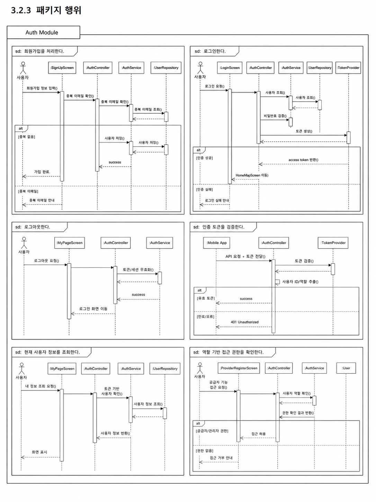
```

---

### 3.2.4 멤버함수 설계

#### (1) M-023 : signUp()

| 구분           | 내용                                                                                                                                                                                                                                    |
| -------------- | --------------------------------------------------------------------------------------------------------------------------------------------------------------------------------------------------------------------------------------- |
| 소속 클래스    | CM-020 : AuthController                                                                                                                                                                                                                 |
| 트리거 클래스  | CM-021 : AuthService                                                                                                                                                                                                                    |
| 파라멘터       | email, password, name, phoneNumber, role                                                                                                                                                                                                |
| 세부 처리 로직 | 모바일 앱에서 전달된 회원가입 정보를 수신한다. 필수 입력값을 검증한 뒤 AuthService에 회원가입 처리를 요청한다. 가입 성공 시 생성된 사용자 정보와 기본 인증 결과를 반환하고, 중복 이메일 또는 입력 오류가 있으면 오류 메시지를 반환한다. |

#### (2) M-024 : login()

| 구분           | 내용                                                                                                                                                                      |
| -------------- | ------------------------------------------------------------------------------------------------------------------------------------------------------------------------- |
| 소속 클래스    | CM-020 : AuthController                                                                                                                                                   |
| 트리거 클래스  | CM-021 : AuthService                                                                                                                                                      |
| 파라멘터       | email, password                                                                                                                                                           |
| 세부 처리 로직 | 사용자가 입력한 이메일과 비밀번호를 수신하여 AuthService에 전달한다. 사용자 정보가 일치하면 TokenProvider를 통해 인증 토큰을 발급하고, 실패 시 인증 실패 응답을 반환한다. |

#### (3) M-025 : logout()

| 구분           | 내용                                                                                                                                                           |
| -------------- | -------------------------------------------------------------------------------------------------------------------------------------------------------------- |
| 소속 클래스    | CM-020 : AuthController                                                                                                                                        |
| 트리거 클래스  | CM-021 : AuthService                                                                                                                                           |
| 파라멘터       | userId, accessToken                                                                                                                                            |
| 세부 처리 로직 | 사용자의 로그아웃 요청을 수신한다. 서버에서 관리하는 refresh token 또는 세션 정보가 있는 경우 해당 정보를 무효화하고, 모바일 앱에는 인증 정보 삭제를 안내한다. |

#### (4) M-026 : validateUser()

| 구분           | 내용                                                                                                                                                                            |
| -------------- | ------------------------------------------------------------------------------------------------------------------------------------------------------------------------------- |
| 소속 클래스    | CM-021 : AuthService                                                                                                                                                            |
| 트리거 클래스  | CM-023 : UserRepository                                                                                                                                                         |
| 파라멘터       | email, password                                                                                                                                                                 |
| 세부 처리 로직 | UserRepository를 통해 이메일에 해당하는 사용자를 조회한다. 사용자가 존재하지 않거나 비밀번호가 일치하지 않으면 인증 실패로 처리하고, 계정이 비활성 상태인 경우 접근을 제한한다. |

#### (5) M-027 : createToken()

| 구분           | 내용                                                                                                                                                            |
| -------------- | --------------------------------------------------------------------------------------------------------------------------------------------------------------- |
| 소속 클래스    | CM-022 : TokenProvider                                                                                                                                          |
| 트리거 클래스  | CM-021 : AuthService                                                                                                                                            |
| 파라멘터       | userId, role                                                                                                                                                    |
| 세부 처리 로직 | 인증에 성공한 사용자의 식별자와 역할 정보를 기반으로 access token을 생성한다. 생성된 토큰은 이후 API 요청에서 사용자의 인증 상태와 권한을 확인하는 데 사용된다. |

#### (6) M-028 : validateToken()

| 구분           | 내용                                                                                                                                                                   |
| -------------- | ---------------------------------------------------------------------------------------------------------------------------------------------------------------------- |
| 소속 클래스    | CM-022 : TokenProvider                                                                                                                                                 |
| 트리거 클래스  | CM-020 : AuthController                                                                                                                                                |
| 파라멘터       | accessToken                                                                                                                                                            |
| 세부 처리 로직 | 요청 헤더에 포함된 access token의 서명, 만료 시간, 발급자 정보를 검증한다. 토큰이 유효하면 사용자 식별자와 역할 정보를 추출하고, 유효하지 않으면 인증 오류를 반환한다. |

#### (7) M-029 : findUserByEmail()

| 구분           | 내용                                                                                                                                                                             |
| -------------- | -------------------------------------------------------------------------------------------------------------------------------------------------------------------------------- |
| 소속 클래스    | CM-023 : UserRepository                                                                                                                                                          |
| 트리거 클래스  | CM-021 : AuthService                                                                                                                                                             |
| 파라멘터       | email                                                                                                                                                                            |
| 세부 처리 로직 | 사용자의 이메일을 기준으로 MySQL 데이터베이스에서 사용자 계정 정보를 조회한다. 회원가입 시에는 이메일 중복 여부 확인에 사용하고, 로그인 시에는 인증 대상 사용자 조회에 사용한다. |

#### (8) M-030 : checkDuplicateEmail()

| 구분           | 내용                                                                                                                                      |
| -------------- | ----------------------------------------------------------------------------------------------------------------------------------------- |
| 소속 클래스    | CM-021 : AuthService                                                                                                                      |
| 트리거 클래스  | CM-023 : UserRepository                                                                                                                   |
| 파라멘터       | email                                                                                                                                     |
| 세부 처리 로직 | 회원가입 요청 시 동일한 이메일이 이미 등록되어 있는지 확인한다. 중복된 이메일이 존재하면 회원가입을 중단하고 중복 오류 메시지를 반환한다. |

#### (9) M-031 : checkUserRole()

| 구분           | 내용                                                                                                                                                       |
| -------------- | ---------------------------------------------------------------------------------------------------------------------------------------------------------- |
| 소속 클래스    | CM-021 : AuthService                                                                                                                                       |
| 트리거 클래스  | CM-017 : User                                                                                                                                              |
| 파라멘터       | userId, requiredRole                                                                                                                                       |
| 세부 처리 로직 | 특정 기능에 접근하기 전 사용자의 역할을 확인한다. 공급자 기능은 공급자 또는 상가 관리자 권한을 요구하고, 관리자 기능은 서비스 운영 관리자 권한을 요구한다. |

#### (10) M-032 : getCurrentUser()

| 구분           | 내용                                                                                                                                               |
| -------------- | -------------------------------------------------------------------------------------------------------------------------------------------------- |
| 소속 클래스    | CM-020 : AuthController                                                                                                                            |
| 트리거 클래스  | CM-021 : AuthService                                                                                                                               |
| 파라멘터       | accessToken                                                                                                                                        |
| 세부 처리 로직 | 현재 로그인한 사용자의 인증 토큰을 기반으로 사용자 ID를 추출하고, UserRepository에서 사용자 기본 정보와 역할 정보를 조회하여 모바일 앱에 반환한다. |

---

## 3.3 SDD-M-003 : Parking Search Module

### 3.3.1 모듈 설명

Parking Search Module은 SmartPark에서 현재 위치 기반 주차장 조회, 목적지 기반 주차장 검색, 주차장 목록 필터링, 주차장 정렬, 혼잡도 정보 결합을 담당하는 백엔드 검색 모듈이다. 사용자는 모바일 앱에서 현재 위치 또는 목적지를 기준으로 주차장을 탐색하며, 본 모듈은 전달받은 위치 좌표, 검색 반경, 필터 조건, 정렬 조건을 바탕으로 주차장 목록을 조회한다.

본 모듈은 단순히 주차장 데이터를 조회하는 역할에 그치지 않고, Parking Management Module의 주차장/주차 공간 데이터, Congestion Analysis Module의 혼잡도 및 추천 점수 데이터, External API Module의 장소 검색·좌표 변환 결과를 함께 활용한다. 이를 통해 사용자는 거리, 요금, 운영 시간, 이용 가능 여부, 혼잡도, 추천 점수를 기준으로 주차장을 비교할 수 있다.

| 항목          | 내용                                                                                                            |
| ------------- | --------------------------------------------------------------------------------------------------------------- |
| 모듈 ID       | SDD-M-003                                                                                                       |
| 모듈명        | Parking Search Module                                                                                           |
| 모듈 유형     | 주차장 검색 및 조회 모듈                                                                                        |
| 주요 역할     | 현재 위치 기반 조회, 목적지 기반 검색, 검색 조건 생성, 필터링, 정렬, 혼잡도 정보 결합                           |
| 구현 기술     | Spring Boot, JPA Repository, MySQL, Naver Maps API 연동                                                         |
| 관련 사용자   | 일반 운전자, 일정 기반 방문 운전자                                                                              |
| 관련 Use Case | U-02, U-03, U-04, U-05, U-10                                                                                    |
| 관련 모듈     | Mobile App Module, Parking Management Module, Congestion Analysis Module, External API Module, Database Package |

---

### 3.3.2 구성 클래스 설계

#### (1) CM-024 : ParkingSearchController

| 구분          | 내용                                                                                                                                                                     |
| ------------- | ------------------------------------------------------------------------------------------------------------------------------------------------------------------------ |
| 클래스 타입   | Boundary                                                                                                                                                                 |
| 관련 Use Case | U-02, U-03, U-04                                                                                                                                                         |
| 설명          | 모바일 앱에서 전달되는 현재 위치 기반 주차장 조회, 목적지 기반 주차장 검색, 주차장 상세 조회 API 요청을 수신하는 클래스이다.                                             |
| 멤버 변수     | - parkingSearchService<br>- requestValidator<br>- responseMapper                                                                                                         |
| 멤버 함수     | + getNearbyLots()<br>+ searchDestinationLots()<br>+ getParkingLotDetail()                                                                                                |
| 관계성        | Generalization(a-kind-of) : 없음<br>Aggregation(has-parts) : ParkingSearchService<br>Other Associations : Mobile App Module, ParkingSearchRequest, ParkingSearchResponse |

#### (2) CM-025 : ParkingSearchService

| 구분          | 내용                                                                                                                                                                                                                     |
| ------------- | ------------------------------------------------------------------------------------------------------------------------------------------------------------------------------------------------------------------------ |
| 클래스 타입   | Control                                                                                                                                                                                                                  |
| 관련 Use Case | U-02, U-03, U-04, U-05, U-10                                                                                                                                                                                             |
| 설명          | 주차장 검색의 핵심 비즈니스 로직을 처리한다. 위치 기반 검색, 목적지 기반 검색, 필터링, 정렬, 혼잡도 정보 결합을 수행한다.                                                                                                |
| 멤버 변수     | - parkingLotRepository<br>- placeSearchClient<br>- congestionService<br>- searchResultMapper                                                                                                                             |
| 멤버 함수     | + findNearbyLots()<br>+ searchByDestination()<br>+ filterAvailableLots()<br>+ sortByDistance()<br>+ combineCongestionInfo()<br>+ buildSearchResult()                                                                     |
| 관계성        | Generalization(a-kind-of) : 없음<br>Aggregation(has-parts) : ParkingLotRepository, PlaceSearchClient, CongestionService<br>Other Associations : ParkingSearchController, Congestion Analysis Module, External API Module |

#### (3) CM-026 : ParkingLotRepository

| 구분          | 내용                                                                                                                                                                |
| ------------- | ------------------------------------------------------------------------------------------------------------------------------------------------------------------- |
| 클래스 타입   | Control                                                                                                                                                             |
| 관련 Use Case | U-02, U-03, U-04                                                                                                                                                    |
| 설명          | MySQL 데이터베이스에 저장된 주차장 데이터를 위치, 주차장 ID, 운영 상태, 이용 가능 여부 기준으로 조회하는 데이터 접근 클래스이다.                                    |
| 멤버 변수     | - databaseConnection<br>- parkingLotTable<br>- parkingSpaceTable                                                                                                    |
| 멤버 함수     | + findByLocation()<br>+ findByParkingLotId()<br>+ findAvailableLots()<br>+ findBySearchCondition()                                                                  |
| 관계성        | Generalization(a-kind-of) : Repository 계층<br>Aggregation(has-parts) : 없음<br>Other Associations : ParkingSearchService, ParkingLot, ParkingSpace, MySQL Database |

#### (4) CM-027 : ParkingSearchCondition

| 구분          | 내용                                                                                                                                                        |
| ------------- | ----------------------------------------------------------------------------------------------------------------------------------------------------------- |
| 클래스 타입   | Entity                                                                                                                                                      |
| 관련 Use Case | U-02, U-03                                                                                                                                                  |
| 설명          | 주차장 검색 시 사용되는 검색 조건을 표현하는 객체이다. 현재 위치 좌표, 목적지 좌표, 검색 반경, 필터 조건, 정렬 조건을 포함한다.                             |
| 멤버 변수     | - latitude<br>- longitude<br>- radius<br>- destinationKeyword<br>- filterOption<br>- sortOption<br>- targetTime                                             |
| 멤버 함수     | + validateCondition()<br>+ updateRadius()<br>+ applyFilterOption()<br>+ applySortOption()                                                                   |
| 관계성        | Generalization(a-kind-of) : 없음<br>Aggregation(has-parts) : FilterOption, SortOption<br>Other Associations : ParkingSearchController, ParkingSearchService |

#### (5) CM-028 : ParkingSearchResult

| 구분          | 내용                                                                                                                                                          |
| ------------- | ------------------------------------------------------------------------------------------------------------------------------------------------------------- |
| 클래스 타입   | Entity                                                                                                                                                        |
| 관련 Use Case | U-02, U-03, U-04, U-05                                                                                                                                        |
| 설명          | 검색 결과로 반환되는 개별 주차장 요약 정보를 표현한다. 주차장 기본 정보와 거리, 요금, 이용 가능 공간 수, 혼잡도, 추천 점수를 포함한다.                        |
| 멤버 변수     | - parkingLotId<br>- name<br>- address<br>- distance<br>- pricePerHour<br>- availableCount<br>- congestionLevel<br>- recommendationScore<br>- markerType       |
| 멤버 함수     | + updateCongestionInfo()<br>+ updateDistance()<br>+ markAsRecommended()                                                                                       |
| 관계성        | Generalization(a-kind-of) : 없음<br>Aggregation(has-parts) : CongestionPrediction, ParkingLot<br>Other Associations : ParkingSearchService, Mobile App Module |

#### (6) CM-029 : ParkingSortOption

| 구분          | 내용                                                                                                                                   |
| ------------- | -------------------------------------------------------------------------------------------------------------------------------------- |
| 클래스 타입   | Entity                                                                                                                                 |
| 관련 Use Case | U-02, U-03                                                                                                                             |
| 설명          | 주차장 목록의 정렬 기준을 정의하는 객체이다. 거리순, 요금순, 혼잡도 낮은 순, 추천 점수순 등의 기준을 관리한다.                         |
| 멤버 변수     | - sortType<br>- direction<br>- priorityRule                                                                                            |
| 멤버 함수     | + isDistanceSort()<br>+ isPriceSort()<br>+ isCongestionSort()<br>+ isRecommendationSort()                                              |
| 관계성        | Generalization(a-kind-of) : 없음<br>Aggregation(has-parts) : 없음<br>Other Associations : ParkingSearchCondition, ParkingSearchService |

#### (7) CM-030 : DestinationSearchRequest

| 구분          | 내용                                                                                                                                                                   |
| ------------- | ---------------------------------------------------------------------------------------------------------------------------------------------------------------------- |
| 클래스 타입   | Entity                                                                                                                                                                 |
| 관련 Use Case | U-03                                                                                                                                                                   |
| 설명          | 사용자가 입력한 목적지명 또는 주소 검색 요청을 표현하는 객체이다. 검색어, 사용자 현재 위치, 검색 반경, 도착 예정 시간을 포함할 수 있다.                                |
| 멤버 변수     | - keyword<br>- currentLatitude<br>- currentLongitude<br>- targetTime<br>- radius                                                                                       |
| 멤버 함수     | + validateKeyword()<br>+ hasCurrentLocation()<br>+ toSearchCondition()                                                                                                 |
| 관계성        | Generalization(a-kind-of) : 없음<br>Aggregation(has-parts) : ParkingSearchCondition<br>Other Associations : ParkingSearchController, PlaceSearchClient, Naver Maps API |

---

### 3.3.3 패키지 행위

Parking Search Module의 패키지 행위는 사용자가 주차장을 탐색하는 흐름을 중심으로 설계한다. 본 모듈은 모바일 앱에서 전달된 현재 위치 또는 목적지 검색 요청을 처리하고, 주차장 데이터와 혼잡도 분석 결과를 결합하여 사용자가 비교 가능한 검색 결과를 반환한다.

Parking Search Module의 주요 패키지 행위는 다음과 같다.

| 행위 ID | 패키지 행위                                    | 관련 클래스                                                         | 관련 Use Case    |
| ------- | ---------------------------------------------- | ------------------------------------------------------------------- | ---------------- |
| B-009   | 현재 위치 기반 주변 주차장을 조회한다          | ParkingSearchController, ParkingSearchService, ParkingLotRepository | U-02             |
| B-010   | 목적지명 또는 주소를 좌표로 변환한다           | DestinationSearchRequest, PlaceSearchClient                         | U-03             |
| B-011   | 목적지 기준 주변 주차장을 검색한다             | ParkingSearchService, ParkingLotRepository, ParkingSearchCondition  | U-03             |
| B-012   | 주차장 상세 정보를 조회한다                    | ParkingSearchController, ParkingSearchService, ParkingLotRepository | U-04             |
| B-013   | 검색 결과에 혼잡도 정보를 결합한다             | ParkingSearchService, CongestionService, ParkingSearchResult        | U-05, U-10       |
| B-014   | 검색 결과를 필터링하고 정렬한다                | ParkingSearchService, ParkingSearchCondition, ParkingSortOption     | U-02, U-03       |
| B-015   | 모바일 앱에 지도 마커와 목록 데이터를 반환한다 | ParkingSearchResult, ParkingSearchController                        | U-02, U-03, U-04 |

패키지 행위 이미지는 이후 생성하여 아래 위치에 삽입한다.

```md
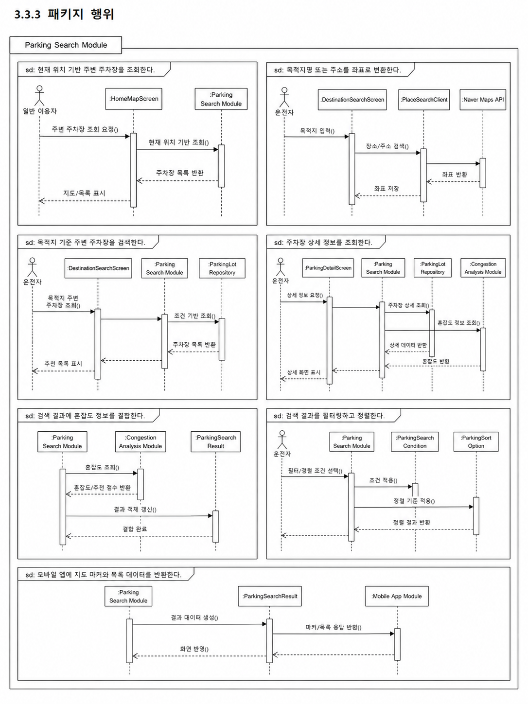
```

---

### 3.3.4 멤버함수 설계

#### (1) M-033 : getNearbyLots()

| 구분           | 내용                                                                                                                                                                                                    |
| -------------- | ------------------------------------------------------------------------------------------------------------------------------------------------------------------------------------------------------- |
| 소속 클래스    | CM-024 : ParkingSearchController                                                                                                                                                                        |
| 트리거 클래스  | CM-025 : ParkingSearchService                                                                                                                                                                           |
| 파라멘터       | latitude, longitude, radius, sort, filter                                                                                                                                                               |
| 세부 처리 로직 | 모바일 앱에서 전달한 현재 위치 좌표와 검색 조건을 수신한다. 입력값을 검증한 뒤 ParkingSearchService에 주변 주차장 조회를 요청하고, 조회 결과를 지도 마커와 목록 표시용 응답 데이터로 변환하여 반환한다. |

#### (2) M-034 : searchDestinationLots()

| 구분           | 내용                                                                                                                                                          |
| -------------- | ------------------------------------------------------------------------------------------------------------------------------------------------------------- |
| 소속 클래스    | CM-024 : ParkingSearchController                                                                                                                              |
| 트리거 클래스  | CM-025 : ParkingSearchService                                                                                                                                 |
| 파라멘터       | keyword, currentLatitude, currentLongitude, radius, targetTime                                                                                                |
| 세부 처리 로직 | 사용자가 입력한 목적지명 또는 주소를 수신한다. 목적지 검색 요청을 ParkingSearchService로 전달하고, 목적지 좌표 변환 후 해당 위치 주변 주차장 목록을 반환한다. |

#### (3) M-035 : findNearbyLots()

| 구분           | 내용                                                                                                                                                                                       |
| -------------- | ------------------------------------------------------------------------------------------------------------------------------------------------------------------------------------------ |
| 소속 클래스    | CM-025 : ParkingSearchService                                                                                                                                                              |
| 트리거 클래스  | CM-026 : ParkingLotRepository                                                                                                                                                              |
| 파라멘터       | latitude, longitude, radius                                                                                                                                                                |
| 세부 처리 로직 | 현재 위치 좌표와 검색 반경을 기준으로 ParkingSearchCondition을 생성한다. ParkingLotRepository를 통해 반경 내 주차장을 조회하고, 운영 상태와 이용 가능 여부를 기준으로 1차 결과를 구성한다. |

#### (4) M-036 : searchByDestination()

| 구분           | 내용                                                                                                                                                                   |
| -------------- | ---------------------------------------------------------------------------------------------------------------------------------------------------------------------- |
| 소속 클래스    | CM-025 : ParkingSearchService                                                                                                                                          |
| 트리거 클래스  | CM-030 : DestinationSearchRequest                                                                                                                                      |
| 파라멘터       | destinationSearchRequest                                                                                                                                               |
| 세부 처리 로직 | 목적지 검색 요청의 keyword를 검증한 뒤 External API Module을 통해 장소 검색 또는 Geocoding을 수행한다. 변환된 목적지 좌표를 기준으로 주변 주차장 조회 흐름을 실행한다. |

#### (5) M-037 : filterAvailableLots()

| 구분           | 내용                                                                                                                                                           |
| -------------- | -------------------------------------------------------------------------------------------------------------------------------------------------------------- |
| 소속 클래스    | CM-025 : ParkingSearchService                                                                                                                                  |
| 트리거 클래스  | CM-027 : ParkingSearchCondition                                                                                                                                |
| 파라멘터       | parkingLots, filterOption                                                                                                                                      |
| 세부 처리 로직 | 조회된 주차장 목록에 필터 조건을 적용한다. 이용 가능 여부, 주차장 유형, 요금 범위, 운영 시간, 혼잡도 조건을 기준으로 사용자에게 표시할 주차장 목록을 제한한다. |

#### (6) M-038 : sortByDistance()

| 구분           | 내용                                                                                                                                                                                      |
| -------------- | ----------------------------------------------------------------------------------------------------------------------------------------------------------------------------------------- |
| 소속 클래스    | CM-025 : ParkingSearchService                                                                                                                                                             |
| 트리거 클래스  | CM-029 : ParkingSortOption                                                                                                                                                                |
| 파라멘터       | parkingLots, currentLocation, sortOption                                                                                                                                                  |
| 세부 처리 로직 | 검색 결과를 사용자의 현재 위치 또는 목적지 좌표와의 거리 기준으로 정렬한다. 사용자가 선택한 정렬 조건이 요금순, 혼잡도 낮은 순, 추천 점수순인 경우 해당 기준에 맞게 정렬 로직을 변경한다. |

#### (7) M-039 : combineCongestionInfo()

| 구분           | 내용                                                                                                                                                                                              |
| -------------- | ------------------------------------------------------------------------------------------------------------------------------------------------------------------------------------------------- |
| 소속 클래스    | CM-025 : ParkingSearchService                                                                                                                                                                     |
| 트리거 클래스  | CM-053 : CongestionService                                                                                                                                                                        |
| 파라멘터       | parkingLots, targetTime                                                                                                                                                                           |
| 세부 처리 로직 | 조회된 주차장 목록에 대해 Congestion Analysis Module의 혼잡도 예측 결과를 조회한다. 각 주차장 결과에 congestionLevel, recommendationScore, reason 정보를 결합하여 ParkingSearchResult를 구성한다. |

#### (8) M-040 : findByLocation()

| 구분           | 내용                                                                                                                                                    |
| -------------- | ------------------------------------------------------------------------------------------------------------------------------------------------------- |
| 소속 클래스    | CM-026 : ParkingLotRepository                                                                                                                           |
| 트리거 클래스  | CM-025 : ParkingSearchService                                                                                                                           |
| 파라멘터       | latitude, longitude, radius                                                                                                                             |
| 세부 처리 로직 | MySQL 데이터베이스에서 위치 좌표와 검색 반경을 기준으로 주차장 목록을 조회한다. 위도, 경도, 상태값, 운영 여부를 기준으로 검색 대상 주차장을 필터링한다. |

#### (9) M-041 : findByParkingLotId()

| 구분           | 내용                                                                                                                                                |
| -------------- | --------------------------------------------------------------------------------------------------------------------------------------------------- |
| 소속 클래스    | CM-026 : ParkingLotRepository                                                                                                                       |
| 트리거 클래스  | CM-025 : ParkingSearchService                                                                                                                       |
| 파라멘터       | parkingLotId                                                                                                                                        |
| 세부 처리 로직 | 주차장 ID를 기준으로 특정 주차장의 상세 정보를 조회한다. 주차장 기본 정보, 주차 공간 수, 운영 시간, 요금 정책, 현재 이용 가능 상태를 함께 조회한다. |

#### (10) M-042 : createSearchCondition()

| 구분           | 내용                                                                                                                                                         |
| -------------- | ------------------------------------------------------------------------------------------------------------------------------------------------------------ |
| 소속 클래스    | CM-027 : ParkingSearchCondition                                                                                                                              |
| 트리거 클래스  | CM-024 : ParkingSearchController                                                                                                                             |
| 파라멘터       | latitude, longitude, radius, filterOption, sortOption, targetTime                                                                                            |
| 세부 처리 로직 | API 요청으로 전달된 검색 파라미터를 하나의 검색 조건 객체로 변환한다. 좌표와 반경 값이 유효한지 확인하고, 필터와 정렬 조건이 없을 경우 기본 조건을 적용한다. |

#### (11) M-043 : buildSearchResult()

| 구분           | 내용                                                                                                                                           |
| -------------- | ---------------------------------------------------------------------------------------------------------------------------------------------- |
| 소속 클래스    | CM-025 : ParkingSearchService                                                                                                                  |
| 트리거 클래스  | CM-028 : ParkingSearchResult                                                                                                                   |
| 파라멘터       | parkingLot, congestionPrediction, distance                                                                                                     |
| 세부 처리 로직 | 주차장 기본 정보, 거리 정보, 요금 정보, 이용 가능 공간 수, 혼잡도 예측 결과를 결합하여 모바일 앱에서 사용할 수 있는 검색 결과 객체를 생성한다. |

---

## 3.4 SDD-M-004 : Parking Management Module

### 3.4.1 모듈 설명

Parking Management Module은 SmartPark에 등록되는 주차장, 개별 주차 공간, 공급자 정보, 이용 가능 시간, 요금 정책을 관리하는 백엔드 모듈이다. 공급자는 본 모듈을 통해 주차장 정보를 등록하고, 운영 시간과 요금 정책을 설정하며, 등록된 주차 공간의 상태를 관리한다.

본 모듈은 주차장 검색 기능의 기준 데이터가 되는 ParkingLot, ParkingSpace, Availability, PricePolicy를 관리한다. 따라서 Parking Search Module, Session & NFC Module, Payment Module, Admin Module과 밀접하게 연결된다. 특히 공급자가 등록한 주차장 정보는 관리자 승인 절차를 거친 뒤 사용자에게 노출된다.

| 항목          | 내용                                                                                         |
| ------------- | -------------------------------------------------------------------------------------------- |
| 모듈 ID       | SDD-M-004                                                                                    |
| 모듈명        | Parking Management Module                                                                    |
| 모듈 유형     | 주차장/주차 공간 관리 모듈                                                                   |
| 주요 역할     | 주차장 등록, 주차 공간 관리, 공급자 정보 관리, 운영 시간 설정, 요금 정책 관리                |
| 구현 기술     | Spring Boot, JPA Repository, MySQL                                                           |
| 관련 사용자   | 개인 주차 공간 공급자, 상가/건물 주차장 관리자, 서비스 운영 관리자                           |
| 관련 Use Case | U-06, U-07, U-11                                                                             |
| 관련 모듈     | Mobile App Module, Parking Search Module, Session & NFC Module, Payment Module, Admin Module |

---

### 3.4.2 구성 클래스 설계

#### (1) CM-031 : ParkingLot

| 구분          | 내용                                                                                                                                                                        |
| ------------- | --------------------------------------------------------------------------------------------------------------------------------------------------------------------------- |
| 클래스 타입   | Entity                                                                                                                                                                      |
| 관련 Use Case | U-02, U-03, U-04, U-06, U-11                                                                                                                                                |
| 설명          | 주차장의 기본 정보를 표현하는 클래스이다. 주차장명, 주소, 좌표, 공급자, 승인 상태, 운영 상태를 관리한다.                                                                    |
| 멤버 변수     | - parkingLotId<br>- providerId<br>- name<br>- address<br>- latitude<br>- longitude<br>- approvalStatus<br>- operationStatus                                                 |
| 멤버 함수     | + updateInfo()<br>+ changeApprovalStatus()<br>+ activate()<br>+ deactivate()                                                                                                |
| 관계성        | Generalization(a-kind-of) : 없음<br>Aggregation(has-parts) : ParkingSpace, Availability, PricePolicy<br>Other Associations : Provider, ApprovalReview, ParkingSearchService |

#### (2) CM-032 : ParkingSpace

| 구분          | 내용                                                                                                                                         |
| ------------- | -------------------------------------------------------------------------------------------------------------------------------------------- |
| 클래스 타입   | Entity                                                                                                                                       |
| 관련 Use Case | U-05, U-06, U-08                                                                                                                             |
| 설명          | 실제 차량 1대가 주차할 수 있는 개별 주차 공간을 표현한다. 주차 공간 상태와 NFC 태그 연결 정보를 관리한다.                                    |
| 멤버 변수     | - parkingSpaceId<br>- parkingLotId<br>- spaceName<br>- status<br>- nfcTagId<br>- expectedExitTime                                            |
| 멤버 함수     | + updateSpaceStatus()<br>+ connectNfcTag()<br>+ markSoonAvailable()<br>+ releaseSpace()                                                      |
| 관계성        | Generalization(a-kind-of) : 없음<br>Aggregation(has-parts) : NfcTag<br>Other Associations : ParkingLot, ParkingSession, Session & NFC Module |

#### (3) CM-033 : Provider

| 구분          | 내용                                                                                                                                           |
| ------------- | ---------------------------------------------------------------------------------------------------------------------------------------------- |
| 클래스 타입   | Entity                                                                                                                                         |
| 관련 Use Case | U-06, U-07                                                                                                                                     |
| 설명          | 주차 공간을 등록하고 운영하는 공급자 정보를 표현한다. 개인 공급자 또는 상가/건물 관리자의 사업자 정보, 연락처, 정산 정보를 관리한다.           |
| 멤버 변수     | - providerId<br>- userId<br>- businessName<br>- contact<br>- settlementAccount<br>- providerStatus                                             |
| 멤버 함수     | + registerParkingLot()<br>+ updateProviderInfo()<br>+ requestSettlement()                                                                      |
| 관계성        | Generalization(a-kind-of) : User role<br>Aggregation(has-parts) : ParkingLot<br>Other Associations : Auth Module, Payment Module, Admin Module |

#### (4) CM-034 : Availability

| 구분          | 내용                                                                                                                         |
| ------------- | ---------------------------------------------------------------------------------------------------------------------------- |
| 클래스 타입   | Entity                                                                                                                       |
| 관련 Use Case | U-06, U-07                                                                                                                   |
| 설명          | 주차장의 이용 가능 요일과 시간대를 표현한다. 사용자가 특정 시간에 주차장을 이용할 수 있는지 판단하는 기준 데이터로 사용된다. |
| 멤버 변수     | - availabilityId<br>- parkingLotId<br>- dayOfWeek<br>- startTime<br>- endTime<br>- isAvailable                               |
| 멤버 함수     | + checkAvailableTime()<br>+ updateAvailableTime()<br>+ disableTimeRange()                                                    |
| 관계성        | Generalization(a-kind-of) : 없음<br>Aggregation(has-parts) : 없음<br>Other Associations : ParkingLot, ParkingSearchService   |

#### (5) CM-035 : PricePolicy

| 구분          | 내용                                                                                                                    |
| ------------- | ----------------------------------------------------------------------------------------------------------------------- |
| 클래스 타입   | Entity                                                                                                                  |
| 관련 Use Case | U-04, U-07, U-09                                                                                                        |
| 설명          | 주차장 이용 요금 정책을 표현한다. 기본 요금, 시간당 요금, 최대 요금, 무료 시간 등을 관리하며 결제 금액 계산에 활용된다. |
| 멤버 변수     | - pricePolicyId<br>- parkingLotId<br>- baseFee<br>- hourlyFee<br>- dailyMaxFee<br>- freeMinutes                         |
| 멤버 함수     | + calculateExpectedFee()<br>+ updatePricePolicy()<br>+ validatePolicy()                                                 |
| 관계성        | Generalization(a-kind-of) : 없음<br>Aggregation(has-parts) : 없음<br>Other Associations : ParkingLot, Payment Module    |

#### (6) CM-036 : ParkingManagementController

| 구분          | 내용                                                                                                                                                               |
| ------------- | ------------------------------------------------------------------------------------------------------------------------------------------------------------------ |
| 클래스 타입   | Boundary                                                                                                                                                           |
| 관련 Use Case | U-06, U-07                                                                                                                                                         |
| 설명          | 공급자 주차장 등록, 수정, 삭제, 운영 시간 및 요금 설정 요청을 수신하는 API 진입 클래스이다.                                                                        |
| 멤버 변수     | - parkingManagementService<br>- parkingSpaceService<br>- requestValidator                                                                                          |
| 멤버 함수     | + registerParkingLot()<br>+ updateParkingLot()<br>+ deleteParkingLot()<br>+ updateAvailability()<br>+ updatePricePolicy()                                          |
| 관계성        | Generalization(a-kind-of) : 없음<br>Aggregation(has-parts) : ParkingManagementService, ParkingSpaceService<br>Other Associations : Mobile App Module, Admin Module |

#### (7) CM-037 : ParkingManagementService

| 구분          | 내용                                                                                                                                                             |
| ------------- | ---------------------------------------------------------------------------------------------------------------------------------------------------------------- |
| 클래스 타입   | Control                                                                                                                                                          |
| 관련 Use Case | U-06, U-07, U-11                                                                                                                                                 |
| 설명          | 주차장 등록과 수정, 공급자 검증, 승인 대기 상태 저장 등 주차장 관리 비즈니스 로직을 처리한다.                                                                    |
| 멤버 변수     | - parkingLotRepository<br>- providerRepository<br>- approvalReviewRepository                                                                                     |
| 멤버 함수     | + createParkingLot()<br>+ updateParkingLotInfo()<br>+ requestApproval()<br>+ validateProvider()                                                                  |
| 관계성        | Generalization(a-kind-of) : 없음<br>Aggregation(has-parts) : ParkingLotRepository, ProviderRepository<br>Other Associations : AdminService, ParkingSearchService |

#### (8) CM-038 : ParkingSpaceService

| 구분          | 내용                                                                                                                                                           |
| ------------- | -------------------------------------------------------------------------------------------------------------------------------------------------------------- |
| 클래스 타입   | Control                                                                                                                                                        |
| 관련 Use Case | U-06, U-08                                                                                                                                                     |
| 설명          | 개별 주차 공간 생성, 상태 변경, NFC 태그 연결, 곧 비워질 자리 상태 관리를 담당한다.                                                                            |
| 멤버 변수     | - parkingSpaceRepository<br>- nfcTagRepository<br>- sessionRepository                                                                                          |
| 멤버 함수     | + registerParkingSpace()<br>+ updateSpaceStatus()<br>+ connectNfcTagToSpace()<br>+ updateExpectedExitTime()                                                    |
| 관계성        | Generalization(a-kind-of) : 없음<br>Aggregation(has-parts) : ParkingSpaceRepository, NfcTagRepository<br>Other Associations : Session & NFC Module, ParkingLot |

---

### 3.4.3 패키지 행위

Parking Management Module의 패키지 행위는 공급자가 주차 공간을 등록하고 운영 조건을 설정하는 흐름을 중심으로 설계한다. 등록된 주차장은 즉시 사용자에게 노출되지 않고, 관리자 승인 절차를 거친 뒤 검색 결과에 포함된다.

| 행위 ID | 패키지 행위                                    | 관련 클래스                                                       | 관련 Use Case |
| ------- | ---------------------------------------------- | ----------------------------------------------------------------- | ------------- |
| B-016   | 공급자가 주차장을 등록한다                     | ParkingManagementController, ParkingManagementService, ParkingLot | U-06          |
| B-017   | 개별 주차 공간을 등록한다                      | ParkingSpaceService, ParkingSpace                                 | U-06          |
| B-018   | 이용 가능 시간을 설정한다                      | Availability, ParkingManagementService                            | U-07          |
| B-019   | 요금 정책을 설정한다                           | PricePolicy, ParkingManagementService                             | U-07          |
| B-020   | 주차장 등록 승인 요청을 생성한다               | ParkingManagementService, ApprovalReview                          | U-11          |
| B-021   | 주차 공간 상태를 변경한다                      | ParkingSpaceService, ParkingSpace                                 | U-05, U-08    |
| B-022   | 검색 모듈에 노출 가능한 주차장 정보를 제공한다 | ParkingLot, ParkingSearchService                                  | U-02, U-03    |

패키지 행위 이미지는 이후 생성하여 아래 위치에 삽입한다.

```md
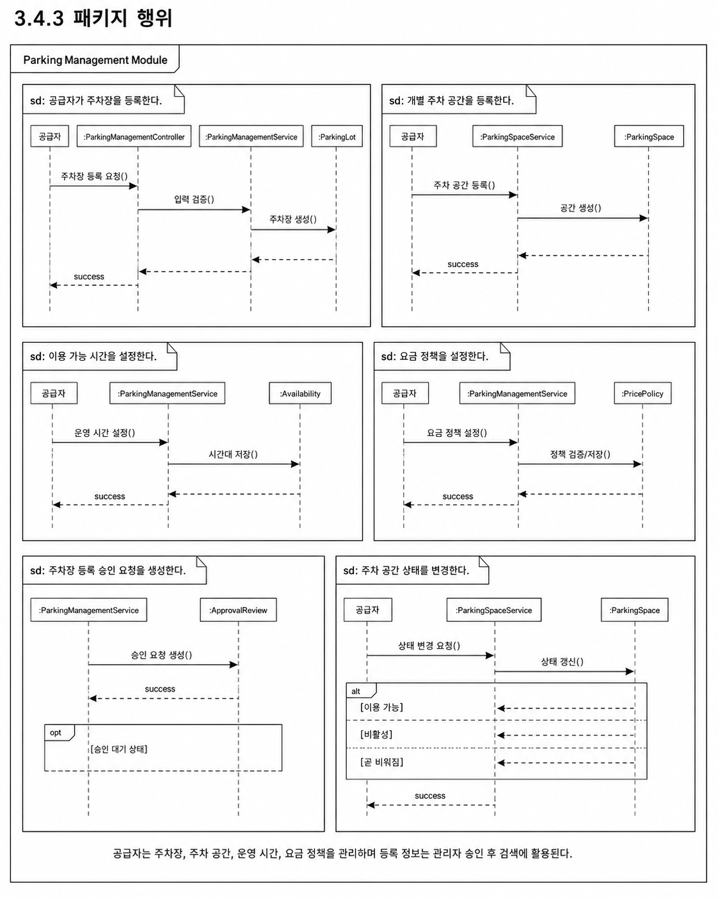
```

---

### 3.4.4 멤버함수 설계

#### (1) M-044 : registerParkingLot()

| 구분           | 내용                                                                                                                                                       |
| -------------- | ---------------------------------------------------------------------------------------------------------------------------------------------------------- |
| 소속 클래스    | CM-036 : ParkingManagementController                                                                                                                       |
| 트리거 클래스  | CM-037 : ParkingManagementService                                                                                                                          |
| 파라멘터       | providerId, parkingLotRequest                                                                                                                              |
| 세부 처리 로직 | 공급자가 입력한 주차장명, 주소, 좌표, 사진, 주차 공간 수, 운영 정보를 수신한다. 입력값을 검증한 뒤 ParkingManagementService에 주차장 등록 처리를 요청한다. |

#### (2) M-045 : updateParkingLot()

| 구분           | 내용                                                                                                                                      |
| -------------- | ----------------------------------------------------------------------------------------------------------------------------------------- |
| 소속 클래스    | CM-036 : ParkingManagementController                                                                                                      |
| 트리거 클래스  | CM-037 : ParkingManagementService                                                                                                         |
| 파라멘터       | parkingLotId, updateRequest                                                                                                               |
| 세부 처리 로직 | 공급자가 기존 주차장의 기본 정보 또는 운영 정보를 수정하면 요청 데이터를 검증하고, 수정 가능한 상태인지 확인한 뒤 주차장 정보를 갱신한다. |

#### (3) M-046 : deleteParkingLot()

| 구분           | 내용                                                                                                                      |
| -------------- | ------------------------------------------------------------------------------------------------------------------------- |
| 소속 클래스    | CM-036 : ParkingManagementController                                                                                      |
| 트리거 클래스  | CM-037 : ParkingManagementService                                                                                         |
| 파라멘터       | parkingLotId, providerId                                                                                                  |
| 세부 처리 로직 | 공급자가 등록한 주차장을 삭제 또는 비활성화한다. 이미 이용 중인 세션이 있는 경우 삭제를 제한하고, 비활성 상태로 전환한다. |

#### (4) M-047 : createParkingLot()

| 구분           | 내용                                                                                                                                                         |
| -------------- | ------------------------------------------------------------------------------------------------------------------------------------------------------------ |
| 소속 클래스    | CM-037 : ParkingManagementService                                                                                                                            |
| 트리거 클래스  | CM-031 : ParkingLot                                                                                                                                          |
| 파라멘터       | providerId, parkingLotRequest                                                                                                                                |
| 세부 처리 로직 | 공급자 권한을 확인한 후 ParkingLot 엔티티를 생성한다. 등록 상태는 기본적으로 PENDING으로 설정하고, 관리자 검토를 위한 ApprovalReview 데이터를 함께 생성한다. |

#### (5) M-048 : updateParkingLotInfo()

| 구분           | 내용                                                                                                                                         |
| -------------- | -------------------------------------------------------------------------------------------------------------------------------------------- |
| 소속 클래스    | CM-037 : ParkingManagementService                                                                                                            |
| 트리거 클래스  | CM-031 : ParkingLot                                                                                                                          |
| 파라멘터       | parkingLotId, updateRequest                                                                                                                  |
| 세부 처리 로직 | 주차장 ID를 기준으로 기존 주차장을 조회한다. 공급자 소유 여부와 수정 가능 상태를 검증한 뒤 주차장명, 주소, 좌표, 설명, 운영 상태를 수정한다. |

#### (6) M-049 : registerParkingSpace()

| 구분           | 내용                                                                                                                                    |
| -------------- | --------------------------------------------------------------------------------------------------------------------------------------- |
| 소속 클래스    | CM-038 : ParkingSpaceService                                                                                                            |
| 트리거 클래스  | CM-032 : ParkingSpace                                                                                                                   |
| 파라멘터       | parkingLotId, spaceRequest                                                                                                              |
| 세부 처리 로직 | 주차장에 속한 개별 주차 공간을 생성한다. 공간명, 상태값, NFC 태그 연결 여부를 저장하고, 초기 상태는 AVAILABLE 또는 INACTIVE로 설정한다. |

#### (7) M-050 : updateSpaceStatus()

| 구분           | 내용                                                                                                               |
| -------------- | ------------------------------------------------------------------------------------------------------------------ |
| 소속 클래스    | CM-038 : ParkingSpaceService                                                                                       |
| 트리거 클래스  | CM-032 : ParkingSpace                                                                                              |
| 파라멘터       | parkingSpaceId, status                                                                                             |
| 세부 처리 로직 | 개별 주차 공간의 상태를 변경한다. 상태값은 AVAILABLE, OCCUPIED, SOON_AVAILABLE, FULL, INACTIVE 중 하나로 관리한다. |

#### (8) M-051 : checkAvailableTime()

| 구분           | 내용                                                                                                                                                                                        |
| -------------- | ------------------------------------------------------------------------------------------------------------------------------------------------------------------------------------------- |
| 소속 클래스    | CM-034 : Availability                                                                                                                                                                       |
| 트리거 클래스  | CM-025 : ParkingSearchService                                                                                                                                                               |
| 파라멘터       | targetDateTime                                                                                                                                                                              |
| 세부 처리 로직 | 사용자가 주차장을 이용하려는 시간이 공급자가 설정한 운영 요일과 시간 범위에 포함되는지 확인한다. 이용 불가능한 시간대인 경우 검색 결과에서 제외하거나 상세 화면에서 비활성 상태로 표시한다. |

#### (9) M-052 : calculateExpectedFee()

| 구분           | 내용                                                                                                                                                          |
| -------------- | ------------------------------------------------------------------------------------------------------------------------------------------------------------- |
| 소속 클래스    | CM-035 : PricePolicy                                                                                                                                          |
| 트리거 클래스  | CM-048 : PaymentService                                                                                                                                       |
| 파라멘터       | startTime, endTime                                                                                                                                            |
| 세부 처리 로직 | 주차 이용 시작 시간과 종료 시간을 기준으로 예상 요금을 계산한다. 무료 시간, 기본 요금, 시간당 요금, 일일 최대 요금 정책을 적용하여 결제 예정 금액을 산출한다. |

---

## 3.5 SDD-M-005 : Session & NFC Module

### 3.5.1 모듈 설명

Session & NFC Module은 사용자의 실제 주차 이용 시작과 종료를 관리하는 모듈이다. 사용자는 주차 공간에 부착된 NFC 태그를 인식하여 이용을 시작하거나 종료할 수 있으며, 시스템은 해당 태그가 유효한 주차 공간과 연결되어 있는지 검증한 후 ParkingSession을 생성 또는 종료한다.

본 모듈은 주차 이용의 실제 상태를 기록하므로 Payment Module과 직접 연결된다. 또한 ParkingSpace의 상태를 OCCUPIED, AVAILABLE, SOON_AVAILABLE 등으로 변경하여 Parking Search Module의 검색 결과에도 영향을 준다.

| 항목          | 내용                                                                              |
| ------------- | --------------------------------------------------------------------------------- |
| 모듈 ID       | SDD-M-005                                                                         |
| 모듈명        | Session & NFC Module                                                              |
| 모듈 유형     | 주차 이용 세션 및 NFC 인증 모듈                                                   |
| 주요 역할     | NFC 태그 검증, 주차 이용 시작/종료, 활성 세션 조회, 주차 공간 상태 변경           |
| 구현 기술     | Spring Boot, NFC 태그 데이터, MySQL                                               |
| 관련 사용자   | 일반 운전자, 공급자                                                               |
| 관련 Use Case | U-08, U-09                                                                        |
| 관련 모듈     | Mobile App Module, Parking Management Module, Payment Module, External API Module |

---

### 3.5.2 구성 클래스 설계

#### (1) CM-039 : NfcTag

| 구분          | 내용                                                                                                                  |
| ------------- | --------------------------------------------------------------------------------------------------------------------- |
| 클래스 타입   | Entity                                                                                                                |
| 관련 Use Case | U-08                                                                                                                  |
| 설명          | 주차 공간과 연결된 NFC 태그 정보를 표현한다. 태그 코드, 연결된 주차 공간, 활성 여부를 관리한다.                       |
| 멤버 변수     | - nfcTagId<br>- tagCode<br>- parkingSpaceId<br>- isActive<br>- registeredAt                                           |
| 멤버 함수     | + validateTag()<br>+ connectSpace()<br>+ deactivateTag()                                                              |
| 관계성        | Generalization(a-kind-of) : 없음<br>Aggregation(has-parts) : 없음<br>Other Associations : ParkingSpace, NfcTagService |

#### (2) CM-040 : ParkingSession

| 구분          | 내용                                                                                                                                      |
| ------------- | ----------------------------------------------------------------------------------------------------------------------------------------- |
| 클래스 타입   | Entity                                                                                                                                    |
| 관련 Use Case | U-08, U-09                                                                                                                                |
| 설명          | 사용자의 주차 이용 시작부터 종료까지의 상태와 시간 정보를 관리한다.                                                                       |
| 멤버 변수     | - sessionId<br>- userId<br>- parkingSpaceId<br>- startTime<br>- endTime<br>- sessionStatus<br>- expectedExitTime                          |
| 멤버 함수     | + startSession()<br>+ endSession()<br>+ updateSessionStatus()<br>+ calculateDuration()                                                    |
| 관계성        | Generalization(a-kind-of) : 없음<br>Aggregation(has-parts) : Payment<br>Other Associations : ParkingSpace, SessionService, PaymentService |

#### (3) CM-041 : SessionController

| 구분          | 내용                                                                                                                                 |
| ------------- | ------------------------------------------------------------------------------------------------------------------------------------ |
| 클래스 타입   | Boundary                                                                                                                             |
| 관련 Use Case | U-08                                                                                                                                 |
| 설명          | 모바일 앱에서 전달되는 NFC 태그 검증, 주차 이용 시작, 주차 이용 종료, 활성 세션 조회 API 요청을 수신한다.                            |
| 멤버 변수     | - sessionService<br>- nfcTagService<br>- requestValidator                                                                            |
| 멤버 함수     | + validateNfcTag()<br>+ startParkingSession()<br>+ endParkingSession()<br>+ getActiveSession()                                       |
| 관계성        | Generalization(a-kind-of) : 없음<br>Aggregation(has-parts) : SessionService, NfcTagService<br>Other Associations : Mobile App Module |

#### (4) CM-042 : SessionService

| 구분          | 내용                                                                                                                                                                  |
| ------------- | --------------------------------------------------------------------------------------------------------------------------------------------------------------------- |
| 클래스 타입   | Control                                                                                                                                                               |
| 관련 Use Case | U-08, U-09                                                                                                                                                            |
| 설명          | 주차 이용 시작/종료, 활성 세션 조회, 주차 공간 상태 변경, 결제 모듈 연계를 처리한다.                                                                                  |
| 멤버 변수     | - sessionRepository<br>- parkingSpaceService<br>- nfcTagService<br>- paymentService                                                                                   |
| 멤버 함수     | + startSession()<br>+ endSession()<br>+ getActiveSession()<br>+ updateSessionStatus()                                                                                 |
| 관계성        | Generalization(a-kind-of) : 없음<br>Aggregation(has-parts) : SessionRepository, ParkingSpaceService<br>Other Associations : Payment Module, Parking Management Module |

#### (5) CM-043 : NfcTagService

| 구분          | 내용                                                                                                                       |
| ------------- | -------------------------------------------------------------------------------------------------------------------------- |
| 클래스 타입   | Control                                                                                                                    |
| 관련 Use Case | U-08                                                                                                                       |
| 설명          | NFC 태그 코드의 유효성을 검증하고, 태그가 어떤 주차 공간과 연결되어 있는지 조회한다.                                       |
| 멤버 변수     | - nfcTagRepository<br>- parkingSpaceRepository                                                                             |
| 멤버 함수     | + validateTag()<br>+ findConnectedSpace()<br>+ connectTagToSpace()                                                         |
| 관계성        | Generalization(a-kind-of) : 없음<br>Aggregation(has-parts) : NfcTagRepository<br>Other Associations : NfcTag, ParkingSpace |

#### (6) CM-044 : ActiveSessionResponse

| 구분          | 내용                                                                                                                                  |
| ------------- | ------------------------------------------------------------------------------------------------------------------------------------- |
| 클래스 타입   | Entity                                                                                                                                |
| 관련 Use Case | U-08, U-09                                                                                                                            |
| 설명          | 사용자에게 현재 진행 중인 주차 세션 정보를 반환하기 위한 응답 객체이다.                                                               |
| 멤버 변수     | - sessionId<br>- parkingLotName<br>- parkingSpaceName<br>- startTime<br>- elapsedMinutes<br>- estimatedFee<br>- sessionStatus         |
| 멤버 함수     | + fromSession()<br>+ updateEstimatedFee()                                                                                             |
| 관계성        | Generalization(a-kind-of) : 없음<br>Aggregation(has-parts) : ParkingSession<br>Other Associations : Mobile App Module, Payment Module |

---

### 3.5.3 패키지 행위

Session & NFC Module의 패키지 행위는 NFC 태그 인식을 기준으로 주차 이용 시작과 종료를 처리하는 흐름으로 구성된다.

| 행위 ID | 패키지 행위                           | 관련 클래스                              | 관련 Use Case |
| ------- | ------------------------------------- | ---------------------------------------- | ------------- |
| B-023   | NFC 태그를 검증한다                   | NfcTagService, NfcTag                    | U-08          |
| B-024   | 주차 이용 세션을 생성한다             | SessionService, ParkingSession           | U-08          |
| B-025   | 주차 공간 상태를 이용 중으로 변경한다 | SessionService, ParkingSpaceService      | U-08          |
| B-026   | 활성 주차 세션을 조회한다             | SessionController, ActiveSessionResponse | U-08          |
| B-027   | 주차 이용 세션을 종료한다             | SessionService, ParkingSession           | U-08          |
| B-028   | 결제 모듈에 요금 계산을 요청한다      | SessionService, PaymentService           | U-09          |

패키지 행위 이미지는 이후 생성하여 아래 위치에 삽입한다.

```md
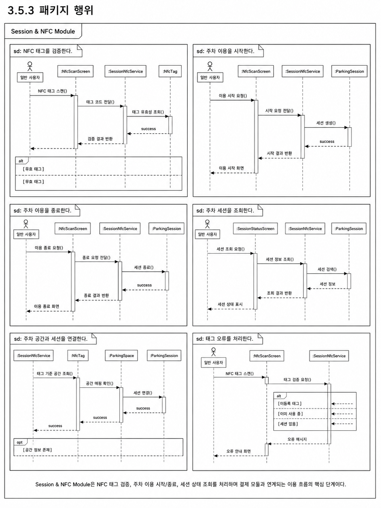
```

---

### 3.5.4 멤버함수 설계

#### (1) M-053 : validateNfcTag()

| 구분           | 내용                                                                                                                                          |
| -------------- | --------------------------------------------------------------------------------------------------------------------------------------------- |
| 소속 클래스    | CM-041 : SessionController                                                                                                                    |
| 트리거 클래스  | CM-043 : NfcTagService                                                                                                                        |
| 파라멘터       | tagCode                                                                                                                                       |
| 세부 처리 로직 | 모바일 앱에서 전달한 NFC 태그 코드를 수신한다. 태그 코드가 등록된 태그인지 확인하고, 활성 상태이며 특정 주차 공간과 연결되어 있는지 검증한다. |

#### (2) M-054 : startParkingSession()

| 구분           | 내용                                                                                                                                              |
| -------------- | ------------------------------------------------------------------------------------------------------------------------------------------------- |
| 소속 클래스    | CM-041 : SessionController                                                                                                                        |
| 트리거 클래스  | CM-042 : SessionService                                                                                                                           |
| 파라멘터       | userId, tagCode                                                                                                                                   |
| 세부 처리 로직 | 사용자가 NFC 태그를 인식하여 이용 시작을 요청하면 태그 유효성을 검증한 뒤 새로운 ParkingSession을 생성한다. 주차 공간 상태는 OCCUPIED로 변경한다. |

#### (3) M-055 : endParkingSession()

| 구분           | 내용                                                                                                                                                              |
| -------------- | ----------------------------------------------------------------------------------------------------------------------------------------------------------------- |
| 소속 클래스    | CM-041 : SessionController                                                                                                                                        |
| 트리거 클래스  | CM-042 : SessionService                                                                                                                                           |
| 파라멘터       | sessionId, tagCode                                                                                                                                                |
| 세부 처리 로직 | 사용자가 이용 종료 시 NFC 태그를 다시 인식하면 활성 세션을 조회하고 종료 시간을 기록한다. 주차 공간 상태를 AVAILABLE로 변경하고 결제 모듈로 요금 계산을 요청한다. |

#### (4) M-056 : validateTag()

| 구분           | 내용                                                                                                        |
| -------------- | ----------------------------------------------------------------------------------------------------------- |
| 소속 클래스    | CM-043 : NfcTagService                                                                                      |
| 트리거 클래스  | CM-039 : NfcTag                                                                                             |
| 파라멘터       | tagCode                                                                                                     |
| 세부 처리 로직 | NFC 태그 코드가 시스템에 등록되어 있는지, 비활성화되지 않았는지, 주차 공간과 정상 연결되어 있는지 검증한다. |

#### (5) M-057 : startSession()

| 구분           | 내용                                                                                                                            |
| -------------- | ------------------------------------------------------------------------------------------------------------------------------- |
| 소속 클래스    | CM-042 : SessionService                                                                                                         |
| 트리거 클래스  | CM-040 : ParkingSession                                                                                                         |
| 파라멘터       | userId, parkingSpaceId                                                                                                          |
| 세부 처리 로직 | 사용자의 기존 활성 세션 여부를 확인한다. 활성 세션이 없으면 시작 시간과 주차 공간 정보를 기준으로 새 ParkingSession을 생성한다. |

#### (6) M-058 : endSession()

| 구분           | 내용                                                                                                                         |
| -------------- | ---------------------------------------------------------------------------------------------------------------------------- |
| 소속 클래스    | CM-042 : SessionService                                                                                                      |
| 트리거 클래스  | CM-040 : ParkingSession                                                                                                      |
| 파라멘터       | sessionId                                                                                                                    |
| 세부 처리 로직 | 활성 상태의 세션을 조회하고 종료 시간을 기록한다. 세션 상태를 COMPLETED로 변경한 뒤 결제 계산에 필요한 이용 시간을 반환한다. |

#### (7) M-059 : getActiveSession()

| 구분           | 내용                                                                                                                                                |
| -------------- | --------------------------------------------------------------------------------------------------------------------------------------------------- |
| 소속 클래스    | CM-042 : SessionService                                                                                                                             |
| 트리거 클래스  | CM-044 : ActiveSessionResponse                                                                                                                      |
| 파라멘터       | userId                                                                                                                                              |
| 세부 처리 로직 | 사용자 ID를 기준으로 현재 IN_USE 상태의 ParkingSession을 조회한다. 활성 세션이 존재하면 주차장명, 시작 시간, 예상 요금 정보를 응답 객체로 변환한다. |

#### (8) M-060 : updateSessionStatus()

| 구분           | 내용                                                                                                                        |
| -------------- | --------------------------------------------------------------------------------------------------------------------------- |
| 소속 클래스    | CM-040 : ParkingSession                                                                                                     |
| 트리거 클래스  | CM-042 : SessionService                                                                                                     |
| 파라멘터       | sessionStatus                                                                                                               |
| 세부 처리 로직 | 주차 세션의 상태를 READY, IN_USE, COMPLETED, CANCELLED, EXPIRED 중 하나로 변경한다. 상태 변경 시 변경 시각을 함께 기록한다. |

---

## 3.6 SDD-M-006 : Payment Module

### 3.6.1 모듈 설명

Payment Module은 주차 이용 종료 후 이용 시간과 요금 정책을 기준으로 결제 금액을 계산하고, 외부 결제 API와 연동하여 결제 승인, 실패, 환불, 정산 정보를 관리하는 모듈이다. 초기 MVP에서는 모의 결제 API 또는 Mock 결제 흐름을 사용하며, 이후 실제 결제 API와 연동할 수 있도록 구조를 분리한다.

본 모듈은 Session & NFC Module에서 종료된 ParkingSession 정보를 전달받아 결제 금액을 계산한다. 결제 결과는 Payment 엔티티에 저장되며, 공급자에게 지급될 금액은 Settlement 엔티티로 관리한다.

| 항목          | 내용                                                                               |
| ------------- | ---------------------------------------------------------------------------------- |
| 모듈 ID       | SDD-M-006                                                                          |
| 모듈명        | Payment Module                                                                     |
| 모듈 유형     | 결제 및 정산 처리 모듈                                                             |
| 주요 역할     | 이용 시간 계산, 요금 산출, 결제 승인 요청, 결제 결과 저장, 환불 및 정산 관리       |
| 구현 기술     | Spring Boot, MySQL, Payment API 또는 Mock Payment API                              |
| 관련 사용자   | 일반 운전자, 공급자, 서비스 운영 관리자                                            |
| 관련 Use Case | U-09, U-12                                                                         |
| 관련 모듈     | Session & NFC Module, Parking Management Module, Admin Module, External API Module |

---

### 3.6.2 구성 클래스 설계

#### (1) CM-045 : Payment

| 구분          | 내용                                                                                                                                             |
| ------------- | ------------------------------------------------------------------------------------------------------------------------------------------------ |
| 클래스 타입   | Entity                                                                                                                                           |
| 관련 Use Case | U-09, U-12                                                                                                                                       |
| 설명          | 결제 금액, 결제 수단, 결제 상태, 승인 시각, 실패 사유를 관리하는 클래스이다.                                                                     |
| 멤버 변수     | - paymentId<br>- sessionId<br>- userId<br>- amount<br>- paymentMethod<br>- paymentStatus<br>- paidAt<br>- failureReason                          |
| 멤버 함수     | + approvePayment()<br>+ failPayment()<br>+ refundPayment()<br>+ updatePaymentStatus()                                                            |
| 관계성        | Generalization(a-kind-of) : 없음<br>Aggregation(has-parts) : ParkingSession<br>Other Associations : PaymentService, PaymentApiClient, Settlement |

#### (2) CM-046 : Settlement

| 구분          | 내용                                                                                                                           |
| ------------- | ------------------------------------------------------------------------------------------------------------------------------ |
| 클래스 타입   | Entity                                                                                                                         |
| 관련 Use Case | U-09, U-13                                                                                                                     |
| 설명          | 공급자에게 지급될 정산 금액과 정산 상태를 관리한다.                                                                            |
| 멤버 변수     | - settlementId<br>- providerId<br>- paymentId<br>- settlementAmount<br>- commissionAmount<br>- settlementStatus<br>- settledAt |
| 멤버 함수     | + createSettlement()<br>+ updateSettlementStatus()<br>+ calculateCommission()                                                  |
| 관계성        | Generalization(a-kind-of) : 없음<br>Aggregation(has-parts) : Payment<br>Other Associations : Provider, Admin Module            |

#### (3) CM-047 : PaymentController

| 구분          | 내용                                                                                                                                |
| ------------- | ----------------------------------------------------------------------------------------------------------------------------------- |
| 클래스 타입   | Boundary                                                                                                                            |
| 관련 Use Case | U-09, U-12                                                                                                                          |
| 설명          | 결제 요청, 결제 결과 조회, 환불 요청, 결제 내역 조회 API 요청을 수신한다.                                                           |
| 멤버 변수     | - paymentService<br>- paymentHistoryMapper<br>- requestValidator                                                                    |
| 멤버 함수     | + requestPayment()<br>+ getPaymentResult()<br>+ requestRefund()<br>+ getPaymentHistory()                                            |
| 관계성        | Generalization(a-kind-of) : 없음<br>Aggregation(has-parts) : PaymentService<br>Other Associations : Mobile App Module, Admin Module |

#### (4) CM-048 : PaymentService

| 구분          | 내용                                                                                                                                                             |
| ------------- | ---------------------------------------------------------------------------------------------------------------------------------------------------------------- |
| 클래스 타입   | Control                                                                                                                                                          |
| 관련 Use Case | U-09, U-12                                                                                                                                                       |
| 설명          | 결제 금액 계산, 결제 승인 요청, 결제 결과 저장, 환불 처리, 정산 생성 로직을 담당한다.                                                                            |
| 멤버 변수     | - paymentRepository<br>- sessionRepository<br>- pricePolicyRepository<br>- paymentApiClient<br>- settlementRepository                                            |
| 멤버 함수     | + calculateFee()<br>+ requestPayment()<br>+ savePaymentResult()<br>+ requestRefund()<br>+ createSettlement()                                                     |
| 관계성        | Generalization(a-kind-of) : 없음<br>Aggregation(has-parts) : PaymentRepository, PaymentApiClient<br>Other Associations : SessionService, PricePolicy, Settlement |

#### (5) CM-049 : PaymentApiClient

| 구분          | 내용                                                                                                                                         |
| ------------- | -------------------------------------------------------------------------------------------------------------------------------------------- |
| 클래스 타입   | External                                                                                                                                     |
| 관련 Use Case | U-09, U-12                                                                                                                                   |
| 설명          | 외부 결제 API와 연동하여 결제 승인, 취소, 환불 요청을 처리한다.                                                                              |
| 멤버 변수     | - apiKey<br>- baseUrl<br>- timeout<br>- retryPolicy                                                                                          |
| 멤버 함수     | + approve()<br>+ cancel()<br>+ refund()<br>+ checkPaymentStatus()                                                                            |
| 관계성        | Generalization(a-kind-of) : External API Client<br>Aggregation(has-parts) : 없음<br>Other Associations : PaymentService, External API Module |

#### (6) CM-050 : PaymentHistoryResponse

| 구분          | 내용                                                                                                                         |
| ------------- | ---------------------------------------------------------------------------------------------------------------------------- |
| 클래스 타입   | Entity                                                                                                                       |
| 관련 Use Case | U-09                                                                                                                         |
| 설명          | 사용자의 결제 내역 화면에 표시할 결제 요약 정보를 구성하는 응답 객체이다.                                                    |
| 멤버 변수     | - paymentId<br>- parkingLotName<br>- amount<br>- paymentStatus<br>- paidAt<br>- durationMinutes                              |
| 멤버 함수     | + fromPayment()<br>+ formatAmount()<br>+ formatPaidAt()                                                                      |
| 관계성        | Generalization(a-kind-of) : 없음<br>Aggregation(has-parts) : Payment<br>Other Associations : Mobile App Module, MyPageScreen |

---

### 3.6.3 패키지 행위

Payment Module의 패키지 행위는 주차 이용 종료 이후 결제 금액을 계산하고, 결제 승인 결과를 저장하는 흐름으로 구성된다.

| 행위 ID | 패키지 행위                    | 관련 클래스                                 | 관련 Use Case |
| ------- | ------------------------------ | ------------------------------------------- | ------------- |
| B-029   | 이용 시간 기반 요금을 계산한다 | PaymentService, PricePolicy, ParkingSession | U-09          |
| B-030   | 결제 승인을 요청한다           | PaymentService, PaymentApiClient            | U-09          |
| B-031   | 결제 결과를 저장한다           | PaymentService, Payment                     | U-09          |
| B-032   | 결제 내역을 조회한다           | PaymentController, PaymentHistoryResponse   | U-09          |
| B-033   | 환불 요청을 처리한다           | PaymentService, PaymentApiClient            | U-12          |
| B-034   | 공급자 정산 정보를 생성한다    | Settlement, PaymentService                  | U-13          |

패키지 행위 이미지는 이후 생성하여 아래 위치에 삽입한다.

```md
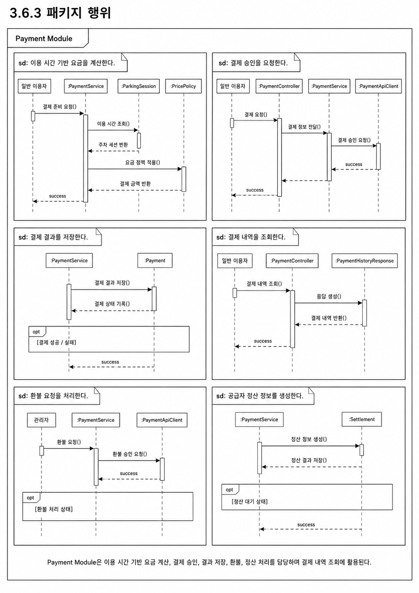
```

---

### 3.6.4 멤버함수 설계

#### (1) M-061 : requestPayment()

| 구분           | 내용                                                                                                                                    |
| -------------- | --------------------------------------------------------------------------------------------------------------------------------------- |
| 소속 클래스    | CM-047 : PaymentController                                                                                                              |
| 트리거 클래스  | CM-048 : PaymentService                                                                                                                 |
| 파라멘터       | sessionId, paymentMethod                                                                                                                |
| 세부 처리 로직 | 모바일 앱에서 전달한 주차 세션 ID와 결제 수단 정보를 수신한다. 세션 상태와 결제 가능 여부를 확인한 후 PaymentService에 결제를 요청한다. |

#### (2) M-062 : calculateFee()

| 구분           | 내용                                                                                                          |
| -------------- | ------------------------------------------------------------------------------------------------------------- |
| 소속 클래스    | CM-048 : PaymentService                                                                                       |
| 트리거 클래스  | CM-035 : PricePolicy                                                                                          |
| 파라멘터       | sessionId                                                                                                     |
| 세부 처리 로직 | ParkingSession의 시작 시간과 종료 시간을 조회하고, 해당 주차장의 PricePolicy를 적용하여 결제 금액을 계산한다. |

#### (3) M-063 : approve()

| 구분           | 내용                                                                                                                                     |
| -------------- | ---------------------------------------------------------------------------------------------------------------------------------------- |
| 소속 클래스    | CM-049 : PaymentApiClient                                                                                                                |
| 트리거 클래스  | 외부 결제 API                                                                                                                            |
| 파라멘터       | amount, paymentMethod, orderId                                                                                                           |
| 세부 처리 로직 | 외부 결제 API에 결제 승인 요청을 전송한다. 승인 성공 시 결제 승인 번호와 결제 시각을 반환하고, 실패 시 오류 코드와 실패 사유를 반환한다. |

#### (4) M-064 : savePaymentResult()

| 구분           | 내용                                                                                                             |
| -------------- | ---------------------------------------------------------------------------------------------------------------- |
| 소속 클래스    | CM-048 : PaymentService                                                                                          |
| 트리거 클래스  | CM-045 : Payment                                                                                                 |
| 파라멘터       | paymentResult                                                                                                    |
| 세부 처리 로직 | 외부 결제 API에서 반환된 결제 결과를 Payment 엔티티로 저장한다. 성공 상태는 PAID, 실패 상태는 FAILED로 기록한다. |

#### (5) M-065 : requestRefund()

| 구분           | 내용                                                                                                                  |
| -------------- | --------------------------------------------------------------------------------------------------------------------- |
| 소속 클래스    | CM-048 : PaymentService                                                                                               |
| 트리거 클래스  | CM-049 : PaymentApiClient                                                                                             |
| 파라멘터       | paymentId, refundReason                                                                                               |
| 세부 처리 로직 | 환불 가능한 결제인지 확인한 뒤 외부 결제 API에 환불 요청을 전송한다. 환불 성공 시 Payment 상태를 REFUNDED로 변경한다. |

#### (6) M-066 : createSettlement()

| 구분           | 내용                                                                                                |
| -------------- | --------------------------------------------------------------------------------------------------- |
| 소속 클래스    | CM-046 : Settlement                                                                                 |
| 트리거 클래스  | CM-048 : PaymentService                                                                             |
| 파라멘터       | providerId, paymentId, amount                                                                       |
| 세부 처리 로직 | 결제 완료 금액에서 플랫폼 수수료를 제외한 공급자 정산 금액을 계산하고 Settlement 데이터를 생성한다. |

#### (7) M-067 : updateSettlementStatus()

| 구분           | 내용                                                                                         |
| -------------- | -------------------------------------------------------------------------------------------- |
| 소속 클래스    | CM-046 : Settlement                                                                          |
| 트리거 클래스  | CM-060 : AdminService                                                                        |
| 파라멘터       | settlementId, settlementStatus                                                               |
| 세부 처리 로직 | 관리자 또는 정산 처리 흐름에 따라 정산 상태를 PENDING, COMPLETED, FAILED 중 하나로 변경한다. |

#### (8) M-068 : getPaymentHistory()

| 구분           | 내용                                                                                                                                       |
| -------------- | ------------------------------------------------------------------------------------------------------------------------------------------ |
| 소속 클래스    | CM-047 : PaymentController                                                                                                                 |
| 트리거 클래스  | CM-048 : PaymentService                                                                                                                    |
| 파라멘터       | userId                                                                                                                                     |
| 세부 처리 로직 | 사용자 ID를 기준으로 결제 내역을 조회하고, PaymentHistoryResponse 목록으로 변환하여 모바일 앱의 마이페이지 또는 결제 내역 화면에 반환한다. |

---

## 3.7 SDD-M-007 : Congestion Analysis Module

### 3.7.1 모듈 설명

Congestion Analysis Module은 주차장 이용 데이터, 시간대, 요일, 지역 특성, 주차 공간 상태, 과거 이용 이력을 바탕으로 주차장별 혼잡도와 추천 점수를 제공하는 모듈이다. 초기 MVP에서는 규칙 기반 분석과 AI 예측 결과 Mock 데이터를 활용하고, 이후 Python 기반 머신러닝 모델 결과를 MySQL에 적재하여 백엔드 API가 조회하는 구조로 확장한다.

본 모듈의 결과는 Parking Search Module과 Parking Detail 화면에 결합되어 사용자에게 제공된다. 사용자는 단순히 가까운 주차장이 아니라 실제 주차 가능성이 높은 주차장을 선택할 수 있다.

| 항목          | 내용                                                                                       |
| ------------- | ------------------------------------------------------------------------------------------ |
| 모듈 ID       | SDD-M-007                                                                                  |
| 모듈명        | Congestion Analysis Module                                                                 |
| 모듈 유형     | 혼잡도 분석 및 추천 점수 제공 모듈                                                         |
| 주요 역할     | 혼잡도 예측 결과 조회, 추천 점수 계산, 추천 사유 생성, AI 분석 모듈 연동                   |
| 구현 기술     | Spring Boot, MySQL, Python AI Module, CSV/DB 기반 예측 결과                                |
| 관련 사용자   | 일반 운전자, 일정 기반 방문 운전자, SmartPark 시스템                                       |
| 관련 Use Case | U-05, U-10                                                                                 |
| 관련 모듈     | Parking Search Module, Parking Management Module, External API Module, AI Analysis Service |

---

### 3.7.2 구성 클래스 설계

#### (1) CM-051 : CongestionPrediction

| 구분          | 내용                                                                                                                                                                 |
| ------------- | -------------------------------------------------------------------------------------------------------------------------------------------------------------------- |
| 클래스 타입   | Entity                                                                                                                                                               |
| 관련 Use Case | U-05, U-10                                                                                                                                                           |
| 설명          | 주차장별 특정 시점의 혼잡도 예측 결과를 저장하는 클래스이다.                                                                                                         |
| 멤버 변수     | - predictionId<br>- parkingLotId<br>- targetDateTime<br>- congestionLevel<br>- congestionScore<br>- recommendationScore<br>- reason<br>- modelVersion<br>- updatedAt |
| 멤버 함수     | + updatePrediction()<br>+ getPredictionResult()<br>+ isExpired()                                                                                                     |
| 관계성        | Generalization(a-kind-of) : 없음<br>Aggregation(has-parts) : ParkingLot<br>Other Associations : CongestionService, AiAnalysisClient, ParkingSearchService            |

#### (2) CM-052 : CongestionController

| 구분          | 내용                                                                                                                                            |
| ------------- | ----------------------------------------------------------------------------------------------------------------------------------------------- |
| 클래스 타입   | Boundary                                                                                                                                        |
| 관련 Use Case | U-10                                                                                                                                            |
| 설명          | 주차장별 혼잡도 조회, 추천 점수 조회, 예측 결과 조회 API 요청을 수신한다.                                                                       |
| 멤버 변수     | - congestionService<br>- responseMapper                                                                                                         |
| 멤버 함수     | + getCongestion()<br>+ getRecommendationScore()<br>+ getPredictionResult()                                                                      |
| 관계성        | Generalization(a-kind-of) : 없음<br>Aggregation(has-parts) : CongestionService<br>Other Associations : Parking Search Module, Mobile App Module |

#### (3) CM-053 : CongestionService

| 구분          | 내용                                                                                                                                                                                        |
| ------------- | ------------------------------------------------------------------------------------------------------------------------------------------------------------------------------------------- |
| 클래스 타입   | Control                                                                                                                                                                                     |
| 관련 Use Case | U-05, U-10                                                                                                                                                                                  |
| 설명          | 혼잡도 예측 결과 조회, 추천 점수 계산, 검색 결과와 혼잡도 정보 결합을 처리한다.                                                                                                             |
| 멤버 변수     | - congestionRepository<br>- aiAnalysisClient<br>- reasonGenerator                                                                                                                           |
| 멤버 함수     | + findPredictionByParkingLot()<br>+ calculateRecommendationScore()<br>+ getCongestionLevel()<br>+ refreshPrediction()                                                                       |
| 관계성        | Generalization(a-kind-of) : 없음<br>Aggregation(has-parts) : CongestionRepository, AiAnalysisClient, CongestionReasonGenerator<br>Other Associations : ParkingSearchService, MySQL Database |

#### (4) CM-054 : RecommendationScore

| 구분          | 내용                                                                                                                                             |
| ------------- | ------------------------------------------------------------------------------------------------------------------------------------------------ |
| 클래스 타입   | Entity                                                                                                                                           |
| 관련 Use Case | U-02, U-03, U-05                                                                                                                                 |
| 설명          | 주차장 추천 점수와 추천 판단 기준을 표현하는 객체이다.                                                                                           |
| 멤버 변수     | - parkingLotId<br>- distanceScore<br>- priceScore<br>- availabilityScore<br>- congestionScore<br>- finalScore                                    |
| 멤버 함수     | + calculateFinalScore()<br>+ updateWeight()<br>+ compareScore()                                                                                  |
| 관계성        | Generalization(a-kind-of) : 없음<br>Aggregation(has-parts) : CongestionPrediction<br>Other Associations : ParkingSearchResult, CongestionService |

#### (5) CM-055 : AiAnalysisClient

| 구분          | 내용                                                                                                                                                              |
| ------------- | ----------------------------------------------------------------------------------------------------------------------------------------------------------------- |
| 클래스 타입   | External                                                                                                                                                          |
| 관련 Use Case | U-10                                                                                                                                                              |
| 설명          | Python AI 분석 모듈 또는 AI 예측 결과 저장소와 연동하는 외부 연동 클래스이다.                                                                                     |
| 멤버 변수     | - endpoint<br>- modelVersion<br>- resultPath<br>- timeout                                                                                                         |
| 멤버 함수     | + requestPrediction()<br>+ loadPredictionResult()<br>+ checkModelVersion()                                                                                        |
| 관계성        | Generalization(a-kind-of) : External API Client<br>Aggregation(has-parts) : 없음<br>Other Associations : Python AI Module, External API Module, CongestionService |

#### (6) CM-056 : CongestionReasonGenerator

| 구분          | 내용                                                                                                                             |
| ------------- | -------------------------------------------------------------------------------------------------------------------------------- |
| 클래스 타입   | Control                                                                                                                          |
| 관련 Use Case | U-05, U-10                                                                                                                       |
| 설명          | 혼잡도 등급과 추천 점수의 근거가 되는 사용자 표시용 추천 사유 문구를 생성한다.                                                   |
| 멤버 변수     | - reasonTemplate<br>- congestionLevel<br>- availabilityCount<br>- distance                                                       |
| 멤버 함수     | + generateReason()<br>+ generateWarningReason()<br>+ generateRecommendationReason()                                              |
| 관계성        | Generalization(a-kind-of) : 없음<br>Aggregation(has-parts) : 없음<br>Other Associations : CongestionService, ParkingSearchResult |

---

### 3.7.3 패키지 행위

Congestion Analysis Module의 패키지 행위는 주차장별 혼잡도 결과를 조회하고, 검색 결과와 결합하여 추천 점수 및 추천 사유를 제공하는 흐름으로 구성된다.

| 행위 ID | 패키지 행위                          | 관련 클래스                             | 관련 Use Case |
| ------- | ------------------------------------ | --------------------------------------- | ------------- |
| B-035   | 주차장별 혼잡도 예측 결과를 조회한다 | CongestionService, CongestionPrediction | U-10          |
| B-036   | 추천 점수를 계산한다                 | RecommendationScore, CongestionService  | U-05          |
| B-037   | 추천 사유를 생성한다                 | CongestionReasonGenerator               | U-05          |
| B-038   | AI 분석 모듈에 예측을 요청한다       | AiAnalysisClient                        | U-10          |
| B-039   | 예측 결과를 검색 결과에 결합한다     | CongestionService, ParkingSearchResult  | U-02, U-03    |
| B-040   | 혼잡도 정보를 모바일 앱에 반환한다   | CongestionController                    | U-05, U-10    |

패키지 행위 이미지는 이후 생성하여 아래 위치에 삽입한다.

```md
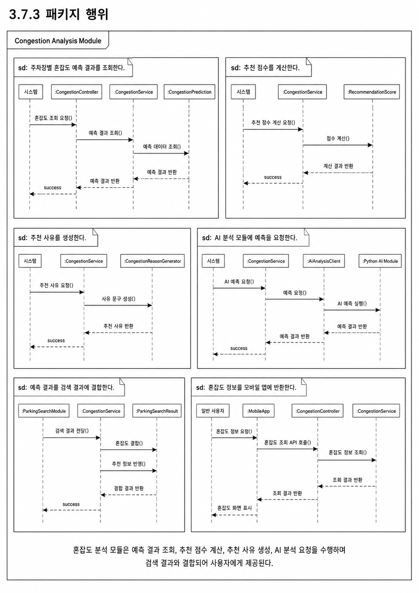
```

---

### 3.7.4 멤버함수 설계

#### (1) M-069 : getCongestion()

| 구분           | 내용                                                                                                                               |
| -------------- | ---------------------------------------------------------------------------------------------------------------------------------- |
| 소속 클래스    | CM-052 : CongestionController                                                                                                      |
| 트리거 클래스  | CM-053 : CongestionService                                                                                                         |
| 파라멘터       | parkingLotId, targetDateTime                                                                                                       |
| 세부 처리 로직 | 특정 주차장의 특정 시점 혼잡도 조회 요청을 수신한다. CongestionService를 통해 예측 결과를 조회하고, 혼잡도 등급과 점수를 반환한다. |

#### (2) M-070 : getRecommendationScore()

| 구분           | 내용                                                                                                                 |
| -------------- | -------------------------------------------------------------------------------------------------------------------- |
| 소속 클래스    | CM-052 : CongestionController                                                                                        |
| 트리거 클래스  | CM-053 : CongestionService                                                                                           |
| 파라멘터       | parkingLotId, userLocation, targetDateTime                                                                           |
| 세부 처리 로직 | 특정 주차장의 추천 점수를 조회한다. 거리, 요금, 이용 가능 공간 수, 혼잡도 점수를 결합하여 최종 추천 점수를 반환한다. |

#### (3) M-071 : findPredictionByParkingLot()

| 구분           | 내용                                                                                                                                                                            |
| -------------- | ------------------------------------------------------------------------------------------------------------------------------------------------------------------------------- |
| 소속 클래스    | CM-053 : CongestionService                                                                                                                                                      |
| 트리거 클래스  | CM-051 : CongestionPrediction                                                                                                                                                   |
| 파라멘터       | parkingLotId, targetDateTime                                                                                                                                                    |
| 세부 처리 로직 | MySQL에 저장된 CongestionPrediction 데이터 중 주차장 ID와 목표 시점에 가장 가까운 예측 결과를 조회한다. 결과가 없으면 UNKNOWN 상태를 반환하거나 기본 규칙 기반 계산을 수행한다. |

#### (4) M-072 : calculateRecommendationScore()

| 구분           | 내용                                                                                                                                                                                |
| -------------- | ----------------------------------------------------------------------------------------------------------------------------------------------------------------------------------- |
| 소속 클래스    | CM-053 : CongestionService                                                                                                                                                          |
| 트리거 클래스  | CM-054 : RecommendationScore                                                                                                                                                        |
| 파라멘터       | parkingLotId, distance, availableCount, congestionScore, price                                                                                                                      |
| 세부 처리 로직 | 거리, 현재 이용 가능 공간 수, 혼잡도 점수, 요금 정보를 기준으로 최종 추천 점수를 계산한다. 사용자가 주차 성공 가능성이 높은 주차장을 선택할 수 있도록 점수를 0~100 범위로 산출한다. |

#### (5) M-073 : generateReason()

| 구분           | 내용                                                                                                                                                                          |
| -------------- | ----------------------------------------------------------------------------------------------------------------------------------------------------------------------------- |
| 소속 클래스    | CM-056 : CongestionReasonGenerator                                                                                                                                            |
| 트리거 클래스  | CM-053 : CongestionService                                                                                                                                                    |
| 파라멘터       | congestionLevel, availableCount, distance, price                                                                                                                              |
| 세부 처리 로직 | 혼잡도 등급, 여유 공간 수, 거리, 요금 정보를 바탕으로 사용자에게 표시할 추천 사유를 생성한다. 예를 들어 “혼잡도가 낮고 목적지와 가까운 주차장입니다.”와 같은 문구를 생성한다. |

#### (6) M-074 : requestPrediction()

| 구분           | 내용                                                                                                                                                              |
| -------------- | ----------------------------------------------------------------------------------------------------------------------------------------------------------------- |
| 소속 클래스    | CM-055 : AiAnalysisClient                                                                                                                                         |
| 트리거 클래스  | Python AI Module                                                                                                                                                  |
| 파라멘터       | parkingLotData, targetDateTime                                                                                                                                    |
| 세부 처리 로직 | Python AI 분석 모듈에 주차장 데이터와 목표 시점을 전달하여 혼잡도 예측을 요청한다. 초기 MVP에서는 직접 호출 대신 사전 생성된 CSV 또는 MySQL 적재 결과를 조회한다. |

#### (7) M-075 : loadPredictionResult()

| 구분           | 내용                                                                                                                                                                    |
| -------------- | ----------------------------------------------------------------------------------------------------------------------------------------------------------------------- |
| 소속 클래스    | CM-055 : AiAnalysisClient                                                                                                                                               |
| 트리거 클래스  | MySQL 또는 CSV Result                                                                                                                                                   |
| 파라멘터       | parkingLotId, targetDateTime                                                                                                                                            |
| 세부 처리 로직 | AI 예측 결과 파일 또는 MySQL 테이블에서 주차장별 예측 결과를 불러온다. 결과에는 congestionLevel, congestionScore, recommendationScore, reason, modelVersion이 포함된다. |

#### (8) M-076 : updatePrediction()

| 구분           | 내용                                                                                                                                               |
| -------------- | -------------------------------------------------------------------------------------------------------------------------------------------------- |
| 소속 클래스    | CM-051 : CongestionPrediction                                                                                                                      |
| 트리거 클래스  | CM-053 : CongestionService                                                                                                                         |
| 파라멘터       | congestionLevel, congestionScore, recommendationScore, reason                                                                                      |
| 세부 처리 로직 | 기존 혼잡도 예측 결과를 최신 분석 결과로 갱신한다. 동일한 parkingLotId와 targetDateTime, modelVersion 조합이 존재하는 경우 기존 값을 업데이트한다. |

---

## 3.8 SDD-M-008 : Admin Module

### 3.8.1 모듈 설명

Admin Module은 SmartPark 서비스 운영자가 주차장 등록 승인, 반려, 신고 처리, 결제 오류 확인, 환불 요청 검토, 운영 통계 조회를 수행할 수 있도록 지원하는 운영 관리 모듈이다. 공급자가 등록한 주차장은 관리자 검토 후 승인되어야 사용자 검색 결과에 노출된다.

본 모듈은 Parking Management Module, Payment Module, Report 데이터, StatisticsService와 연결되어 서비스 신뢰성을 유지한다. 특히 허위 주차장 등록, 결제 오류, 신고 및 분쟁 상황을 관리하는 역할을 담당한다.

| 항목          | 내용                                                                              |
| ------------- | --------------------------------------------------------------------------------- |
| 모듈 ID       | SDD-M-008                                                                         |
| 모듈명        | Admin Module                                                                      |
| 모듈 유형     | 운영 관리 모듈                                                                    |
| 주요 역할     | 주차장 승인/반려, 신고 처리, 결제 오류 관리, 환불 검토, 운영 통계 조회            |
| 구현 기술     | Spring Boot, MySQL, 관리자 화면 또는 관리자 API                                   |
| 관련 사용자   | 서비스 운영 관리자                                                                |
| 관련 Use Case | U-11, U-12, U-13                                                                  |
| 관련 모듈     | Parking Management Module, Payment Module, Session & NFC Module, Database Package |

---

### 3.8.2 구성 클래스 설계

#### (1) CM-057 : ApprovalReview

| 구분          | 내용                                                                                                                                   |
| ------------- | -------------------------------------------------------------------------------------------------------------------------------------- |
| 클래스 타입   | Entity                                                                                                                                 |
| 관련 Use Case | U-11                                                                                                                                   |
| 설명          | 공급자가 등록한 주차장에 대한 승인/반려 검토 정보를 관리한다.                                                                          |
| 멤버 변수     | - reviewId<br>- parkingLotId<br>- adminId<br>- reviewStatus<br>- reason<br>- reviewedAt                                                |
| 멤버 함수     | + approve()<br>+ reject()<br>+ requestRevision()                                                                                       |
| 관계성        | Generalization(a-kind-of) : 없음<br>Aggregation(has-parts) : ParkingLot<br>Other Associations : AdminService, ParkingManagementService |

#### (2) CM-058 : Report

| 구분          | 내용                                                                                                                              |
| ------------- | --------------------------------------------------------------------------------------------------------------------------------- |
| 클래스 타입   | Entity                                                                                                                            |
| 관련 Use Case | U-12                                                                                                                              |
| 설명          | 사용자가 접수한 신고 또는 분쟁 정보를 관리한다.                                                                                   |
| 멤버 변수     | - reportId<br>- reporterId<br>- targetType<br>- targetId<br>- reportReason<br>- reportStatus<br>- resolvedAt                      |
| 멤버 함수     | + receiveReport()<br>+ updateReportStatus()<br>+ resolveReport()                                                                  |
| 관계성        | Generalization(a-kind-of) : 없음<br>Aggregation(has-parts) : 없음<br>Other Associations : AdminService, User, ParkingLot, Payment |

#### (3) CM-059 : AdminController

| 구분          | 내용                                                                                                                                                                        |
| ------------- | --------------------------------------------------------------------------------------------------------------------------------------------------------------------------- |
| 클래스 타입   | Boundary                                                                                                                                                                    |
| 관련 Use Case | U-11, U-12, U-13                                                                                                                                                            |
| 설명          | 관리자 화면 또는 관리자 API에서 전달되는 승인, 반려, 신고 처리, 통계 조회 요청을 수신한다.                                                                                  |
| 멤버 변수     | - adminService<br>- statisticsService<br>- requestValidator                                                                                                                 |
| 멤버 함수     | + approveParkingLot()<br>+ rejectParkingLot()<br>+ getReportList()<br>+ resolveReport()<br>+ getOperationStatistics()                                                       |
| 관계성        | Generalization(a-kind-of) : 없음<br>Aggregation(has-parts) : AdminService, StatisticsService<br>Other Associations : 관리자 화면, Parking Management Module, Payment Module |

#### (4) CM-060 : AdminService

| 구분          | 내용                                                                                                                                                                     |
| ------------- | ------------------------------------------------------------------------------------------------------------------------------------------------------------------------ |
| 클래스 타입   | Control                                                                                                                                                                  |
| 관련 Use Case | U-11, U-12                                                                                                                                                               |
| 설명          | 주차장 승인/반려, 신고 처리, 결제 오류 확인 등 관리자 기능의 핵심 비즈니스 로직을 담당한다.                                                                              |
| 멤버 변수     | - approvalReviewRepository<br>- reportRepository<br>- parkingLotRepository<br>- paymentRepository                                                                        |
| 멤버 함수     | + reviewParkingLot()<br>+ handleReport()<br>+ approveParkingLot()<br>+ rejectParkingLot()<br>+ checkPaymentIssue()                                                       |
| 관계성        | Generalization(a-kind-of) : 없음<br>Aggregation(has-parts) : ApprovalReviewRepository, ReportRepository<br>Other Associations : ParkingManagementService, PaymentService |

#### (5) CM-061 : StatisticsService

| 구분          | 내용                                                                                                                      |
| ------------- | ------------------------------------------------------------------------------------------------------------------------- |
| 클래스 타입   | Control                                                                                                                   |
| 관련 Use Case | U-13                                                                                                                      |
| 설명          | 운영 통계, 주차장 등록 수, 이용 건수, 결제 금액, 신고 처리 현황 등을 집계한다.                                            |
| 멤버 변수     | - parkingLotRepository<br>- sessionRepository<br>- paymentRepository<br>- reportRepository                                |
| 멤버 함수     | + getStatistics()<br>+ getParkingUsageStats()<br>+ getPaymentStats()<br>+ getReportStats()                                |
| 관계성        | Generalization(a-kind-of) : 없음<br>Aggregation(has-parts) : 없음<br>Other Associations : AdminController, MySQL Database |

---

### 3.8.3 패키지 행위

Admin Module의 패키지 행위는 운영 관리자가 공급자 등록 정보를 검토하고, 신고 및 결제 오류를 처리하며, 서비스 운영 통계를 확인하는 흐름으로 구성된다.

| 행위 ID | 패키지 행위                 | 관련 클래스                              | 관련 Use Case |
| ------- | --------------------------- | ---------------------------------------- | ------------- |
| B-041   | 주차장 등록 요청을 조회한다 | AdminController, ApprovalReview          | U-11          |
| B-042   | 주차장 등록을 승인한다      | AdminService, ApprovalReview, ParkingLot | U-11          |
| B-043   | 주차장 등록을 반려한다      | AdminService, ApprovalReview, ParkingLot | U-11          |
| B-044   | 신고 목록을 조회한다        | AdminController, Report                  | U-12          |
| B-045   | 신고를 처리한다             | AdminService, Report                     | U-12          |
| B-046   | 결제 오류를 확인한다        | AdminService, Payment                    | U-12          |
| B-047   | 운영 통계를 조회한다        | StatisticsService                        | U-13          |

패키지 행위 이미지는 이후 생성하여 아래 위치에 삽입한다.

```md
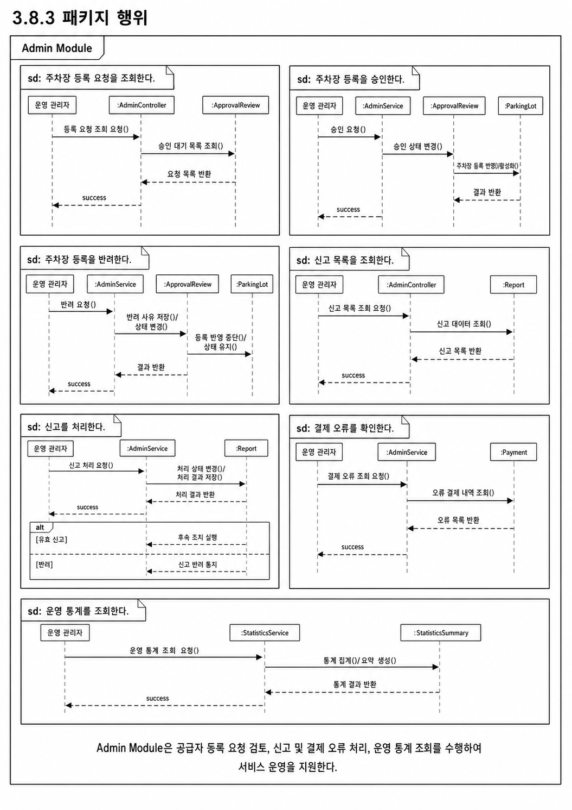
```

---

### 3.8.4 멤버함수 설계

#### (1) M-077 : approveParkingLot()

| 구분           | 내용                                                                                                                                                            |
| -------------- | --------------------------------------------------------------------------------------------------------------------------------------------------------------- |
| 소속 클래스    | CM-059 : AdminController                                                                                                                                        |
| 트리거 클래스  | CM-060 : AdminService                                                                                                                                           |
| 파라멘터       | parkingLotId, adminId                                                                                                                                           |
| 세부 처리 로직 | 관리자가 승인 버튼을 선택하면 주차장 ID와 관리자 ID를 전달받는다. AdminService는 검토 상태를 APPROVED로 변경하고, ParkingLot의 승인 상태도 APPROVED로 갱신한다. |

#### (2) M-078 : rejectParkingLot()

| 구분           | 내용                                                                                                                                                    |
| -------------- | ------------------------------------------------------------------------------------------------------------------------------------------------------- |
| 소속 클래스    | CM-059 : AdminController                                                                                                                                |
| 트리거 클래스  | CM-060 : AdminService                                                                                                                                   |
| 파라멘터       | parkingLotId, adminId, reason                                                                                                                           |
| 세부 처리 로직 | 관리자가 주차장 등록을 반려하면 반려 사유를 저장한다. ApprovalReview 상태를 REJECTED로 변경하고 공급자에게 수정 또는 반려 알림을 제공할 수 있도록 한다. |

#### (3) M-079 : getReportList()

| 구분           | 내용                                                                                                                        |
| -------------- | --------------------------------------------------------------------------------------------------------------------------- |
| 소속 클래스    | CM-059 : AdminController                                                                                                    |
| 트리거 클래스  | CM-060 : AdminService                                                                                                       |
| 파라멘터       | reportStatus, page, size                                                                                                    |
| 세부 처리 로직 | 신고 상태와 페이지 조건을 기준으로 신고 목록을 조회한다. RECEIVED, REVIEWING, RESOLVED, REJECTED 상태별로 필터링할 수 있다. |

#### (4) M-080 : resolveReport()

| 구분           | 내용                                                                                                                                   |
| -------------- | -------------------------------------------------------------------------------------------------------------------------------------- |
| 소속 클래스    | CM-059 : AdminController                                                                                                               |
| 트리거 클래스  | CM-060 : AdminService                                                                                                                  |
| 파라멘터       | reportId, result, adminComment                                                                                                         |
| 세부 처리 로직 | 관리자가 신고 내용을 검토한 후 처리 결과를 저장한다. 신고 상태를 RESOLVED 또는 REJECTED로 변경하고 처리 시각과 관리자 의견을 기록한다. |

#### (5) M-081 : reviewParkingLot()

| 구분           | 내용                                                                                                                        |
| -------------- | --------------------------------------------------------------------------------------------------------------------------- |
| 소속 클래스    | CM-060 : AdminService                                                                                                       |
| 트리거 클래스  | CM-057 : ApprovalReview                                                                                                     |
| 파라멘터       | parkingLotId, reviewStatus, reason                                                                                          |
| 세부 처리 로직 | 주차장 등록 검토 요청을 조회하고 승인, 반려, 수정 요청 중 하나의 상태로 변경한다. 상태 변경 결과는 ParkingLot에도 반영된다. |

#### (6) M-082 : handleReport()

| 구분           | 내용                                                                                                                               |
| -------------- | ---------------------------------------------------------------------------------------------------------------------------------- |
| 소속 클래스    | CM-060 : AdminService                                                                                                              |
| 트리거 클래스  | CM-058 : Report                                                                                                                    |
| 파라멘터       | reportId, processResult                                                                                                            |
| 세부 처리 로직 | 신고 대상과 신고 사유를 확인한 뒤 처리 결과를 저장한다. 필요 시 주차장 비활성화, 결제 확인, 사용자 안내 등의 후속 처리를 수행한다. |

#### (7) M-083 : getStatistics()

| 구분           | 내용                                                                                                                     |
| -------------- | ------------------------------------------------------------------------------------------------------------------------ |
| 소속 클래스    | CM-061 : StatisticsService                                                                                               |
| 트리거 클래스  | CM-059 : AdminController                                                                                                 |
| 파라멘터       | startDate, endDate                                                                                                       |
| 세부 처리 로직 | 지정된 기간 동안의 주차장 등록 수, 이용 세션 수, 결제 금액, 신고 건수, 승인/반려 건수를 집계하여 관리자 화면에 반환한다. |

---

## 3.9 SDD-M-009 : External API Module

### 3.9.1 모듈 설명

External API Module은 SmartPark 백엔드와 외부 시스템 사이의 연동을 담당하는 모듈이다. 지도/장소 검색, 주소 변환, 경로 안내, 결제 승인, NFC 태그 인식, AI 분석 결과 조회 등 외부 또는 독립 모듈과의 통신을 하나의 연동 계층으로 분리한다.

본 모듈을 별도로 설계하는 이유는 내부 서비스 로직이 외부 API의 상세 구현 방식에 직접 의존하지 않도록 하기 위함이다. Parking Search Module은 장소 검색과 경로 안내가 필요할 때 NaverMapsClient, GeocodingClient, DirectionsClient를 사용하고, Payment Module은 PaymentApiClient를 통해 외부 결제 API와 통신한다.

| 항목          | 내용                                                                                    |
| ------------- | --------------------------------------------------------------------------------------- |
| 모듈 ID       | SDD-M-009                                                                               |
| 모듈명        | External API Module                                                                     |
| 모듈 유형     | 외부 시스템 연동 모듈                                                                   |
| 주요 역할     | Naver Maps API, Geocoding, Directions5, 결제 API, NFC, AI 분석 서비스 연동              |
| 구현 기술     | Spring Boot WebClient 또는 RestTemplate, 외부 API Client, 환경 변수 기반 API Key 관리   |
| 관련 사용자   | 시스템 내부 모듈                                                                        |
| 관련 Use Case | U-02, U-03, U-04, U-08, U-09, U-10                                                      |
| 관련 모듈     | Parking Search Module, Payment Module, Session & NFC Module, Congestion Analysis Module |

---

### 3.9.2 구성 클래스 설계

#### (1) CM-062 : NaverMapsClient

| 구분          | 내용                                                                                                                                                    |
| ------------- | ------------------------------------------------------------------------------------------------------------------------------------------------------- |
| 클래스 타입   | External                                                                                                                                                |
| 관련 Use Case | U-02, U-03, U-04                                                                                                                                        |
| 설명          | Naver Maps API와 연동하여 지도 표시, 장소 검색, 주소 검색 관련 요청을 처리한다.                                                                         |
| 멤버 변수     | - clientId<br>- clientSecret<br>- baseUrl<br>- timeout                                                                                                  |
| 멤버 함수     | + searchPlace()<br>+ geocode()<br>+ reverseGeocode()                                                                                                    |
| 관계성        | Generalization(a-kind-of) : External API Client<br>Aggregation(has-parts) : 없음<br>Other Associations : ParkingSearchService, DestinationSearchRequest |

#### (2) CM-063 : GeocodingClient

| 구분          | 내용                                                                                                                                          |
| ------------- | --------------------------------------------------------------------------------------------------------------------------------------------- |
| 클래스 타입   | External                                                                                                                                      |
| 관련 Use Case | U-03                                                                                                                                          |
| 설명          | 주소 또는 장소명을 위도/경도 좌표로 변환하고, 좌표를 주소로 변환하는 기능을 담당한다.                                                         |
| 멤버 변수     | - apiKey<br>- geocodingEndpoint<br>- reverseGeocodingEndpoint                                                                                 |
| 멤버 함수     | + geocode()<br>+ reverseGeocode()<br>+ validateCoordinate()                                                                                   |
| 관계성        | Generalization(a-kind-of) : External API Client<br>Aggregation(has-parts) : 없음<br>Other Associations : ParkingSearchService, Naver Maps API |

#### (3) CM-064 : DirectionsClient

| 구분          | 내용                                                                                                                                               |
| ------------- | -------------------------------------------------------------------------------------------------------------------------------------------------- |
| 클래스 타입   | External                                                                                                                                           |
| 관련 Use Case | U-04                                                                                                                                               |
| 설명          | 사용자의 현재 위치와 선택한 주차장 사이의 경로 안내 정보를 외부 지도 API로부터 조회한다.                                                           |
| 멤버 변수     | - directionsEndpoint<br>- apiKey<br>- routeOption                                                                                                  |
| 멤버 함수     | + getDirections()<br>+ calculateEstimatedTime()<br>+ parseRouteResponse()                                                                          |
| 관계성        | Generalization(a-kind-of) : External API Client<br>Aggregation(has-parts) : 없음<br>Other Associations : ParkingDetailScreen, ParkingSearchService |

#### (4) CM-065 : ExternalApiService

| 구분          | 내용                                                                                                                                                       |
| ------------- | ---------------------------------------------------------------------------------------------------------------------------------------------------------- |
| 클래스 타입   | Control                                                                                                                                                    |
| 관련 Use Case | U-02 ~ U-10                                                                                                                                                |
| 설명          | 외부 API 호출의 공통 예외 처리, 재시도, 응답 변환, API Key 관리 정책을 담당한다.                                                                           |
| 멤버 변수     | - apiResponseMapper<br>- retryPolicy<br>- timeoutPolicy<br>- apiErrorHandler                                                                               |
| 멤버 함수     | + handleExternalApiError()<br>+ executeWithRetry()<br>+ validateApiResponse()                                                                              |
| 관계성        | Generalization(a-kind-of) : 없음<br>Aggregation(has-parts) : ApiResponseMapper<br>Other Associations : NaverMapsClient, PaymentApiClient, AiAnalysisClient |

#### (5) CM-066 : ApiResponseMapper

| 구분          | 내용                                                                                                                                               |
| ------------- | -------------------------------------------------------------------------------------------------------------------------------------------------- |
| 클래스 타입   | Control                                                                                                                                            |
| 관련 Use Case | U-02 ~ U-10                                                                                                                                        |
| 설명          | 외부 API 응답을 SmartPark 내부 DTO 또는 도메인 객체로 변환하는 클래스이다.                                                                         |
| 멤버 변수     | - responseFormat<br>- mappingRule                                                                                                                  |
| 멤버 함수     | + mapExternalResponse()<br>+ mapErrorResponse()<br>+ normalizeAddress()<br>+ normalizeCoordinate()                                                 |
| 관계성        | Generalization(a-kind-of) : 없음<br>Aggregation(has-parts) : 없음<br>Other Associations : ExternalApiService, ParkingSearchService, PaymentService |

---

### 3.9.3 패키지 행위

External API Module의 패키지 행위는 내부 모듈이 외부 시스템을 직접 호출하지 않고, 외부 연동 계층을 통해 필요한 결과를 전달받는 흐름으로 구성된다.

| 행위 ID | 패키지 행위                             | 관련 클래스                                            | 관련 Use Case |
| ------- | --------------------------------------- | ------------------------------------------------------ | ------------- |
| B-048   | 장소명 또는 주소를 검색한다             | NaverMapsClient, GeocodingClient                       | U-03          |
| B-049   | 좌표를 주소로 변환한다                  | GeocodingClient                                        | U-02, U-03    |
| B-050   | 경로 안내 정보를 조회한다               | DirectionsClient                                       | U-04          |
| B-051   | 외부 API 응답을 내부 응답으로 변환한다  | ApiResponseMapper                                      | U-02 ~ U-10   |
| B-052   | 외부 API 오류를 처리한다                | ExternalApiService                                     | U-02 ~ U-10   |
| B-053   | 결제 API와 AI 분석 모듈 호출을 중계한다 | ExternalApiService, PaymentApiClient, AiAnalysisClient | U-09, U-10    |

패키지 행위 이미지는 이후 생성하여 아래 위치에 삽입한다.

```md
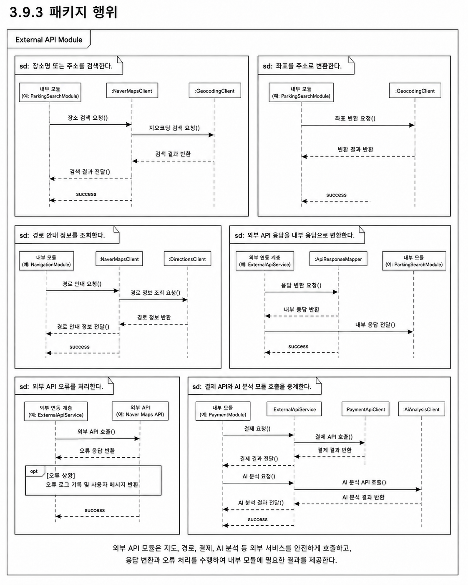
```

---

### 3.9.4 멤버함수 설계

#### (1) M-084 : searchPlace()

| 구분           | 내용                                                                                                                                         |
| -------------- | -------------------------------------------------------------------------------------------------------------------------------------------- |
| 소속 클래스    | CM-062 : NaverMapsClient                                                                                                                     |
| 트리거 클래스  | CM-025 : ParkingSearchService                                                                                                                |
| 파라멘터       | keyword                                                                                                                                      |
| 세부 처리 로직 | 사용자가 입력한 장소명 또는 주소를 Naver Maps API에 전달하여 검색 결과를 조회한다. 결과는 목적지 후보 목록 또는 좌표 변환 흐름으로 전달된다. |

#### (2) M-085 : geocode()

| 구분           | 내용                                                                                                     |
| -------------- | -------------------------------------------------------------------------------------------------------- |
| 소속 클래스    | CM-063 : GeocodingClient                                                                                 |
| 트리거 클래스  | CM-025 : ParkingSearchService                                                                            |
| 파라멘터       | address                                                                                                  |
| 세부 처리 로직 | 주소 또는 장소명을 위도와 경도 좌표로 변환한다. 변환된 좌표는 목적지 기준 주차장 검색 조건으로 사용된다. |

#### (3) M-086 : reverseGeocode()

| 구분           | 내용                                                                                               |
| -------------- | -------------------------------------------------------------------------------------------------- |
| 소속 클래스    | CM-063 : GeocodingClient                                                                           |
| 트리거 클래스  | CM-004 : HomeMapScreen                                                                             |
| 파라멘터       | latitude, longitude                                                                                |
| 세부 처리 로직 | 좌표 정보를 주소 문자열로 변환한다. 현재 위치 표시, 주차장 주소 보정, 사용자 위치 안내에 활용한다. |

#### (4) M-087 : getDirections()

| 구분           | 내용                                                                                                                                   |
| -------------- | -------------------------------------------------------------------------------------------------------------------------------------- |
| 소속 클래스    | CM-064 : DirectionsClient                                                                                                              |
| 트리거 클래스  | CM-007 : ParkingDetailScreen                                                                                                           |
| 파라멘터       | originLatitude, originLongitude, destinationLatitude, destinationLongitude                                                             |
| 세부 처리 로직 | 현재 위치와 선택한 주차장 좌표를 기준으로 경로 안내 정보를 조회한다. 예상 이동 시간, 거리, 경로 요약 정보를 내부 응답 객체로 변환한다. |

#### (5) M-088 : mapExternalResponse()

| 구분           | 내용                                                                                                                                               |
| -------------- | -------------------------------------------------------------------------------------------------------------------------------------------------- |
| 소속 클래스    | CM-066 : ApiResponseMapper                                                                                                                         |
| 트리거 클래스  | CM-065 : ExternalApiService                                                                                                                        |
| 파라멘터       | externalResponse                                                                                                                                   |
| 세부 처리 로직 | 외부 API 응답 구조를 SmartPark 내부에서 사용하는 DTO 또는 도메인 객체 형식으로 변환한다. 불필요한 필드를 제거하고 좌표, 주소, 상태값을 표준화한다. |

#### (6) M-089 : handleExternalApiError()

| 구분           | 내용                                                                                                                                |
| -------------- | ----------------------------------------------------------------------------------------------------------------------------------- |
| 소속 클래스    | CM-065 : ExternalApiService                                                                                                         |
| 트리거 클래스  | External API Client                                                                                                                 |
| 파라멘터       | errorCode, errorMessage                                                                                                             |
| 세부 처리 로직 | 외부 API 호출 실패, 타임아웃, 인증 오류, 응답 형식 오류를 공통 방식으로 처리한다. 내부 오류 코드로 변환하여 호출한 모듈에 반환한다. |

#### (7) M-090 : executeWithRetry()

| 구분           | 내용                                                                                                                                           |
| -------------- | ---------------------------------------------------------------------------------------------------------------------------------------------- |
| 소속 클래스    | CM-065 : ExternalApiService                                                                                                                    |
| 트리거 클래스  | External API Client                                                                                                                            |
| 파라멘터       | requestFunction, retryCount                                                                                                                    |
| 세부 처리 로직 | 일시적인 네트워크 오류 또는 외부 API 지연이 발생한 경우 제한된 횟수만큼 재시도한다. 재시도 후에도 실패하면 표준 외부 API 오류 응답을 반환한다. |

---

## 3.10 모듈 간 협력 요약

SmartPark의 모듈은 사용자 요청 흐름에 따라 독립적으로 동작하지 않고 서로 협력한다. Mobile App Module은 사용자 입력과 화면 표시를 담당하고, 백엔드의 각 모듈은 인증, 주차장 검색, 주차장 관리, 이용 세션, 결제, 혼잡도 분석, 관리자 기능, 외부 API 연동을 분리하여 처리한다.

| 사용자 요청                | 주요 협력 모듈                                                                                  |
| -------------------------- | ----------------------------------------------------------------------------------------------- |
| 회원가입/로그인            | Mobile App Module, Auth Module                                                                  |
| 현재 위치 기반 주차장 조회 | Mobile App Module, Parking Search Module, Congestion Analysis Module, External API Module       |
| 목적지 기반 주차장 검색    | Mobile App Module, Parking Search Module, External API Module, Congestion Analysis Module       |
| 주차장 상세 정보 확인      | Mobile App Module, Parking Search Module, Parking Management Module, Congestion Analysis Module |
| 주차 공간 등록             | Mobile App Module, Parking Management Module, Admin Module                                      |
| 이용 가능 시간/요금 설정   | Mobile App Module, Parking Management Module                                                    |
| NFC 기반 이용 시작/종료    | Mobile App Module, Session & NFC Module, Parking Management Module                              |
| 결제 처리                  | Session & NFC Module, Payment Module, External API Module                                       |
| AI 혼잡도 분석             | Congestion Analysis Module, Parking Search Module, External API Module, MySQL Database          |
| 관리자 승인/신고 처리      | Admin Module, Parking Management Module, Payment Module                                         |

본 장에서 정의한 CM 클래스와 M 멤버함수는 이후 4장 인터페이스 설계, 5장 데이터 설계, 7장 요구사항 추적표와 연결된다.

# 4. 인터페이스 설계

본 장에서는 SmartPark 시스템을 구성하는 주요 모듈 간 데이터 전달 방식과 외부 시스템 연동 방식을 정의한다. 인터페이스 설계는 2장의 소프트웨어 아키텍처와 3장의 모듈/패키지 설계를 기반으로 하며, 외부 시스템 인터페이스, 내부 API 인터페이스, 사용자 인터페이스로 구분한다.

SmartPark는 React Native 모바일 앱, Spring Boot 백엔드 서버, MySQL 데이터베이스, Python AI/규칙 기반 혼잡도 분석 모듈, Naver Maps API, 결제 API, NFC 태그를 연동하는 구조이다. 따라서 각 구성 요소가 어떤 데이터를 주고받고, 어떤 책임을 가지는지 명확히 정의해야 한다.

| 구분                   | 인터페이스 대상                                                   | 주요 목적                                         |
| ---------------------- | ----------------------------------------------------------------- | ------------------------------------------------- |
| 외부 시스템 인터페이스 | Naver Maps API, 결제 API, NFC 태그, AI/규칙 기반 혼잡도 분석 모듈 | 외부 서비스 및 독립 모듈과의 연동 방식 정의       |
| 내부 API 인터페이스    | 모바일 앱, 관리자 화면, Spring Boot 백엔드 서버                   | 클라이언트와 서버 간 REST API 요청/응답 구조 정의 |
| 사용자 인터페이스      | 일반 이용자 화면, 공급자 화면, 관리자 화면                        | 사용자 유형별 화면 구성과 API 연결 관계 정의      |

---

## 4.1 외부 시스템 인터페이스

외부 시스템 인터페이스는 SmartPark 내부 시스템이 외부 서비스 또는 독립 모듈과 데이터를 주고받는 방식을 정의한다. SmartPark는 지도/위치 기반 기능, 결제 기능, NFC 인증 기능, 혼잡도 분석 기능을 제공하기 위해 다음 외부 시스템과 연동한다.

| 외부 시스템                   | 연동 목적                                  | 관련 모듈                                  |
| ----------------------------- | ------------------------------------------ | ------------------------------------------ |
| Naver Maps API                | 지도 표시, 장소 검색, 주소 변환, 경로 안내 | Parking Search Module, External API Module |
| 결제 API                      | 주차 요금 결제 승인, 실패, 환불 처리       | Payment Module, External API Module        |
| NFC 태그                      | 주차 이용 시작/종료 인증                   | Session & NFC Module                       |
| AI/규칙 기반 혼잡도 분석 모듈 | 혼잡도 예측, 추천 점수 생성                | Congestion Analysis Module                 |

---

### 4.1.1 Naver Maps API 인터페이스

Naver Maps API 인터페이스는 사용자의 현재 위치 또는 목적지 기반 주차장 검색을 지원하기 위해 사용한다. SmartPark는 지도 표시, 장소 검색, 주소 변환, 경로 안내 기능을 중심으로 Naver Maps API를 연동한다.

| 항목         | 내용                                                                  |
| ------------ | --------------------------------------------------------------------- |
| 인터페이스명 | Naver Maps API Interface                                              |
| 연동 대상    | Naver Maps API, Geocoding API, Reverse Geocoding API, Directions5 API |
| 호출 주체    | External API Module, Parking Search Module                            |
| 주요 목적    | 목적지 검색, 주소-좌표 변환, 현재 위치 주소 변환, 경로 안내           |
| 인증 방식    | API Key 또는 Client ID/Secret 기반 인증                               |
| 데이터 형식  | JSON                                                                  |
| 호출 방식    | HTTPS 기반 REST API                                                   |

#### 주요 연동 기능

| 기능              | 입력 데이터              | 출력 데이터                     | 활용 화면               |
| ----------------- | ------------------------ | ------------------------------- | ----------------------- |
| 장소 검색         | 목적지명, 키워드         | 장소명, 주소, 좌표 후보         | 목적지 검색 화면        |
| Geocoding         | 주소 문자열              | 위도, 경도 좌표                 | 목적지 기반 주차장 검색 |
| Reverse Geocoding | 위도, 경도               | 도로명/지번 주소                | 현재 위치 표시          |
| Directions5       | 출발지 좌표, 도착지 좌표 | 예상 거리, 예상 시간, 경로 정보 | 주차장 상세 화면        |

#### 요청/응답 예시

```json
{
  "request": {
    "keyword": "강남역",
    "currentLatitude": 37.4979,
    "currentLongitude": 127.0276
  },
  "response": {
    "placeName": "강남역",
    "address": "서울특별시 강남구",
    "latitude": 37.4979,
    "longitude": 127.0276
  }
}
```

#### 예외 처리

| 오류 상황               | 처리 방식                                       |
| ----------------------- | ----------------------------------------------- |
| 검색 결과 없음          | 모바일 앱에 “검색 결과가 없습니다.” 메시지 표시 |
| API 인증 실패           | 서버 로그 기록 후 외부 API 인증 오류 응답 반환  |
| 응답 지연 또는 타임아웃 | 재시도 후 실패 시 기본 오류 메시지 반환         |
| 좌표 변환 실패          | 사용자가 주소를 다시 입력하도록 안내            |

---

### 4.1.2 결제 API 인터페이스

결제 API 인터페이스는 사용자가 주차 이용을 종료한 뒤, 이용 시간에 따른 요금을 결제하기 위해 사용한다. 초기 MVP에서는 Mock 결제 API 또는 테스트 결제 API를 사용할 수 있으며, 이후 실제 결제 대행 API로 확장 가능하도록 설계한다.

| 항목         | 내용                                                 |
| ------------ | ---------------------------------------------------- |
| 인터페이스명 | Payment API Interface                                |
| 연동 대상    | 외부 결제 대행 API 또는 Mock Payment API             |
| 호출 주체    | Payment Module, External API Module                  |
| 주요 목적    | 결제 승인, 결제 실패 처리, 환불 요청, 결제 상태 조회 |
| 인증 방식    | API Key 또는 가맹점 인증 토큰                        |
| 데이터 형식  | JSON                                                 |
| 호출 방식    | HTTPS 기반 REST API                                  |

#### 주요 연동 기능

| 기능           | 입력 데이터                              | 출력 데이터                          | 관련 Use Case |
| -------------- | ---------------------------------------- | ------------------------------------ | ------------- |
| 결제 승인 요청 | 결제 금액, 결제 수단, 주문 ID, 사용자 ID | 결제 승인 번호, 결제 상태, 승인 시각 | U-09          |
| 결제 상태 조회 | 결제 ID, 주문 ID                         | 결제 상태, 실패 사유                 | U-09, U-12    |
| 환불 요청      | 결제 ID, 환불 사유, 환불 금액            | 환불 상태, 환불 시각                 | U-12          |
| 결제 실패 처리 | 오류 코드, 오류 메시지                   | 실패 상태 저장, 사용자 안내 메시지   | U-12          |

#### 요청/응답 예시

```json
{
  "request": {
    "orderId": "SP-ORDER-20260523-001",
    "userId": 1,
    "sessionId": 1001,
    "amount": 4500,
    "paymentMethod": "CARD"
  },
  "response": {
    "paymentId": 501,
    "paymentStatus": "PAID",
    "approvedAt": "2026-05-23T15:30:00",
    "approvalNumber": "APPROVAL-123456"
  }
}
```

#### 예외 처리

| 오류 상황         | 처리 방식                                            |
| ----------------- | ---------------------------------------------------- |
| 결제 승인 실패    | Payment 상태를 FAILED로 저장하고 결제 실패 화면 표시 |
| 중복 결제 요청    | 동일 sessionId의 결제 완료 여부를 먼저 확인          |
| 결제 API 타임아웃 | 결제 상태 재조회 후 최종 상태 확정                   |
| 환불 실패         | 관리자 확인 대상으로 등록                            |

---

### 4.1.3 NFC 태그 인터페이스

NFC 태그 인터페이스는 주차 공간에 부착된 NFC 태그를 통해 사용자의 주차 이용 시작과 종료를 인증하기 위해 사용한다. 모바일 앱은 NFC 태그를 인식하여 태그 코드를 백엔드 서버에 전달하고, 백엔드는 태그 코드와 주차 공간 연결 정보를 검증한다.

| 항목         | 내용                                                      |
| ------------ | --------------------------------------------------------- |
| 인터페이스명 | NFC Tag Interface                                         |
| 연동 대상    | 주차 공간 NFC 태그                                        |
| 호출 주체    | Mobile App Module, Session & NFC Module                   |
| 주요 목적    | NFC 태그 인식, 태그 유효성 검증, 주차 이용 시작/종료 처리 |
| 데이터 형식  | 태그 ID 또는 태그 코드 문자열                             |
| 호출 방식    | 모바일 기기 NFC 인식 후 백엔드 API 호출                   |

#### 주요 연동 기능

| 기능             | 입력 데이터        | 출력 데이터                          | 관련 Use Case |
| ---------------- | ------------------ | ------------------------------------ | ------------- |
| NFC 태그 인식    | NFC Tag Code       | 태그 코드, 인식 성공 여부            | U-08          |
| 태그 유효성 검증 | tagCode            | 유효 여부, 연결된 parkingSpaceId     | U-08          |
| 주차 이용 시작   | userId, tagCode    | sessionId, sessionStatus             | U-08          |
| 주차 이용 종료   | sessionId, tagCode | 종료 시간, 이용 시간, 결제 예정 금액 | U-08, U-09    |

#### 요청/응답 예시

```json
{
  "request": {
    "userId": 1,
    "tagCode": "NFC-SP-0001"
  },
  "response": {
    "valid": true,
    "parkingSpaceId": 301,
    "sessionStatus": "READY"
  }
}
```

#### 예외 처리

| 오류 상황                | 처리 방식                               |
| ------------------------ | --------------------------------------- |
| 등록되지 않은 NFC 태그   | “유효하지 않은 태그입니다.” 메시지 반환 |
| 비활성화된 태그          | 관리자 확인 대상으로 기록               |
| 이미 사용 중인 주차 공간 | 이용 시작 제한 및 현재 상태 안내        |
| 사용자 활성 세션 존재    | 중복 이용 시작 제한                     |

---

### 4.1.4 AI/규칙 기반 혼잡도 분석 모듈 인터페이스

AI/규칙 기반 혼잡도 분석 모듈 인터페이스는 주차장 이용 데이터, 시간대, 요일, 지역 특성, 과거 이용 이력을 기반으로 혼잡도와 추천 점수를 계산하기 위해 사용한다. 초기에는 규칙 기반 분석 또는 사전 생성된 예측 결과를 사용하고, 이후 Python 기반 AI 모델과 연동할 수 있도록 설계한다.

| 항목         | 내용                                        |
| ------------ | ------------------------------------------- |
| 인터페이스명 | Congestion Analysis Interface               |
| 연동 대상    | Python AI Module 또는 규칙 기반 분석 모듈   |
| 호출 주체    | Congestion Analysis Module                  |
| 주요 목적    | 혼잡도 예측, 추천 점수 계산, 추천 사유 생성 |
| 데이터 형식  | JSON 또는 MySQL 테이블 기반 결과            |
| 호출 방식    | 내부 API 호출, 배치 처리, DB 조회 방식      |

#### 주요 연동 기능

| 기능             | 입력 데이터                           | 출력 데이터                 | 관련 Use Case |
| ---------------- | ------------------------------------- | --------------------------- | ------------- |
| 혼잡도 예측 요청 | 주차장 ID, 시간대, 요일, 이용 이력    | 혼잡도 점수, 혼잡도 등급    | U-10          |
| 추천 점수 계산   | 거리, 요금, 이용 가능 공간 수, 혼잡도 | 추천 점수                   | U-05, U-10    |
| 추천 사유 생성   | 혼잡도 등급, 주차 가능성, 거리        | 추천 문구                   | U-05          |
| 예측 결과 저장   | prediction result                     | CongestionPrediction 데이터 | U-10          |

#### 요청/응답 예시

```json
{
  "request": {
    "parkingLotId": 101,
    "targetDateTime": "2026-05-23T18:00:00",
    "availableCount": 3,
    "recentUsageRate": 0.82
  },
  "response": {
    "congestionLevel": "HIGH",
    "congestionScore": 86,
    "recommendationScore": 42,
    "reason": "퇴근 시간대 이용률이 높아 혼잡 가능성이 큽니다.",
    "modelVersion": "rule-v1"
  }
}
```

#### 예외 처리

| 오류 상황         | 처리 방식                                   |
| ----------------- | ------------------------------------------- |
| 예측 데이터 없음  | UNKNOWN 또는 기본 규칙 기반 결과 반환       |
| AI 모듈 호출 실패 | 최근 저장된 예측 결과 사용                  |
| 모델 버전 불일치  | 서버 로그 기록 후 기본 결과 반환            |
| 데이터 부족       | 혼잡도 대신 이용 가능 공간 수 중심으로 안내 |

---

## 4.2 내부 API 인터페이스

내부 API 인터페이스는 React Native 모바일 앱, 관리자 화면, Spring Boot 백엔드 서버 간의 요청/응답 구조를 정의한다. SmartPark 내부 API는 REST 방식으로 설계하며, 기능별 모듈 책임에 따라 인증, 주차장 조회, 주차장 등록/관리, 주차 세션, 결제, 혼잡도 분석, 관리자 API로 구분한다.

---

### 4.2.1 API 설계 개요

SmartPark 내부 API는 다음 원칙에 따라 설계한다.

| 설계 원칙           | 내용                                                                   |
| ------------------- | ---------------------------------------------------------------------- |
| REST 기반 설계      | 자원 중심 URI와 HTTP Method를 사용한다.                                |
| JSON 응답           | 모든 요청/응답 데이터는 JSON 형식을 기본으로 한다.                     |
| 인증 토큰 사용      | 로그인 이후 보호 API는 Authorization Header의 Bearer Token을 사용한다. |
| 모듈별 URI 분리     | 인증, 주차장, 세션, 결제, 관리자 기능을 URI 기준으로 구분한다.         |
| 공통 응답 형식 적용 | 성공/실패 응답 구조와 오류 코드를 통일한다.                            |
| 확장 가능성 고려    | MVP 이후 AI 고도화, 정산, 신고 기능 확장을 고려한다.                   |

#### API URI 기본 구조

```text
/api/auth
/api/parking-lots
/api/parking-spaces
/api/sessions
/api/payments
/api/congestion
/api/admin
```

#### 공통 요청 Header

| Header                              | 설명                            | 필수 여부         |
| ----------------------------------- | ------------------------------- | ----------------- |
| Content-Type: application/json      | JSON 요청 본문 형식             | 필수              |
| Authorization: Bearer {accessToken} | 인증이 필요한 API의 사용자 토큰 | 보호 API에서 필수 |
| X-Request-Id                        | 요청 추적용 ID                  | 선택              |

---

### 4.2.2 인증 API

인증 API는 회원가입, 로그인, 로그아웃, 토큰 검증, 현재 사용자 정보 조회를 담당한다.

| API ID       | Method | URI                | 설명                  | 인증   |
| ------------ | ------ | ------------------ | --------------------- | ------ |
| API-AUTH-001 | POST   | /api/auth/signup   | 회원가입              | 불필요 |
| API-AUTH-002 | POST   | /api/auth/login    | 로그인                | 불필요 |
| API-AUTH-003 | POST   | /api/auth/logout   | 로그아웃              | 필요   |
| API-AUTH-004 | GET    | /api/auth/me       | 현재 사용자 정보 조회 | 필요   |
| API-AUTH-005 | POST   | /api/auth/validate | 인증 토큰 검증        | 필요   |

#### 회원가입 요청 예시

```json
{
  "email": "user@example.com",
  "password": "password1234",
  "name": "최수연",
  "phoneNumber": "010-0000-0000",
  "role": "DRIVER"
}
```

#### 로그인 응답 예시

```json
{
  "success": true,
  "code": "AUTH_LOGIN_SUCCESS",
  "message": "로그인에 성공했습니다.",
  "data": {
    "accessToken": "jwt-access-token",
    "refreshToken": "jwt-refresh-token",
    "userId": 1,
    "role": "DRIVER"
  }
}
```

---

### 4.2.3 주차장 조회 API

주차장 조회 API는 현재 위치 기반 주변 주차장 조회, 목적지 기반 검색, 주차장 상세 정보 조회, 지도 마커 데이터 조회를 담당한다.

| API ID       | Method | URI                                     | 설명                            | 인증 |
| ------------ | ------ | --------------------------------------- | ------------------------------- | ---- |
| API-PARK-001 | GET    | /api/parking-lots/nearby                | 현재 위치 기반 주변 주차장 조회 | 선택 |
| API-PARK-002 | GET    | /api/parking-lots/search                | 목적지 기반 주차장 검색         | 선택 |
| API-PARK-003 | GET    | /api/parking-lots/{parkingLotId}        | 주차장 상세 정보 조회           | 선택 |
| API-PARK-004 | GET    | /api/parking-lots/{parkingLotId}/spaces | 주차 공간 목록 조회             | 선택 |
| API-PARK-005 | GET    | /api/parking-lots/map-markers           | 지도 마커 데이터 조회           | 선택 |

#### 현재 위치 기반 주차장 조회 요청 파라미터

| 파라미터      | 타입    | 설명                                        | 필수 |
| ------------- | ------- | ------------------------------------------- | ---- |
| latitude      | Double  | 현재 위치 위도                              | 필수 |
| longitude     | Double  | 현재 위치 경도                              | 필수 |
| radius        | Integer | 검색 반경                                   | 선택 |
| sort          | String  | distance, price, congestion, recommendation | 선택 |
| availableOnly | Boolean | 이용 가능 주차장만 조회 여부                | 선택 |

#### 응답 예시

```json
{
  "success": true,
  "code": "PARKING_LOT_LIST_SUCCESS",
  "message": "주변 주차장 조회에 성공했습니다.",
  "data": [
    {
      "parkingLotId": 101,
      "name": "강남역 공유 주차장",
      "address": "서울특별시 강남구",
      "distance": 320,
      "pricePerHour": 3000,
      "availableCount": 4,
      "congestionLevel": "LOW",
      "recommendationScore": 86
    }
  ]
}
```

---

### 4.2.4 주차장 등록/관리 API

주차장 등록/관리 API는 공급자가 주차장과 개별 주차 공간을 등록하고, 이용 가능 시간과 요금 정책을 설정하는 기능을 담당한다.

| API ID       | Method | URI                                                    | 설명                      | 인증   |
| ------------ | ------ | ------------------------------------------------------ | ------------------------- | ------ |
| API-MGMT-001 | POST   | /api/provider/parking-lots                             | 주차장 등록               | 공급자 |
| API-MGMT-002 | PUT    | /api/provider/parking-lots/{parkingLotId}              | 주차장 정보 수정          | 공급자 |
| API-MGMT-003 | DELETE | /api/provider/parking-lots/{parkingLotId}              | 주차장 삭제 또는 비활성화 | 공급자 |
| API-MGMT-004 | POST   | /api/provider/parking-lots/{parkingLotId}/spaces       | 주차 공간 등록            | 공급자 |
| API-MGMT-005 | PUT    | /api/provider/parking-spaces/{parkingSpaceId}/status   | 주차 공간 상태 변경       | 공급자 |
| API-MGMT-006 | PUT    | /api/provider/parking-lots/{parkingLotId}/availability | 이용 가능 시간 설정       | 공급자 |
| API-MGMT-007 | PUT    | /api/provider/parking-lots/{parkingLotId}/price-policy | 요금 정책 설정            | 공급자 |

#### 주차장 등록 요청 예시

```json
{
  "name": "역삼동 공유 주차장",
  "address": "서울특별시 강남구 역삼동",
  "latitude": 37.5001,
  "longitude": 127.0364,
  "spaceCount": 5,
  "description": "평일 야간 이용 가능한 공유 주차장입니다."
}
```

#### 요금 정책 설정 요청 예시

```json
{
  "baseFee": 1000,
  "hourlyFee": 3000,
  "dailyMaxFee": 20000,
  "freeMinutes": 10
}
```

---

### 4.2.5 주차 세션 API

주차 세션 API는 NFC 태그 기반 주차 이용 시작, 종료, 활성 세션 조회를 담당한다.

| API ID          | Method | URI                           | 설명                 | 인증 |
| --------------- | ------ | ----------------------------- | -------------------- | ---- |
| API-SESSION-001 | POST   | /api/sessions/nfc/validate    | NFC 태그 유효성 검증 | 필요 |
| API-SESSION-002 | POST   | /api/sessions/start           | 주차 이용 시작       | 필요 |
| API-SESSION-003 | POST   | /api/sessions/{sessionId}/end | 주차 이용 종료       | 필요 |
| API-SESSION-004 | GET    | /api/sessions/active          | 현재 활성 세션 조회  | 필요 |
| API-SESSION-005 | GET    | /api/sessions/history         | 주차 이용 내역 조회  | 필요 |

#### 주차 이용 시작 요청 예시

```json
{
  "tagCode": "NFC-SP-0001"
}
```

#### 주차 이용 시작 응답 예시

```json
{
  "success": true,
  "code": "SESSION_START_SUCCESS",
  "message": "주차 이용이 시작되었습니다.",
  "data": {
    "sessionId": 1001,
    "parkingLotName": "강남역 공유 주차장",
    "parkingSpaceId": 301,
    "startTime": "2026-05-23T18:00:00",
    "sessionStatus": "IN_USE"
  }
}
```

---

### 4.2.6 결제 API

결제 API는 주차 이용 종료 후 결제 금액 계산, 결제 승인 요청, 결제 결과 조회, 결제 내역 조회, 환불 요청을 담당한다.

| API ID      | Method | URI                              | 설명                | 인증 |
| ----------- | ------ | -------------------------------- | ------------------- | ---- |
| API-PAY-001 | GET    | /api/payments/estimate           | 결제 예정 금액 조회 | 필요 |
| API-PAY-002 | POST   | /api/payments                    | 결제 요청           | 필요 |
| API-PAY-003 | GET    | /api/payments/{paymentId}        | 결제 결과 조회      | 필요 |
| API-PAY-004 | GET    | /api/payments/history            | 결제 내역 조회      | 필요 |
| API-PAY-005 | POST   | /api/payments/{paymentId}/refund | 환불 요청           | 필요 |

#### 결제 요청 예시

```json
{
  "sessionId": 1001,
  "paymentMethod": "CARD",
  "amount": 4500
}
```

#### 결제 응답 예시

```json
{
  "success": true,
  "code": "PAYMENT_SUCCESS",
  "message": "결제가 완료되었습니다.",
  "data": {
    "paymentId": 501,
    "sessionId": 1001,
    "amount": 4500,
    "paymentStatus": "PAID",
    "paidAt": "2026-05-23T19:20:00"
  }
}
```

---

### 4.2.7 혼잡도 분석 API

혼잡도 분석 API는 주차장별 혼잡도 예측 결과, 추천 점수, 추천 사유를 조회하는 기능을 담당한다.

| API ID       | Method | URI                                         | 설명                    | 인증 |
| ------------ | ------ | ------------------------------------------- | ----------------------- | ---- |
| API-CONG-001 | GET    | /api/congestion/parking-lots/{parkingLotId} | 특정 주차장 혼잡도 조회 | 선택 |
| API-CONG-002 | GET    | /api/congestion/recommendations             | 추천 주차장 목록 조회   | 선택 |
| API-CONG-003 | POST   | /api/congestion/predict                     | 혼잡도 예측 요청        | 내부 |
| API-CONG-004 | GET    | /api/congestion/results                     | 혼잡도 예측 결과 조회   | 내부 |

#### 혼잡도 조회 응답 예시

```json
{
  "success": true,
  "code": "CONGESTION_RESULT_SUCCESS",
  "message": "혼잡도 분석 결과 조회에 성공했습니다.",
  "data": {
    "parkingLotId": 101,
    "congestionLevel": "MEDIUM",
    "congestionScore": 63,
    "recommendationScore": 74,
    "reason": "현재 이용 가능 공간은 있으나, 주변 이용률이 증가하는 시간대입니다."
  }
}
```

---

### 4.2.8 관리자 API

관리자 API는 주차장 등록 승인/반려, 신고 처리, 결제 오류 확인, 환불 검토, 운영 통계 조회를 담당한다.

| API ID        | Method | URI                                            | 설명                       | 인증   |
| ------------- | ------ | ---------------------------------------------- | -------------------------- | ------ |
| API-ADMIN-001 | GET    | /api/admin/parking-lots/pending                | 승인 대기 주차장 목록 조회 | 관리자 |
| API-ADMIN-002 | POST   | /api/admin/parking-lots/{parkingLotId}/approve | 주차장 등록 승인           | 관리자 |
| API-ADMIN-003 | POST   | /api/admin/parking-lots/{parkingLotId}/reject  | 주차장 등록 반려           | 관리자 |
| API-ADMIN-004 | GET    | /api/admin/reports                             | 신고 목록 조회             | 관리자 |
| API-ADMIN-005 | POST   | /api/admin/reports/{reportId}/resolve          | 신고 처리                  | 관리자 |
| API-ADMIN-006 | GET    | /api/admin/payments/issues                     | 결제 오류 목록 조회        | 관리자 |
| API-ADMIN-007 | GET    | /api/admin/statistics                          | 운영 통계 조회             | 관리자 |

#### 주차장 승인 요청 예시

```json
{
  "adminId": 9001,
  "comment": "등록 정보와 위치 정보가 확인되어 승인합니다."
}
```

#### 주차장 반려 요청 예시

```json
{
  "adminId": 9001,
  "reason": "주차장 사진과 위치 정보가 불명확합니다."
}
```

---

### 4.2.9 공통 응답 형식 및 오류 코드

SmartPark 내부 API는 클라이언트에서 일관되게 응답을 처리할 수 있도록 공통 응답 형식을 사용한다.

#### 성공 응답 형식

```json
{
  "success": true,
  "code": "SUCCESS_CODE",
  "message": "요청이 성공적으로 처리되었습니다.",
  "data": {}
}
```

#### 실패 응답 형식

```json
{
  "success": false,
  "code": "ERROR_CODE",
  "message": "요청 처리 중 오류가 발생했습니다.",
  "data": null
}
```

#### 주요 오류 코드

| 오류 코드                   | HTTP Status | 설명                                 |
| --------------------------- | ----------: | ------------------------------------ |
| AUTH_INVALID_CREDENTIALS    |         401 | 이메일 또는 비밀번호가 일치하지 않음 |
| AUTH_TOKEN_EXPIRED          |         401 | 인증 토큰 만료                       |
| AUTH_ACCESS_DENIED          |         403 | 접근 권한 없음                       |
| USER_DUPLICATE_EMAIL        |         409 | 이미 등록된 이메일                   |
| PARKING_LOT_NOT_FOUND       |         404 | 주차장 정보 없음                     |
| PARKING_SPACE_UNAVAILABLE   |         409 | 이용 불가능한 주차 공간              |
| NFC_TAG_INVALID             |         400 | 유효하지 않은 NFC 태그               |
| SESSION_NOT_FOUND           |         404 | 주차 세션 정보 없음                  |
| SESSION_ALREADY_ACTIVE      |         409 | 이미 활성화된 세션 존재              |
| PAYMENT_FAILED              |         400 | 결제 실패                            |
| PAYMENT_DUPLICATED          |         409 | 중복 결제 요청                       |
| CONGESTION_RESULT_NOT_FOUND |         404 | 혼잡도 예측 결과 없음                |
| EXTERNAL_API_ERROR          |         502 | 외부 API 호출 실패                   |
| INTERNAL_SERVER_ERROR       |         500 | 서버 내부 오류                       |

---

## 4.3 사용자 인터페이스

사용자 인터페이스는 SmartPark 사용자가 실제로 기능을 수행하는 화면 구조를 정의한다. SmartPark의 사용자는 일반 이용자, 공급자, 관리자 세 유형으로 구분되며, 각 사용자 유형에 따라 접근 가능한 화면과 기능이 달라진다.

---

### 4.3.1 일반 이용자 화면

일반 이용자 화면은 주차 공간을 탐색하고, 상세 정보를 확인한 뒤, NFC 기반으로 이용을 시작/종료하고 결제까지 진행하는 흐름을 중심으로 구성한다.

| 화면명                  | 주요 기능                            | 연결 API                                                                      |
| ----------------------- | ------------------------------------ | ----------------------------------------------------------------------------- |
| SplashScreen            | 앱 초기 진입, 로그인 상태 확인       | /api/auth/me                                                                  |
| LoginScreen             | 로그인                               | /api/auth/login                                                               |
| SignUpScreen            | 회원가입                             | /api/auth/signup                                                              |
| HomeMapScreen           | 현재 위치 기반 주변 주차장 지도 표시 | /api/parking-lots/nearby                                                      |
| DestinationSearchScreen | 목적지명/주소 검색                   | /api/parking-lots/search                                                      |
| ParkingListScreen       | 주차장 목록 비교, 필터링, 정렬       | /api/parking-lots/nearby, /api/parking-lots/search                            |
| ParkingDetailScreen     | 주차장 상세 정보, 혼잡도, 경로 확인  | /api/parking-lots/{parkingLotId}, /api/congestion/parking-lots/{parkingLotId} |
| NfcScanScreen           | NFC 태그 인식, 이용 시작/종료        | /api/sessions/start, /api/sessions/{sessionId}/end                            |
| PaymentScreen           | 결제 금액 확인, 결제 요청            | /api/payments/estimate, /api/payments                                         |
| PaymentResultScreen     | 결제 성공/실패 결과 확인             | /api/payments/{paymentId}                                                     |
| MyPageScreen            | 내 정보, 이용 내역, 결제 내역 확인   | /api/auth/me, /api/sessions/history, /api/payments/history                    |

#### 일반 이용자 화면 흐름

```text
앱 실행
→ 로그인 상태 확인
→ 현재 위치 기반 주차장 조회
→ 주차장 상세 정보 확인
→ NFC 태그 인식
→ 주차 이용 시작
→ 주차 이용 종료
→ 결제
→ 결제 결과 확인
```

---

### 4.3.2 공급자 화면

공급자 화면은 주차 공간을 등록하고, 이용 가능 시간과 요금 정책을 설정하며, 등록 상태와 이용 내역을 확인하는 흐름을 중심으로 구성한다.

| 화면명                   | 주요 기능                                   | 연결 API                                               |
| ------------------------ | ------------------------------------------- | ------------------------------------------------------ |
| ProviderDashboardScreen  | 등록 주차장 목록, 이용 현황, 정산 요약 확인 | /api/provider/parking-lots                             |
| ParkingRegisterScreen    | 주차장 등록                                 | /api/provider/parking-lots                             |
| ParkingSpaceManageScreen | 개별 주차 공간 등록 및 상태 관리            | /api/provider/parking-lots/{parkingLotId}/spaces       |
| AvailabilityEditScreen   | 이용 가능 시간 설정                         | /api/provider/parking-lots/{parkingLotId}/availability |
| PricePolicyEditScreen    | 요금 정책 설정                              | /api/provider/parking-lots/{parkingLotId}/price-policy |
| ProviderSettlementScreen | 정산 내역 확인                              | /api/payments/history 또는 /api/provider/settlements   |
| ProviderReportScreen     | 신고/분쟁 내역 확인                         | /api/admin/reports 또는 공급자 신고 API                |

#### 공급자 화면 흐름

```text
공급자 로그인
→ 공급자 대시보드 진입
→ 주차장 등록
→ 주차 공간 등록
→ 이용 가능 시간 설정
→ 요금 정책 설정
→ 관리자 승인 대기
→ 승인 후 사용자 검색 결과에 노출
→ 이용 내역 및 정산 확인
```

---

### 4.3.3 관리자 화면

관리자 화면은 서비스 운영자가 주차장 등록 요청을 검토하고, 신고 및 결제 오류를 처리하며, 운영 통계를 확인하는 흐름을 중심으로 구성한다.

| 화면명                      | 주요 기능                           | 연결 API                                                                                      |
| --------------------------- | ----------------------------------- | --------------------------------------------------------------------------------------------- |
| AdminLoginScreen            | 관리자 로그인                       | /api/auth/login                                                                               |
| AdminDashboardScreen        | 운영 현황 요약                      | /api/admin/statistics                                                                         |
| ParkingApprovalScreen       | 승인 대기 주차장 목록 확인          | /api/admin/parking-lots/pending                                                               |
| ParkingApprovalDetailScreen | 주차장 등록 정보 검토, 승인/반려    | /api/admin/parking-lots/{parkingLotId}/approve, /api/admin/parking-lots/{parkingLotId}/reject |
| ReportManageScreen          | 신고 목록 조회 및 처리              | /api/admin/reports, /api/admin/reports/{reportId}/resolve                                     |
| PaymentIssueScreen          | 결제 오류 및 환불 요청 확인         | /api/admin/payments/issues                                                                    |
| OperationStatisticsScreen   | 주차장 이용률, 결제, 신고 통계 확인 | /api/admin/statistics                                                                         |

#### 관리자 화면 흐름

```text
관리자 로그인
→ 관리자 대시보드 진입
→ 승인 대기 주차장 확인
→ 등록 정보 검토
→ 승인/반려 처리
→ 신고 및 결제 오류 처리
→ 운영 통계 확인
```

---

### 4.3.4 화면-API 연결 구조

화면-API 연결 구조는 사용자의 화면 조작이 어떤 내부 API를 호출하고, 어떤 모듈에서 처리되는지 나타낸다.

| 사용자 유형 | 화면                        | 호출 API                                                   | 처리 모듈                                         |
| ----------- | --------------------------- | ---------------------------------------------------------- | ------------------------------------------------- |
| 일반 이용자 | LoginScreen                 | POST /api/auth/login                                       | Auth Module                                       |
| 일반 이용자 | HomeMapScreen               | GET /api/parking-lots/nearby                               | Parking Search Module                             |
| 일반 이용자 | DestinationSearchScreen     | GET /api/parking-lots/search                               | Parking Search Module, External API Module        |
| 일반 이용자 | ParkingDetailScreen         | GET /api/parking-lots/{parkingLotId}                       | Parking Search Module, Congestion Analysis Module |
| 일반 이용자 | NfcScanScreen               | POST /api/sessions/start                                   | Session & NFC Module                              |
| 일반 이용자 | NfcScanScreen               | POST /api/sessions/{sessionId}/end                         | Session & NFC Module, Payment Module              |
| 일반 이용자 | PaymentScreen               | POST /api/payments                                         | Payment Module                                    |
| 공급자      | ParkingRegisterScreen       | POST /api/provider/parking-lots                            | Parking Management Module                         |
| 공급자      | AvailabilityEditScreen      | PUT /api/provider/parking-lots/{parkingLotId}/availability | Parking Management Module                         |
| 공급자      | PricePolicyEditScreen       | PUT /api/provider/parking-lots/{parkingLotId}/price-policy | Parking Management Module                         |
| 관리자      | ParkingApprovalScreen       | GET /api/admin/parking-lots/pending                        | Admin Module                                      |
| 관리자      | ParkingApprovalDetailScreen | POST /api/admin/parking-lots/{parkingLotId}/approve        | Admin Module                                      |
| 관리자      | ReportManageScreen          | POST /api/admin/reports/{reportId}/resolve                 | Admin Module                                      |
| 관리자      | OperationStatisticsScreen   | GET /api/admin/statistics                                  | Admin Module                                      |

#### 화면-API 연결 요약

```text
사용자 화면
→ React Native 화면 컴포넌트
→ API 요청 함수
→ Spring Boot Controller
→ Service
→ Repository 또는 외부 API Client
→ 응답 DTO
→ 화면 상태 갱신
```

본 장에서 정의한 인터페이스 설계는 이후 5장 데이터 설계와 7장 요구사항 추적표 작성 시 기준으로 활용한다. 특히 내부 API 인터페이스는 각 기능 요구사항, 화면, 모듈, 데이터 엔티티와 연결되어야 하며, 외부 시스템 인터페이스는 Naver Maps API, 결제 API, NFC 태그, AI 분석 모듈의 연동 책임을 명확히 구분하는 기준이 된다.

# 5. 데이터 설계

본 장에서는 SmartPark 시스템에서 관리해야 하는 주요 데이터 구조를 정의한다. 데이터 설계는 2장의 소프트웨어 아키텍처, 3장의 모듈/패키지 설계, 4장의 인터페이스 설계를 기반으로 하며, 사용자, 공급자, 주차장, 주차 공간, 이용 가능 시간, 요금 정책, NFC 태그, 주차 세션, 결제, 정산, 신고, 혼잡도 예측, 알림 데이터를 중심으로 구성한다.

SmartPark는 사용자의 현재 위치 또는 목적지 기반 주차장 조회, 공급자의 주차 공간 등록, NFC 기반 이용 시작/종료, 이용 시간 기반 결제, 혼잡도 분석, 관리자 승인 및 신고 처리를 제공한다. 따라서 데이터 설계에서는 각 기능이 안정적으로 동작할 수 있도록 엔티티 간 관계, 테이블 구조, 상태값을 명확히 정의해야 한다.

---

## 5.1 데이터 설계 개요

SmartPark의 데이터는 크게 사용자 계정 데이터, 주차장 운영 데이터, 주차 이용 데이터, 결제/정산 데이터, 운영 관리 데이터, 혼잡도 분석 데이터로 구분한다.

| 데이터 구분        | 주요 엔티티                                                 | 설명                                                                                   |
| ------------------ | ----------------------------------------------------------- | -------------------------------------------------------------------------------------- |
| 사용자 계정 데이터 | User, Provider                                              | 일반 이용자, 공급자, 관리자 계정과 역할 정보를 관리한다.                               |
| 주차장 운영 데이터 | ParkingLot, ParkingSpace, Availability, PricePolicy, NfcTag | 주차장 기본 정보, 개별 주차 공간, 운영 가능 시간, 요금 정책, NFC 태그 정보를 관리한다. |
| 주차 이용 데이터   | ParkingSession                                              | 사용자의 주차 이용 시작, 종료, 이용 상태, 이용 시간을 기록한다.                        |
| 결제/정산 데이터   | Payment, Settlement                                         | 주차 이용 요금 결제 결과와 공급자 정산 정보를 관리한다.                                |
| 운영 관리 데이터   | Report, Notification                                        | 신고, 분쟁, 승인/반려, 결제 결과, 시스템 알림 정보를 관리한다.                         |
| 혼잡도 분석 데이터 | CongestionPrediction                                        | 주차장별 혼잡도 예측 결과, 추천 점수, 추천 사유를 저장한다.                            |

SmartPark 데이터베이스는 MySQL을 기준으로 설계하며, 백엔드에서는 Spring Boot JPA Entity와 Repository 계층을 통해 데이터를 조회하고 저장한다. 주요 테이블은 서비스 흐름에 따라 다음과 같이 연결된다.

```text
User
 ├─ Provider
 ├─ ParkingSession
 ├─ Payment
 ├─ Report
 └─ Notification

Provider
 └─ ParkingLot
      ├─ ParkingSpace
      │    ├─ NfcTag
      │    └─ ParkingSession
      ├─ Availability
      ├─ PricePolicy
      └─ CongestionPrediction

ParkingSession
 └─ Payment
      └─ Settlement
```

데이터 설계의 기본 원칙은 다음과 같다.

| 설계 원칙             | 내용                                                                                    |
| --------------------- | --------------------------------------------------------------------------------------- |
| 역할 기반 데이터 관리 | User의 role 값을 기준으로 일반 이용자, 공급자, 관리자를 구분한다.                       |
| 주차장-주차 공간 분리 | ParkingLot은 주차장 단위 정보, ParkingSpace는 실제 개별 주차면 정보를 관리한다.         |
| 상태값 기반 흐름 제어 | 주차장 승인 상태, 주차 공간 상태, 세션 상태, 결제 상태, 신고 상태를 명확히 구분한다.    |
| 이력 데이터 보존      | 결제, 세션, 신고, 예측 결과는 서비스 운영 이력으로 보존한다.                            |
| 외부 연동 결과 저장   | 결제 승인 번호, AI 모델 버전, NFC 태그 코드 등 외부 연동 결과를 내부 데이터로 기록한다. |
| 확장 가능성 확보      | MVP 이후 예약, 쿠폰, 리뷰, 고도화된 AI 예측 기능이 추가될 수 있도록 엔티티를 분리한다.  |

---

## 5.2 주요 엔티티 설계

본 절에서는 SmartPark 시스템에서 사용하는 주요 엔티티를 정의한다. 각 엔티티는 데이터베이스 테이블로 매핑되며, 3장에서 정의한 모듈의 핵심 데이터 객체로 활용된다.

---

### 5.2.1 User

User 엔티티는 SmartPark에 가입한 사용자의 계정 정보와 역할 정보를 관리한다. 일반 운전자, 공급자, 관리자 모두 User 엔티티를 기반으로 구분한다.

| 항목          | 내용                                           |
| ------------- | ---------------------------------------------- |
| 엔티티명      | User                                           |
| 테이블명      | users                                          |
| 주요 역할     | 사용자 계정, 로그인 정보, 역할, 계정 상태 관리 |
| 관련 모듈     | Auth Module, Mobile App Module, Admin Module   |
| 관련 Use Case | U-01, U-06, U-09, U-11, U-12, U-13             |

| 속성명       | 타입         | 제약조건           | 설명                                 |
| ------------ | ------------ | ------------------ | ------------------------------------ |
| user_id      | BIGINT       | PK, AUTO_INCREMENT | 사용자 고유 식별자                   |
| email        | VARCHAR(100) | UNIQUE, NOT NULL   | 로그인 이메일                        |
| password     | VARCHAR(255) | NOT NULL           | 암호화된 비밀번호                    |
| name         | VARCHAR(50)  | NOT NULL           | 사용자 이름                          |
| phone_number | VARCHAR(20)  | NULL               | 사용자 연락처                        |
| role         | VARCHAR(20)  | NOT NULL           | DRIVER, PROVIDER, ADMIN              |
| status       | VARCHAR(20)  | NOT NULL           | ACTIVE, INACTIVE, BLOCKED, WITHDRAWN |
| created_at   | DATETIME     | NOT NULL           | 계정 생성 시각                       |
| updated_at   | DATETIME     | NOT NULL           | 계정 정보 수정 시각                  |

User 엔티티는 인증과 권한 판단의 기준 데이터이다. 보호 API 호출 시 인증 토큰에서 추출한 user_id와 role을 기준으로 사용자의 접근 권한을 확인한다.

---

### 5.2.2 Provider

Provider 엔티티는 주차 공간을 등록하고 운영하는 공급자 정보를 관리한다. User가 공급자 역할을 가질 경우 Provider 데이터와 연결된다.

| 항목          | 내용                                                                 |
| ------------- | -------------------------------------------------------------------- |
| 엔티티명      | Provider                                                             |
| 테이블명      | providers                                                            |
| 주요 역할     | 공급자 정보, 사업자 정보, 정산 계좌, 승인 상태 관리                  |
| 관련 모듈     | Auth Module, Parking Management Module, Payment Module, Admin Module |
| 관련 Use Case | U-06, U-07, U-11, U-13                                               |

| 속성명             | 타입         | 제약조건           | 설명                        |
| ------------------ | ------------ | ------------------ | --------------------------- |
| provider_id        | BIGINT       | PK, AUTO_INCREMENT | 공급자 고유 식별자          |
| user_id            | BIGINT       | FK, NOT NULL       | User 참조 ID                |
| provider_name      | VARCHAR(100) | NOT NULL           | 공급자명 또는 사업자명      |
| business_number    | VARCHAR(30)  | NULL               | 사업자 등록 번호            |
| contact_number     | VARCHAR(20)  | NULL               | 공급자 연락처               |
| settlement_account | VARCHAR(100) | NULL               | 정산 계좌 정보              |
| approval_status    | VARCHAR(20)  | NOT NULL           | PENDING, APPROVED, REJECTED |
| provider_status    | VARCHAR(20)  | NOT NULL           | ACTIVE, INACTIVE, SUSPENDED |
| created_at         | DATETIME     | NOT NULL           | 등록 시각                   |
| updated_at         | DATETIME     | NOT NULL           | 수정 시각                   |

Provider는 여러 개의 ParkingLot을 등록할 수 있다. 공급자 정보가 승인되지 않은 경우 주차장 등록 또는 노출 기능을 제한할 수 있다.

---

### 5.2.3 ParkingLot

ParkingLot 엔티티는 사용자가 검색하고 선택하는 주차장 단위의 기본 정보를 관리한다. 주차장명, 주소, 좌표, 승인 상태, 운영 상태를 포함한다.

| 항목          | 내용                                                           |
| ------------- | -------------------------------------------------------------- |
| 엔티티명      | ParkingLot                                                     |
| 테이블명      | parking_lots                                                   |
| 주요 역할     | 주차장 기본 정보, 위치 정보, 승인 상태, 운영 상태 관리         |
| 관련 모듈     | Parking Search Module, Parking Management Module, Admin Module |
| 관련 Use Case | U-02, U-03, U-04, U-06, U-11                                   |

| 속성명           | 타입          | 제약조건           | 설명                        |
| ---------------- | ------------- | ------------------ | --------------------------- |
| parking_lot_id   | BIGINT        | PK, AUTO_INCREMENT | 주차장 고유 식별자          |
| provider_id      | BIGINT        | FK, NOT NULL       | 공급자 참조 ID              |
| name             | VARCHAR(100)  | NOT NULL           | 주차장명                    |
| address          | VARCHAR(255)  | NOT NULL           | 주차장 주소                 |
| latitude         | DECIMAL(10,7) | NOT NULL           | 위도                        |
| longitude        | DECIMAL(10,7) | NOT NULL           | 경도                        |
| description      | TEXT          | NULL               | 주차장 설명                 |
| approval_status  | VARCHAR(20)   | NOT NULL           | PENDING, APPROVED, REJECTED |
| operation_status | VARCHAR(20)   | NOT NULL           | OPEN, CLOSED, INACTIVE      |
| image_url        | VARCHAR(255)  | NULL               | 주차장 이미지 URL           |
| created_at       | DATETIME      | NOT NULL           | 등록 시각                   |
| updated_at       | DATETIME      | NOT NULL           | 수정 시각                   |

ParkingLot은 ParkingSpace, Availability, PricePolicy, CongestionPrediction과 연결된다. 사용자의 주차장 검색 결과는 ParkingLot을 중심으로 구성되며, 혼잡도와 요금, 이용 가능 공간 수가 함께 결합되어 반환된다.

---

### 5.2.4 ParkingSpace

ParkingSpace 엔티티는 실제 차량 1대가 주차할 수 있는 개별 주차 공간을 관리한다. 하나의 ParkingLot은 여러 개의 ParkingSpace를 가질 수 있다.

| 항목          | 내용                                                                   |
| ------------- | ---------------------------------------------------------------------- |
| 엔티티명      | ParkingSpace                                                           |
| 테이블명      | parking_spaces                                                         |
| 주요 역할     | 개별 주차 공간 상태, NFC 연결 정보, 출차 예정 시간 관리                |
| 관련 모듈     | Parking Management Module, Session & NFC Module, Parking Search Module |
| 관련 Use Case | U-05, U-06, U-08                                                       |

| 속성명             | 타입        | 제약조건           | 설명                                                |
| ------------------ | ----------- | ------------------ | --------------------------------------------------- |
| parking_space_id   | BIGINT      | PK, AUTO_INCREMENT | 주차 공간 고유 식별자                               |
| parking_lot_id     | BIGINT      | FK, NOT NULL       | 주차장 참조 ID                                      |
| space_name         | VARCHAR(50) | NOT NULL           | 주차 공간명                                         |
| status             | VARCHAR(30) | NOT NULL           | AVAILABLE, OCCUPIED, SOON_AVAILABLE, FULL, INACTIVE |
| expected_exit_time | DATETIME    | NULL               | 출차 예정 시각                                      |
| nfc_tag_id         | BIGINT      | FK, NULL           | 연결된 NFC 태그 ID                                  |
| created_at         | DATETIME    | NOT NULL           | 생성 시각                                           |
| updated_at         | DATETIME    | NOT NULL           | 수정 시각                                           |

ParkingSpace의 상태는 검색 결과의 이용 가능 여부에 직접 영향을 준다. NFC 기반 이용 시작 시 OCCUPIED로 변경되고, 이용 종료 시 AVAILABLE로 변경된다.

---

### 5.2.5 Availability

Availability 엔티티는 주차장의 이용 가능 요일과 시간대를 관리한다. 공급자가 설정한 운영 가능 시간은 주차장 검색과 상세 화면에서 이용 가능 여부를 판단하는 기준이 된다.

| 항목          | 내용                                             |
| ------------- | ------------------------------------------------ |
| 엔티티명      | Availability                                     |
| 테이블명      | availabilities                                   |
| 주요 역할     | 주차장 이용 가능 요일, 시작 시간, 종료 시간 관리 |
| 관련 모듈     | Parking Management Module, Parking Search Module |
| 관련 Use Case | U-06, U-07                                       |

| 속성명          | 타입        | 제약조건           | 설명                              |
| --------------- | ----------- | ------------------ | --------------------------------- |
| availability_id | BIGINT      | PK, AUTO_INCREMENT | 이용 가능 시간 고유 식별자        |
| parking_lot_id  | BIGINT      | FK, NOT NULL       | 주차장 참조 ID                    |
| day_of_week     | VARCHAR(10) | NOT NULL           | MON, TUE, WED, THU, FRI, SAT, SUN |
| start_time      | TIME        | NOT NULL           | 이용 가능 시작 시간               |
| end_time        | TIME        | NOT NULL           | 이용 가능 종료 시간               |
| is_available    | BOOLEAN     | NOT NULL           | 해당 시간대 이용 가능 여부        |
| created_at      | DATETIME    | NOT NULL           | 생성 시각                         |
| updated_at      | DATETIME    | NOT NULL           | 수정 시각                         |

Availability는 ParkingLot과 1:N 관계를 가진다. 하나의 주차장은 요일별 또는 시간대별로 여러 개의 이용 가능 시간 데이터를 가질 수 있다.

---

### 5.2.6 PricePolicy

PricePolicy 엔티티는 주차장의 요금 정책을 관리한다. 이용 시간 기반 결제 금액 계산 시 Payment Module에서 활용된다.

| 항목          | 내용                                              |
| ------------- | ------------------------------------------------- |
| 엔티티명      | PricePolicy                                       |
| 테이블명      | price_policies                                    |
| 주요 역할     | 기본 요금, 시간당 요금, 최대 요금, 무료 시간 관리 |
| 관련 모듈     | Parking Management Module, Payment Module         |
| 관련 Use Case | U-04, U-07, U-09                                  |

| 속성명          | 타입        | 제약조건           | 설명                  |
| --------------- | ----------- | ------------------ | --------------------- |
| price_policy_id | BIGINT      | PK, AUTO_INCREMENT | 요금 정책 고유 식별자 |
| parking_lot_id  | BIGINT      | FK, NOT NULL       | 주차장 참조 ID        |
| base_fee        | INT         | NOT NULL           | 기본 요금             |
| hourly_fee      | INT         | NOT NULL           | 시간당 요금           |
| daily_max_fee   | INT         | NULL               | 일일 최대 요금        |
| free_minutes    | INT         | DEFAULT 0          | 무료 이용 시간        |
| policy_status   | VARCHAR(20) | NOT NULL           | ACTIVE, INACTIVE      |
| created_at      | DATETIME    | NOT NULL           | 생성 시각             |
| updated_at      | DATETIME    | NOT NULL           | 수정 시각             |

PricePolicy는 ParkingLot과 1:1 또는 1:N 구조로 확장 가능하다. MVP에서는 주차장별 활성 요금 정책 1개를 기준으로 설계한다.

---

### 5.2.7 NfcTag

NfcTag 엔티티는 주차 공간에 부착된 NFC 태그 정보를 관리한다. NFC 태그는 주차 이용 시작과 종료를 검증하는 인증 수단으로 활용된다.

| 항목          | 내용                                            |
| ------------- | ----------------------------------------------- |
| 엔티티명      | NfcTag                                          |
| 테이블명      | nfc_tags                                        |
| 주요 역할     | NFC 태그 코드, 연결 주차 공간, 활성 상태 관리   |
| 관련 모듈     | Session & NFC Module, Parking Management Module |
| 관련 Use Case | U-08                                            |

| 속성명           | 타입         | 제약조건           | 설명                 |
| ---------------- | ------------ | ------------------ | -------------------- |
| nfc_tag_id       | BIGINT       | PK, AUTO_INCREMENT | NFC 태그 고유 식별자 |
| tag_code         | VARCHAR(100) | UNIQUE, NOT NULL   | NFC 태그 코드        |
| parking_space_id | BIGINT       | FK, NOT NULL       | 연결된 주차 공간 ID  |
| is_active        | BOOLEAN      | NOT NULL           | 태그 활성 여부       |
| registered_at    | DATETIME     | NOT NULL           | 등록 시각            |
| updated_at       | DATETIME     | NOT NULL           | 수정 시각            |

NfcTag는 ParkingSpace와 연결된다. 태그가 비활성화되거나 등록되지 않은 경우 주차 이용 시작 또는 종료 요청은 실패 처리된다.

---

### 5.2.8 ParkingSession

ParkingSession 엔티티는 사용자의 주차 이용 시작부터 종료까지의 이용 기록을 관리한다. 결제 금액 계산과 이용 내역 조회의 기준 데이터이다.

| 항목          | 내용                                                |
| ------------- | --------------------------------------------------- |
| 엔티티명      | ParkingSession                                      |
| 테이블명      | parking_sessions                                    |
| 주요 역할     | 주차 이용 시작/종료 시간, 이용 상태, 이용 공간 기록 |
| 관련 모듈     | Session & NFC Module, Payment Module                |
| 관련 Use Case | U-08, U-09                                          |

| 속성명             | 타입        | 제약조건           | 설명                                         |
| ------------------ | ----------- | ------------------ | -------------------------------------------- |
| session_id         | BIGINT      | PK, AUTO_INCREMENT | 주차 세션 고유 식별자                        |
| user_id            | BIGINT      | FK, NOT NULL       | 이용자 ID                                    |
| parking_space_id   | BIGINT      | FK, NOT NULL       | 이용한 주차 공간 ID                          |
| start_time         | DATETIME    | NOT NULL           | 이용 시작 시각                               |
| end_time           | DATETIME    | NULL               | 이용 종료 시각                               |
| expected_exit_time | DATETIME    | NULL               | 출차 예정 시각                               |
| session_status     | VARCHAR(20) | NOT NULL           | READY, IN_USE, COMPLETED, CANCELLED, EXPIRED |
| created_at         | DATETIME    | NOT NULL           | 생성 시각                                    |
| updated_at         | DATETIME    | NOT NULL           | 수정 시각                                    |

ParkingSession은 Payment와 연결된다. 이용 종료 후 Payment Module이 세션의 start_time과 end_time을 기준으로 결제 금액을 계산한다.

---

### 5.2.9 Payment

Payment 엔티티는 주차 이용 요금 결제 결과를 관리한다. 결제 금액, 결제 수단, 결제 상태, 승인 번호, 실패 사유 등을 포함한다.

| 항목          | 내용                                                 |
| ------------- | ---------------------------------------------------- |
| 엔티티명      | Payment                                              |
| 테이블명      | payments                                             |
| 주요 역할     | 결제 요청, 결제 승인 결과, 결제 실패, 환불 상태 관리 |
| 관련 모듈     | Payment Module, Session & NFC Module, Admin Module   |
| 관련 Use Case | U-09, U-12                                           |

| 속성명          | 타입         | 제약조건           | 설명                                     |
| --------------- | ------------ | ------------------ | ---------------------------------------- |
| payment_id      | BIGINT       | PK, AUTO_INCREMENT | 결제 고유 식별자                         |
| session_id      | BIGINT       | FK, NOT NULL       | 주차 세션 ID                             |
| user_id         | BIGINT       | FK, NOT NULL       | 결제 사용자 ID                           |
| amount          | INT          | NOT NULL           | 결제 금액                                |
| payment_method  | VARCHAR(20)  | NOT NULL           | CARD, KAKAO_PAY, NAVER_PAY, MOCK         |
| payment_status  | VARCHAR(20)  | NOT NULL           | READY, PAID, FAILED, CANCELLED, REFUNDED |
| approval_number | VARCHAR(100) | NULL               | 외부 결제 승인 번호                      |
| failure_reason  | VARCHAR(255) | NULL               | 결제 실패 사유                           |
| paid_at         | DATETIME     | NULL               | 결제 완료 시각                           |
| created_at      | DATETIME     | NOT NULL           | 생성 시각                                |
| updated_at      | DATETIME     | NOT NULL           | 수정 시각                                |

Payment는 ParkingSession과 1:1 관계를 기본으로 한다. 중복 결제 방지를 위해 동일 session_id에 대해 결제 완료 상태가 존재하는지 먼저 확인해야 한다.

---

### 5.2.10 Settlement

Settlement 엔티티는 공급자에게 지급될 정산 정보를 관리한다. 결제 완료 금액에서 플랫폼 수수료를 제외한 공급자 정산 금액을 기록한다.

| 항목          | 내용                                     |
| ------------- | ---------------------------------------- |
| 엔티티명      | Settlement                               |
| 테이블명      | settlements                              |
| 주요 역할     | 공급자 정산 금액, 수수료, 정산 상태 관리 |
| 관련 모듈     | Payment Module, Admin Module             |
| 관련 Use Case | U-13                                     |

| 속성명            | 타입        | 제약조건           | 설명                             |
| ----------------- | ----------- | ------------------ | -------------------------------- |
| settlement_id     | BIGINT      | PK, AUTO_INCREMENT | 정산 고유 식별자                 |
| provider_id       | BIGINT      | FK, NOT NULL       | 공급자 ID                        |
| payment_id        | BIGINT      | FK, NOT NULL       | 결제 ID                          |
| settlement_amount | INT         | NOT NULL           | 공급자 지급 금액                 |
| commission_amount | INT         | NOT NULL           | 플랫폼 수수료                    |
| settlement_status | VARCHAR(20) | NOT NULL           | PENDING, COMPLETED, FAILED, HOLD |
| settled_at        | DATETIME    | NULL               | 정산 완료 시각                   |
| created_at        | DATETIME    | NOT NULL           | 생성 시각                        |
| updated_at        | DATETIME    | NOT NULL           | 수정 시각                        |

Settlement는 결제 완료 후 생성된다. 결제 취소 또는 환불이 발생하면 정산 상태를 보류 또는 실패 상태로 변경할 수 있다.

---

### 5.2.11 Report

Report 엔티티는 사용자 또는 공급자가 접수한 신고와 분쟁 정보를 관리한다. 신고 대상은 주차장, 결제, 사용자, 주차 세션 등으로 확장 가능하다.

| 항목          | 내용                                                    |
| ------------- | ------------------------------------------------------- |
| 엔티티명      | Report                                                  |
| 테이블명      | reports                                                 |
| 주요 역할     | 신고 접수, 신고 대상, 처리 상태, 관리자 처리 결과 관리  |
| 관련 모듈     | Admin Module, Payment Module, Parking Management Module |
| 관련 Use Case | U-12                                                    |

| 속성명        | 타입         | 제약조건           | 설명                                    |
| ------------- | ------------ | ------------------ | --------------------------------------- |
| report_id     | BIGINT       | PK, AUTO_INCREMENT | 신고 고유 식별자                        |
| reporter_id   | BIGINT       | FK, NOT NULL       | 신고자 User ID                          |
| target_type   | VARCHAR(30)  | NOT NULL           | PARKING_LOT, PAYMENT, USER, SESSION     |
| target_id     | BIGINT       | NOT NULL           | 신고 대상 ID                            |
| report_reason | VARCHAR(255) | NOT NULL           | 신고 사유                               |
| report_detail | TEXT         | NULL               | 신고 상세 내용                          |
| report_status | VARCHAR(20)  | NOT NULL           | RECEIVED, REVIEWING, RESOLVED, REJECTED |
| admin_comment | TEXT         | NULL               | 관리자 처리 의견                        |
| resolved_at   | DATETIME     | NULL               | 처리 완료 시각                          |
| created_at    | DATETIME     | NOT NULL           | 신고 접수 시각                          |
| updated_at    | DATETIME     | NOT NULL           | 수정 시각                               |

Report는 관리자 화면에서 조회되고 처리된다. 신고 처리 결과에 따라 주차장 비활성화, 결제 확인, 사용자 안내 등의 후속 조치가 수행될 수 있다.

---

### 5.2.12 CongestionPrediction

CongestionPrediction 엔티티는 주차장별 특정 시점의 혼잡도 예측 결과를 저장한다. Parking Search Module은 검색 결과에 이 데이터를 결합하여 사용자에게 혼잡도와 추천 점수를 제공한다.

| 항목          | 내용                                                           |
| ------------- | -------------------------------------------------------------- |
| 엔티티명      | CongestionPrediction                                           |
| 테이블명      | congestion_predictions                                         |
| 주요 역할     | 혼잡도 점수, 혼잡도 등급, 추천 점수, 추천 사유, 모델 버전 관리 |
| 관련 모듈     | Congestion Analysis Module, Parking Search Module              |
| 관련 Use Case | U-05, U-10                                                     |

| 속성명               | 타입         | 제약조건           | 설명                        |
| -------------------- | ------------ | ------------------ | --------------------------- |
| prediction_id        | BIGINT       | PK, AUTO_INCREMENT | 예측 결과 고유 식별자       |
| parking_lot_id       | BIGINT       | FK, NOT NULL       | 주차장 ID                   |
| target_datetime      | DATETIME     | NOT NULL           | 예측 대상 시각              |
| congestion_level     | VARCHAR(20)  | NOT NULL           | LOW, MEDIUM, HIGH, UNKNOWN  |
| congestion_score     | INT          | NOT NULL           | 혼잡도 점수                 |
| recommendation_score | INT          | NOT NULL           | 추천 점수                   |
| reason               | VARCHAR(255) | NULL               | 추천 또는 혼잡 사유         |
| model_version        | VARCHAR(50)  | NOT NULL           | AI 또는 규칙 기반 모델 버전 |
| created_at           | DATETIME     | NOT NULL           | 생성 시각                   |
| updated_at           | DATETIME     | NOT NULL           | 수정 시각                   |

CongestionPrediction은 시간대별로 여러 개 생성될 수 있다. 예측 데이터가 없는 경우 UNKNOWN 또는 규칙 기반 기본값을 반환한다.

---

### 5.2.13 Notification

Notification 엔티티는 사용자에게 전달되는 주요 알림 정보를 관리한다. 승인 결과, 결제 결과, 신고 처리 결과, 세션 상태 변경 등의 메시지를 저장한다.

| 항목          | 내용                                                         |
| ------------- | ------------------------------------------------------------ |
| 엔티티명      | Notification                                                 |
| 테이블명      | notifications                                                |
| 주요 역할     | 사용자 알림, 관리자 처리 결과 안내, 결제/세션 알림 관리      |
| 관련 모듈     | Mobile App Module, Auth Module, Payment Module, Admin Module |
| 관련 Use Case | U-01, U-09, U-11, U-12                                       |

| 속성명            | 타입         | 제약조건           | 설명                                       |
| ----------------- | ------------ | ------------------ | ------------------------------------------ |
| notification_id   | BIGINT       | PK, AUTO_INCREMENT | 알림 고유 식별자                           |
| user_id           | BIGINT       | FK, NOT NULL       | 알림 수신 사용자 ID                        |
| notification_type | VARCHAR(30)  | NOT NULL           | PAYMENT, SESSION, APPROVAL, REPORT, SYSTEM |
| title             | VARCHAR(100) | NOT NULL           | 알림 제목                                  |
| message           | VARCHAR(255) | NOT NULL           | 알림 내용                                  |
| is_read           | BOOLEAN      | NOT NULL           | 읽음 여부                                  |
| created_at        | DATETIME     | NOT NULL           | 알림 생성 시각                             |

Notification은 모바일 앱의 마이페이지 또는 알림 화면에서 조회된다. 관리자 승인/반려, 결제 성공/실패, 신고 처리 결과와 같이 사용자에게 전달해야 하는 이벤트가 발생했을 때 생성된다.

---

## 5.3 테이블 구조

본 절에서는 5.2에서 정의한 엔티티를 기준으로 SmartPark의 주요 데이터베이스 테이블 구조를 정리한다.

### 5.3.1 테이블 목록

| 테이블명               | 주요 역할                  | 주요 PK          | 주요 FK                    |
| ---------------------- | -------------------------- | ---------------- | -------------------------- |
| users                  | 사용자 계정 및 역할 관리   | user_id          | 없음                       |
| providers              | 공급자 정보 관리           | provider_id      | user_id                    |
| parking_lots           | 주차장 기본 정보 관리      | parking_lot_id   | provider_id                |
| parking_spaces         | 개별 주차 공간 관리        | parking_space_id | parking_lot_id, nfc_tag_id |
| availabilities         | 주차장 이용 가능 시간 관리 | availability_id  | parking_lot_id             |
| price_policies         | 주차장 요금 정책 관리      | price_policy_id  | parking_lot_id             |
| nfc_tags               | NFC 태그 정보 관리         | nfc_tag_id       | parking_space_id           |
| parking_sessions       | 주차 이용 세션 관리        | session_id       | user_id, parking_space_id  |
| payments               | 결제 정보 관리             | payment_id       | session_id, user_id        |
| settlements            | 공급자 정산 정보 관리      | settlement_id    | provider_id, payment_id    |
| reports                | 신고 및 분쟁 정보 관리     | report_id        | reporter_id                |
| congestion_predictions | 혼잡도 예측 결과 관리      | prediction_id    | parking_lot_id             |
| notifications          | 사용자 알림 관리           | notification_id  | user_id                    |

### 5.3.2 주요 테이블 상세 구조

#### users

| 컬럼명       | 타입         | 제약조건           | 설명        |
| ------------ | ------------ | ------------------ | ----------- |
| user_id      | BIGINT       | PK, AUTO_INCREMENT | 사용자 ID   |
| email        | VARCHAR(100) | UNIQUE, NOT NULL   | 이메일      |
| password     | VARCHAR(255) | NOT NULL           | 비밀번호    |
| name         | VARCHAR(50)  | NOT NULL           | 이름        |
| phone_number | VARCHAR(20)  | NULL               | 연락처      |
| role         | VARCHAR(20)  | NOT NULL           | 사용자 역할 |
| status       | VARCHAR(20)  | NOT NULL           | 계정 상태   |
| created_at   | DATETIME     | NOT NULL           | 생성 시각   |
| updated_at   | DATETIME     | NOT NULL           | 수정 시각   |

#### parking_lots

| 컬럼명           | 타입          | 제약조건           | 설명      |
| ---------------- | ------------- | ------------------ | --------- |
| parking_lot_id   | BIGINT        | PK, AUTO_INCREMENT | 주차장 ID |
| provider_id      | BIGINT        | FK, NOT NULL       | 공급자 ID |
| name             | VARCHAR(100)  | NOT NULL           | 주차장명  |
| address          | VARCHAR(255)  | NOT NULL           | 주소      |
| latitude         | DECIMAL(10,7) | NOT NULL           | 위도      |
| longitude        | DECIMAL(10,7) | NOT NULL           | 경도      |
| approval_status  | VARCHAR(20)   | NOT NULL           | 승인 상태 |
| operation_status | VARCHAR(20)   | NOT NULL           | 운영 상태 |
| created_at       | DATETIME      | NOT NULL           | 생성 시각 |
| updated_at       | DATETIME      | NOT NULL           | 수정 시각 |

#### parking_spaces

| 컬럼명             | 타입        | 제약조건           | 설명           |
| ------------------ | ----------- | ------------------ | -------------- |
| parking_space_id   | BIGINT      | PK, AUTO_INCREMENT | 주차 공간 ID   |
| parking_lot_id     | BIGINT      | FK, NOT NULL       | 주차장 ID      |
| space_name         | VARCHAR(50) | NOT NULL           | 주차 공간명    |
| status             | VARCHAR(30) | NOT NULL           | 주차 공간 상태 |
| expected_exit_time | DATETIME    | NULL               | 출차 예정 시각 |
| nfc_tag_id         | BIGINT      | FK, NULL           | NFC 태그 ID    |
| created_at         | DATETIME    | NOT NULL           | 생성 시각      |
| updated_at         | DATETIME    | NOT NULL           | 수정 시각      |

#### parking_sessions

| 컬럼명             | 타입        | 제약조건           | 설명           |
| ------------------ | ----------- | ------------------ | -------------- |
| session_id         | BIGINT      | PK, AUTO_INCREMENT | 주차 세션 ID   |
| user_id            | BIGINT      | FK, NOT NULL       | 사용자 ID      |
| parking_space_id   | BIGINT      | FK, NOT NULL       | 주차 공간 ID   |
| start_time         | DATETIME    | NOT NULL           | 시작 시각      |
| end_time           | DATETIME    | NULL               | 종료 시각      |
| expected_exit_time | DATETIME    | NULL               | 출차 예정 시각 |
| session_status     | VARCHAR(20) | NOT NULL           | 세션 상태      |
| created_at         | DATETIME    | NOT NULL           | 생성 시각      |
| updated_at         | DATETIME    | NOT NULL           | 수정 시각      |

#### payments

| 컬럼명          | 타입         | 제약조건           | 설명           |
| --------------- | ------------ | ------------------ | -------------- |
| payment_id      | BIGINT       | PK, AUTO_INCREMENT | 결제 ID        |
| session_id      | BIGINT       | FK, NOT NULL       | 주차 세션 ID   |
| user_id         | BIGINT       | FK, NOT NULL       | 사용자 ID      |
| amount          | INT          | NOT NULL           | 결제 금액      |
| payment_method  | VARCHAR(20)  | NOT NULL           | 결제 수단      |
| payment_status  | VARCHAR(20)  | NOT NULL           | 결제 상태      |
| approval_number | VARCHAR(100) | NULL               | 결제 승인 번호 |
| failure_reason  | VARCHAR(255) | NULL               | 실패 사유      |
| paid_at         | DATETIME     | NULL               | 결제 완료 시각 |
| created_at      | DATETIME     | NOT NULL           | 생성 시각      |
| updated_at      | DATETIME     | NOT NULL           | 수정 시각      |

#### congestion_predictions

| 컬럼명               | 타입         | 제약조건           | 설명           |
| -------------------- | ------------ | ------------------ | -------------- |
| prediction_id        | BIGINT       | PK, AUTO_INCREMENT | 예측 결과 ID   |
| parking_lot_id       | BIGINT       | FK, NOT NULL       | 주차장 ID      |
| target_datetime      | DATETIME     | NOT NULL           | 예측 대상 시각 |
| congestion_level     | VARCHAR(20)  | NOT NULL           | 혼잡도 등급    |
| congestion_score     | INT          | NOT NULL           | 혼잡도 점수    |
| recommendation_score | INT          | NOT NULL           | 추천 점수      |
| reason               | VARCHAR(255) | NULL               | 추천 사유      |
| model_version        | VARCHAR(50)  | NOT NULL           | 모델 버전      |
| created_at           | DATETIME     | NOT NULL           | 생성 시각      |
| updated_at           | DATETIME     | NOT NULL           | 수정 시각      |

### 5.3.3 데이터 무결성 기준

| 기준                    | 내용                                                                                       |
| ----------------------- | ------------------------------------------------------------------------------------------ |
| 사용자 이메일 중복 방지 | users.email은 UNIQUE로 관리한다.                                                           |
| 주차장 소유 관계 보장   | parking_lots.provider_id는 providers.provider_id를 참조한다.                               |
| 주차 공간 소속 보장     | parking_spaces.parking_lot_id는 parking_lots.parking_lot_id를 참조한다.                    |
| NFC 태그 중복 방지      | nfc_tags.tag_code는 UNIQUE로 관리한다.                                                     |
| 활성 세션 중복 방지     | 동일 user_id에 대해 IN_USE 상태 세션은 1개만 허용한다.                                     |
| 중복 결제 방지          | 동일 session_id에 대해 PAID 상태 결제는 1개만 허용한다.                                    |
| 예측 결과 식별          | congestion_predictions는 parking_lot_id, target_datetime, model_version 조합으로 관리한다. |
| 상태값 정합성 유지      | 모든 상태값은 5.5 상태값 설계 기준을 따른다.                                               |

---

## 5.4 데이터 관계

본 절에서는 SmartPark 주요 엔티티 간 관계를 정의한다. 데이터 관계는 시스템의 기능 흐름과 직접 연결되며, 각 모듈이 어떤 데이터를 참조하고 수정하는지 판단하는 기준이 된다.

### 5.4.1 주요 엔티티 관계 요약

| 관계                              | 관계 유형 | 설명                                                          |
| --------------------------------- | --------- | ------------------------------------------------------------- |
| User - Provider                   | 1:0..1    | 공급자 역할의 사용자는 Provider 정보를 가질 수 있다.          |
| Provider - ParkingLot             | 1:N       | 하나의 공급자는 여러 주차장을 등록할 수 있다.                 |
| ParkingLot - ParkingSpace         | 1:N       | 하나의 주차장은 여러 개별 주차 공간을 가진다.                 |
| ParkingLot - Availability         | 1:N       | 하나의 주차장은 여러 요일/시간대 이용 가능 정보를 가진다.     |
| ParkingLot - PricePolicy          | 1:N       | 하나의 주차장은 여러 요금 정책 이력을 가질 수 있다.           |
| ParkingSpace - NfcTag             | 1:1       | 하나의 주차 공간은 하나의 활성 NFC 태그와 연결된다.           |
| User - ParkingSession             | 1:N       | 한 사용자는 여러 주차 이용 세션을 가질 수 있다.               |
| ParkingSpace - ParkingSession     | 1:N       | 하나의 주차 공간은 시간에 따라 여러 이용 세션을 가질 수 있다. |
| ParkingSession - Payment          | 1:0..1    | 완료된 주차 세션은 하나의 결제 데이터와 연결된다.             |
| Payment - Settlement              | 1:0..1    | 결제 완료 후 공급자 정산 데이터가 생성된다.                   |
| User - Report                     | 1:N       | 사용자는 여러 신고를 접수할 수 있다.                          |
| ParkingLot - CongestionPrediction | 1:N       | 하나의 주차장은 시간대별 혼잡도 예측 결과를 가진다.           |
| User - Notification               | 1:N       | 사용자에게 여러 알림이 생성될 수 있다.                        |

### 5.4.2 ERD 개념 구조

```text
User (1) ─── (0..1) Provider
User (1) ─── (N) ParkingSession
User (1) ─── (N) Payment
User (1) ─── (N) Report
User (1) ─── (N) Notification

Provider (1) ─── (N) ParkingLot

ParkingLot (1) ─── (N) ParkingSpace
ParkingLot (1) ─── (N) Availability
ParkingLot (1) ─── (N) PricePolicy
ParkingLot (1) ─── (N) CongestionPrediction

ParkingSpace (1) ─── (1) NfcTag
ParkingSpace (1) ─── (N) ParkingSession

ParkingSession (1) ─── (0..1) Payment
Payment (1) ─── (0..1) Settlement
```

### 5.4.3 기능 흐름별 데이터 관계

| 기능 흐름                  | 참조 데이터                                                               | 생성/수정 데이터                                                    |
| -------------------------- | ------------------------------------------------------------------------- | ------------------------------------------------------------------- |
| 회원가입                   | 없음                                                                      | User                                                                |
| 공급자 등록                | User                                                                      | Provider                                                            |
| 주차장 등록                | Provider                                                                  | ParkingLot, ParkingSpace, Availability, PricePolicy                 |
| 현재 위치 기반 주차장 조회 | ParkingLot, ParkingSpace, Availability, PricePolicy, CongestionPrediction | 없음                                                                |
| 주차장 상세 조회           | ParkingLot, ParkingSpace, PricePolicy, CongestionPrediction               | 없음                                                                |
| NFC 이용 시작              | User, NfcTag, ParkingSpace                                                | ParkingSession, ParkingSpace.status                                 |
| NFC 이용 종료              | ParkingSession, ParkingSpace                                              | ParkingSession.end_time, ParkingSession.status, ParkingSpace.status |
| 결제 요청                  | ParkingSession, PricePolicy, Payment API                                  | Payment, Settlement                                                 |
| 신고 접수                  | User, 신고 대상 데이터                                                    | Report                                                              |
| 관리자 승인                | ParkingLot, ApprovalReview                                                | ParkingLot.approval_status, Notification                            |
| 혼잡도 분석                | ParkingLot, ParkingSession, ParkingSpace                                  | CongestionPrediction                                                |

### 5.4.4 데이터 흐름 요약

```text
주차장 등록 데이터
Provider → ParkingLot → ParkingSpace → Availability / PricePolicy / NfcTag

주차장 검색 데이터
User Location → ParkingLot / ParkingSpace → CongestionPrediction → ParkingSearchResult

주차 이용 데이터
User → NfcTag → ParkingSpace → ParkingSession → Payment → Settlement

운영 관리 데이터
Report / Payment Issue / ParkingLot Approval → Admin Module → Notification
```

---

## 5.5 상태값 설계

상태값은 SmartPark의 주요 기능 흐름을 제어하는 기준이다. 주차장 승인 상태, 주차 공간 상태, 세션 상태, 결제 상태, 정산 상태, 신고 상태, 혼잡도 등급 등을 명확히 정의해야 데이터 정합성과 기능 흐름을 유지할 수 있다.

### 5.5.1 User 상태값

| 상태값    | 설명                           |
| --------- | ------------------------------ |
| ACTIVE    | 정상 이용 가능한 계정          |
| INACTIVE  | 일시적으로 비활성화된 계정     |
| BLOCKED   | 관리자에 의해 이용 제한된 계정 |
| WITHDRAWN | 탈퇴 처리된 계정               |

### 5.5.2 User Role 상태값

| 상태값   | 설명               |
| -------- | ------------------ |
| DRIVER   | 일반 주차 이용자   |
| PROVIDER | 주차 공간 공급자   |
| ADMIN    | 서비스 운영 관리자 |

### 5.5.3 Provider 승인 상태값

| 상태값    | 설명                     |
| --------- | ------------------------ |
| PENDING   | 공급자 정보 검토 대기    |
| APPROVED  | 공급자 승인 완료         |
| REJECTED  | 공급자 승인 반려         |
| SUSPENDED | 운영 중지 또는 제재 상태 |

### 5.5.4 ParkingLot 승인 상태값

| 상태값             | 설명                                  |
| ------------------ | ------------------------------------- |
| PENDING            | 주차장 등록 후 관리자 승인 대기       |
| APPROVED           | 관리자 승인 완료, 검색 결과 노출 가능 |
| REJECTED           | 등록 반려                             |
| REVISION_REQUESTED | 보완 요청 상태                        |

### 5.5.5 ParkingLot 운영 상태값

| 상태값   | 설명                        |
| -------- | --------------------------- |
| OPEN     | 운영 중                     |
| CLOSED   | 운영 시간 외 또는 임시 종료 |
| INACTIVE | 비활성화 상태               |
| DELETED  | 삭제 처리 상태              |

### 5.5.6 ParkingSpace 상태값

| 상태값         | 설명                                      |
| -------------- | ----------------------------------------- |
| AVAILABLE      | 즉시 이용 가능한 주차 공간                |
| OCCUPIED       | 현재 이용 중인 주차 공간                  |
| SOON_AVAILABLE | 곧 비워질 것으로 예상되는 주차 공간       |
| FULL           | 주차장 전체 또는 해당 공간 이용 불가 상태 |
| INACTIVE       | 운영하지 않는 주차 공간                   |

### 5.5.7 ParkingSession 상태값

| 상태값    | 설명                       |
| --------- | -------------------------- |
| READY     | 이용 시작 전 준비 상태     |
| IN_USE    | 주차 이용 중               |
| COMPLETED | 이용 종료 완료             |
| CANCELLED | 이용 취소                  |
| EXPIRED   | 비정상 종료 또는 만료 상태 |

### 5.5.8 Payment 상태값

| 상태값    | 설명                   |
| --------- | ---------------------- |
| READY     | 결제 요청 전 준비 상태 |
| PAID      | 결제 완료              |
| FAILED    | 결제 실패              |
| CANCELLED | 결제 취소              |
| REFUNDED  | 환불 완료              |

### 5.5.9 Settlement 상태값

| 상태값    | 설명                              |
| --------- | --------------------------------- |
| PENDING   | 정산 대기                         |
| COMPLETED | 정산 완료                         |
| FAILED    | 정산 실패                         |
| HOLD      | 신고, 환불, 오류 등으로 정산 보류 |

### 5.5.10 Report 상태값

| 상태값    | 설명           |
| --------- | -------------- |
| RECEIVED  | 신고 접수 완료 |
| REVIEWING | 관리자 검토 중 |
| RESOLVED  | 처리 완료      |
| REJECTED  | 신고 반려      |

### 5.5.11 Congestion Level 상태값

| 상태값  | 설명                                   |
| ------- | -------------------------------------- |
| LOW     | 혼잡도가 낮아 이용 가능성이 높은 상태  |
| MEDIUM  | 보통 수준의 혼잡 상태                  |
| HIGH    | 혼잡도가 높아 이용 가능성이 낮은 상태  |
| UNKNOWN | 예측 결과가 없거나 판단할 수 없는 상태 |

### 5.5.12 Notification 상태값

| 상태값 | 설명                             |
| ------ | -------------------------------- |
| UNREAD | 사용자가 아직 확인하지 않은 알림 |
| READ   | 사용자가 확인한 알림             |

### 5.5.13 상태 전이 요약

#### 주차 공간 상태 전이

```text
AVAILABLE
→ NFC 이용 시작
→ OCCUPIED
→ 출차 예정 등록
→ SOON_AVAILABLE
→ NFC 이용 종료
→ AVAILABLE
```

#### 주차 세션 상태 전이

```text
READY
→ 이용 시작
→ IN_USE
→ 이용 종료
→ COMPLETED

IN_USE
→ 비정상 종료 또는 시간 초과
→ EXPIRED
```

#### 결제 상태 전이

```text
READY
→ 결제 승인 요청
→ PAID

READY
→ 결제 실패
→ FAILED

PAID
→ 환불 요청 승인
→ REFUNDED
```

#### 주차장 승인 상태 전이

```text
PENDING
→ 관리자 승인
→ APPROVED

PENDING
→ 관리자 반려
→ REJECTED

PENDING
→ 보완 요청
→ REVISION_REQUESTED
```

---

## 5.6 데이터 설계 요약

본 장에서는 SmartPark 시스템의 주요 데이터 구조를 정의하였다. 데이터 설계는 사용자 계정, 공급자, 주차장, 주차 공간, 이용 가능 시간, 요금 정책, NFC 태그, 주차 세션, 결제, 정산, 신고, 혼잡도 예측, 알림 데이터를 중심으로 구성된다.

| 설계 항목        | 핵심 내용                                                                                                                                                                  |
| ---------------- | -------------------------------------------------------------------------------------------------------------------------------------------------------------------------- |
| 데이터 설계 개요 | 사용자, 주차장, 이용, 결제, 운영 관리, 혼잡도 분석 데이터로 구분하였다.                                                                                                    |
| 주요 엔티티 설계 | User, Provider, ParkingLot, ParkingSpace, Availability, PricePolicy, NfcTag, ParkingSession, Payment, Settlement, Report, CongestionPrediction, Notification을 정의하였다. |
| 테이블 구조      | 각 엔티티의 주요 컬럼, 타입, 제약조건, 설명을 정리하였다.                                                                                                                  |
| 데이터 관계      | User-Provider, Provider-ParkingLot, ParkingLot-ParkingSpace, ParkingSession-Payment 등 핵심 관계를 정의하였다.                                                             |
| 상태값 설계      | 계정, 주차장, 주차 공간, 세션, 결제, 정산, 신고, 혼잡도 상태값을 정의하였다.                                                                                               |

본 데이터 설계는 이후 6장 구현 기술 설계에서 데이터베이스 구현 방식과 연결되며, 7장 요구사항 추적표에서는 기능 요구사항, API, 화면, 데이터 엔티티 간 연결 관계를 확인하는 기준으로 활용한다.

# 6. 구현 기술 설계

본 장에서는 SmartPark 시스템을 실제 구현하기 위해 적용할 기술 스택과 구현 방식을 정의한다. 구현 기술 설계는 2장의 소프트웨어 아키텍처, 3장의 모듈/패키지 설계, 4장의 인터페이스 설계, 5장의 데이터 설계를 실제 개발 환경으로 연결하는 단계이다.

SmartPark는 React Native 기반 모바일 앱, Spring Boot 기반 백엔드 서버, MySQL 데이터베이스, Python 기반 AI/규칙 기반 혼잡도 분석 모듈, Naver Maps API, 결제 API, NFC 태그 연동으로 구성된다. 또한 GitHub Repository를 통해 문서와 코드 산출물을 형상관리하며, 개발 단계에서는 Claude Code와 Codex를 활용한 AI 보조 구현 방식을 병행한다.

| 구분          | 적용 기술                                                        | 주요 역할                                      |
| ------------- | ---------------------------------------------------------------- | ---------------------------------------------- |
| 프론트엔드    | React Native, TypeScript, React Navigation, Naver Map SDK        | 모바일 앱 화면, 지도 표시, 사용자 입력 처리    |
| 백엔드        | Java, Spring Boot, Spring Web, Spring Security/JWT, JPA          | REST API, 인증, 비즈니스 로직, 외부 API 연동   |
| 데이터베이스  | MySQL, JPA Entity, Repository                                    | 사용자, 주차장, 세션, 결제, 혼잡도 데이터 저장 |
| AI 분석       | Python, Pandas, Scikit-learn 또는 규칙 기반 로직                 | 혼잡도 예측, 추천 점수 계산                    |
| 외부 API      | Naver Maps API, Payment API, NFC Tag                             | 지도/장소 검색, 결제 승인, 주차 이용 인증      |
| 형상관리/배포 | Git, GitHub, Git Tag, GitHub Repository, 로컬/클라우드 배포 환경 | 버전 관리, 산출물 관리, 배포 준비              |

---

## 6.1 프론트엔드 구현 기술

프론트엔드는 React Native 기반 모바일 애플리케이션으로 구현한다. 일반 이용자와 공급자가 사용하는 주요 화면을 제공하며, 사용자의 현재 위치 또는 목적지 기반으로 주차장을 탐색하고, 상세 정보 확인, NFC 이용 시작/종료, 결제, 이용 내역 확인, 공급자 주차 공간 등록 기능을 수행한다.

### 6.1.1 적용 기술

| 기술                             | 설명                                            | 적용 목적                                                 |
| -------------------------------- | ----------------------------------------------- | --------------------------------------------------------- |
| React Native                     | JavaScript/TypeScript 기반 모바일 앱 프레임워크 | Android/iOS 모바일 앱 구현                                |
| TypeScript                       | 정적 타입을 지원하는 JavaScript 확장 언어       | 화면 props, API 응답, 상태 데이터 타입 안정성 확보        |
| React Navigation                 | React Native 화면 이동 라이브러리               | Home, Search, Detail, Payment, My 화면 간 네비게이션 구현 |
| Naver Map SDK                    | 네이버 지도 표시용 모바일 지도 SDK              | 지도 화면, 주차장 마커, 현재 위치 표시                    |
| Axios 또는 Fetch API             | HTTP 통신 라이브러리                            | 백엔드 REST API 호출                                      |
| AsyncStorage 또는 Secure Storage | 앱 내 로컬 저장소                               | 인증 토큰, 최근 검색어, 사용자 설정 저장                  |
| React Native NFC Manager         | NFC 태그 인식 라이브러리                        | NFC 기반 주차 이용 시작/종료 처리                         |
| React Native UI Components       | 공통 UI 컴포넌트                                | 버튼, 카드, 바텀시트, 모달, 입력 폼 구성                  |

### 6.1.2 프론트엔드 화면 구성

프론트엔드는 사용자 유형별로 일반 이용자 화면, 공급자 화면, 공통 화면으로 구분한다.

| 화면 구분        | 주요 화면                                                                                               | 설명                                                   |
| ---------------- | ------------------------------------------------------------------------------------------------------- | ------------------------------------------------------ |
| 공통 화면        | SplashScreen, LoginScreen, SignUpScreen                                                                 | 앱 초기 진입, 로그인, 회원가입 처리                    |
| 일반 이용자 화면 | HomeMapScreen, DestinationSearchScreen, ParkingDetailScreen, NfcScanScreen, PaymentScreen, MyPageScreen | 주차장 조회, 상세 확인, NFC 이용, 결제, 이용 내역 확인 |
| 공급자 화면      | ProviderDashboardScreen, ParkingRegisterScreen, AvailabilityEditScreen, PricePolicyEditScreen           | 주차장 등록, 이용 가능 시간 설정, 요금 정책 설정       |
| 결과 화면        | PaymentResultScreen, SessionStatusScreen, NotificationScreen                                            | 결제 결과, 이용 세션 상태, 알림 확인                   |

### 6.1.3 프론트엔드 구현 구조

프론트엔드 소스 코드는 `src/frontend/src` 디렉터리를 기준으로 작성한다. React Native 프로젝트의 기본 설정 파일과 Android/iOS 빌드 관련 파일은 `src/frontend` 루트에 위치하고, 실제 화면, 컴포넌트, API 호출, 타입, 테마, 유틸리티 코드는 `src/frontend/src` 내부에 배치한다.

```text
src/frontend
 ├─ __tests__
 ├─ .bundle
 ├─ .claude
 ├─ android
 ├─ ios
 ├─ node_modules
 ├─ App.tsx
 ├─ app.json
 ├─ package.json
 └─ src
     ├─ app
     ├─ assets
     ├─ components
     ├─ constants
     ├─ hooks
     ├─ mocks
     ├─ navigation
     ├─ screens
     ├─ services
     ├─ theme
     ├─ types
     └─ utils
```

| 디렉터리                      | 주요 역할                                                                                    |
| ----------------------------- | -------------------------------------------------------------------------------------------- |
| `src/frontend`                | React Native 프로젝트 루트이다. Android/iOS 빌드 설정, 패키지 설정, 앱 진입 파일을 관리한다. |
| `src/frontend/android`        | Android 네이티브 빌드 설정과 권한, Gradle 설정을 관리한다.                                   |
| `src/frontend/ios`            | iOS 네이티브 빌드 설정을 관리한다.                                                           |
| `src/frontend/App.tsx`        | React Native 앱의 최상위 진입 컴포넌트이다.                                                  |
| `src/frontend/src/app`        | 앱 초기 설정, 전역 Provider, 앱 진입 구조를 관리한다.                                        |
| `src/frontend/src/assets`     | 이미지, 아이콘, 정적 리소스를 관리한다.                                                      |
| `src/frontend/src/components` | 공통 UI 컴포넌트, 버튼, 카드, 바텀시트, 지도 관련 표시 컴포넌트를 관리한다.                  |
| `src/frontend/src/constants`  | 화면 상수, API 경로, 공통 설정값을 관리한다.                                                 |
| `src/frontend/src/hooks`      | 위치 조회, API 호출, 세션 상태 관리 등 커스텀 훅을 관리한다.                                 |
| `src/frontend/src/mocks`      | 개발 및 발표용 Mock 데이터를 관리한다.                                                       |
| `src/frontend/src/navigation` | Stack Navigator, Tab Navigator 등 화면 이동 구조를 관리한다.                                 |
| `src/frontend/src/screens`    | Home, Search, ParkingDetail, NfcScan, Payment, Provider, My 등 주요 화면을 관리한다.         |
| `src/frontend/src/services`   | 백엔드 API 호출 함수와 외부 연동 서비스 함수를 관리한다.                                     |
| `src/frontend/src/theme`      | 색상, 폰트, 간격, 그림자, 디자인 시스템 값을 관리한다.                                       |
| `src/frontend/src/types`      | TypeScript 타입과 API 요청/응답 타입을 정의한다.                                             |
| `src/frontend/src/utils`      | 날짜 포맷, 금액 포맷, 거리 계산 등 공통 유틸리티 함수를 관리한다.                            |

프론트엔드 작업 위치는 `src/frontend/src`로 고정한다. React Native 프로젝트 루트 설정 파일은 `src/frontend`에 유지하고, 서비스 기능과 관련된 화면 및 로직은 `src/frontend/src/screens`, `src/frontend/src/components`, `src/frontend/src/services`, `src/frontend/src/types`, `src/frontend/src/theme`을 중심으로 작성한다.

### 6.1.4 프론트엔드 구현 방식

프론트엔드 구현 시 실제 화면과 기능 코드는 `src/frontend/src` 내부에 작성한다. React Native 프로젝트의 루트 설정 파일은 `src/frontend`에 유지하고, 서비스 기능과 관련된 코드는 `src/frontend/src/screens`, `src/frontend/src/components`, `src/frontend/src/services`, `src/frontend/src/types`, `src/frontend/src/theme` 등을 중심으로 작성한다.

| 구현 항목   | 구현 방식                                                                                              |
| ----------- | ------------------------------------------------------------------------------------------------------ |
| 지도 표시   | HomeMapScreen에서 Naver Map SDK를 사용하여 현재 위치와 주차장 마커를 표시한다.                         |
| 위치 권한   | 앱 실행 또는 HomeMapScreen 진입 시 위치 권한을 요청하고 현재 좌표를 수집한다.                          |
| 주차장 목록 | 백엔드의 `/api/parking-lots/nearby` 또는 `/api/parking-lots/search` 응답을 카드와 바텀시트로 표시한다. |
| 상세 화면   | 선택한 `parkingLotId`를 기준으로 상세 정보와 혼잡도 정보를 조회한다.                                   |
| NFC 인식    | NfcScanScreen에서 NFC 태그를 인식하고 태그 코드를 백엔드 세션 API로 전달한다.                          |
| 결제 화면   | 이용 종료 후 결제 예정 금액을 확인하고 결제 API를 호출한다.                                            |
| 공급자 등록 | 공급자가 주차장 위치, 사진, 운영 시간, 요금 정책을 입력하여 백엔드에 등록 요청을 보낸다.               |
| 인증 처리   | 로그인 성공 시 access token을 저장하고 보호 API 요청 시 Authorization Header에 포함한다.               |

### 6.1.5 프론트엔드 예외 처리

| 예외 상황             | 처리 방식                                            |
| --------------------- | ---------------------------------------------------- |
| 위치 권한 거부        | 권한 안내 화면 또는 수동 목적지 검색 기능 제공       |
| 주차장 검색 결과 없음 | “검색 결과가 없습니다.” 메시지와 검색 조건 변경 안내 |
| API 호출 실패         | 재시도 버튼 또는 오류 안내 메시지 표시               |
| NFC 태그 인식 실패    | 재스캔 안내 및 태그 유효성 오류 표시                 |
| 결제 실패             | 결제 실패 사유 표시 후 재시도 또는 관리자 문의 안내  |
| 인증 토큰 만료        | 로그인 화면으로 이동 또는 토큰 재발급 요청           |

---

## 6.2 백엔드 구현 기술

백엔드는 Spring Boot 기반 REST API 서버로 구현한다. 모바일 앱과 관리자 화면의 요청을 처리하고, 인증, 주차장 조회, 주차장 관리, NFC 세션, 결제, 혼잡도 분석, 관리자 기능을 제공한다.

### 6.2.1 적용 기술

| 기술                        | 설명                              | 적용 목적                              |
| --------------------------- | --------------------------------- | -------------------------------------- |
| Java 17                     | 백엔드 구현 언어                  | 안정적인 서버 애플리케이션 구현        |
| Spring Boot                 | Java 기반 애플리케이션 프레임워크 | REST API 서버 구현                     |
| Spring Web                  | HTTP API 구현 모듈                | Controller 기반 REST API 제공          |
| Spring Security             | 인증/인가 처리 프레임워크         | 로그인, 권한 검증, 보호 API 처리       |
| JWT                         | 토큰 기반 인증 방식               | 모바일 앱 인증 상태 유지               |
| Spring Data JPA             | ORM 기반 데이터 접근 기술         | Entity와 Repository를 통한 DB 접근     |
| MySQL Driver                | MySQL 연결 드라이버               | MySQL 데이터베이스 연동                |
| WebClient 또는 RestTemplate | 외부 API 호출 도구                | Naver Maps API, 결제 API, AI 모듈 호출 |
| Validation                  | 요청 데이터 검증                  | 필수값, 형식, 범위 검증                |
| Swagger/OpenAPI             | API 문서화 도구                   | API 명세 확인 및 테스트                |

### 6.2.2 백엔드 계층 구조

백엔드는 Controller, Service, Repository, Entity, DTO 계층으로 분리한다.

| 계층            | 역할                                         | 예시                                                |
| --------------- | -------------------------------------------- | --------------------------------------------------- |
| Controller      | 클라이언트 요청을 수신하고 응답을 반환한다.  | AuthController, ParkingSearchController             |
| Service         | 비즈니스 로직을 처리한다.                    | AuthService, ParkingSearchService, PaymentService   |
| Repository      | 데이터베이스 조회/저장/수정/삭제를 담당한다. | UserRepository, ParkingLotRepository                |
| Entity          | DB 테이블과 매핑되는 도메인 객체이다.        | User, ParkingLot, ParkingSession                    |
| DTO             | API 요청/응답 데이터 전달 객체이다.          | LoginRequest, ParkingLotResponse                    |
| External Client | 외부 API 호출을 담당한다.                    | NaverMapsClient, PaymentApiClient, AiAnalysisClient |

### 6.2.3 백엔드 패키지 구조

```text
src/backend
 ├─ auth
 │   ├─ controller
 │   ├─ service
 │   ├─ domain
 │   ├─ repository
 │   └─ dto
 ├─ parking
 │   ├─ search
 │   ├─ management
 │   ├─ domain
 │   ├─ repository
 │   └─ dto
 ├─ session
 ├─ payment
 ├─ congestion
 ├─ admin
 ├─ external
 ├─ common
 │   ├─ response
 │   ├─ exception
 │   └─ config
 └─ SmartParkApplication.java
```

### 6.2.4 주요 백엔드 구현 방식

| 구현 항목   | 구현 방식                                                                                      |
| ----------- | ---------------------------------------------------------------------------------------------- |
| 인증 처리   | 로그인 성공 시 JWT access token을 발급하고, 보호 API 호출 시 토큰을 검증한다.                  |
| 권한 처리   | User의 role 값을 기준으로 DRIVER, PROVIDER, ADMIN 권한을 구분한다.                             |
| 주차장 조회 | 위치 좌표, 목적지 좌표, 검색 반경, 필터 조건을 기반으로 ParkingLot 데이터를 조회한다.          |
| 주차장 등록 | 공급자 권한을 확인한 뒤 ParkingLot, ParkingSpace, Availability, PricePolicy 데이터를 저장한다. |
| NFC 세션    | NFC 태그 유효성을 검증하고 ParkingSession 생성/종료와 ParkingSpace 상태 변경을 처리한다.       |
| 결제 처리   | 이용 시간과 PricePolicy를 기준으로 요금을 계산하고 외부 결제 API 승인 결과를 저장한다.         |
| 혼잡도 분석 | CongestionPrediction 데이터를 조회하거나 AI 분석 모듈에 예측 요청을 전달한다.                  |
| 관리자 기능 | 주차장 승인/반려, 신고 처리, 결제 오류 확인, 운영 통계 조회를 처리한다.                        |

### 6.2.5 공통 응답 및 예외 처리

모든 API는 공통 응답 형식을 사용한다.

```json
{
  "success": true,
  "code": "SUCCESS_CODE",
  "message": "요청이 성공적으로 처리되었습니다.",
  "data": {}
}
```

예외 발생 시에는 공통 오류 응답을 반환한다.

```json
{
  "success": false,
  "code": "ERROR_CODE",
  "message": "요청 처리 중 오류가 발생했습니다.",
  "data": null
}
```

| 예외 유형     | 처리 방식                                     |
| ------------- | --------------------------------------------- |
| 인증 오류     | 401 Unauthorized 응답 반환                    |
| 권한 오류     | 403 Forbidden 응답 반환                       |
| 데이터 없음   | 404 Not Found 응답 반환                       |
| 중복 요청     | 409 Conflict 응답 반환                        |
| 외부 API 오류 | 502 Bad Gateway 또는 내부 표준 오류 코드 반환 |
| 서버 오류     | 500 Internal Server Error 응답 반환           |

---

## 6.3 데이터베이스 구현 기술

데이터베이스는 MySQL을 기준으로 설계한다. 5장에서 정의한 User, Provider, ParkingLot, ParkingSpace, Availability, PricePolicy, NfcTag, ParkingSession, Payment, Settlement, Report, CongestionPrediction, Notification 엔티티를 테이블로 구현한다.

### 6.3.1 적용 기술

| 기술                       | 설명                       | 적용 목적                                |
| -------------------------- | -------------------------- | ---------------------------------------- |
| MySQL                      | 관계형 데이터베이스        | 주요 서비스 데이터 저장                  |
| JPA Entity                 | Java 객체와 DB 테이블 매핑 | 객체 중심 데이터 처리                    |
| Spring Data JPA Repository | 데이터 접근 계층           | CRUD 및 조건 조회 구현                   |
| MySQL Index                | 검색 성능 최적화           | 위치 기반 검색, 상태 기반 조회 성능 향상 |
| Transaction                | 데이터 일관성 보장         | 세션 종료, 결제, 정산 처리의 원자성 보장 |
| Migration Script           | 테이블 생성 및 변경 관리   | DB 스키마 변경 이력 관리                 |

### 6.3.2 주요 테이블 구현 대상

| 테이블명               | 구현 목적                | 주요 연결                          |
| ---------------------- | ------------------------ | ---------------------------------- |
| users                  | 사용자 계정 및 역할 저장 | Provider, ParkingSession, Payment  |
| providers              | 공급자 정보 저장         | User, ParkingLot                   |
| parking_lots           | 주차장 기본 정보 저장    | Provider, ParkingSpace             |
| parking_spaces         | 개별 주차 공간 상태 저장 | ParkingLot, NfcTag, ParkingSession |
| availabilities         | 이용 가능 시간 저장      | ParkingLot                         |
| price_policies         | 요금 정책 저장           | ParkingLot, Payment                |
| nfc_tags               | NFC 태그 정보 저장       | ParkingSpace                       |
| parking_sessions       | 주차 이용 세션 저장      | User, ParkingSpace, Payment        |
| payments               | 결제 내역 저장           | ParkingSession, Settlement         |
| settlements            | 공급자 정산 정보 저장    | Provider, Payment                  |
| reports                | 신고 및 분쟁 정보 저장   | User, Admin                        |
| congestion_predictions | 혼잡도 예측 결과 저장    | ParkingLot                         |
| notifications          | 사용자 알림 저장         | User                               |

### 6.3.3 데이터베이스 제약조건 구현

| 제약조건       | 적용 대상                       | 구현 방식                          |
| -------------- | ------------------------------- | ---------------------------------- |
| PK             | 모든 주요 테이블                | BIGINT AUTO_INCREMENT              |
| FK             | 관계 테이블                     | JPA 연관관계 또는 명시적 FK        |
| UNIQUE         | users.email, nfc_tags.tag_code  | 중복 방지                          |
| NOT NULL       | 필수 컬럼                       | DB 제약조건 및 DTO 검증 병행       |
| 상태값 제한    | role, status, payment_status 등 | Enum 또는 VARCHAR + 서비스 검증    |
| 생성/수정 시각 | created_at, updated_at          | BaseTimeEntity 또는 공통 필드 적용 |

### 6.3.4 인덱스 설계

| 인덱스 대상                                               | 목적                                           |
| --------------------------------------------------------- | ---------------------------------------------- |
| users.email                                               | 로그인 시 이메일 조회 성능 향상                |
| parking_lots.latitude, parking_lots.longitude             | 위치 기반 주차장 검색 성능 향상                |
| parking_lots.approval_status                              | 승인된 주차장만 조회하기 위한 필터링 성능 향상 |
| parking_spaces.status                                     | 이용 가능 주차 공간 조회 성능 향상             |
| nfc_tags.tag_code                                         | NFC 태그 검증 속도 향상                        |
| parking_sessions.user_id, parking_sessions.session_status | 활성 세션 조회 성능 향상                       |
| payments.session_id                                       | 중복 결제 방지 및 결제 결과 조회               |
| congestion_predictions.parking_lot_id, target_datetime    | 시간대별 혼잡도 결과 조회 성능 향상            |

### 6.3.5 트랜잭션 처리 기준

| 기능           | 트랜잭션 처리 대상                                                         |
| -------------- | -------------------------------------------------------------------------- |
| 주차 이용 시작 | NFC 태그 검증, ParkingSession 생성, ParkingSpace 상태 변경                 |
| 주차 이용 종료 | ParkingSession 종료 시간 기록, ParkingSpace 상태 변경, 결제 예정 금액 계산 |
| 결제 처리      | Payment 생성, 결제 상태 저장, Settlement 생성                              |
| 주차장 등록    | ParkingLot 생성, ParkingSpace 생성, Availability/PricePolicy 저장          |
| 관리자 승인    | ApprovalReview 상태 변경, ParkingLot 승인 상태 변경, Notification 생성     |

---

## 6.4 AI 혼잡도 분석 구현 기술

AI 혼잡도 분석 기능은 주차장 이용 데이터, 주차 공간 상태, 시간대, 요일, 지역 특성, 과거 세션 데이터를 바탕으로 주차장별 혼잡도와 추천 점수를 계산한다. MVP 단계에서는 규칙 기반 분석 또는 Mock 예측 데이터를 사용하고, 이후 Python 기반 AI 모델로 고도화한다.

### 6.4.1 적용 기술

| 기술             | 설명                       | 적용 목적                             |
| ---------------- | -------------------------- | ------------------------------------- |
| Python           | AI 분석 모듈 구현 언어     | 데이터 분석 및 예측 로직 구현         |
| Pandas           | 데이터 처리 라이브러리     | 주차 세션, 시간대, 지역 데이터 전처리 |
| Scikit-learn     | 머신러닝 라이브러리        | 혼잡도 예측 모델 구현 후보            |
| NumPy            | 수치 계산 라이브러리       | 점수 계산 및 데이터 변환              |
| CSV 또는 MySQL   | 분석 입력/출력 데이터 저장 | 예측 결과 적재                        |
| Rule-based Logic | 규칙 기반 계산 로직        | 초기 MVP 혼잡도 계산                  |
| Spring Boot 연동 | 백엔드에서 예측 결과 조회  | 검색 결과와 혼잡도 결합               |

### 6.4.2 AI 분석 입력 데이터

| 입력 데이터          | 출처                         | 설명                             |
| -------------------- | ---------------------------- | -------------------------------- |
| parking_lot_id       | ParkingLot                   | 주차장 식별자                    |
| parking_space_status | ParkingSpace                 | 현재 주차 공간 상태              |
| session_history      | ParkingSession               | 과거 이용 시작/종료 기록         |
| target_datetime      | 사용자 요청 또는 시스템 배치 | 예측 대상 시간                   |
| day_of_week          | target_datetime 기반         | 요일 정보                        |
| hour                 | target_datetime 기반         | 시간대 정보                      |
| available_count      | ParkingSpace                 | 현재 이용 가능한 주차 공간 수    |
| recent_usage_rate    | ParkingSession               | 최근 이용률                      |
| price                | PricePolicy                  | 요금 정보                        |
| distance             | Parking Search Module        | 사용자 위치 또는 목적지와의 거리 |

### 6.4.3 AI 분석 출력 데이터

| 출력 데이터          | 설명                                                     |
| -------------------- | -------------------------------------------------------- |
| congestion_level     | LOW, MEDIUM, HIGH, UNKNOWN 중 하나                       |
| congestion_score     | 0~100 범위의 혼잡도 점수                                 |
| recommendation_score | 거리, 요금, 이용 가능 공간 수, 혼잡도를 결합한 추천 점수 |
| reason               | 사용자에게 표시할 추천 또는 혼잡 사유                    |
| model_version        | 사용한 규칙 또는 AI 모델 버전                            |
| target_datetime      | 예측 대상 시각                                           |

### 6.4.4 규칙 기반 혼잡도 계산 방식

MVP 단계에서는 다음과 같은 규칙 기반 점수 계산을 사용할 수 있다.

| 기준              | 점수 반영 방식                                                |
| ----------------- | ------------------------------------------------------------- |
| 이용 가능 공간 수 | 이용 가능 공간이 적을수록 혼잡도 점수 증가                    |
| 최근 이용률       | 최근 이용률이 높을수록 혼잡도 점수 증가                       |
| 시간대            | 출퇴근 시간, 점심 시간, 주말 저녁 시간대는 혼잡도 가중치 증가 |
| 요일              | 평일/주말 패턴에 따라 가중치 적용                             |
| 출차 예정 정보    | 곧 비워질 공간이 있으면 추천 점수 증가                        |
| 거리              | 사용자 위치 또는 목적지와 가까울수록 추천 점수 증가           |
| 요금              | 동일 조건에서 요금이 낮을수록 추천 점수 증가                  |

#### 규칙 기반 계산 예시

```text
congestion_score =
  recent_usage_rate_weight
+ available_space_weight
+ time_slot_weight
+ day_of_week_weight

recommendation_score =
  distance_score
+ price_score
+ availability_score
- congestion_penalty
```

### 6.4.5 AI 분석 처리 흐름

```text
주차장/세션 데이터 수집
→ 데이터 전처리
→ 시간대/요일/이용률/공간 상태 변수 생성
→ 규칙 기반 또는 AI 모델 기반 혼잡도 계산
→ 추천 점수 및 추천 사유 생성
→ CongestionPrediction 테이블 저장
→ Parking Search Module에서 검색 결과와 결합
→ 모바일 앱에 혼잡도 및 추천 사유 표시
```

### 6.4.6 AI 분석 구현 방식

| 구현 단계 | 내용                                                                                |
| --------- | ----------------------------------------------------------------------------------- |
| 1단계     | Mock 데이터 기반 혼잡도 결과를 생성한다.                                            |
| 2단계     | ParkingSession, ParkingSpace 데이터를 기반으로 규칙 기반 혼잡도 점수를 계산한다.    |
| 3단계     | Python 스크립트에서 혼잡도 예측 결과를 CSV 또는 MySQL에 저장한다.                   |
| 4단계     | Spring Boot에서 CongestionPrediction 테이블을 조회하여 주차장 검색 결과와 결합한다. |
| 5단계     | 이용 데이터가 충분히 축적되면 Scikit-learn 기반 예측 모델로 고도화한다.             |

---

## 6.5 외부 API 연동 기술

SmartPark는 지도, 장소 검색, 경로 안내, 결제, NFC 태그, AI 분석 모듈과 연동한다. 외부 API 연동은 External API Module에서 공통적으로 처리하며, 내부 모듈이 외부 API 세부 구현에 직접 의존하지 않도록 분리한다.

### 6.5.1 Naver Maps API 연동

| 항목      | 내용                                                          |
| --------- | ------------------------------------------------------------- |
| 적용 API  | Dynamic Map, Geocoding, Reverse Geocoding, Directions5        |
| 사용 위치 | HomeMapScreen, DestinationSearchScreen, ParkingDetailScreen   |
| 호출 방식 | 프론트엔드 지도 SDK 사용 또는 백엔드 External API Module 경유 |
| 인증 방식 | Naver Cloud Platform API Key 또는 Client ID/Secret            |
| 주요 기능 | 지도 표시, 장소/주소 검색, 좌표 변환, 경로 안내               |

#### Naver Maps API 연동 흐름

```text
사용자 목적지 입력
→ Mobile App
→ Backend Parking Search API
→ External API Module
→ Naver Maps API
→ 좌표/장소 결과 반환
→ 주변 주차장 검색
```

### 6.5.2 결제 API 연동

| 항목      | 내용                                                 |
| --------- | ---------------------------------------------------- |
| 적용 API  | Mock Payment API 또는 외부 결제 대행 API             |
| 사용 위치 | PaymentScreen, Payment Module                        |
| 호출 방식 | 백엔드 PaymentApiClient를 통해 호출                  |
| 인증 방식 | API Key 또는 가맹점 인증 토큰                        |
| 주요 기능 | 결제 승인, 결제 실패 처리, 결제 상태 조회, 환불 요청 |

#### 결제 API 연동 흐름

```text
사용자 결제 요청
→ Mobile App
→ PaymentController
→ PaymentService
→ PaymentApiClient
→ 외부 결제 API
→ 결제 결과 반환
→ Payment 저장
→ 결제 결과 화면 표시
```

### 6.5.3 NFC 태그 연동

| 항목      | 내용                                                  |
| --------- | ----------------------------------------------------- |
| 적용 기술 | NFC Tag, React Native NFC Manager                     |
| 사용 위치 | NfcScanScreen, Session & NFC Module                   |
| 호출 방식 | 모바일 앱에서 태그 인식 후 백엔드 API 호출            |
| 주요 기능 | 태그 코드 인식, 태그 유효성 검증, 주차 이용 시작/종료 |

#### NFC 연동 흐름

```text
사용자 NFC 태그 스캔
→ Mobile App에서 tagCode 인식
→ SessionController로 tagCode 전달
→ NfcTagService에서 유효성 검증
→ ParkingSession 생성 또는 종료
```

### 6.5.4 AI 분석 모듈 연동

| 항목      | 내용                                        |
| --------- | ------------------------------------------- |
| 적용 기술 | Python AI Module, CSV/MySQL, 내부 API       |
| 사용 위치 | Congestion Analysis Module                  |
| 호출 방식 | 배치 분석 결과 DB 저장 또는 내부 API 호출   |
| 주요 기능 | 혼잡도 예측, 추천 점수 계산, 추천 사유 생성 |

#### AI 분석 모듈 연동 흐름

```text
ParkingSession / ParkingSpace 데이터
→ Python AI Module
→ 혼잡도 계산
→ CongestionPrediction 저장
→ Spring Boot CongestionService 조회
→ Parking Search Result에 결합
```

### 6.5.5 외부 API 공통 처리 기준

| 처리 항목    | 구현 방식                                                          |
| ------------ | ------------------------------------------------------------------ |
| API Key 관리 | 환경 변수 또는 설정 파일로 분리하고 GitHub에 직접 노출하지 않는다. |
| 타임아웃     | 외부 API 호출 시 제한 시간을 설정한다.                             |
| 재시도       | 일시적 네트워크 오류에 대해서만 제한적으로 재시도한다.             |
| 오류 변환    | 외부 API 오류를 내부 공통 오류 코드로 변환한다.                    |
| 응답 매핑    | 외부 API 응답을 내부 DTO 형식으로 변환한다.                        |
| 로그 기록    | 외부 API 호출 실패, 인증 오류, 응답 지연 상황을 기록한다.          |

---

## 6.6 형상관리 및 배포 환경

SmartPark 프로젝트는 GitHub Public Repository를 기반으로 문서와 소스코드를 함께 관리한다. 과제 산출물은 Markdown 문서와 PDF 문서로 관리하며, 구현 산출물은 프론트엔드, 백엔드, AI 모듈로 구분하여 관리한다.

### 6.6.1 형상관리 도구

| 도구          | 설명                   | 적용 목적                                  |
| ------------- | ---------------------- | ------------------------------------------ |
| Git           | 분산 버전 관리 도구    | 코드 및 문서 변경 이력 관리                |
| GitHub        | 원격 Repository 서비스 | Public Repository 관리 및 제출 링크 제공   |
| Git Tag       | 특정 버전 식별         | 과제 산출물 및 구현 단계 버전 구분         |
| CHANGELOG.md  | 변경 이력 문서         | 버전별 변경 사항 기록                      |
| README.md     | 프로젝트 소개 문서     | 프로젝트 개요, 실행 방법, 산출물 링크 제공 |
| PROMPT_LOG.md | AI 작업 프롬프트 기록  | Claude/Codex 기반 작업 과정 기록           |

### 6.6.2 Repository 구조

```text
software-engineering-ai-parking-service
 ├─ docs
 │   ├─ requirements
 │   ├─ plan
 │   ├─ design
 │   ├─ test
 │   ├─ product
 │   ├─ ai
 │   └─ harness
 ├─ src
 │   ├─ frontend
 │   │   ├─ android
 │   │   ├─ ios
 │   │   ├─ App.tsx
 │   │   └─ src
 │   │       ├─ app
 │   │       ├─ components
 │   │       ├─ navigation
 │   │       ├─ screens
 │   │       ├─ services
 │   │       ├─ theme
 │   │       ├─ types
 │   │       └─ utils
 │   ├─ backend
 │   └─ ai
 ├─ README.md
 ├─ CHANGELOG.md
 ├─ PROMPT_LOG.md
 └─ configuration_management_plan.md
```

### 6.6.3 문서 산출물 관리 기준

| 산출물                    | 저장 위치                       | 관리 방식              |
| ------------------------- | ------------------------------- | ---------------------- |
| 프로젝트 정의서           | docs/requirements               | Markdown/PDF 병행 관리 |
| 프로젝트 관리 계획서      | docs/plan                       | Markdown/PDF 병행 관리 |
| 요구사항 정의서           | docs/requirements               | Markdown/PDF 병행 관리 |
| 요구사항 분석서           | docs/requirements               | Markdown/PDF 병행 관리 |
| 소프트웨어 설계서         | docs/design                     | Markdown/PDF 병행 관리 |
| 인스펙션 및 테스트 결과서 | docs/test                       | Markdown/PDF 병행 관리 |
| 구현 프롬프트 기록        | PROMPT_LOG.md 또는 docs/harness | 작업 단계별 기록       |

### 6.6.4 Git Commit 및 Tag 관리

Commit 메시지는 작업 유형과 내용을 식별할 수 있도록 작성한다.

```text
[DOCS-XX] 문서명 또는 작업 내용
[FE-XX] 프론트엔드 기능 구현
[BE-XX] 백엔드 기능 구현
[AI-XX] AI 분석 기능 구현
[FIX-XX] 오류 수정
```

Tag는 주요 산출물 완료 시점 또는 구현 단계별 기준점에 생성한다.

```text
v0.1.0 프로젝트 정의서 작성
v0.2.0 프로젝트 관리 계획서 작성
v0.3.0 요구사항 정의서 작성
v0.4.0 요구사항 분석서 작성
v0.5.0 소프트웨어 설계서 작성
v1.0.0 구현 시작 기준 버전
```

### 6.6.5 배포 환경

SmartPark의 배포 환경은 MVP 단계와 확장 단계로 구분한다.

| 구분                   | 배포 환경                           | 설명                           |
| ---------------------- | ----------------------------------- | ------------------------------ |
| 프론트엔드 개발 환경   | Android Emulator, 실제 Android 기기 | React Native 앱 실행 및 테스트 |
| 백엔드 개발 환경       | Local Spring Boot Server            | 로컬 API 개발 및 테스트        |
| 데이터베이스 개발 환경 | Local MySQL 또는 Cloud MySQL        | 개발용 데이터 저장             |
| AI 개발 환경           | Local Python Environment            | 혼잡도 분석 스크립트 실행      |
| 확장 배포 환경         | AWS, Cloud Server, Docker           | 서비스 운영 단계에서 확장 가능 |

### 6.6.6 환경 변수 및 보안 관리

| 항목                 | 관리 방식                                                   |
| -------------------- | ----------------------------------------------------------- |
| Naver Maps API Key   | `.env` 또는 서버 환경 변수로 관리                           |
| 결제 API Key         | 서버 환경 변수로 관리                                       |
| JWT Secret Key       | 외부에 노출되지 않도록 환경 변수로 관리                     |
| DB 접속 정보         | application-local.yml 또는 환경 변수로 분리                 |
| GitHub 업로드 제한   | API Key, 비밀번호, 인증 토큰은 Repository에 업로드하지 않음 |
| 공개 Repository 관리 | 민감정보 제외 후 문서와 소스코드 업로드                     |

### 6.6.7 구현 기술 설계 요약

| 설계 항목                | 핵심 내용                                                                               |
| ------------------------ | --------------------------------------------------------------------------------------- |
| 프론트엔드 구현 기술     | React Native 기반 모바일 앱으로 지도, 검색, NFC, 결제, 공급자 화면을 구현한다.          |
| 백엔드 구현 기술         | Spring Boot 기반 REST API 서버로 인증, 주차장 조회, 세션, 결제, 관리자 기능을 처리한다. |
| 데이터베이스 구현 기술   | MySQL과 JPA를 사용하여 주요 엔티티와 상태값을 저장하고 관리한다.                        |
| AI 혼잡도 분석 구현 기술 | Python 기반 규칙/AI 분석으로 혼잡도와 추천 점수를 계산한다.                             |
| 외부 API 연동 기술       | Naver Maps API, 결제 API, NFC, AI 분석 모듈을 External API Module로 분리하여 연동한다.  |
| 형상관리 및 배포 환경    | GitHub, Git Tag, CHANGELOG, README를 기준으로 산출물과 구현 결과를 관리한다.            |

본 장에서 정의한 구현 기술 설계는 SmartPark의 실제 구현 단계에서 기술 선택과 개발 구조를 결정하는 기준으로 활용된다. 특히 프론트엔드, 백엔드, 데이터베이스, AI 분석 모듈, 외부 API 연동, 형상관리 방식은 각 모듈의 구현 가능성과 유지보수성을 높이기 위한 핵심 설계 요소이다.

# 7. 요구사항 추적표

본 장에서는 SmartPark의 기능 요구사항이 앞 장에서 정의한 모듈, 화면, API, 데이터 설계와 어떻게 연결되는지 추적한다. 요구사항 추적표는 각 기능이 어떤 설계 요소에서 구현되는지 확인하기 위한 기준이며, 이후 구현 및 테스트 단계에서 누락된 기능이 없는지 검토하는 데 활용한다.

---

## 7.1 요구사항 추적표 개요

요구사항 추적표의 목적은 다음과 같다.

| 구분               | 내용                                                                           |
| ------------------ | ------------------------------------------------------------------------------ |
| 요구사항 누락 방지 | 기능 요구사항이 어떤 모듈에서 처리되는지 확인한다.                             |
| 설계 요소 연결     | 요구사항, 모듈, 화면, API, 데이터 엔티티 간 연결 관계를 정리한다.              |
| 구현 기준 제공     | 프론트엔드, 백엔드, AI 모듈 구현 시 어떤 기능을 우선 구현해야 하는지 확인한다. |
| 테스트 기준 제공   | 기능 요구사항별 테스트 대상 모듈과 API를 식별한다.                             |

---

## 7.2 추적 대상 모듈

| 모듈 ID   | 모듈명                     | 주요 역할                                                 |
| --------- | -------------------------- | --------------------------------------------------------- |
| SDD-M-001 | Mobile App Module          | 사용자 화면, 네비게이션, 입력값 처리, API 호출, 결과 표시 |
| SDD-M-002 | Auth Module                | 회원가입, 로그인, 인증 토큰, 사용자 권한 관리             |
| SDD-M-003 | Parking Search Module      | 현재 위치 및 목적지 기반 주차장 조회, 필터링, 정렬        |
| SDD-M-004 | Parking Management Module  | 주차장 등록, 주차 공간, 운영 시간, 요금 정책 관리         |
| SDD-M-005 | Session & NFC Module       | NFC 태그 검증, 주차 이용 시작/종료, 세션 관리             |
| SDD-M-006 | Payment Module             | 요금 계산, 결제 승인 요청, 결제 결과 저장, 정산 관리      |
| SDD-M-007 | Congestion Analysis Module | 혼잡도 예측, 추천 점수 계산, 추천 사유 제공               |
| SDD-M-008 | Admin Module               | 주차장 승인/반려, 신고 처리, 결제 오류, 운영 통계 관리    |
| SDD-M-009 | External API Module        | 지도 API, 결제 API, NFC, AI 분석 모듈 연동                |

---

## 7.3 기능 요구사항 목록

| 요구사항 ID | 기능명                                | 설명                                                                               |
| ----------- | ------------------------------------- | ---------------------------------------------------------------------------------- |
| F-01        | 현재 위치 기반 주변 주차장 조회       | 사용자의 현재 위치를 기준으로 주변 주차장을 지도와 목록에 표시한다.                |
| F-02        | 목적지 기반 주차장 검색               | 목적지명 또는 주소를 입력하여 목적지 주변 주차장을 검색한다.                       |
| F-03        | 주차장 상세 정보 확인                 | 주차장의 위치, 요금, 운영 시간, 사진, 이용 가능 여부, 혼잡도를 확인한다.           |
| F-04        | 곧 비워질 자리 안내                   | 출차 예정 시간이 등록된 주차 공간을 곧 이용 가능한 공간으로 표시한다.              |
| F-05        | 개인/상가 주차 공간 등록              | 공급자가 공유 가능한 주차 공간의 위치, 사진, 이용 조건을 등록한다.                 |
| F-06        | 이용 가능 시간 및 요금 설정           | 공급자가 공유 가능한 시간대와 요금 정책을 설정한다.                                |
| F-07        | NFC 기반 주차 이용 시작/종료          | NFC 태그를 통해 주차 이용 시작과 종료를 기록한다.                                  |
| F-08        | 이용 시간 기반 결제 및 결제 내역 저장 | 이용 시간을 기준으로 요금을 계산하고 결제 내역을 저장한다.                         |
| F-09        | AI/규칙 기반 혼잡도 분석 및 추천      | 시간대, 지역, 과거 이용 데이터 등을 기반으로 주차장 혼잡도와 추천 점수를 계산한다. |
| F-10        | 관리자 주차장 등록 승인/반려          | 운영 관리자가 공급자의 주차장 등록 신청을 승인 또는 반려한다.                      |
| F-11        | 신고 및 분쟁 관리                     | 이용자와 공급자가 신고를 등록하고 관리자가 처리할 수 있도록 한다.                  |
| F-12        | 결제 오류 및 환불 관리                | 결제 실패, 중복 결제, 환불 요청을 관리한다.                                        |
| F-13        | 운영 통계 확인                        | 주차장 이용률, 결제, 신고, 혼잡도 등 운영 통계를 확인한다.                         |

---

## 7.4 요구사항-모듈 추적표

아래 표는 기능 요구사항이 어떤 설계 모듈과 직접적으로 연결되는지 나타낸다. 표의 `●` 표시는 해당 요구사항을 구현하거나 처리하는 주요 모듈을 의미한다.

| 요구사항 ID | SDD-M-001<br>Mobile App | SDD-M-002<br>Auth | SDD-M-003<br>Parking Search | SDD-M-004<br>Parking Management | SDD-M-005<br>Session & NFC | SDD-M-006<br>Payment | SDD-M-007<br>Congestion | SDD-M-008<br>Admin | SDD-M-009<br>External API |
| ----------- | :---------------------: | :---------------: | :-------------------------: | :-----------------------------: | :------------------------: | :------------------: | :---------------------: | :----------------: | :-----------------------: |
| F-01        |            ●            |                   |              ●              |                                 |                            |                      |            ●            |                    |             ●             |
| F-02        |            ●            |                   |              ●              |                                 |                            |                      |            ●            |                    |             ●             |
| F-03        |            ●            |                   |              ●              |                ●                |                            |                      |            ●            |                    |             ●             |
| F-04        |            ●            |                   |              ●              |                ●                |             ●              |                      |            ●            |                    |                           |
| F-05        |            ●            |         ●         |                             |                ●                |                            |                      |                         |         ●          |             ●             |
| F-06        |            ●            |         ●         |                             |                ●                |                            |          ●           |                         |         ●          |                           |
| F-07        |            ●            |         ●         |                             |                ●                |             ●              |                      |                         |                    |             ●             |
| F-08        |            ●            |         ●         |                             |                                 |             ●              |          ●           |                         |                    |             ●             |
| F-09        |            ●            |                   |              ●              |                                 |                            |                      |            ●            |                    |             ●             |
| F-10        |            ●            |         ●         |                             |                ●                |                            |                      |                         |         ●          |                           |
| F-11        |            ●            |         ●         |                             |                ●                |                            |                      |                         |         ●          |                           |
| F-12        |            ●            |         ●         |                             |                                 |             ●              |          ●           |                         |         ●          |             ●             |
| F-13        |            ●            |         ●         |                             |                ●                |                            |          ●           |            ●            |         ●          |                           |

---

## 7.5 요구사항-화면-API-데이터 추적표

| 요구사항 ID | 관련 화면                                          | 주요 API                                                                                                                                               | 주요 데이터 엔티티                                                        |
| ----------- | -------------------------------------------------- | ------------------------------------------------------------------------------------------------------------------------------------------------------ | ------------------------------------------------------------------------- |
| F-01        | HomeMapScreen, ParkingListScreen                   | GET `/api/parking-lots/nearby`                                                                                                                         | ParkingLot, ParkingSpace, CongestionPrediction                            |
| F-02        | DestinationSearchScreen, ParkingListScreen         | GET `/api/parking-lots/search`                                                                                                                         | ParkingLot, ParkingSpace, CongestionPrediction                            |
| F-03        | ParkingDetailScreen                                | GET `/api/parking-lots/{parkingLotId}`                                                                                                                 | ParkingLot, ParkingSpace, Availability, PricePolicy, CongestionPrediction |
| F-04        | HomeMapScreen, ParkingDetailScreen                 | GET `/api/parking-lots/nearby`                                                                                                                         | ParkingSpace, ParkingSession, CongestionPrediction                        |
| F-05        | ParkingRegisterScreen, ProviderDashboardScreen     | POST `/api/provider/parking-lots`                                                                                                                      | Provider, ParkingLot, ParkingSpace                                        |
| F-06        | AvailabilityEditScreen, PricePolicyEditScreen      | PUT `/api/provider/parking-lots/{parkingLotId}/availability`<br>PUT `/api/provider/parking-lots/{parkingLotId}/price-policy`                           | Availability, PricePolicy, ParkingLot                                     |
| F-07        | NfcScanScreen, SessionStatusScreen                 | POST `/api/sessions/start`<br>POST `/api/sessions/{sessionId}/end`                                                                                     | NfcTag, ParkingSession, ParkingSpace                                      |
| F-08        | PaymentScreen, PaymentResultScreen, MyPageScreen   | GET `/api/payments/estimate`<br>POST `/api/payments`<br>GET `/api/payments/history`                                                                    | Payment, ParkingSession, PricePolicy, Settlement                          |
| F-09        | HomeMapScreen, ParkingDetailScreen                 | GET `/api/congestion/parking-lots/{parkingLotId}`<br>GET `/api/congestion/recommendations`                                                             | CongestionPrediction, ParkingLot, ParkingSession                          |
| F-10        | ParkingApprovalScreen, ParkingApprovalDetailScreen | GET `/api/admin/parking-lots/pending`<br>POST `/api/admin/parking-lots/{parkingLotId}/approve`<br>POST `/api/admin/parking-lots/{parkingLotId}/reject` | ParkingLot, ApprovalReview, Notification                                  |
| F-11        | ReportManageScreen                                 | GET `/api/admin/reports`<br>POST `/api/admin/reports/{reportId}/resolve`                                                                               | Report, User, ParkingLot, Payment                                         |
| F-12        | PaymentIssueScreen                                 | GET `/api/admin/payments/issues`<br>POST `/api/payments/{paymentId}/refund`                                                                            | Payment, ParkingSession, Settlement, Report                               |
| F-13        | AdminDashboardScreen, OperationStatisticsScreen    | GET `/api/admin/statistics`                                                                                                                            | ParkingLot, ParkingSession, Payment, Report, CongestionPrediction         |

---

## 7.6 요구사항-테스트 관점 추적표

| 요구사항 ID | 테스트 관점                | 검증 내용                                                                      |
| ----------- | -------------------------- | ------------------------------------------------------------------------------ |
| F-01        | 현재 위치 기반 조회 테스트 | 위치 권한 허용 후 주변 주차장 목록과 지도 마커가 정상 표시되는지 확인한다.     |
| F-02        | 목적지 검색 테스트         | 목적지명을 입력했을 때 좌표 변환 후 주변 주차장이 조회되는지 확인한다.         |
| F-03        | 상세 정보 조회 테스트      | 주차장 상세 화면에서 위치, 요금, 운영 시간, 혼잡도 정보가 표시되는지 확인한다. |
| F-04        | 곧 비워질 자리 표시 테스트 | 출차 예정 시간이 등록된 주차 공간이 곧 이용 가능 상태로 표시되는지 확인한다.   |
| F-05        | 주차 공간 등록 테스트      | 공급자가 주차장 정보를 입력하면 승인 대기 상태로 저장되는지 확인한다.          |
| F-06        | 운영 시간/요금 설정 테스트 | 이용 가능 시간과 요금 정책이 저장되고 상세 화면에 반영되는지 확인한다.         |
| F-07        | NFC 이용 시작/종료 테스트  | NFC 태그 인식 후 세션 생성 및 종료가 정상 처리되는지 확인한다.                 |
| F-08        | 결제 처리 테스트           | 이용 시간 기준으로 요금이 계산되고 결제 결과가 저장되는지 확인한다.            |
| F-09        | 혼잡도 분석 테스트         | 주차장별 혼잡도 등급과 추천 점수가 검색 결과에 결합되는지 확인한다.            |
| F-10        | 관리자 승인 테스트         | 관리자가 주차장 등록 요청을 승인 또는 반려할 수 있는지 확인한다.               |
| F-11        | 신고 처리 테스트           | 신고 접수 후 관리자가 처리 상태를 변경할 수 있는지 확인한다.                   |
| F-12        | 결제 오류/환불 테스트      | 결제 실패, 중복 결제, 환불 요청이 정상적으로 처리되는지 확인한다.              |
| F-13        | 운영 통계 테스트           | 이용 건수, 결제 금액, 신고 건수, 승인 건수 등이 집계되는지 확인한다.           |

---

## 7.7 요구사항 추적 요약

본 장에서는 SmartPark의 기능 요구사항이 설계 모듈, 화면, API, 데이터 엔티티, 테스트 관점과 어떻게 연결되는지 정리하였다.

| 추적 항목            | 핵심 내용                                                                    |
| -------------------- | ---------------------------------------------------------------------------- |
| 요구사항-모듈 추적   | F-01부터 F-13까지의 기능 요구사항을 9개 설계 모듈과 연결하였다.              |
| 요구사항-화면 추적   | 각 기능이 어떤 React Native 화면 또는 관리자 화면에서 사용되는지 정리하였다. |
| 요구사항-API 추적    | 기능 요구사항별 주요 내부 API를 연결하였다.                                  |
| 요구사항-데이터 추적 | 각 기능이 참조하거나 생성하는 주요 엔티티를 연결하였다.                      |
| 요구사항-테스트 추적 | 구현 이후 기능 검증 시 확인해야 할 테스트 관점을 정리하였다.                 |

요구사항 추적표를 통해 SmartPark의 기능 요구사항이 설계 요소에 빠짐없이 반영되었는지 확인할 수 있다. 이후 구현 단계에서는 본 추적표를 기준으로 각 기능의 개발 완료 여부와 테스트 통과 여부를 점검한다.

# 8. 참고문헌 및 부록

본 장에서는 SmartPark 소프트웨어설계서 작성에 참고한 자료와 GitHub 반영 기준을 간단히 정리한다. 본 장은 본문 내용을 보완하기 위한 부록이며, 상세한 설계 내용은 1장부터 7장에 작성된 내용을 기준으로 한다.

---

## 8.1 참고문헌

본 소프트웨어설계서는 SmartPark 프로젝트의 선행 산출물과 구현 관련 문서를 바탕으로 작성하였다.

| 구분                | 참고 자료                                                 | 활용 내용                                                |
| ------------------- | --------------------------------------------------------- | -------------------------------------------------------- |
| 프로젝트 기획 문서  | 과제1.프로젝트정의서.md                                   | 서비스 목적, 시스템 개요, 주요 기능 참고                 |
| 프로젝트 관리 문서  | 과제2.프로젝트관리계획서.md                               | 개발 환경, 일정, 형상관리 기준 참고                      |
| 요구사항 문서       | 과제3.요구사항정의서.md                                   | 기능 요구사항, 비기능 요구사항, 인터페이스 요구사항 참고 |
| 요구사항 분석 문서  | 과제4.요구사항분석서.md                                   | Use Case, 클래스 구조, 동적 흐름 참고                    |
| 제품/설계 보조 문서 | PRD.md, FEATURE_SPEC.md, SCREEN_STRUCTURE.md              | 기능 명세, 화면 구조, 사용자 흐름 참고                   |
| 구현 관련 문서      | SmartPark 구현 방향.txt, SmartPark AI 구현 단계.txt       | 프론트엔드, 백엔드, AI 구현 방향 참고                    |
| 형상관리 문서       | configuration_management_plan.md, README.md, CHANGELOG.md | GitHub 관리, 변경 이력, 산출물 관리 기준 참고            |

---

## 8.2 GitHub Repository 링크

SmartPark 프로젝트는 GitHub Public Repository를 통해 문서와 소스코드를 함께 관리한다.

| 항목            | 내용                                                                   |
| --------------- | ---------------------------------------------------------------------- |
| Repository 이름 | software-engineering-ai-parking-service                                |
| Repository 링크 | https://github.com/csy5271abcd/software-engineering-ai-parking-service |
| Repository 유형 | Public Repository                                                      |
| 주요 관리 대상  | 요구사항 문서, 설계 문서, 구현 코드, 이미지 파일, 변경 이력            |
| 설계서 위치     | docs/design                                                            |
| 프론트엔드 위치 | src/frontend/src                                                       |
| 백엔드 위치     | src/backend                                                            |
| AI 모듈 위치    | src/ai                                                                 |

---

## 8.3 이미지 파일 목록

소프트웨어설계서에는 시스템 구조와 모듈 행위를 설명하기 위한 이미지를 사용하였다.

| 파일명                                          | 사용 위치 | 설명                                   |
| ----------------------------------------------- | --------- | -------------------------------------- |
| smartpark_software_architecture.png             | 2.1       | 전체 소프트웨어 아키텍처               |
| smartpark_package_diagram.png                   | 2.2       | 정적 구조                              |
| smartpark_main_sequence_flow.png                | 2.3       | 주요 동적 구조 흐름                    |
| smartpark_module_structure.png                  | 2.4       | 모듈 구조                              |
| mobile_app_package_behavior.png                 | 3.1       | Mobile App Module 패키지 행위          |
| auth_module_package_behavior.png                | 3.2       | Auth Module 패키지 행위                |
| parking_search_module_package_behavior.png      | 3.3       | Parking Search Module 패키지 행위      |
| parking_management_module_package_behavior.png  | 3.4       | Parking Management Module 패키지 행위  |
| session_nfc_module_package_behavior.png         | 3.5       | Session & NFC Module 패키지 행위       |
| payment_module_package_behavior.png             | 3.6       | Payment Module 패키지 행위             |
| congestion_analysis_module_package_behavior.png | 3.7       | Congestion Analysis Module 패키지 행위 |
| admin_module_package_behavior.png               | 3.8       | Admin Module 패키지 행위               |
| external_api_module_package_behavior.png        | 3.9       | External API Module 패키지 행위        |

---

## 8.4 주요 API 목록

SmartPark의 주요 내부 API는 기능별로 다음과 같이 구분한다.

| 구분            | 주요 API                                                                                   | 설명                                      |
| --------------- | ------------------------------------------------------------------------------------------ | ----------------------------------------- |
| 인증 API        | `/api/auth/signup`, `/api/auth/login`, `/api/auth/me`                                      | 회원가입, 로그인, 사용자 정보 조회        |
| 주차장 조회 API | `/api/parking-lots/nearby`, `/api/parking-lots/search`, `/api/parking-lots/{parkingLotId}` | 현재 위치/목적지 기반 주차장 조회         |
| 주차장 관리 API | `/api/provider/parking-lots`, `/api/provider/parking-spaces/{parkingSpaceId}/status`       | 공급자 주차장 등록 및 관리                |
| 세션 API        | `/api/sessions/start`, `/api/sessions/{sessionId}/end`, `/api/sessions/active`             | NFC 기반 이용 시작/종료                   |
| 결제 API        | `/api/payments/estimate`, `/api/payments`, `/api/payments/history`                         | 결제 금액 조회, 결제 요청, 결제 내역 조회 |
| 혼잡도 API      | `/api/congestion/parking-lots/{parkingLotId}`, `/api/congestion/recommendations`           | 혼잡도 및 추천 결과 조회                  |
| 관리자 API      | `/api/admin/parking-lots/pending`, `/api/admin/reports`, `/api/admin/statistics`           | 승인, 신고, 운영 통계 관리                |

---

## 8.5 주요 오류 코드

SmartPark API에서 사용할 주요 오류 코드는 다음과 같다.

| 오류 코드                   | 설명                         |
| --------------------------- | ---------------------------- |
| AUTH_INVALID_CREDENTIALS    | 로그인 정보가 일치하지 않음  |
| AUTH_TOKEN_EXPIRED          | 인증 토큰 만료               |
| AUTH_ACCESS_DENIED          | 접근 권한 없음               |
| USER_DUPLICATE_EMAIL        | 이미 등록된 이메일           |
| PARKING_LOT_NOT_FOUND       | 주차장 정보 없음             |
| PARKING_SPACE_UNAVAILABLE   | 이용 불가능한 주차 공간      |
| NFC_TAG_INVALID             | 유효하지 않은 NFC 태그       |
| SESSION_ALREADY_ACTIVE      | 이미 활성화된 주차 세션 존재 |
| PAYMENT_FAILED              | 결제 실패                    |
| PAYMENT_DUPLICATED          | 중복 결제 요청               |
| CONGESTION_RESULT_NOT_FOUND | 혼잡도 예측 결과 없음        |
| EXTERNAL_API_ERROR          | 외부 API 호출 실패           |
| VALIDATION_ERROR            | 요청 데이터 검증 실패        |
| INTERNAL_SERVER_ERROR       | 서버 내부 오류               |

---

## 8.6 GitHub 반영 기준

소프트웨어설계서와 관련 산출물은 다음 기준에 따라 GitHub에 반영한다.

| 구분          | 반영 기준                                                    |
| ------------- | ------------------------------------------------------------ |
| Markdown 문서 | `docs/design/과제5.소프트웨어설계서.md`에 저장               |
| PDF 문서      | `docs/design/과제5.소프트웨어설계서.pdf`에 저장              |
| 이미지 파일   | `docs/design` 또는 `docs/design/images`에 저장               |
| README.md     | 과제5 소프트웨어설계서 산출물 링크 반영                      |
| CHANGELOG.md  | 설계서 작성 및 수정 이력 반영                                |
| Commit 메시지 | `[DOCS-05] 소프트웨어설계서 작성` 형식 사용                  |
| Tag           | 과제5 최종 제출 기준으로 `v0.5.0` 또는 보완 시 `v0.5.1` 사용 |

GitHub 반영 시 PDF 열람 여부, 이미지 경로, 목차 페이지 번호, 민감정보 포함 여부를 확인한 뒤 commit과 tag를 생성한다.
