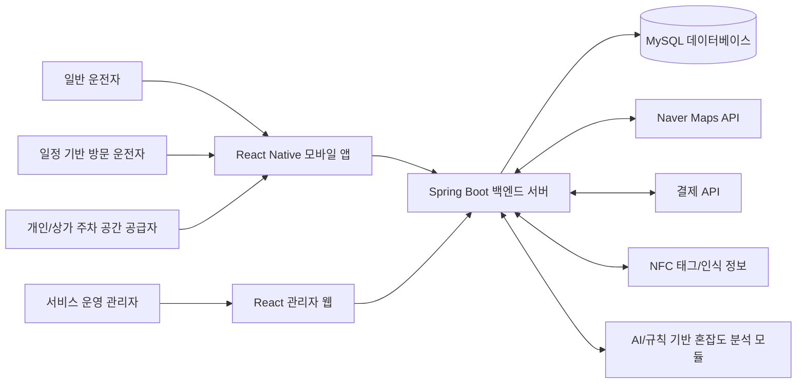
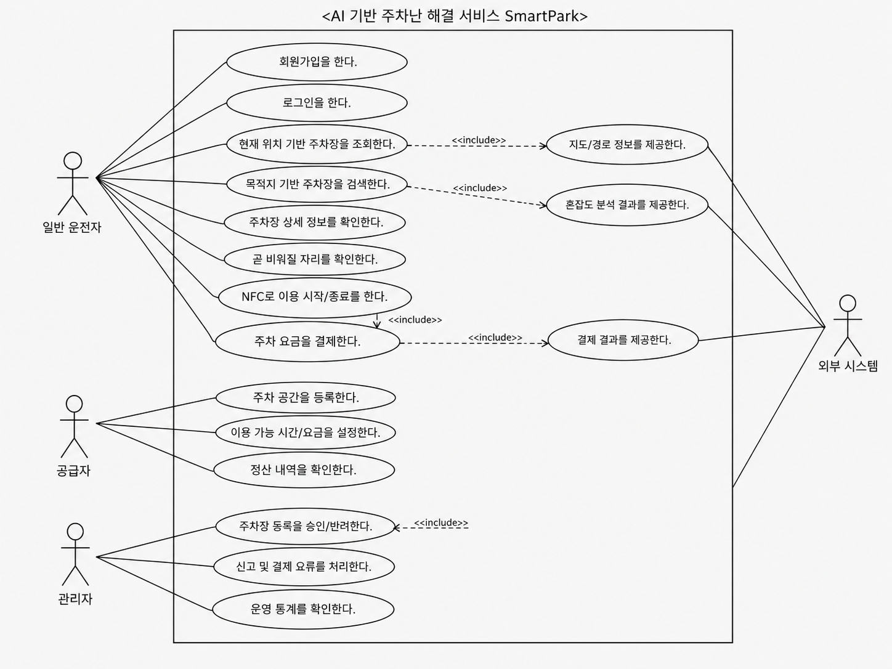
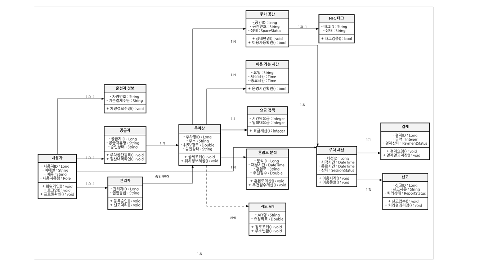
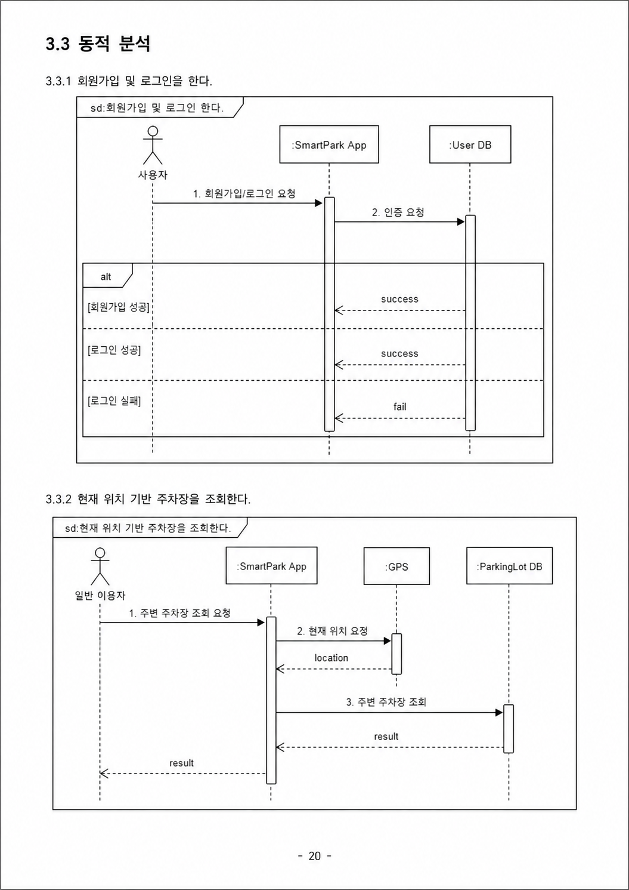
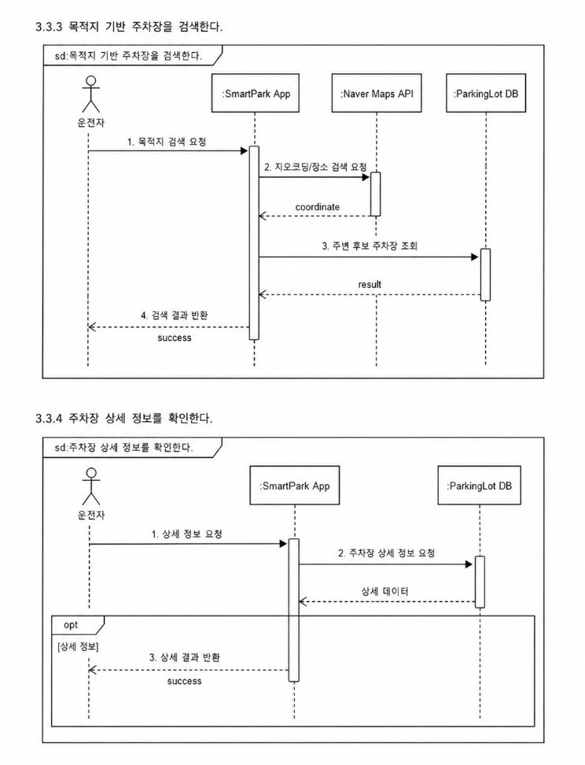
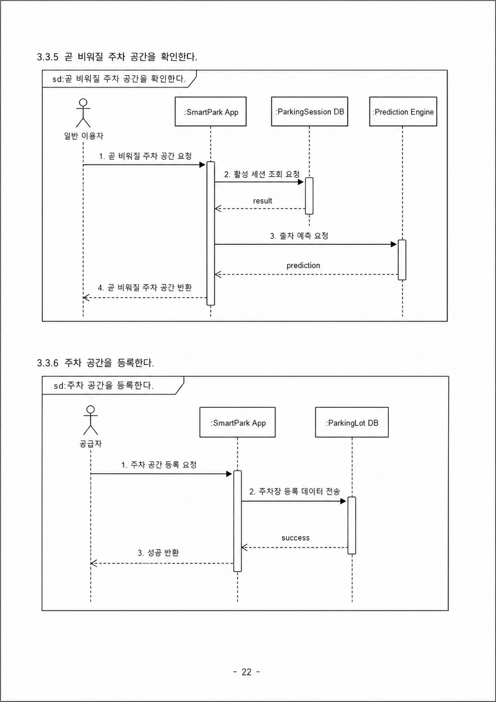
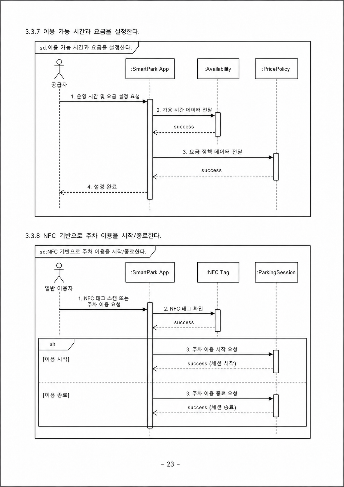
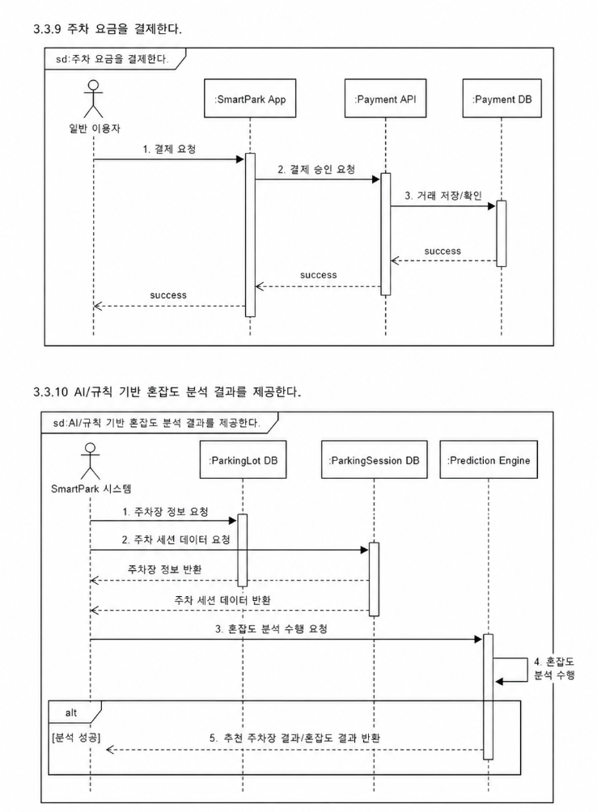

# 1. 서론

## 1.1 문서 목적 및 범위

본 요구사항 분석서는 SmartPark의 **AI 기반 주차난 해결 서비스**에 대한 요구사항을 분석하고, 시스템이 제공해야 할 기능과 사용자 상호작용 구조를 구체화하기 위해 작성되었다.

SmartPark는 도심 및 주거 지역에서 발생하는 주차 공간 부족 문제를 해결하기 위한 스마트 주차 플랫폼이다. 사용자는 현재 위치 또는 목적지를 기준으로 주변 주차 가능 공간을 탐색하고, 주차장의 거리, 요금, 운영 시간, 이용 가능 여부, 예상 혼잡도 등을 비교할 수 있다. 또한 곧 비워질 주차 공간 정보, 개인 및 상가 주차 공간 등록, NFC 기반 이용 시작/종료 및 결제, AI 또는 규칙 기반 혼잡도 분석 기능을 통해 실제 주차 성공 가능성이 높은 공간을 선택할 수 있다.

본 문서는 앞서 작성한 요구사항 정의서를 기반으로, 단순히 기능 목록을 나열하는 수준을 넘어 다음 내용을 분석 대상으로 포함한다.

| 구분             | 분석 내용                                                                                               |
| ---------------- | ------------------------------------------------------------------------------------------------------- |
| 시스템 문맥 분석 | SmartPark와 외부 사용자, 외부 시스템 간의 관계를 정의한다.                                              |
| Actor 분석       | 일반 운전자, 일정 기반 방문 운전자, 공급자, 관리자, 외부 서비스의 역할을 정의한다.                      |
| Use Case 분석    | 각 Actor가 수행하는 주요 기능과 시스템 반응을 Use Case 단위로 분석한다.                                 |
| 정적 분석        | 주요 도메인 객체, 속성, 관계를 분석한다.                                                                |
| CRC 카드         | 핵심 클래스의 책임과 협력 관계를 정리한다.                                                              |
| 동적 분석        | 주요 시나리오의 흐름, 대안 흐름, 예외 흐름을 분석한다.                                                  |
| 인터페이스 분석  | 모바일 앱, 관리자 웹, 지도 API, 결제 API, NFC 태그, AI 분석 모듈과의 연동 지점을 분석한다.              |
| 제약사항 분석    | 기술, 데이터, 보안, 운영 측면의 제약사항을 정리한다.                                                    |
| 요구사항 추적    | 요구사항 정의서의 기능 요구사항이 분석 항목, Use Case, 화면, 테스트 항목으로 이어질 수 있도록 연결한다. |

본 문서의 범위는 SmartPark의 **MVP 수준에서 구현 가능한 핵심 기능**을 중심으로 한다. 다만 향후 확장 가능성을 고려하여 관리자 운영 기능, 공급자 정산, 신고 및 분쟁 처리, AI 혼잡도 고도화와 같은 확장 요소도 분석 항목에 포함한다.

## 1.2 시스템 개요

SmartPark는 주차 공간을 찾는 이용자와 유휴 주차 공간을 보유한 공급자를 연결하는 AI 기반 스마트 주차 서비스이다. 기존 지도 서비스나 주차장 검색 서비스가 주차장 위치 안내에 집중한다면, SmartPark는 사용자가 **실제로 주차할 수 있는 가능성**을 높이는 데 초점을 둔다.

SmartPark의 핵심 사용자는 다음과 같이 구분된다.

| 사용자 유형             | 설명                                                              | 주요 목적                                                     |
| ----------------------- | ----------------------------------------------------------------- | ------------------------------------------------------------- |
| 일반 운전자             | 도심, 대학가, 병원, 상가, 행사장 주변에서 주차 공간을 찾는 사용자 | 현재 위치 또는 목적지 주변의 주차 가능 공간을 빠르게 탐색     |
| 일정 기반 방문 운전자   | 병원 예약, 회의, 공연 등 정해진 시간에 도착해야 하는 사용자       | 도착 예정 시간 기준으로 주차 가능성이 높은 공간을 사전에 확인 |
| 개인 주차 공간 공급자   | 개인 주택, 빌라, 소규모 건물의 유휴 주차 공간을 공유하려는 사용자 | 사용하지 않는 주차 공간을 등록하고 수익화                     |
| 상가/건물 주차장 관리자 | 상가 또는 건물의 주차 공간을 운영하는 관리자                      | 주차 공간 이용 현황, 운영 시간, 결제 및 정산 관리             |
| 서비스 운영 관리자      | SmartPark 플랫폼을 운영하는 관리자                                | 등록 승인, 신고 처리, 결제 오류, 운영 통계 관리               |

SmartPark의 주요 기능은 다음과 같다.

| 기능 ID | 주요 기능                       | 설명                                                                     |
| ------- | ------------------------------- | ------------------------------------------------------------------------ |
| F01     | 현재 위치 기반 주변 주차장 조회 | 사용자의 현재 위치를 기준으로 주변 주차장을 지도와 목록에 표시한다.      |
| F02     | 목적지 기반 주차장 검색         | 목적지명 또는 주소를 입력하여 목적지 주변 주차장을 검색한다.             |
| F03     | 주차장 상세 정보 확인           | 주차장의 위치, 요금, 운영 시간, 사진, 이용 가능 여부, 혼잡도를 확인한다. |
| F04     | 곧 비워질 자리 안내             | 출차 예정 시간이 등록된 공간을 곧 이용 가능한 주차 공간으로 표시한다.    |
| F05     | 개인/상가 주차 공간 등록        | 공급자가 주차 공간 위치, 사진, 이용 가능 시간, 요금을 등록한다.          |
| F06     | NFC 기반 이용 시작/종료         | NFC 태그를 통해 주차 이용 시작과 종료를 기록한다.                        |
| F07     | 이용 시간 기반 결제             | 이용 시간을 기준으로 요금을 계산하고 결제 내역을 저장한다.               |
| F08     | AI/규칙 기반 혼잡도 분석        | 시간대, 지역, 과거 이용 데이터 등을 기반으로 주차장 혼잡도를 예측한다.   |
| F09     | 관리자 승인 및 신고 처리        | 운영 관리자가 주차장 등록 승인, 신고, 결제 오류를 처리한다.              |

## 1.3 분석 관점

요구사항 분석은 요구사항 정의 단계에서 도출된 기능을 실제 설계와 구현으로 연결하기 위한 중간 단계이다. 따라서 본 문서는 기능 요구사항을 단순히 다시 설명하는 것이 아니라, 각 요구사항이 어떤 사용자 행동, 시스템 객체, 데이터 흐름, 예외 상황과 연결되는지를 분석한다.

본 문서에서는 다음 관점을 기준으로 요구사항을 분석한다.

| 분석 관점       | 설명                                                                                          |
| --------------- | --------------------------------------------------------------------------------------------- |
| 사용자 관점     | 사용자가 어떤 목적을 가지고 시스템을 이용하는지 분석한다.                                     |
| 시스템 관점     | 시스템이 사용자 요청을 처리하기 위해 어떤 기능과 데이터를 사용해야 하는지 분석한다.           |
| 데이터 관점     | 주차장, 주차 공간, 이용 세션, 결제, 신고, 혼잡도 예측 등 주요 데이터 객체를 분석한다.         |
| 인터페이스 관점 | 모바일 앱, 관리자 웹, 지도 API, 결제 API, NFC 태그, AI 분석 모듈 간의 연동 방식을 분석한다.   |
| 예외 처리 관점  | 위치 권한 거부, 지도 API 오류, 결제 실패, NFC 인식 실패, 주차장 만차 등 예외 상황을 분석한다. |
| 추적성 관점     | 기능 요구사항이 Use Case, 클래스, 화면, 테스트 케이스로 연결될 수 있도록 정리한다.            |

## 1.4 용어 정의

본 문서에서 사용하는 주요 용어와 약어는 다음과 같다.

| 용어                  | 설명                                                                                                 |
| --------------------- | ---------------------------------------------------------------------------------------------------- |
| SmartPark             | AI 기반 주차난 해결 서비스를 제공하는 본 프로젝트의 서비스명이다.                                    |
| 이용자                | 주차 공간을 검색하고 실제로 주차장을 이용하는 일반 사용자이다.                                       |
| 일반 운전자           | 현재 위치 또는 목적지 주변에서 주차 공간을 찾는 사용자이다.                                          |
| 일정 기반 방문 운전자 | 병원 예약, 회의, 공연 등 정해진 도착 시간이 있는 사용자이다.                                         |
| 공급자                | 개인 또는 상가/건물의 유휴 주차 공간을 SmartPark에 등록하고 공유하는 사용자이다.                     |
| 관리자                | SmartPark 서비스 운영, 주차장 등록 승인, 신고 처리, 결제 오류 관리 등을 담당하는 사용자이다.         |
| 주차장                | 여러 개의 주차 공간을 포함하는 주차 시설 또는 공유 가능한 주차 장소이다.                             |
| 주차 공간             | 실제 차량 1대가 주차할 수 있는 개별 공간이다.                                                        |
| 곧 비워질 자리        | 현재 사용 중이지만 출차 예정 시간이 등록되어 일정 시간 내 이용 가능할 것으로 예상되는 주차 공간이다. |
| 혼잡도                | 특정 주차장 또는 지역의 주차 가능성이 낮아지는 정도를 나타내는 지표이다.                             |
| AI 혼잡도 분석        | 시간대, 지역 특성, 과거 이용 데이터, 출차 예정 정보 등을 바탕으로 주차장 혼잡도를 예측하는 기능이다. |
| NFC                   | Near Field Communication의 약자로, 근거리 무선 통신을 통해 태그를 인식하는 기술이다.                 |
| NFC 태그              | 주차 이용 시작 또는 종료를 확인하기 위해 주차 공간에 부착되는 태그이다.                              |
| Geocoding             | 주소 또는 장소명을 위도/경도 좌표로 변환하는 기능이다.                                               |
| Reverse Geocoding     | 위도/경도 좌표를 주소 정보로 변환하는 기능이다.                                                      |
| Directions5           | 출발지와 목적지 사이의 경로 정보를 제공하는 Naver Maps API의 길찾기 기능이다.                        |
| Naver Maps API        | 지도 표시, 주소 변환, 경로 안내 등 위치 기반 기능을 제공하는 외부 지도 API이다.                      |
| 결제 API              | 주차 이용 요금을 결제하기 위해 외부 결제 대행 서비스와 연동하는 인터페이스이다.                      |
| 주차 세션             | 사용자의 주차 이용 시작부터 종료까지의 이용 기록이다.                                                |
| 정산                  | 공급자에게 주차 이용 수익을 지급하기 위해 결제 금액을 계산하고 처리하는 과정이다.                    |
| 신고                  | 이용자 또는 공급자가 잘못된 주차 정보, 결제 문제, 이용 분쟁 등을 운영자에게 접수하는 기능이다.       |
| MVP                   | Minimum Viable Product의 약자로, 핵심 기능을 검증하기 위한 최소 기능 제품이다.                       |
| Actor                 | 시스템과 상호작용하는 외부 주체를 의미하며, 일반 운전자, 공급자, 관리자, 외부 시스템 등이 포함된다.  |
| Use Case              | Actor가 특정 목적을 달성하기 위해 시스템과 상호작용하는 기능 단위이다.                               |
| CRC 카드              | Class, Responsibility, Collaborator를 정리하여 클래스의 책임과 협력 관계를 분석하는 기법이다.        |

## 1.5 참조 문서

본 요구사항 분석서는 다음 문서를 기반으로 작성한다.

| 문서명                                          | 설명                                                                  | 활용 내용                                |
| ----------------------------------------------- | --------------------------------------------------------------------- | ---------------------------------------- |
| `[최수연]시스템정의서_260313_Doc-001.pdf`       | SmartPark의 시스템명, 시스템 설명, 운영 환경, 주요 기능을 정의한 문서 | 시스템 개요와 핵심 기능 도출             |
| `[최수연]프로젝트관리계획서_260413_Doc-001.pdf` | 개발 계획, 일정, 개발 환경, 산출물 관리 기준을 정의한 문서            | 프로젝트 범위와 개발 환경 확인           |
| `과제3.요구사항정의서.md`                       | 기능 요구사항, 비기능 요구사항, 인터페이스 요구사항을 정리한 문서     | 요구사항 분석의 기준 요구사항으로 사용   |
| `PERSONA.md`                                    | SmartPark의 주요 사용자 유형과 대표 페르소나를 정의한 문서            | Actor와 사용자 목적 분석                 |
| `USER_JOURNEY.md`                               | 일반 이용자, 공급자, 관리자 관점의 서비스 이용 흐름을 정리한 문서     | Use Case와 동적 분석 근거                |
| `SERVICE_SCENARIO.md`                           | 실제 서비스 이용 상황과 예외 흐름을 시나리오 단위로 정리한 문서       | Use Case Description과 시퀀스 분석 근거  |
| `COMPETITOR_ANALYSIS.md`                        | 기존 주차 서비스와 SmartPark의 차별성을 분석한 문서                   | 기능 우선순위와 차별 요구사항 도출       |
| `BUSINESS_MODEL.md`                             | 목표 시장, 가치 제안, 수익 모델, 운영 구조를 정리한 문서              | 공급자, 결제, 정산, 관리자 요구사항 분석 |
| `PRD.md`                                        | SmartPark 제품 요구사항과 MVP 범위를 정리한 문서                      | 제품 목표, 기능 범위, 사용자 가치 확인   |
| `FEATURE_SPEC.md`                               | 기능별 상세 동작, 입력값, 출력값, 예외 상황, API 후보를 정리한 문서   | 기능별 Use Case와 인터페이스 분석        |
| `SCREEN_STRUCTURE.md`                           | React Native 앱의 화면 구조와 네비게이션을 정리한 문서                | 화면 흐름과 인터페이스 분석              |
| `configuration_management_plan.md`              | 형상관리, 변경통제, 버전관리, 기록유지 방법을 정의한 문서             | 문서 변경 이력 및 산출물 관리 기준       |

# 2. 시스템 개요

## 2.1 소프트웨어 컨텍스트(Context)

SmartPark 시스템은 모바일 앱, 관리자 웹, 백엔드 서버, 데이터베이스, 지도 API, 결제 API, NFC 태그, AI/규칙 기반 혼잡도 분석 모듈로 구성된다. 사용자는 모바일 앱을 통해 주차장을 검색하고 주차 이용을 진행하며, 공급자는 주차 공간을 등록하고 이용 가능 시간과 요금을 관리한다. 관리자는 관리자 웹 또는 별도 운영 화면을 통해 등록 승인, 신고 처리, 결제 오류, 운영 통계를 관리한다.

SmartPark 시스템의 외부 연동 요소는 다음과 같다.

| 외부 요소              | 연동 목적                                                                   |
| ---------------------- | --------------------------------------------------------------------------- |
| Naver Maps API         | 지도 표시, 장소 검색, 주소 변환, 경로 안내를 제공한다.                      |
| GPS/위치 정보          | 사용자의 현재 위치를 수집하여 주변 주차장 검색에 활용한다.                  |
| NFC 태그               | 주차 이용 시작과 종료를 확인하는 인증 수단으로 활용한다.                    |
| 결제 API               | 이용 시간 기반 결제 승인, 실패, 환불 처리를 수행한다.                       |
| AI/규칙 기반 분석 모듈 | 시간대, 지역, 과거 이용 데이터를 바탕으로 혼잡도를 계산한다.                |
| MySQL 데이터베이스     | 사용자, 주차장, 주차 공간, 이용 세션, 결제, 신고, 혼잡도 데이터를 저장한다. |

### 2.1.1 시스템 경계

SmartPark의 시스템 경계는 다음과 같다.

```text
일반 운전자 / 일정 기반 방문 운전자
        ↓
React Native 모바일 앱
        ↓
Spring Boot 백엔드 서버
        ↓
MySQL 데이터베이스

Spring Boot 백엔드 서버
        ↔ Naver Maps API
        ↔ 결제 API
        ↔ NFC 태그 인식 정보
        ↔ AI/규칙 기반 혼잡도 분석 모듈

공급자
        ↓
React Native 모바일 앱 또는 공급자 화면
        ↓
Spring Boot 백엔드 서버

서비스 운영 관리자
        ↓
React 관리자 웹 또는 관리자 화면
        ↓
Spring Boot 백엔드 서버
```

위 구조에서 SmartPark 백엔드 서버는 사용자 요청을 처리하는 중심 컴포넌트이다. 모바일 앱과 관리자 화면은 사용자의 입력과 조회 결과를 전달하는 인터페이스이며, 지도 API, 결제 API, NFC 태그, AI 분석 모듈은 기능 수행을 위한 외부 또는 보조 시스템으로 분류한다.

### 2.1.2 Actor Table

| Actor                   | Role                                                                                                     |
| ----------------------- | -------------------------------------------------------------------------------------------------------- |
| 일반 운전자             | 현재 위치 또는 목적지 주변의 주차장을 검색하고, 주차장을 선택하여 이용하는 사용자이다.                   |
| 일정 기반 방문 운전자   | 병원 예약, 회의, 공연 등 특정 도착 시간에 맞춰 주차 가능성이 높은 공간을 미리 찾는 사용자이다.           |
| 개인 주차 공간 공급자   | 개인 주택, 빌라, 소규모 건물의 유휴 주차 공간을 등록하고 공유하는 사용자이다.                            |
| 상가/건물 주차장 관리자 | 상가 또는 건물의 주차 공간을 등록하고, 이용 가능 시간, 요금, 이용 내역, 정산 정보를 관리하는 사용자이다. |
| 서비스 운영 관리자      | SmartPark 플랫폼의 주차장 등록 승인, 신고 처리, 결제 오류, 사용자 상태, 운영 통계를 관리하는 사용자이다. |
| SmartPark 시스템        | 사용자 요청을 처리하고, 주차장 조회, 추천, 결제, 신고, 알림, 데이터 저장 기능을 수행하는 시스템이다.     |
| Naver Maps API          | 지도 표시, 장소 검색, 주소 변환, 경로 안내 기능을 제공하는 외부 지도 서비스이다.                         |
| 결제 API                | 주차 이용 요금 결제 승인, 실패, 환불 처리를 담당하는 외부 결제 서비스이다.                               |
| NFC 태그                | 주차 이용 시작과 종료를 확인하기 위한 물리적 인증 수단이다.                                              |
| AI/규칙 기반 분석 모듈  | 시간대, 지역, 이용 이력, 출차 예정 정보를 바탕으로 주차장 혼잡도와 추천 점수를 계산하는 분석 모듈이다.   |

### 2.1.3 Context Diagram

Markdown 문서에서는 아래와 같이 SmartPark의 시스템 문맥을 표현할 수 있다.



이 문맥도는 SmartPark가 모바일 앱과 관리자 웹을 통해 사용자의 요청을 받고, 백엔드 서버가 핵심 비즈니스 로직을 처리하며, 지도/결제/NFC/AI 분석 모듈과 연동하여 결과를 제공하는 구조를 나타낸다.

### 2.1.4 Use Case Diagram

SmartPark의 주요 Use Case는 다음 그림과 같이 구성된다.



위 Use Case Diagram은 SmartPark의 핵심 기능이 Actor별로 어떻게 연결되는지를 보여준다. 일반 운전자는 주차장 탐색과 이용, 결제에 집중하고, 공급자는 주차 공간 등록과 운영 설정을 수행한다. 운영 관리자는 승인, 신고, 결제 오류, 통계 관리를 담당한다. 외부 시스템은 지도, 결제, NFC, 혼잡도 분석을 보조한다.

## 2.2 기능 분류 및 설명

SmartPark의 기능은 사용자 유형과 시스템 목적에 따라 다음과 같이 분류한다.

| 구분             | 기능 영역                                             | 관련 Use Case    | 주요 Actor                                 |
| ---------------- | ----------------------------------------------------- | ---------------- | ------------------------------------------ |
| 사용자 계정      | 회원가입/로그인                                       | U-01             | 일반 운전자, 공급자, 관리자                |
| 주차장 탐색      | 현재 위치 기반 조회, 목적지 기반 검색, 상세 정보 확인 | U-02, U-03, U-04 | 일반 운전자, 일정 기반 방문 운전자         |
| 주차 가능성 판단 | 곧 비워질 자리 확인, AI 혼잡도 분석                   | U-05, U-10       | 일반 운전자, 일정 기반 방문 운전자, 시스템 |
| 공급자 운영      | 주차장 등록, 이용 가능 시간/요금 설정                 | U-06, U-07       | 개인 공급자, 상가/건물 관리자              |
| 주차 이용        | NFC 기반 이용 시작/종료                               | U-08             | 일반 운전자, 공급자, NFC 태그              |
| 결제/정산        | 이용 시간 기반 결제, 결제 내역 저장                   | U-09             | 일반 운전자, 공급자, 결제 API              |
| 관리자 운영      | 등록 승인, 신고 처리, 결제 오류 관리, 운영 통계       | U-11, U-12, U-13 | 서비스 운영 관리자                         |
| 외부 연동        | 지도, 경로, 결제, NFC, 혼잡도 분석                    | U-02 ~ U-13      | Naver Maps API, 결제 API, NFC, AI 모듈     |

### 2.2.1 Use Case 목록

| Use Case ID | Use Case Name                            | Primary Actor                        | Importance Level | 설명                                                                    |
| ----------- | ---------------------------------------- | ------------------------------------ | ---------------- | ----------------------------------------------------------------------- |
| U-01        | 회원가입 및 로그인을 한다                | 일반 운전자, 공급자, 관리자          | High             | 사용자가 SmartPark 서비스를 이용하기 위해 계정을 생성하거나 로그인한다. |
| U-02        | 현재 위치 기반 주차장을 조회한다         | 일반 운전자                          | High             | 현재 위치 주변의 주차장을 지도와 목록으로 확인한다.                     |
| U-03        | 목적지 기반 주차장을 검색한다            | 일반 운전자, 일정 기반 방문 운전자   | High             | 목적지명 또는 주소를 입력하여 목적지 주변 주차장을 검색한다.            |
| U-04        | 주차장 상세 정보를 확인한다              | 일반 운전자                          | High             | 주차장 요금, 운영 시간, 사진, 이용 가능 여부, 혼잡도를 확인한다.        |
| U-05        | 곧 비워질 주차 공간을 확인한다           | 일반 운전자, 일정 기반 방문 운전자   | Medium           | 출차 예정 시간이 등록된 주차 공간을 확인한다.                           |
| U-06        | 주차 공간을 등록한다                     | 개인 공급자, 상가/건물 관리자        | High             | 공급자가 공유 가능한 주차 공간의 위치, 사진, 운영 정보를 등록한다.      |
| U-07        | 이용 가능 시간과 요금을 설정한다         | 개인 공급자, 상가/건물 관리자        | High             | 공급자가 공유 가능한 시간대와 요금 정책을 설정한다.                     |
| U-08        | NFC 기반으로 주차 이용을 시작/종료한다   | 일반 운전자, 공급자                  | Medium           | NFC 태그를 통해 주차 이용 시작과 종료를 기록한다.                       |
| U-09        | 주차 요금을 결제한다                     | 일반 운전자                          | Medium           | 이용 시간에 따라 계산된 주차 요금을 결제한다.                           |
| U-10        | AI/규칙 기반 혼잡도 분석 결과를 제공한다 | SmartPark 시스템                     | High             | 시스템이 주차장별 예상 혼잡도와 추천 점수를 계산한다.                   |
| U-11        | 주차장 등록을 승인/반려한다              | 서비스 운영 관리자                   | High             | 관리자가 공급자가 등록한 주차 공간을 검토하고 승인 또는 반려한다.       |
| U-12        | 신고 및 결제 오류를 처리한다             | 서비스 운영 관리자                   | Medium           | 관리자가 신고, 결제 실패, 환불 요청, 분쟁 상황을 처리한다.              |
| U-13        | 운영 통계를 확인한다                     | 서비스 운영 관리자, 상가/건물 관리자 | Low              | 주차장 이용률, 결제, 신고, 혼잡도 통계를 확인한다.                      |

## 2.3 UseCase Description

본 절에서는 SmartPark의 주요 Use Case를 샘플 문서와 유사한 표 형식으로 정리한다. 각 Use Case는 이름, 식별자, 중요도, Primary Actor, 설명, 이해관계자, Trigger, 관계, 정상 흐름, 하위 흐름, 대안/예외 흐름으로 구성한다.

### 2.3.1 U-01 회원가입 및 로그인을 한다

<table class="usecase-desc">
  <tbody>
    <tr class="uc-top">
      <td class="uc-name"><strong>Use Case Name</strong> : 회원가입 및 로그인을 한다</td>
      <td class="uc-id"><strong>ID</strong> : U-01</td>
      <td class="uc-importance"><strong>Importance Level</strong> : High</td>
    </tr>
    <tr>
      <td colspan="3"><strong>Primary Actor</strong> : 일반 운전자, 공급자, 관리자</td>
    </tr>
    <tr>
      <td colspan="3"><strong>Use Case Type</strong> : Detail, Essential</td>
    </tr>
    <tr>
      <td colspan="3"><strong>Brief Description</strong> : 사용자는 SmartPark 서비스를 이용하기 위해 회원가입 또는 로그인을 수행한다.</td>
    </tr>
    <tr>
      <td colspan="3" class="uc-section"><strong>Stakeholders and Interests</strong></td>
    </tr>
    <tr>
      <td colspan="3"><div class="uc-line"><strong>일반 운전자</strong> : 주차장 검색, 이용, 결제 내역 확인을 위해 서비스에 로그인하고자 한다.</div><div class="uc-line"><strong>공급자</strong> : 주차 공간 등록, 이용 현황, 정산 내역 확인을 위해 서비스에 로그인하고자 한다.</div><div class="uc-line"><strong>관리자</strong> : 승인, 신고, 결제 오류 관리를 위해 관리자 권한으로 로그인하고자 한다.</div></td>
    </tr>
    <tr>
      <td colspan="3"><strong>Trigger</strong> : 사용자가 앱 또는 관리자 웹에서 회원가입 또는 로그인 버튼을 선택한다.</td>
    </tr>
    <tr>
      <td colspan="3" class="uc-section"><strong>Relationships</strong></td>
    </tr>
    <tr>
      <td colspan="3"><div class="uc-line"><strong>Association</strong> : 일반 운전자, 공급자, 관리자</div><div class="uc-line"><strong>Include</strong> : 사용자 유형 선택, 약관 동의</div><div class="uc-line"><strong>Extend</strong> : 비밀번호 찾기, 계정 잠금 안내</div><div class="uc-line"><strong>Generalization</strong> : 없음</div></td>
    </tr>
    <tr>
      <td colspan="3" class="uc-section"><strong>Normal Flow of Events</strong> :</td>
    </tr>
    <tr>
      <td colspan="3"><div class="uc-line"><span class="uc-num">1.</span> 사용자는 회원가입 또는 로그인 화면에 접근한다.</div><div class="uc-line"><span class="uc-num">2.</span> 사용자는 이메일, 비밀번호, 사용자 유형 등 필요한 정보를 입력한다.</div><div class="uc-line"><span class="uc-num">3.</span> 시스템은 입력값의 형식과 필수 입력 여부를 확인한다.</div><div class="uc-line"><span class="uc-num">4.</span> 회원가입인 경우 시스템은 중복 이메일 여부를 확인한다.</div><div class="uc-line"><span class="uc-num">5.</span> 로그인의 경우 시스템은 계정 정보와 비밀번호를 검증한다.</div><div class="uc-line"><span class="uc-num">6.</span> 인증에 성공하면 시스템은 사용자 유형에 맞는 화면으로 이동한다.</div></td>
    </tr>
    <tr>
      <td colspan="3" class="uc-section"><strong>Subflows</strong> :</td>
    </tr>
    <tr>
      <td colspan="3"><div class="uc-line"><span class="uc-num">S1.</span> 회원가입 흐름과 로그인 흐름으로 구분할 수 있다.</div></td>
    </tr>
    <tr>
      <td colspan="3" class="uc-section"><strong>Alternate / Exceptional Flows</strong> :</td>
    </tr>
    <tr>
      <td colspan="3"><div class="uc-line"><span class="uc-num">A1.</span> 필수 입력값이 누락된 경우 시스템은 누락된 항목을 표시하고 재입력을 요청한다.</div><div class="uc-line"><span class="uc-num">A2.</span> 중복 이메일이 존재하는 경우 시스템은 이미 가입된 이메일임을 안내한다.</div><div class="uc-line"><span class="uc-num">A3.</span> 비밀번호가 일치하지 않는 경우 시스템은 로그인 실패 메시지를 표시한다.</div><div class="uc-line"><span class="uc-num">A4.</span> 관리자 권한이 없는 사용자는 관리자 화면 접근이 제한된다.</div></td>
    </tr>
  </tbody>
</table>

### 2.3.2 U-02 현재 위치 기반 주차장을 조회한다

<table class="usecase-desc">
  <tbody>
    <tr class="uc-top">
      <td class="uc-name"><strong>Use Case Name</strong> : 현재 위치 기반 주차장을 조회한다</td>
      <td class="uc-id"><strong>ID</strong> : U-02</td>
      <td class="uc-importance"><strong>Importance Level</strong> : High</td>
    </tr>
    <tr>
      <td colspan="3"><strong>Primary Actor</strong> : 일반 운전자</td>
    </tr>
    <tr>
      <td colspan="3"><strong>Use Case Type</strong> : Detail, Essential</td>
    </tr>
    <tr>
      <td colspan="3"><strong>Brief Description</strong> : 사용자는 현재 위치를 기준으로 주변 주차장을 지도와 목록에서 확인한다.</td>
    </tr>
    <tr>
      <td colspan="3" class="uc-section"><strong>Stakeholders and Interests</strong></td>
    </tr>
    <tr>
      <td colspan="3"><div class="uc-line"><strong>일반 운전자</strong> : 가까운 주차장 중 실제 이용 가능한 공간을 빠르게 찾고자 한다.</div><div class="uc-line"><strong>SmartPark 시스템</strong> : 현재 위치, 주차장 데이터, 혼잡도 정보를 결합하여 검색 결과를 제공해야 한다.</div><div class="uc-line"><strong>Naver Maps API</strong> : 지도 표시와 위치 기반 검색을 지원한다.</div></td>
    </tr>
    <tr>
      <td colspan="3"><strong>Trigger</strong> : 사용자가 앱을 실행하거나 홈 화면에서 현재 위치 기반 조회를 요청한다.</td>
    </tr>
    <tr>
      <td colspan="3" class="uc-section"><strong>Relationships</strong></td>
    </tr>
    <tr>
      <td colspan="3"><div class="uc-line"><strong>Association</strong> : 일반 운전자, Naver Maps API, SmartPark 시스템</div><div class="uc-line"><strong>Include</strong> : 위치 권한 확인, 지도 표시, 주차장 목록 조회</div><div class="uc-line"><strong>Extend</strong> : 위치 권한 거부 시 수동 위치 입력</div><div class="uc-line"><strong>Generalization</strong> : 주차장 탐색</div></td>
    </tr>
    <tr>
      <td colspan="3" class="uc-section"><strong>Normal Flow of Events</strong> :</td>
    </tr>
    <tr>
      <td colspan="3"><div class="uc-line"><span class="uc-num">1.</span> 사용자가 SmartPark 앱을 실행한다.</div><div class="uc-line"><span class="uc-num">2.</span> 시스템은 위치 권한 허용 여부를 확인한다.</div><div class="uc-line"><span class="uc-num">3.</span> 위치 권한이 허용된 경우 현재 위도와 경도를 수집한다.</div><div class="uc-line"><span class="uc-num">4.</span> 시스템은 현재 위치 기준 주변 주차장 데이터를 조회한다.</div><div class="uc-line"><span class="uc-num">5.</span> 시스템은 지도 마커와 목록 카드에 주차장 정보를 표시한다.</div><div class="uc-line"><span class="uc-num">6.</span> 사용자는 거리, 요금, 운영 시간, 이용 가능 여부, 혼잡도를 비교한다.</div><div class="uc-line"><span class="uc-num">7.</span> 사용자는 원하는 주차장을 선택한다.</div></td>
    </tr>
    <tr>
      <td colspan="3" class="uc-section"><strong>Subflows</strong> :</td>
    </tr>
    <tr>
      <td colspan="3"><div class="uc-line"><span class="uc-num">S1.</span> 현재 위치 권한 확인 흐름, 주변 주차장 조회 흐름, 지도/목록 표시 흐름으로 구분한다.</div></td>
    </tr>
    <tr>
      <td colspan="3" class="uc-section"><strong>Alternate / Exceptional Flows</strong> :</td>
    </tr>
    <tr>
      <td colspan="3"><div class="uc-line"><span class="uc-num">A1.</span> 위치 권한이 거부된 경우 위치 권한 안내 화면을 표시하고 수동 위치 입력을 제공한다.</div><div class="uc-line"><span class="uc-num">A2.</span> 주변 주차장이 없는 경우 검색 반경 확대 버튼을 제공한다.</div><div class="uc-line"><span class="uc-num">A3.</span> 지도 API 오류가 발생한 경우 목록형 결과를 우선 표시하고 지도 재시도 버튼을 제공한다.</div><div class="uc-line"><span class="uc-num">A4.</span> 네트워크 오류가 발생한 경우 오류 메시지와 재시도 버튼을 표시한다.</div></td>
    </tr>
  </tbody>
</table>

### 2.3.3 U-03 목적지 기반 주차장을 검색한다

<table class="usecase-desc">
  <tbody>
    <tr class="uc-top">
      <td class="uc-name"><strong>Use Case Name</strong> : 목적지 기반 주차장을 검색한다</td>
      <td class="uc-id"><strong>ID</strong> : U-03</td>
      <td class="uc-importance"><strong>Importance Level</strong> : High</td>
    </tr>
    <tr>
      <td colspan="3"><strong>Primary Actor</strong> : 일반 운전자, 일정 기반 방문 운전자</td>
    </tr>
    <tr>
      <td colspan="3"><strong>Use Case Type</strong> : Detail, Essential</td>
    </tr>
    <tr>
      <td colspan="3"><strong>Brief Description</strong> : 사용자는 목적지명 또는 주소를 입력하여 목적지 주변 주차장을 검색한다.</td>
    </tr>
    <tr>
      <td colspan="3" class="uc-section"><strong>Stakeholders and Interests</strong></td>
    </tr>
    <tr>
      <td colspan="3"><div class="uc-line"><strong>일반 운전자</strong> : 목적지 주변의 주차장을 사전에 확인하고자 한다.</div><div class="uc-line"><strong>일정 기반 방문 운전자</strong> : 도착 예정 시간 기준으로 주차 가능성이 높은 공간을 확인하고자 한다.</div><div class="uc-line"><strong>Naver Maps API</strong> : 장소 검색, 좌표 변환, 경로 안내에 필요한 데이터를 제공한다.</div></td>
    </tr>
    <tr>
      <td colspan="3"><strong>Trigger</strong> : 사용자가 검색 화면에서 목적지명 또는 주소를 입력한다.</td>
    </tr>
    <tr>
      <td colspan="3" class="uc-section"><strong>Relationships</strong></td>
    </tr>
    <tr>
      <td colspan="3"><div class="uc-line"><strong>Association</strong> : 일반 운전자, 일정 기반 방문 운전자, Naver Maps API</div><div class="uc-line"><strong>Include</strong> : 장소 검색, Geocoding, 주차장 목록 조회, 혼잡도 분석</div><div class="uc-line"><strong>Extend</strong> : 도착 예정 시간 입력, 대체 주차장 추천</div><div class="uc-line"><strong>Generalization</strong> : 주차장 탐색</div></td>
    </tr>
    <tr>
      <td colspan="3" class="uc-section"><strong>Normal Flow of Events</strong> :</td>
    </tr>
    <tr>
      <td colspan="3"><div class="uc-line"><span class="uc-num">1.</span> 사용자는 목적지명 또는 주소를 입력한다.</div><div class="uc-line"><span class="uc-num">2.</span> 시스템은 장소 검색 결과를 표시한다.</div><div class="uc-line"><span class="uc-num">3.</span> 사용자는 검색 결과 중 목적지를 선택한다.</div><div class="uc-line"><span class="uc-num">4.</span> 시스템은 목적지 좌표를 기준으로 주변 주차장을 조회한다.</div><div class="uc-line"><span class="uc-num">5.</span> 도착 예정 시간이 입력된 경우 시스템은 해당 시간 기준 혼잡도를 반영한다.</div><div class="uc-line"><span class="uc-num">6.</span> 시스템은 주차 가능성, 거리, 요금, 도보 거리 기준으로 목록을 표시한다.</div><div class="uc-line"><span class="uc-num">7.</span> 사용자는 추천 주차장 또는 대체 주차장을 선택한다.</div></td>
    </tr>
    <tr>
      <td colspan="3" class="uc-section"><strong>Subflows</strong> :</td>
    </tr>
    <tr>
      <td colspan="3"><div class="uc-line"><span class="uc-num">S1.</span> 목적지 검색 흐름과 도착 예정 시간 기반 추천 흐름으로 구분한다.</div></td>
    </tr>
    <tr>
      <td colspan="3" class="uc-section"><strong>Alternate / Exceptional Flows</strong> :</td>
    </tr>
    <tr>
      <td colspan="3"><div class="uc-line"><span class="uc-num">A1.</span> 검색 결과가 없는 경우 주소 직접 입력 또는 지도에서 위치 선택을 제공한다.</div><div class="uc-line"><span class="uc-num">A2.</span> 목적지 좌표 변환에 실패한 경우 검색어 수정을 안내한다.</div><div class="uc-line"><span class="uc-num">A3.</span> 목적지 주변 주차장이 없는 경우 검색 반경 확대를 제안한다.</div><div class="uc-line"><span class="uc-num">A4.</span> 도착 예정 시간이 입력되지 않은 경우 현재 시간 기준으로 기본 추천을 제공한다.</div></td>
    </tr>
  </tbody>
</table>

### 2.3.4 U-04 주차장 상세 정보를 확인한다

<table class="usecase-desc">
  <tbody>
    <tr class="uc-top">
      <td class="uc-name"><strong>Use Case Name</strong> : 주차장 상세 정보를 확인한다</td>
      <td class="uc-id"><strong>ID</strong> : U-04</td>
      <td class="uc-importance"><strong>Importance Level</strong> : High</td>
    </tr>
    <tr>
      <td colspan="3"><strong>Primary Actor</strong> : 일반 운전자</td>
    </tr>
    <tr>
      <td colspan="3"><strong>Use Case Type</strong> : Detail, Essential</td>
    </tr>
    <tr>
      <td colspan="3"><strong>Brief Description</strong> : 사용자는 특정 주차장을 선택하여 상세 정보를 확인한다.</td>
    </tr>
    <tr>
      <td colspan="3" class="uc-section"><strong>Stakeholders and Interests</strong></td>
    </tr>
    <tr>
      <td colspan="3"><div class="uc-line"><strong>일반 운전자</strong> : 주차장 선택 전 요금, 운영 시간, 위치, 혼잡도, 이용 가능 여부를 확인하고자 한다.</div><div class="uc-line"><strong>공급자</strong> : 등록한 주차 공간 정보가 정확하게 사용자에게 표시되기를 원한다.</div><div class="uc-line"><strong>SmartPark 시스템</strong> : 최신 주차장 상태와 상세 정보를 정확히 제공해야 한다.</div></td>
    </tr>
    <tr>
      <td colspan="3"><strong>Trigger</strong> : 사용자가 지도 마커 또는 주차장 목록 카드에서 특정 주차장을 선택한다.</td>
    </tr>
    <tr>
      <td colspan="3" class="uc-section"><strong>Relationships</strong></td>
    </tr>
    <tr>
      <td colspan="3"><div class="uc-line"><strong>Association</strong> : 일반 운전자, SmartPark 시스템</div><div class="uc-line"><strong>Include</strong> : 주차장 정보 조회, 혼잡도 조회</div><div class="uc-line"><strong>Extend</strong> : 경로 안내, 이용 시작, 신고 접수</div><div class="uc-line"><strong>Generalization</strong> : 주차장 탐색</div></td>
    </tr>
    <tr>
      <td colspan="3" class="uc-section"><strong>Normal Flow of Events</strong> :</td>
    </tr>
    <tr>
      <td colspan="3"><div class="uc-line"><span class="uc-num">1.</span> 사용자는 지도 마커 또는 주차장 목록에서 주차장을 선택한다.</div><div class="uc-line"><span class="uc-num">2.</span> 시스템은 해당 주차장의 상세 정보를 조회한다.</div><div class="uc-line"><span class="uc-num">3.</span> 시스템은 주소, 사진, 요금, 운영 시간, 이용 가능 여부, 혼잡도를 표시한다.</div><div class="uc-line"><span class="uc-num">4.</span> 사용자는 상세 정보를 확인한다.</div><div class="uc-line"><span class="uc-num">5.</span> 사용자는 경로 안내 또는 이용 시작을 선택한다.</div></td>
    </tr>
    <tr>
      <td colspan="3" class="uc-section"><strong>Subflows</strong> :</td>
    </tr>
    <tr>
      <td colspan="3"><div class="uc-line"><span class="uc-num">S1.</span> 상세 정보 조회, 경로 안내, 이용 시작 요청 흐름으로 확장될 수 있다.</div></td>
    </tr>
    <tr>
      <td colspan="3" class="uc-section"><strong>Alternate / Exceptional Flows</strong> :</td>
    </tr>
    <tr>
      <td colspan="3"><div class="uc-line"><span class="uc-num">A1.</span> 상세 정보 조회에 실패한 경우 기본 정보만 표시하고 재조회 버튼을 제공한다.</div><div class="uc-line"><span class="uc-num">A2.</span> 운영 시간이 아닌 경우 이용 불가 상태를 표시한다.</div><div class="uc-line"><span class="uc-num">A3.</span> 만차 상태인 경우 대체 주차장 추천 버튼을 제공한다.</div><div class="uc-line"><span class="uc-num">A4.</span> 사진이 없는 경우 기본 이미지를 표시한다.</div></td>
    </tr>
  </tbody>
</table>

### 2.3.5 U-05 곧 비워질 주차 공간을 확인한다

<table class="usecase-desc">
  <tbody>
    <tr class="uc-top">
      <td class="uc-name"><strong>Use Case Name</strong> : 곧 비워질 주차 공간을 확인한다</td>
      <td class="uc-id"><strong>ID</strong> : U-05</td>
      <td class="uc-importance"><strong>Importance Level</strong> : Medium</td>
    </tr>
    <tr>
      <td colspan="3"><strong>Primary Actor</strong> : 일반 운전자, 일정 기반 방문 운전자</td>
    </tr>
    <tr>
      <td colspan="3"><strong>Use Case Type</strong> : Detail, Essential</td>
    </tr>
    <tr>
      <td colspan="3"><strong>Brief Description</strong> : 사용자는 현재 만차이거나 혼잡한 지역에서 곧 이용 가능할 것으로 예상되는 주차 공간을 확인한다.</td>
    </tr>
    <tr>
      <td colspan="3" class="uc-section"><strong>Stakeholders and Interests</strong></td>
    </tr>
    <tr>
      <td colspan="3"><div class="uc-line"><strong>일반 운전자</strong> : 현재 비어 있지 않더라도 곧 이용 가능한 주차 공간을 알고자 한다.</div><div class="uc-line"><strong>주차 이용 중인 사용자</strong> : 출차 예정 시간을 등록하여 다른 이용자에게 정보를 제공할 수 있다.</div><div class="uc-line"><strong>SmartPark 시스템</strong> : 출차 예정 시간과 주차 공간 상태를 기반으로 곧 비워질 자리를 표시해야 한다.</div></td>
    </tr>
    <tr>
      <td colspan="3"><strong>Trigger</strong> : 사용자가 곧 비워질 자리 필터를 선택하거나, 시스템이 만차 지역에서 곧 비워질 자리를 추천한다.</td>
    </tr>
    <tr>
      <td colspan="3" class="uc-section"><strong>Relationships</strong></td>
    </tr>
    <tr>
      <td colspan="3"><div class="uc-line"><strong>Association</strong> : 일반 운전자, 일정 기반 방문 운전자, SmartPark 시스템</div><div class="uc-line"><strong>Include</strong> : 출차 예정 시간 확인, 주차 공간 상태 조회</div><div class="uc-line"><strong>Extend</strong> : 대기 안내, 알림 설정</div><div class="uc-line"><strong>Generalization</strong> : 주차 가능성 판단</div></td>
    </tr>
    <tr>
      <td colspan="3" class="uc-section"><strong>Normal Flow of Events</strong> :</td>
    </tr>
    <tr>
      <td colspan="3"><div class="uc-line"><span class="uc-num">1.</span> 사용자가 곧 비워질 자리 목록을 요청한다.</div><div class="uc-line"><span class="uc-num">2.</span> 시스템은 출차 예정 시간이 등록된 주차 공간을 조회한다.</div><div class="uc-line"><span class="uc-num">3.</span> 시스템은 예상 이용 가능 시간, 거리, 요금, 혼잡도를 표시한다.</div><div class="uc-line"><span class="uc-num">4.</span> 사용자는 이용 가능한 후보를 확인한다.</div><div class="uc-line"><span class="uc-num">5.</span> 사용자는 원하는 주차장을 선택하거나 알림을 설정한다.</div></td>
    </tr>
    <tr>
      <td colspan="3" class="uc-section"><strong>Subflows</strong> :</td>
    </tr>
    <tr>
      <td colspan="3"><div class="uc-line"><span class="uc-num">S1.</span> 출차 예정 시간 조회 흐름과 알림 설정 흐름으로 구분한다.</div></td>
    </tr>
    <tr>
      <td colspan="3" class="uc-section"><strong>Alternate / Exceptional Flows</strong> :</td>
    </tr>
    <tr>
      <td colspan="3"><div class="uc-line"><span class="uc-num">A1.</span> 곧 비워질 자리가 없는 경우 일반 주차장 검색 결과를 제공한다.</div><div class="uc-line"><span class="uc-num">A2.</span> 출차 예정 시간이 지연되는 경우 사용자에게 상태 변경을 안내한다.</div><div class="uc-line"><span class="uc-num">A3.</span> 허위 출차 예정 정보가 의심되는 경우 신고 또는 신뢰도 점수 하락 처리를 할 수 있다.</div></td>
    </tr>
  </tbody>
</table>

### 2.3.6 U-06 주차 공간을 등록한다

<table class="usecase-desc">
  <tbody>
    <tr class="uc-top">
      <td class="uc-name"><strong>Use Case Name</strong> : 주차 공간을 등록한다</td>
      <td class="uc-id"><strong>ID</strong> : U-06</td>
      <td class="uc-importance"><strong>Importance Level</strong> : High</td>
    </tr>
    <tr>
      <td colspan="3"><strong>Primary Actor</strong> : 개인 주차 공간 공급자, 상가/건물 주차장 관리자</td>
    </tr>
    <tr>
      <td colspan="3"><strong>Use Case Type</strong> : Detail, Essential</td>
    </tr>
    <tr>
      <td colspan="3"><strong>Brief Description</strong> : 공급자는 공유 가능한 주차 공간의 위치, 사진, 이용 조건을 등록한다.</td>
    </tr>
    <tr>
      <td colspan="3" class="uc-section"><strong>Stakeholders and Interests</strong></td>
    </tr>
    <tr>
      <td colspan="3"><div class="uc-line"><strong>개인 공급자</strong> : 사용하지 않는 주차 공간을 등록하여 수익을 얻고자 한다.</div><div class="uc-line"><strong>상가/건물 관리자</strong> : 건물 주차 공간의 외부 공유와 운영 효율화를 원한다.</div><div class="uc-line"><strong>서비스 운영 관리자</strong> : 등록 정보가 정확하고 신뢰할 수 있는지 검토해야 한다.</div></td>
    </tr>
    <tr>
      <td colspan="3"><strong>Trigger</strong> : 공급자가 공급자 화면에서 주차 공간 등록 버튼을 선택한다.</td>
    </tr>
    <tr>
      <td colspan="3" class="uc-section"><strong>Relationships</strong></td>
    </tr>
    <tr>
      <td colspan="3"><div class="uc-line"><strong>Association</strong> : 공급자, 상가/건물 관리자, 서비스 운영 관리자</div><div class="uc-line"><strong>Include</strong> : 위치 선택, 사진 등록, 이용 조건 입력, 승인 요청</div><div class="uc-line"><strong>Extend</strong> : 보완 요청, 등록 반려</div><div class="uc-line"><strong>Generalization</strong> : 공급자 운영</div></td>
    </tr>
    <tr>
      <td colspan="3" class="uc-section"><strong>Normal Flow of Events</strong> :</td>
    </tr>
    <tr>
      <td colspan="3"><div class="uc-line"><span class="uc-num">1.</span> 공급자는 주차 공간 등록 화면에 접근한다.</div><div class="uc-line"><span class="uc-num">2.</span> 공급자는 주차 공간명, 주소, 위치, 사진, 출입 방식 정보를 입력한다.</div><div class="uc-line"><span class="uc-num">3.</span> 공급자는 이용 가능 시간과 요금 정책을 입력한다.</div><div class="uc-line"><span class="uc-num">4.</span> 시스템은 필수 정보 입력 여부를 확인한다.</div><div class="uc-line"><span class="uc-num">5.</span> 공급자는 등록 요청을 제출한다.</div><div class="uc-line"><span class="uc-num">6.</span> 시스템은 등록 상태를 승인 대기 상태로 저장한다.</div><div class="uc-line"><span class="uc-num">7.</span> 관리자는 등록 정보를 검토한다.</div></td>
    </tr>
    <tr>
      <td colspan="3" class="uc-section"><strong>Subflows</strong> :</td>
    </tr>
    <tr>
      <td colspan="3"><div class="uc-line"><span class="uc-num">S1.</span> 위치 선택, 사진 등록, 이용 가능 시간/요금 설정, 승인 요청 흐름으로 구성된다.</div></td>
    </tr>
    <tr>
      <td colspan="3" class="uc-section"><strong>Alternate / Exceptional Flows</strong> :</td>
    </tr>
    <tr>
      <td colspan="3"><div class="uc-line"><span class="uc-num">A1.</span> 필수 정보가 누락된 경우 시스템은 누락 항목을 표시하고 등록을 제한한다.</div><div class="uc-line"><span class="uc-num">A2.</span> 위치 정보가 부정확한 경우 지도에서 위치 재선택을 요청한다.</div><div class="uc-line"><span class="uc-num">A3.</span> 사진이 등록되지 않은 경우 사진 등록을 안내하거나 기본 상태로 저장한다.</div><div class="uc-line"><span class="uc-num">A4.</span> 관리자가 반려한 경우 반려 사유를 공급자에게 표시한다.</div></td>
    </tr>
  </tbody>
</table>

### 2.3.7 U-07 이용 가능 시간과 요금을 설정한다

<table class="usecase-desc">
  <tbody>
    <tr class="uc-top">
      <td class="uc-name"><strong>Use Case Name</strong> : 이용 가능 시간과 요금을 설정한다</td>
      <td class="uc-id"><strong>ID</strong> : U-07</td>
      <td class="uc-importance"><strong>Importance Level</strong> : High</td>
    </tr>
    <tr>
      <td colspan="3"><strong>Primary Actor</strong> : 개인 주차 공간 공급자, 상가/건물 주차장 관리자</td>
    </tr>
    <tr>
      <td colspan="3"><strong>Use Case Type</strong> : Detail, Essential</td>
    </tr>
    <tr>
      <td colspan="3"><strong>Brief Description</strong> : 공급자는 공유 가능한 요일, 시간대, 시간당 요금, 최대 요금 등을 설정한다.</td>
    </tr>
    <tr>
      <td colspan="3" class="uc-section"><strong>Stakeholders and Interests</strong></td>
    </tr>
    <tr>
      <td colspan="3"><div class="uc-line"><strong>공급자</strong> : 본인이 사용할 시간과 외부 공유 시간을 구분하고 싶다.</div><div class="uc-line"><strong>이용자</strong> : 실제 이용 가능한 시간과 요금을 정확히 확인하고 싶다.</div><div class="uc-line"><strong>SmartPark 시스템</strong> : 등록된 시간과 요금 기준으로 이용 가능 여부와 결제 금액을 계산해야 한다.</div></td>
    </tr>
    <tr>
      <td colspan="3"><strong>Trigger</strong> : 공급자가 주차 공간 등록 또는 수정 과정에서 이용 가능 시간과 요금 설정 화면에 접근한다.</td>
    </tr>
    <tr>
      <td colspan="3" class="uc-section"><strong>Relationships</strong></td>
    </tr>
    <tr>
      <td colspan="3"><div class="uc-line"><strong>Association</strong> : 공급자, 상가/건물 관리자</div><div class="uc-line"><strong>Include</strong> : 요일 선택, 시간대 설정, 요금 정책 입력</div><div class="uc-line"><strong>Extend</strong> : 임시 비활성화, 특수 요금 설정</div><div class="uc-line"><strong>Generalization</strong> : 공급자 운영</div></td>
    </tr>
    <tr>
      <td colspan="3" class="uc-section"><strong>Normal Flow of Events</strong> :</td>
    </tr>
    <tr>
      <td colspan="3"><div class="uc-line"><span class="uc-num">1.</span> 공급자는 이용 가능 요일을 선택한다.</div><div class="uc-line"><span class="uc-num">2.</span> 공급자는 시작 시간과 종료 시간을 입력한다.</div><div class="uc-line"><span class="uc-num">3.</span> 공급자는 시간당 요금, 일 최대 요금, 추가 요금 정책을 입력한다.</div><div class="uc-line"><span class="uc-num">4.</span> 시스템은 시간 중복과 요금 형식을 검증한다.</div><div class="uc-line"><span class="uc-num">5.</span> 공급자는 설정 내용을 저장한다.</div><div class="uc-line"><span class="uc-num">6.</span> 시스템은 설정된 조건을 주차 공간 정보에 반영한다.</div></td>
    </tr>
    <tr>
      <td colspan="3" class="uc-section"><strong>Subflows</strong> :</td>
    </tr>
    <tr>
      <td colspan="3"><div class="uc-line"><span class="uc-num">S1.</span> 이용 가능 시간 설정 흐름과 요금 정책 설정 흐름으로 구분한다.</div></td>
    </tr>
    <tr>
      <td colspan="3" class="uc-section"><strong>Alternate / Exceptional Flows</strong> :</td>
    </tr>
    <tr>
      <td colspan="3"><div class="uc-line"><span class="uc-num">A1.</span> 시간대가 중복된 경우 시스템은 중복 시간대를 표시하고 수정을 요청한다.</div><div class="uc-line"><span class="uc-num">A2.</span> 요금이 입력되지 않은 경우 시스템은 요금 입력을 요청한다.</div><div class="uc-line"><span class="uc-num">A3.</span> 운영 불가 시간이 설정된 경우 비활성화 상태로 저장하거나 관리자 검토를 요청한다.</div></td>
    </tr>
  </tbody>
</table>

### 2.3.8 U-08 NFC 기반으로 주차 이용을 시작/종료한다

<table class="usecase-desc">
  <tbody>
    <tr class="uc-top">
      <td class="uc-name"><strong>Use Case Name</strong> : NFC 기반으로 주차 이용을 시작/종료한다</td>
      <td class="uc-id"><strong>ID</strong> : U-08</td>
      <td class="uc-importance"><strong>Importance Level</strong> : Medium</td>
    </tr>
    <tr>
      <td colspan="3"><strong>Primary Actor</strong> : 일반 운전자</td>
    </tr>
    <tr>
      <td colspan="3"><strong>Use Case Type</strong> : Detail, Essential</td>
    </tr>
    <tr>
      <td colspan="3"><strong>Brief Description</strong> : 사용자는 주차 공간의 NFC 태그를 인식하여 이용 시작과 종료를 기록한다.</td>
    </tr>
    <tr>
      <td colspan="3" class="uc-section"><strong>Stakeholders and Interests</strong></td>
    </tr>
    <tr>
      <td colspan="3"><div class="uc-line"><strong>일반 운전자</strong> : 복잡한 절차 없이 주차 이용 시작과 종료를 처리하고 싶다.</div><div class="uc-line"><strong>공급자</strong> : 실제 이용 시작과 종료 기록이 정확하게 남기를 원한다.</div><div class="uc-line"><strong>SmartPark 시스템</strong> : 이용 시간과 결제 금액 산정의 기준이 되는 세션을 정확히 기록해야 한다.</div><div class="uc-line"><strong>NFC 태그</strong> : 주차 공간과 이용 세션을 연결하는 인증 정보를 제공한다.</div></td>
    </tr>
    <tr>
      <td colspan="3"><strong>Trigger</strong> : 사용자가 주차장 도착 후 NFC 이용 시작 버튼을 누르거나, 출차 시 NFC 이용 종료를 선택한다.</td>
    </tr>
    <tr>
      <td colspan="3" class="uc-section"><strong>Relationships</strong></td>
    </tr>
    <tr>
      <td colspan="3"><div class="uc-line"><strong>Association</strong> : 일반 운전자, NFC 태그, SmartPark 시스템</div><div class="uc-line"><strong>Include</strong> : NFC 태그 인식, 주차 세션 생성/종료, 결제 흐름 연결</div><div class="uc-line"><strong>Extend</strong> : 수동 코드 입력, NFC 인식 실패 처리</div><div class="uc-line"><strong>Generalization</strong> : 주차 이용</div></td>
    </tr>
    <tr>
      <td colspan="3" class="uc-section"><strong>Normal Flow of Events</strong> :</td>
    </tr>
    <tr>
      <td colspan="3"><div class="uc-line"><span class="uc-num">1.</span> 사용자는 주차 공간에 도착한다.</div><div class="uc-line"><span class="uc-num">2.</span> 사용자는 NFC 태그에 기기를 가까이 댄다.</div><div class="uc-line"><span class="uc-num">3.</span> 시스템은 NFC 태그 정보를 인식한다.</div><div class="uc-line"><span class="uc-num">4.</span> 시스템은 해당 주차 공간과 사용자 정보를 확인한다.</div><div class="uc-line"><span class="uc-num">5.</span> 이용 시작 시 시스템은 주차 세션을 생성한다.</div><div class="uc-line"><span class="uc-num">6.</span> 이용 종료 시 시스템은 주차 세션 종료 시간을 기록한다.</div><div class="uc-line"><span class="uc-num">7.</span> 시스템은 이용 시간과 예상 결제 금액을 계산한다.</div></td>
    </tr>
    <tr>
      <td colspan="3" class="uc-section"><strong>Subflows</strong> :</td>
    </tr>
    <tr>
      <td colspan="3"><div class="uc-line"><span class="uc-num">S1.</span> NFC 이용 시작 흐름과 NFC 이용 종료 흐름으로 구분한다.</div></td>
    </tr>
    <tr>
      <td colspan="3" class="uc-section"><strong>Alternate / Exceptional Flows</strong> :</td>
    </tr>
    <tr>
      <td colspan="3"><div class="uc-line"><span class="uc-num">A1.</span> NFC 인식에 실패한 경우 시스템은 재시도 또는 수동 코드 입력을 제공한다.</div><div class="uc-line"><span class="uc-num">A2.</span> 잘못된 NFC 태그인 경우 유효하지 않은 주차 공간임을 안내한다.</div><div class="uc-line"><span class="uc-num">A3.</span> 이미 이용 중인 공간인 경우 이용 시작을 제한하고 관리자 문의를 안내한다.</div><div class="uc-line"><span class="uc-num">A4.</span> 세션 종료에 실패한 경우 임시 저장 후 재시도를 안내한다.</div></td>
    </tr>
  </tbody>
</table>

### 2.3.9 U-09 주차 요금을 결제한다

<table class="usecase-desc">
  <tbody>
    <tr class="uc-top">
      <td class="uc-name"><strong>Use Case Name</strong> : 주차 요금을 결제한다</td>
      <td class="uc-id"><strong>ID</strong> : U-09</td>
      <td class="uc-importance"><strong>Importance Level</strong> : Medium</td>
    </tr>
    <tr>
      <td colspan="3"><strong>Primary Actor</strong> : 일반 운전자</td>
    </tr>
    <tr>
      <td colspan="3"><strong>Use Case Type</strong> : Detail, Essential</td>
    </tr>
    <tr>
      <td colspan="3"><strong>Brief Description</strong> : 사용자는 주차 이용 종료 후 이용 시간에 따라 계산된 요금을 결제한다.</td>
    </tr>
    <tr>
      <td colspan="3" class="uc-section"><strong>Stakeholders and Interests</strong></td>
    </tr>
    <tr>
      <td colspan="3"><div class="uc-line"><strong>일반 운전자</strong> : 정확한 요금을 확인하고 간편하게 결제하고자 한다.</div><div class="uc-line"><strong>공급자</strong> : 이용 요금이 정상 결제되고 정산되기를 원한다.</div><div class="uc-line"><strong>결제 API</strong> : 결제 승인, 실패, 환불 요청을 처리한다.</div><div class="uc-line"><strong>SmartPark 시스템</strong> : 결제 상태와 결제 내역을 저장해야 한다.</div></td>
    </tr>
    <tr>
      <td colspan="3"><strong>Trigger</strong> : 사용자가 주차 이용 종료 후 결제 화면에서 결제하기 버튼을 선택한다.</td>
    </tr>
    <tr>
      <td colspan="3" class="uc-section"><strong>Relationships</strong></td>
    </tr>
    <tr>
      <td colspan="3"><div class="uc-line"><strong>Association</strong> : 일반 운전자, 결제 API, SmartPark 시스템</div><div class="uc-line"><strong>Include</strong> : 이용 시간 계산, 결제 요청, 결제 내역 저장</div><div class="uc-line"><strong>Extend</strong> : 결제 실패, 환불 요청</div><div class="uc-line"><strong>Generalization</strong> : 결제/정산</div></td>
    </tr>
    <tr>
      <td colspan="3" class="uc-section"><strong>Normal Flow of Events</strong> :</td>
    </tr>
    <tr>
      <td colspan="3"><div class="uc-line"><span class="uc-num">1.</span> 사용자가 주차 이용 종료를 요청한다.</div><div class="uc-line"><span class="uc-num">2.</span> 시스템은 주차 세션의 시작 시간과 종료 시간을 기준으로 이용 시간을 계산한다.</div><div class="uc-line"><span class="uc-num">3.</span> 시스템은 요금 정책에 따라 결제 금액을 산출한다.</div><div class="uc-line"><span class="uc-num">4.</span> 사용자는 결제 수단을 선택한다.</div><div class="uc-line"><span class="uc-num">5.</span> 시스템은 결제 API에 결제 승인을 요청한다.</div><div class="uc-line"><span class="uc-num">6.</span> 결제가 성공하면 시스템은 결제 내역을 저장한다.</div><div class="uc-line"><span class="uc-num">7.</span> 시스템은 결제 완료 화면을 표시한다.</div></td>
    </tr>
    <tr>
      <td colspan="3" class="uc-section"><strong>Subflows</strong> :</td>
    </tr>
    <tr>
      <td colspan="3"><div class="uc-line"><span class="uc-num">S1.</span> 요금 계산, 결제 승인 요청, 결제 결과 저장 흐름으로 구분한다.</div></td>
    </tr>
    <tr>
      <td colspan="3" class="uc-section"><strong>Alternate / Exceptional Flows</strong> :</td>
    </tr>
    <tr>
      <td colspan="3"><div class="uc-line"><span class="uc-num">A1.</span> 결제 실패 시 시스템은 실패 사유를 표시하고 재결제를 제공한다.</div><div class="uc-line"><span class="uc-num">A2.</span> 결제 중 네트워크 오류가 발생하면 결제 상태를 확인한 뒤 재시도 또는 문의 안내를 제공한다.</div><div class="uc-line"><span class="uc-num">A3.</span> 금액 계산 오류가 발생하면 결제를 제한하고 관리자 문의를 안내한다.</div><div class="uc-line"><span class="uc-num">A4.</span> 환불 요청이 있는 경우 결제 내역을 기준으로 환불 요청을 접수한다.</div></td>
    </tr>
  </tbody>
</table>

### 2.3.10 U-10 AI/규칙 기반 혼잡도 분석 결과를 제공한다

<table class="usecase-desc">
  <tbody>
    <tr class="uc-top">
      <td class="uc-name"><strong>Use Case Name</strong> : AI/규칙 기반 혼잡도 분석 결과를 제공한다</td>
      <td class="uc-id"><strong>ID</strong> : U-10</td>
      <td class="uc-importance"><strong>Importance Level</strong> : High</td>
    </tr>
    <tr>
      <td colspan="3"><strong>Primary Actor</strong> : SmartPark 시스템</td>
    </tr>
    <tr>
      <td colspan="3"><strong>Use Case Type</strong> : Detail, Essential</td>
    </tr>
    <tr>
      <td colspan="3"><strong>Brief Description</strong> : 시스템은 시간대, 지역, 과거 이용 데이터, 출차 예정 정보를 바탕으로 주차장 혼잡도와 추천 점수를 계산한다.</td>
    </tr>
    <tr>
      <td colspan="3" class="uc-section"><strong>Stakeholders and Interests</strong></td>
    </tr>
    <tr>
      <td colspan="3"><div class="uc-line"><strong>일반 운전자</strong> : 주차 성공 가능성이 높은 공간을 추천받고자 한다.</div><div class="uc-line"><strong>일정 기반 방문 운전자</strong> : 도착 예정 시간 기준으로 주차 가능성을 미리 확인하고자 한다.</div><div class="uc-line"><strong>SmartPark 시스템</strong> : 주차장 상태와 혼잡도 데이터를 기반으로 추천 결과를 제공해야 한다.</div><div class="uc-line"><strong>AI/규칙 기반 분석 모듈</strong> : 혼잡도 산정 로직 또는 예측 모델을 수행한다.</div></td>
    </tr>
    <tr>
      <td colspan="3"><strong>Trigger</strong> : 사용자가 현재 위치 기반 조회, 목적지 기반 검색, 도착 예정 시간 기반 추천을 요청한다.</td>
    </tr>
    <tr>
      <td colspan="3" class="uc-section"><strong>Relationships</strong></td>
    </tr>
    <tr>
      <td colspan="3"><div class="uc-line"><strong>Association</strong> : SmartPark 시스템, AI/규칙 기반 분석 모듈</div><div class="uc-line"><strong>Include</strong> : 주차장 데이터 조회, 시간대 정보 반영, 추천 점수 계산</div><div class="uc-line"><strong>Extend</strong> : 데이터 부족 시 기본 추천</div><div class="uc-line"><strong>Generalization</strong> : 주차 가능성 판단</div></td>
    </tr>
    <tr>
      <td colspan="3" class="uc-section"><strong>Normal Flow of Events</strong> :</td>
    </tr>
    <tr>
      <td colspan="3"><div class="uc-line"><span class="uc-num">1.</span> 시스템은 사용자의 현재 위치 또는 목적지 정보를 확인한다.</div><div class="uc-line"><span class="uc-num">2.</span> 시스템은 주차장별 이용 가능 수, 출차 예정 정보, 과거 이용 데이터를 조회한다.</div><div class="uc-line"><span class="uc-num">3.</span> 시스템은 시간대, 지역 특성, 거리, 요금 정보를 반영한다.</div><div class="uc-line"><span class="uc-num">4.</span> AI/규칙 기반 분석 모듈은 혼잡도와 추천 점수를 계산한다.</div><div class="uc-line"><span class="uc-num">5.</span> 시스템은 혼잡도 등급과 추천 순위를 사용자에게 제공한다.</div></td>
    </tr>
    <tr>
      <td colspan="3" class="uc-section"><strong>Subflows</strong> :</td>
    </tr>
    <tr>
      <td colspan="3"><div class="uc-line"><span class="uc-num">S1.</span> 규칙 기반 혼잡도 계산 흐름과 AI 모델 기반 추천 흐름으로 확장 가능하다.</div></td>
    </tr>
    <tr>
      <td colspan="3" class="uc-section"><strong>Alternate / Exceptional Flows</strong> :</td>
    </tr>
    <tr>
      <td colspan="3"><div class="uc-line"><span class="uc-num">A1.</span> 데이터가 부족한 경우 거리, 요금, 운영 시간 중심의 기본 추천을 제공한다.</div><div class="uc-line"><span class="uc-num">A2.</span> 분석 모듈 오류가 발생한 경우 혼잡도를 UNKNOWN으로 표시하고 일반 검색 결과를 제공한다.</div><div class="uc-line"><span class="uc-num">A3.</span> 과거 이용 데이터가 없는 경우 현재 상태와 운영 시간 기준으로 추천한다.</div></td>
    </tr>
  </tbody>
</table>

### 2.3.11 U-11 주차장 등록을 승인/반려한다

<table class="usecase-desc">
  <tbody>
    <tr class="uc-top">
      <td class="uc-name"><strong>Use Case Name</strong> : 주차장 등록을 승인/반려한다</td>
      <td class="uc-id"><strong>ID</strong> : U-11</td>
      <td class="uc-importance"><strong>Importance Level</strong> : High</td>
    </tr>
    <tr>
      <td colspan="3"><strong>Primary Actor</strong> : 서비스 운영 관리자</td>
    </tr>
    <tr>
      <td colspan="3"><strong>Use Case Type</strong> : Detail, Essential</td>
    </tr>
    <tr>
      <td colspan="3"><strong>Brief Description</strong> : 관리자는 공급자가 등록한 주차 공간 정보를 검토하고 승인 또는 반려한다.</td>
    </tr>
    <tr>
      <td colspan="3" class="uc-section"><strong>Stakeholders and Interests</strong></td>
    </tr>
    <tr>
      <td colspan="3"><div class="uc-line"><strong>서비스 운영 관리자</strong> : 허위 등록이나 부정확한 정보를 차단하여 서비스 신뢰성을 유지하고자 한다.</div><div class="uc-line"><strong>공급자</strong> : 등록한 주차 공간이 승인되어 이용자에게 노출되기를 원한다.</div><div class="uc-line"><strong>이용자</strong> : 정확하고 안전한 주차 공간 정보를 확인하고자 한다.</div></td>
    </tr>
    <tr>
      <td colspan="3"><strong>Trigger</strong> : 공급자가 주차 공간 등록을 완료하여 승인 대기 상태가 된다.</td>
    </tr>
    <tr>
      <td colspan="3" class="uc-section"><strong>Relationships</strong></td>
    </tr>
    <tr>
      <td colspan="3"><div class="uc-line"><strong>Association</strong> : 서비스 운영 관리자, 공급자</div><div class="uc-line"><strong>Include</strong> : 등록 정보 검토, 승인/반려 처리</div><div class="uc-line"><strong>Extend</strong> : 보완 요청, 신고 접수</div><div class="uc-line"><strong>Generalization</strong> : 관리자 운영</div></td>
    </tr>
    <tr>
      <td colspan="3" class="uc-section"><strong>Normal Flow of Events</strong> :</td>
    </tr>
    <tr>
      <td colspan="3"><div class="uc-line"><span class="uc-num">1.</span> 관리자는 승인 대기 목록을 확인한다.</div><div class="uc-line"><span class="uc-num">2.</span> 관리자는 등록된 위치, 사진, 요금, 운영 시간, 출입 방식을 검토한다.</div><div class="uc-line"><span class="uc-num">3.</span> 정보가 적절하면 승인 처리한다.</div><div class="uc-line"><span class="uc-num">4.</span> 정보가 부족하거나 부정확하면 반려 또는 보완 요청을 처리한다.</div><div class="uc-line"><span class="uc-num">5.</span> 시스템은 승인 결과를 공급자에게 알린다.</div><div class="uc-line"><span class="uc-num">6.</span> 승인된 주차 공간은 이용자 검색 결과에 노출된다.</div></td>
    </tr>
    <tr>
      <td colspan="3" class="uc-section"><strong>Subflows</strong> :</td>
    </tr>
    <tr>
      <td colspan="3"><div class="uc-line"><span class="uc-num">S1.</span> 승인 처리, 반려 처리, 보완 요청 처리 흐름으로 구분한다.</div></td>
    </tr>
    <tr>
      <td colspan="3" class="uc-section"><strong>Alternate / Exceptional Flows</strong> :</td>
    </tr>
    <tr>
      <td colspan="3"><div class="uc-line"><span class="uc-num">A1.</span> 필수 정보가 부족한 경우 관리자는 보완 요청을 등록한다.</div><div class="uc-line"><span class="uc-num">A2.</span> 허위 등록이 의심되는 경우 관리자는 등록을 반려하고 사유를 기록한다.</div><div class="uc-line"><span class="uc-num">A3.</span> 위치 정보가 불일치하는 경우 관리자는 지도 위치 재등록을 요청한다.</div></td>
    </tr>
  </tbody>
</table>

### 2.3.12 U-12 신고 및 결제 오류를 처리한다

<table class="usecase-desc">
  <tbody>
    <tr class="uc-top">
      <td class="uc-name"><strong>Use Case Name</strong> : 신고 및 결제 오류를 처리한다</td>
      <td class="uc-id"><strong>ID</strong> : U-12</td>
      <td class="uc-importance"><strong>Importance Level</strong> : Medium</td>
    </tr>
    <tr>
      <td colspan="3"><strong>Primary Actor</strong> : 서비스 운영 관리자</td>
    </tr>
    <tr>
      <td colspan="3"><strong>Use Case Type</strong> : Detail, Essential</td>
    </tr>
    <tr>
      <td colspan="3"><strong>Brief Description</strong> : 관리자는 이용자 또는 공급자가 접수한 신고, 결제 오류, 환불 요청, 분쟁 상황을 처리한다.</td>
    </tr>
    <tr>
      <td colspan="3" class="uc-section"><strong>Stakeholders and Interests</strong></td>
    </tr>
    <tr>
      <td colspan="3"><div class="uc-line"><strong>이용자</strong> : 잘못된 정보, 결제 문제, 이용 불편을 해결하고자 한다.</div><div class="uc-line"><strong>공급자</strong> : 부정 이용, 미결제, 정산 문제를 해결하고자 한다.</div><div class="uc-line"><strong>관리자</strong> : 신고와 오류를 처리하여 서비스 신뢰도를 유지하고자 한다.</div></td>
    </tr>
    <tr>
      <td colspan="3"><strong>Trigger</strong> : 이용자 또는 공급자가 신고를 접수하거나 결제 오류가 발생한다.</td>
    </tr>
    <tr>
      <td colspan="3" class="uc-section"><strong>Relationships</strong></td>
    </tr>
    <tr>
      <td colspan="3"><div class="uc-line"><strong>Association</strong> : 서비스 운영 관리자, 이용자, 공급자</div><div class="uc-line"><strong>Include</strong> : 신고 접수, 상태 변경, 처리 결과 기록</div><div class="uc-line"><strong>Extend</strong> : 환불 처리, 사용자 제재</div><div class="uc-line"><strong>Generalization</strong> : 관리자 운영</div></td>
    </tr>
    <tr>
      <td colspan="3" class="uc-section"><strong>Normal Flow of Events</strong> :</td>
    </tr>
    <tr>
      <td colspan="3"><div class="uc-line"><span class="uc-num">1.</span> 사용자는 신고 또는 문의를 접수한다.</div><div class="uc-line"><span class="uc-num">2.</span> 시스템은 신고 내용을 접수 상태로 저장한다.</div><div class="uc-line"><span class="uc-num">3.</span> 관리자는 신고 목록을 확인한다.</div><div class="uc-line"><span class="uc-num">4.</span> 관리자는 관련 주차 세션, 결제 내역, 주차장 정보를 검토한다.</div><div class="uc-line"><span class="uc-num">5.</span> 관리자는 처리 결과를 등록한다.</div><div class="uc-line"><span class="uc-num">6.</span> 시스템은 사용자에게 처리 결과를 안내한다.</div></td>
    </tr>
    <tr>
      <td colspan="3" class="uc-section"><strong>Subflows</strong> :</td>
    </tr>
    <tr>
      <td colspan="3"><div class="uc-line"><span class="uc-num">S1.</span> 신고 처리 흐름, 결제 오류 확인 흐름, 환불 요청 처리 흐름으로 구분한다.</div></td>
    </tr>
    <tr>
      <td colspan="3" class="uc-section"><strong>Alternate / Exceptional Flows</strong> :</td>
    </tr>
    <tr>
      <td colspan="3"><div class="uc-line"><span class="uc-num">A1.</span> 결제 실패가 발생한 경우 관리자는 결제 상태를 확인하고 재결제 또는 환불 절차를 안내한다.</div><div class="uc-line"><span class="uc-num">A2.</span> 허위 신고로 판단되는 경우 관리자는 신고를 반려하고 사유를 기록한다.</div><div class="uc-line"><span class="uc-num">A3.</span> 분쟁 해결이 어려운 경우 추가 증빙을 요청하거나 별도 고객지원 절차로 이관한다.</div></td>
    </tr>
  </tbody>
</table>

### 2.3.13 U-13 운영 통계를 확인한다

<table class="usecase-desc">
  <tbody>
    <tr class="uc-top">
      <td class="uc-name"><strong>Use Case Name</strong> : 운영 통계를 확인한다</td>
      <td class="uc-id"><strong>ID</strong> : U-13</td>
      <td class="uc-importance"><strong>Importance Level</strong> : Low</td>
    </tr>
    <tr>
      <td colspan="3"><strong>Primary Actor</strong> : 서비스 운영 관리자, 상가/건물 주차장 관리자</td>
    </tr>
    <tr>
      <td colspan="3"><strong>Use Case Type</strong> : Detail, Essential</td>
    </tr>
    <tr>
      <td colspan="3"><strong>Brief Description</strong> : 관리자는 주차장 이용률, 결제, 신고, 혼잡도 등 운영 지표를 확인한다.</td>
    </tr>
    <tr>
      <td colspan="3" class="uc-section"><strong>Stakeholders and Interests</strong></td>
    </tr>
    <tr>
      <td colspan="3"><div class="uc-line"><strong>서비스 운영 관리자</strong> : 서비스 전체 이용 현황과 문제 지표를 확인하고 싶다.</div><div class="uc-line"><strong>상가/건물 관리자</strong> : 본인이 운영하는 주차 공간의 이용률과 정산 현황을 확인하고 싶다.</div><div class="uc-line"><strong>SmartPark 시스템</strong> : 운영 통계 데이터를 수집하고 요약해서 제공해야 한다.</div></td>
    </tr>
    <tr>
      <td colspan="3"><strong>Trigger</strong> : 관리자가 관리자 화면 또는 공급자 운영 화면에서 통계 메뉴를 선택한다.</td>
    </tr>
    <tr>
      <td colspan="3" class="uc-section"><strong>Relationships</strong></td>
    </tr>
    <tr>
      <td colspan="3"><div class="uc-line"><strong>Association</strong> : 서비스 운영 관리자, 상가/건물 관리자</div><div class="uc-line"><strong>Include</strong> : 이용률 조회, 결제 통계 조회, 신고 통계 조회</div><div class="uc-line"><strong>Extend</strong> : 기간별 필터, 주차장별 필터</div><div class="uc-line"><strong>Generalization</strong> : 관리자 운영</div></td>
    </tr>
    <tr>
      <td colspan="3" class="uc-section"><strong>Normal Flow of Events</strong> :</td>
    </tr>
    <tr>
      <td colspan="3"><div class="uc-line"><span class="uc-num">1.</span> 관리자는 운영 통계 화면에 접근한다.</div><div class="uc-line"><span class="uc-num">2.</span> 시스템은 전체 또는 특정 주차장의 이용 데이터를 조회한다.</div><div class="uc-line"><span class="uc-num">3.</span> 시스템은 이용률, 매출, 결제 실패, 신고 건수, 혼잡도 지표를 표시한다.</div><div class="uc-line"><span class="uc-num">4.</span> 관리자는 기간 또는 주차장별로 필터를 적용한다.</div><div class="uc-line"><span class="uc-num">5.</span> 시스템은 조건에 맞는 통계 결과를 다시 표시한다.</div></td>
    </tr>
    <tr>
      <td colspan="3" class="uc-section"><strong>Subflows</strong> :</td>
    </tr>
    <tr>
      <td colspan="3"><div class="uc-line"><span class="uc-num">S1.</span> 전체 통계 조회 흐름과 주차장별 통계 조회 흐름으로 구분한다.</div></td>
    </tr>
    <tr>
      <td colspan="3" class="uc-section"><strong>Alternate / Exceptional Flows</strong> :</td>
    </tr>
    <tr>
      <td colspan="3"><div class="uc-line"><span class="uc-num">A1.</span> 조회 기간 데이터가 없는 경우 시스템은 데이터 없음 상태를 표시한다.</div><div class="uc-line"><span class="uc-num">A2.</span> 통계 계산 오류가 발생한 경우 오류 메시지와 재시도 버튼을 표시한다.</div><div class="uc-line"><span class="uc-num">A3.</span> 권한이 부족한 경우 시스템은 해당 통계 접근을 제한한다.</div></td>
    </tr>
  </tbody>
</table>

# 3. 요구사항 명세

본 장에서는 SmartPark의 요구사항을 분석 모델로 구체화한다.  
요구사항 정의 단계에서 도출한 기능을 바탕으로 시스템 내부의 주요 객체, 객체 간 관계, 클래스 책임, 사용자 시나리오의 동적 흐름을 분석한다.

요구사항 명세는 다음 세 가지 관점으로 구성한다.

| 구분          | 분석 내용                                    | 목적                                                      |
| ------------- | -------------------------------------------- | --------------------------------------------------------- |
| 3.1 정적 분석 | 주요 클래스, 속성, 관계, 상태값 분석         | 시스템을 구성하는 데이터와 객체 구조 파악                 |
| 3.2 CRC 카드  | 클래스별 책임과 협력 객체 분석               | 객체가 어떤 역할을 수행하고 어떤 객체와 협력하는지 정리   |
| 3.3 동적 분석 | 주요 시나리오의 흐름, 시퀀스, 상태 변화 분석 | 사용자 요청이 시스템 내부에서 어떤 순서로 처리되는지 파악 |

## 3.1 정적 분석

SmartPark의 정적 분석은 시스템을 구성하는 주요 객체와 객체 간 관계를 클래스 단위로 표현한다. 아래 클래스 다이어그램은 이용자, 공급자, 관리자, 주차장, 주차 공간, 주차 세션, 결제, 신고, 혼잡도 분석, 외부 지도 API가 어떤 관계를 가지는지 나타낸다.



그림에서 `User`는 일반 운전자, 공급자, 관리자 역할로 확장되며, 공급자는 여러 주차장을 등록할 수 있다. 하나의 주차장은 여러 주차 공간, 이용 가능 시간, 요금 정책, 혼잡도 분석 결과와 연결된다. 실제 주차 이용은 `ParkingSession`을 중심으로 시작/종료되고, 결제는 `Payment`, 신고는 `Report`와 연결된다.

## 3.2 CRC 카드

CRC 카드는 Class, Responsibility, Collaborator의 약자로, 각 클래스가 어떤 책임을 가지며 어떤 클래스와 협력하는지를 정리하는 객체지향 분석 기법이다.  
SmartPark에서는 주차 탐색, 주차 공간 등록, 이용 세션, 결제, 신고, 혼잡도 분석 기능이 서로 연결되므로 각 객체의 책임을 명확히 분리해야 한다.

### 3.2.1 User CRC 카드

| Class          | User                                                                                       |
| -------------- | ------------------------------------------------------------------------------------------ |
| Responsibility | 사용자 계정 정보를 관리한다. 사용자 역할을 구분한다. 로그인과 인증의 기준 정보를 제공한다. |
| Collaborator   | DriverProfile, Provider, Admin, ParkingSession, Payment, Report, Notification              |

| 세부 책임      | 설명                                                    |
| -------------- | ------------------------------------------------------- |
| 계정 정보 보유 | 이메일, 비밀번호, 이름, 연락처 등 기본 정보를 저장한다. |
| 역할 구분      | 일반 이용자, 공급자, 관리자 역할을 구분한다.            |
| 이용 이력 연결 | 사용자의 주차 이용, 결제, 신고, 알림과 연결된다.        |

### 3.2.2 DriverProfile CRC 카드

| Class          | DriverProfile                                        |
| -------------- | ---------------------------------------------------- |
| Responsibility | 일반 운전자의 차량 정보와 결제 선호 정보를 관리한다. |
| Collaborator   | User, ParkingSession, Payment                        |

| 세부 책임      | 설명                                      |
| -------------- | ----------------------------------------- |
| 차량 정보 관리 | 차량번호, 차량 유형 등을 저장한다.        |
| 결제 수단 연결 | 사용자의 기본 결제 수단 정보를 참조한다.  |
| 주차 이용 지원 | 주차 세션 생성 시 운전자 정보를 제공한다. |

### 3.2.3 Provider CRC 카드

| Class          | Provider                                                                |
| -------------- | ----------------------------------------------------------------------- |
| Responsibility | 주차 공간 공급자 정보를 관리하고, 등록한 주차장과 정산 내역을 연결한다. |
| Collaborator   | User, ParkingLot, Settlement, ApprovalReview                            |

| 세부 책임        | 설명                                               |
| ---------------- | -------------------------------------------------- |
| 공급자 정보 관리 | 개인 공급자 또는 상가/건물 관리자 정보를 저장한다. |
| 주차장 등록 관리 | 공급자가 등록한 ParkingLot 목록과 연결된다.        |
| 승인 상태 관리   | 공급자 또는 주차장 승인 상태를 확인한다.           |
| 정산 정보 연결   | 주차 이용에 따른 정산 내역과 연결된다.             |

### 3.2.4 ParkingLot CRC 카드

| Class          | ParkingLot                                                                                      |
| -------------- | ----------------------------------------------------------------------------------------------- |
| Responsibility | 주차장의 기본 정보, 위치 정보, 승인 상태를 관리한다.                                            |
| Collaborator   | Provider, ParkingSpace, Availability, PricePolicy, CongestionPrediction, ApprovalReview, Report |

| 세부 책임        | 설명                                                 |
| ---------------- | ---------------------------------------------------- |
| 위치 정보 제공   | 주소, 위도, 경도 정보를 저장한다.                    |
| 주차장 정보 제공 | 주차장명, 사진, 출입 방식, 운영 정보를 제공한다.     |
| 승인 상태 관리   | 관리자 승인 여부에 따라 사용자 노출 여부를 결정한다. |
| 주차 공간 연결   | 개별 ParkingSpace 목록과 연결된다.                   |
| 혼잡도 연결      | 시간대별 혼잡도 분석 결과와 연결된다.                |

### 3.2.5 ParkingSpace CRC 카드

| Class          | ParkingSpace                                           |
| -------------- | ------------------------------------------------------ |
| Responsibility | 개별 주차 공간의 상태와 NFC 사용 가능 여부를 관리한다. |
| Collaborator   | ParkingLot, NfcTag, ParkingSession                     |

| 세부 책임      | 설명                                                    |
| -------------- | ------------------------------------------------------- |
| 공간 상태 관리 | AVAILABLE, OCCUPIED, SOON_AVAILABLE 등 상태를 관리한다. |
| NFC 태그 연결  | NFC 기반 이용 시작/종료 처리를 위해 NfcTag와 연결된다.  |
| 이용 세션 연결 | 주차 이용 기록인 ParkingSession과 연결된다.             |

### 3.2.6 Availability CRC 카드

| Class          | Availability                                 |
| -------------- | -------------------------------------------- |
| Responsibility | 주차장의 이용 가능 요일과 시간대를 관리한다. |
| Collaborator   | ParkingLot                                   |

| 세부 책임           | 설명                                                     |
| ------------------- | -------------------------------------------------------- |
| 운영 시간 관리      | 요일별 시작 시간과 종료 시간을 저장한다.                 |
| 이용 가능 여부 판단 | 현재 시간이 이용 가능 시간인지 판단하는 기준을 제공한다. |
| 비활성화 처리       | 공급자가 일시적으로 이용 불가 상태를 설정할 수 있다.     |

### 3.2.7 PricePolicy CRC 카드

| Class          | PricePolicy                            |
| -------------- | -------------------------------------- |
| Responsibility | 주차장 이용 요금 계산 기준을 관리한다. |
| Collaborator   | ParkingLot, ParkingSession, Payment    |

| 세부 책임           | 설명                                                             |
| ------------------- | ---------------------------------------------------------------- |
| 시간당 요금 관리    | 기본 시간당 요금을 저장한다.                                     |
| 일 최대 요금 관리   | 장시간 이용 시 최대 요금 기준을 제공한다.                        |
| 이용 요금 계산 지원 | ParkingSession의 이용 시간을 기준으로 결제 금액 산정에 활용된다. |

### 3.2.8 NfcTag CRC 카드

| Class          | NfcTag                                                 |
| -------------- | ------------------------------------------------------ |
| Responsibility | NFC 태그 정보를 통해 주차 공간과 이용 세션을 연결한다. |
| Collaborator   | ParkingSpace, ParkingSession                           |

| 세부 책임           | 설명                                                      |
| ------------------- | --------------------------------------------------------- |
| 태그 코드 관리      | NFC 태그의 고유 코드를 저장한다.                          |
| 주차 공간 식별      | 태그 코드로 ParkingSpace를 식별한다.                      |
| 이용 시작/종료 인증 | NFC 인식을 통해 ParkingSession 생성 또는 종료를 지원한다. |

### 3.2.9 ParkingSession CRC 카드

| Class          | ParkingSession                                                  |
| -------------- | --------------------------------------------------------------- |
| Responsibility | 사용자의 주차 이용 시작, 종료, 이용 상태, 예상 요금을 관리한다. |
| Collaborator   | User, ParkingSpace, NfcTag, PricePolicy, Payment, Report        |

| 세부 책임      | 설명                                                          |
| -------------- | ------------------------------------------------------------- |
| 이용 시작 기록 | NFC 인식 또는 대체 코드 입력 시 시작 시간을 기록한다.         |
| 이용 종료 기록 | 출차 시 종료 시간을 기록한다.                                 |
| 이용 상태 관리 | READY, IN_USE, COMPLETED 등 세션 상태를 관리한다.             |
| 요금 계산 연결 | 이용 시간을 기반으로 PricePolicy와 결제 금액 계산에 사용된다. |

### 3.2.10 Payment CRC 카드

| Class          | Payment                                            |
| -------------- | -------------------------------------------------- |
| Responsibility | 주차 이용 요금 결제 정보와 결제 상태를 관리한다.   |
| Collaborator   | ParkingSession, User, PaymentApiClient, Settlement |

| 세부 책임      | 설명                                             |
| -------------- | ------------------------------------------------ |
| 결제 금액 저장 | 이용 시간 기준으로 계산된 결제 금액을 저장한다.  |
| 결제 상태 관리 | PENDING, PAID, FAILED, REFUNDED 상태를 관리한다. |
| 외부 결제 연동 | PaymentApiClient를 통해 결제 승인을 요청한다.    |
| 정산 연결      | 결제 완료 후 공급자 정산 데이터 생성에 사용된다. |

### 3.2.11 Settlement CRC 카드

| Class          | Settlement                                          |
| -------------- | --------------------------------------------------- |
| Responsibility | 공급자에게 지급할 정산 금액과 정산 상태를 관리한다. |
| Collaborator   | Provider, Payment                                   |

| 세부 책임      | 설명                                                       |
| -------------- | ---------------------------------------------------------- |
| 정산 금액 계산 | 결제 금액에서 수수료를 제외한 공급자 지급 금액을 계산한다. |
| 정산 상태 관리 | 정산 대기, 정산 완료, 정산 보류 상태를 관리한다.           |
| 공급자 연결    | 정산 대상 공급자와 연결된다.                               |

### 3.2.12 Report CRC 카드

| Class          | Report                                           |
| -------------- | ------------------------------------------------ |
| Responsibility | 이용자와 공급자의 신고 및 분쟁 정보를 관리한다.  |
| Collaborator   | User, ParkingLot, ParkingSession, Payment, Admin |

| 세부 책임        | 설명                                                     |
| ---------------- | -------------------------------------------------------- |
| 신고 접수        | 신고 사유, 대상, 신고자를 저장한다.                      |
| 처리 상태 관리   | RECEIVED, REVIEWING, RESOLVED, REJECTED 상태를 관리한다. |
| 관련 정보 연결   | 주차장, 세션, 결제 정보와 연결하여 검토 근거를 제공한다. |
| 관리자 처리 지원 | 관리자가 신고 결과를 기록할 수 있도록 한다.              |

### 3.2.13 ApprovalReview CRC 카드

| Class          | ApprovalReview                                 |
| -------------- | ---------------------------------------------- |
| Responsibility | 주차장 등록 승인 및 반려 검토 정보를 관리한다. |
| Collaborator   | Admin, ParkingLot, Provider                    |

| 세부 책임      | 설명                                        |
| -------------- | ------------------------------------------- |
| 등록 정보 검토 | 공급자가 등록한 주차장 정보를 검토한다.     |
| 승인/반려 기록 | 승인 상태와 검토 의견을 저장한다.           |
| 보완 요청 관리 | 정보 부족 시 공급자에게 보완 요청을 남긴다. |

### 3.2.14 CongestionPrediction CRC 카드

| Class          | CongestionPrediction                                                             |
| -------------- | -------------------------------------------------------------------------------- |
| Responsibility | 주차장별 혼잡도와 추천 점수를 관리한다.                                          |
| Collaborator   | ParkingLot, ParkingSpace, ParkingSession, AiAnalysisClient, RecommendationResult |

| 세부 책임      | 설명                                                       |
| -------------- | ---------------------------------------------------------- |
| 혼잡도 저장    | 시간대별 혼잡도 등급을 저장한다.                           |
| 추천 점수 관리 | 거리, 요금, 이용 가능성, 혼잡도 기반 추천 점수를 저장한다. |
| 분석 결과 제공 | 주차장 목록과 상세 화면에서 혼잡도 정보를 제공한다.        |

### 3.2.15 Notification CRC 카드

| Class          | Notification                                          |
| -------------- | ----------------------------------------------------- |
| Responsibility | 사용자에게 전달되는 알림 정보를 관리한다.             |
| Collaborator   | User, ParkingSession, Payment, Report, ApprovalReview |

| 세부 책임      | 설명                                                                  |
| -------------- | --------------------------------------------------------------------- |
| 알림 생성      | 승인 결과, 결제 결과, 신고 처리 결과, 주차 상태 변경 알림을 생성한다. |
| 읽음 상태 관리 | 사용자가 알림을 확인했는지 관리한다.                                  |
| 사용자 연결    | 알림을 받을 User와 연결된다.                                          |

## 3.3 동적 분석

동적 분석은 사용자의 요청이 시스템 내부에서 어떤 순서로 처리되는지 분석하는 과정이다.  
본 문서에서는 SmartPark의 핵심 이용 흐름을 시퀀스 다이어그램 형태로 정리하였다.

| 구분        | 포함 시나리오                                                   |
| ----------- | --------------------------------------------------------------- |
| 동적 분석 1 | 3.3.1 회원가입 및 로그인, 3.3.2 현재 위치 기반 주차장 조회      |
| 동적 분석 2 | 3.3.3 목적지 기반 주차장 검색, 3.3.4 주차장 상세 정보 확인      |
| 동적 분석 3 | 3.3.5 곧 비워질 주차 공간 확인, 3.3.6 주차 공간 등록            |
| 동적 분석 4 | 3.3.7 이용 가능 시간/요금 설정, 3.3.8 NFC 기반 이용 시작/종료   |
| 동적 분석 5 | 3.3.9 주차 요금 결제, 3.3.10 AI/규칙 기반 혼잡도 분석 결과 제공 |

### 3.3.1 회원가입 및 로그인 / 3.3.2 현재 위치 기반 주차장 조회



### 3.3.3 목적지 기반 주차장 검색 / 3.3.4 주차장 상세 정보 확인



### 3.3.5 곧 비워질 주차 공간 확인 / 3.3.6 주차 공간 등록



### 3.3.7 이용 가능 시간과 요금 설정 / 3.3.8 NFC 기반 주차 이용 시작·종료



### 3.3.9 주차 요금 결제 / 3.3.10 AI·규칙 기반 혼잡도 분석 결과 제공



## 3.4 요구사항 명세 요약

본 장에서 분석한 요구사항 명세를 요약하면 다음과 같다.

| 분석 항목   | 핵심 내용                                                                                                                  |
| ----------- | -------------------------------------------------------------------------------------------------------------------------- |
| 정적 분석   | User, Provider, ParkingLot, ParkingSpace, ParkingSession, Payment, Report, CongestionPrediction 등 주요 객체를 도출하였다. |
| 클래스 관계 | 사용자-세션-결제, 공급자-주차장-정산, 주차장-주차공간-혼잡도 예측 관계를 정의하였다.                                       |
| 상태 분석   | 주차 공간, 등록 승인, 주차 세션, 결제, 신고, 혼잡도 상태값을 정의하였다.                                                   |
| CRC 카드    | 각 클래스의 책임과 협력 객체를 정리하여 객체지향 설계의 기초를 마련하였다.                                                 |
| 동적 분석   | 주차장 조회, 목적지 추천, 공급자 등록, NFC 이용, 결제, 신고 처리, 통계 조회의 흐름을 시퀀스 단위로 분석하였다.             |

이 분석 결과는 이후 소프트웨어 설계서에서 데이터베이스 설계, API 설계, 화면 설계, 모듈 구조 설계의 기준으로 활용할 수 있다.

# 4. 인터페이스 분석

본 장에서는 SmartPark 시스템이 사용자, 외부 시스템, 하드웨어 장치, 데이터베이스와 어떤 방식으로 상호작용하는지 분석한다.  
인터페이스 분석은 요구사항 정의와 요구사항 명세에서 도출된 기능이 실제 시스템 구성 요소와 어떻게 연결되는지를 명확히 하기 위한 단계이다.

SmartPark는 모바일 앱 중심의 서비스이지만, 실제 동작을 위해 다음과 같은 다양한 인터페이스가 필요하다.

| 인터페이스 구분         | 설명                                                       |
| ----------------------- | ---------------------------------------------------------- |
| 사용자 인터페이스       | 일반 운전자, 공급자, 관리자와 시스템이 상호작용하는 화면   |
| 외부 시스템 인터페이스  | 지도 API, 결제 API, AI 분석 모듈 등 외부 서비스와의 연동   |
| 하드웨어 인터페이스     | GPS, NFC 태그, 모바일 기기 센서 등 물리적 장치와의 연동    |
| 데이터 인터페이스       | 백엔드 서버와 MySQL 데이터베이스 간 데이터 저장 및 조회    |
| API 인터페이스          | 프론트엔드와 백엔드 간 REST API 요청/응답 구조             |
| 오류 및 예외 인터페이스 | 위치 권한 거부, 결제 실패, NFC 인식 실패 등 예외 상황 안내 |

## 4.1 사용자 인터페이스 분석

사용자 인터페이스는 SmartPark 사용자가 시스템 기능을 직접 이용하는 접점이다.  
SmartPark의 사용자 인터페이스는 크게 일반 이용자 화면, 공급자 화면, 관리자 화면으로 구분된다.

### 4.1.1 일반 이용자 인터페이스

일반 이용자 인터페이스는 주차장을 검색하고, 주차장 상세 정보를 확인하며, 주차 이용과 결제를 진행하는 화면으로 구성된다.

| 화면               | 주요 기능                        | 입력 정보                              | 출력 정보                                              |
| ------------------ | -------------------------------- | -------------------------------------- | ------------------------------------------------------ |
| 메인 지도 화면     | 현재 위치 기반 주변 주차장 조회  | 현재 위치 권한, 검색 반경, 필터 조건   | 지도 마커, 주차장 목록, 거리, 요금, 혼잡도             |
| 목적지 검색 화면   | 목적지명 또는 주소 검색          | 검색어, 도착 예정 시간                 | 장소 검색 결과, 목적지 좌표                            |
| 추천 주차장 화면   | 목적지 기준 추천 주차장 제공     | 목적지 좌표, 도착 예정 시간, 정렬 기준 | 추천 주차장 목록, 추천 점수, 혼잡도                    |
| 주차장 상세 화면   | 특정 주차장의 상세 정보 확인     | parkingLotId                           | 주소, 사진, 요금, 운영 시간, 이용 가능 여부, 출입 방식 |
| 경로 안내 화면     | 선택 주차장까지의 이동 경로 확인 | 출발지, 목적지 주차장 좌표             | 경로 정보, 예상 이동 시간, 거리                        |
| NFC 이용 시작 화면 | 주차 이용 시작 처리              | NFC 태그 정보, 사용자 정보             | 주차 세션 생성 결과, 이용 시작 시간                    |
| 이용 중 화면       | 현재 주차 이용 상태 확인         | sessionId                              | 이용 시간, 예상 요금, 주차 공간 상태                   |
| 이용 종료 화면     | 주차 이용 종료 처리              | NFC 태그 정보, sessionId               | 이용 종료 시간, 최종 이용 시간                         |
| 결제 화면          | 이용 요금 결제                   | 결제 수단, 결제 금액                   | 결제 요청 결과                                         |
| 결제 결과 화면     | 결제 성공/실패 결과 확인         | paymentId                              | 결제 상태, 결제 일시, 이용 내역                        |
| 이용 내역 화면     | 과거 주차 이용 내역 확인         | userId, 조회 기간                      | 주차장명, 이용 시간, 결제 금액, 결제 상태              |

#### 일반 이용자 인터페이스 요구사항

| ID         | 요구사항                                                                                               |
| ---------- | ------------------------------------------------------------------------------------------------------ |
| UI-USER-01 | 사용자는 앱 실행 후 현재 위치 주변 주차장을 지도와 목록으로 확인할 수 있어야 한다.                     |
| UI-USER-02 | 사용자는 목적지명 또는 주소를 입력하여 목적지 주변 주차장을 검색할 수 있어야 한다.                     |
| UI-USER-03 | 주차장 목록에는 거리, 요금, 운영 시간, 이용 가능 여부, 혼잡도가 표시되어야 한다.                       |
| UI-USER-04 | 사용자는 주차장 상세 화면에서 사진, 출입 방식, 요금 정책, 곧 비워질 자리 여부를 확인할 수 있어야 한다. |
| UI-USER-05 | 사용자는 NFC 또는 대체 인증 방식으로 주차 이용 시작과 종료를 처리할 수 있어야 한다.                    |
| UI-USER-06 | 사용자는 이용 시간 기준으로 계산된 요금을 확인하고 결제를 진행할 수 있어야 한다.                       |
| UI-USER-07 | 결제 성공, 실패, 처리 중 상태는 사용자가 이해하기 쉬운 메시지로 제공되어야 한다.                       |

### 4.1.2 공급자 인터페이스

공급자 인터페이스는 개인 주차 공간 공급자 또는 상가/건물 주차장 관리자가 주차 공간을 등록하고 운영하기 위한 화면이다.

| 화면                     | 주요 기능                       | 입력 정보                              | 출력 정보                              |
| ------------------------ | ------------------------------- | -------------------------------------- | -------------------------------------- |
| 공급자 홈 화면           | 등록 주차장 및 운영 상태 확인   | providerId                             | 등록 주차장 목록, 승인 상태, 이용 현황 |
| 공급자 등록 화면         | 공급자 유형 등록                | 공급자 유형, 이름, 연락처, 사업자 정보 | 공급자 등록 결과                       |
| 주차 공간 등록 화면      | 주차장 기본 정보 입력           | 주차장명, 주소, 사진, 출입 방식        | 등록 요청 결과                         |
| 위치 선택 화면           | 지도에서 주차 공간 위치 선택    | 위도, 경도, 주소                       | 선택 위치 정보                         |
| 사진 등록 화면           | 주차 공간 사진 업로드           | 이미지 파일                            | 업로드 결과                            |
| 이용 가능 시간 설정 화면 | 이용 가능 요일 및 시간 설정     | 요일, 시작 시간, 종료 시간             | 이용 가능 시간 저장 결과               |
| 요금 설정 화면           | 주차 요금 정책 설정             | 시간당 요금, 일 최대 요금, 추가 요금   | 요금 정책 저장 결과                    |
| 승인 상태 화면           | 등록 승인/반려 상태 확인        | parkingLotId                           | 승인 대기, 승인, 반려, 보완 요청 상태  |
| 이용 내역 화면           | 공급자 주차 공간 이용 내역 확인 | providerId, 조회 기간                  | 이용자, 이용 시간, 결제 상태           |
| 정산 화면                | 공급자 정산 내역 확인           | providerId, 조회 기간                  | 정산 예정 금액, 정산 상태              |

#### 공급자 인터페이스 요구사항

| ID             | 요구사항                                                                                  |
| -------------- | ----------------------------------------------------------------------------------------- |
| UI-PROVIDER-01 | 공급자는 자신의 주차 공간을 등록할 수 있어야 한다.                                        |
| UI-PROVIDER-02 | 공급자는 주차 공간의 위치, 사진, 출입 방식, 이용 가능 시간, 요금을 입력할 수 있어야 한다. |
| UI-PROVIDER-03 | 공급자는 등록한 주차장의 승인 상태를 확인할 수 있어야 한다.                               |
| UI-PROVIDER-04 | 승인 반려 또는 보완 요청이 발생한 경우 공급자는 반려 사유를 확인할 수 있어야 한다.        |
| UI-PROVIDER-05 | 공급자는 주차 공간 이용 내역과 정산 내역을 확인할 수 있어야 한다.                         |
| UI-PROVIDER-06 | 공급자는 필요 시 주차 공간을 일시적으로 비활성화할 수 있어야 한다.                        |

### 4.1.3 관리자 인터페이스

관리자 인터페이스는 SmartPark 운영자가 주차장 등록 승인, 신고 처리, 결제 오류, 운영 통계를 관리하기 위한 화면이다.  
관리자 기능은 모바일 앱의 핵심 이용자 흐름과 분리하여 관리자 웹 또는 별도 관리자 화면에서 제공하는 것을 전제로 한다.

| 화면                | 주요 기능                            | 입력 정보                | 출력 정보                                |
| ------------------- | ------------------------------------ | ------------------------ | ---------------------------------------- |
| 관리자 로그인 화면  | 관리자 인증                          | 관리자 계정, 비밀번호    | 로그인 결과                              |
| 관리자 대시보드     | 전체 운영 상태 확인                  | 조회 기간                | 등록 수, 이용 수, 결제 오류, 신고 건수   |
| 승인 대기 목록 화면 | 공급자 등록 주차장 검토              | 승인 상태 필터           | 승인 대기 주차장 목록                    |
| 등록 상세 검토 화면 | 주차장 등록 정보 확인                | parkingLotId             | 위치, 사진, 요금, 운영 시간, 공급자 정보 |
| 신고 관리 화면      | 신고 목록 확인 및 처리               | 신고 상태, 신고 유형     | 신고 목록, 처리 상태                     |
| 결제 오류 관리 화면 | 결제 실패/환불 요청 관리             | paymentStatus, 조회 기간 | 결제 오류 목록, 환불 요청 목록           |
| 사용자 관리 화면    | 사용자 및 공급자 상태 관리           | userId, providerId       | 계정 상태, 이용 이력                     |
| 운영 통계 화면      | 이용률, 매출, 신고, 혼잡도 통계 확인 | 기간, 주차장, 지역       | 통계 표, 그래프, 요약 지표               |

#### 관리자 인터페이스 요구사항

| ID          | 요구사항                                                                           |
| ----------- | ---------------------------------------------------------------------------------- |
| UI-ADMIN-01 | 관리자는 승인 대기 중인 주차 공간 목록을 확인할 수 있어야 한다.                    |
| UI-ADMIN-02 | 관리자는 등록 정보를 검토한 뒤 승인, 반려, 보완 요청을 처리할 수 있어야 한다.      |
| UI-ADMIN-03 | 관리자는 신고 목록을 확인하고 처리 상태를 변경할 수 있어야 한다.                   |
| UI-ADMIN-04 | 관리자는 결제 실패, 환불 요청, 정산 오류를 확인할 수 있어야 한다.                  |
| UI-ADMIN-05 | 관리자는 서비스 이용률, 결제 건수, 신고 건수, 혼잡도 통계를 확인할 수 있어야 한다. |
| UI-ADMIN-06 | 관리자 기능은 일반 사용자 권한으로 접근할 수 없어야 한다.                          |

## 4.2 외부 시스템 인터페이스 분석

SmartPark는 자체 시스템만으로 모든 기능을 수행하지 않고, 지도, 결제, NFC, AI 분석 등 외부 또는 보조 시스템과 연동한다.  
외부 시스템 인터페이스는 서비스 안정성과 사용자 경험에 큰 영향을 주므로, 각 연동 지점의 목적과 오류 처리 방식을 명확히 정의해야 한다.

### 4.2.1 Naver Maps API 인터페이스

Naver Maps API는 SmartPark의 위치 기반 기능을 구현하기 위한 핵심 외부 API이다.

| 항목          | 내용                                                   |
| ------------- | ------------------------------------------------------ |
| 인터페이스명  | Naver Maps API                                         |
| 연동 목적     | 지도 표시, 장소 검색, 주소 변환, 경로 안내             |
| 사용 기능     | Dynamic Map, Geocoding, Reverse Geocoding, Directions5 |
| 호출 주체     | 백엔드 서버 또는 모바일 앱                             |
| 관련 Use Case | U-02, U-03, U-04                                       |
| 주요 입력값   | keyword, latitude, longitude, startPoint, endPoint     |
| 주요 출력값   | 장소 후보, 주소 정보, 좌표, 경로 정보, 거리, 예상 시간 |

#### 연동 기능

| 기능              | 설명                                                           |
| ----------------- | -------------------------------------------------------------- |
| Dynamic Map       | 모바일 앱에서 현재 위치와 주변 주차장 마커를 표시한다.         |
| Geocoding         | 사용자가 입력한 주소 또는 장소명을 위도/경도 좌표로 변환한다.  |
| Reverse Geocoding | 선택한 좌표를 주소 정보로 변환한다.                            |
| Directions5       | 현재 위치 또는 목적지에서 선택한 주차장까지의 경로를 제공한다. |

#### 예외 처리

| 예외 상황      | 처리 방식                                                       |
| -------------- | --------------------------------------------------------------- |
| 지도 로딩 실패 | 목록형 주차장 결과를 우선 표시하고 지도 재시도 버튼을 제공한다. |
| 장소 검색 실패 | 검색어 수정 또는 지도에서 직접 위치 선택을 안내한다.            |
| 좌표 변환 실패 | 주소 재입력을 요청한다.                                         |
| 경로 조회 실패 | 주차장 상세 정보는 유지하고 경로 안내 재시도를 제공한다.        |

### 4.2.2 결제 API 인터페이스

결제 API는 주차 이용 종료 후 이용 시간에 따라 계산된 금액을 결제하기 위해 사용된다.

| 항목          | 내용                                                |
| ------------- | --------------------------------------------------- |
| 인터페이스명  | 결제 API                                            |
| 연동 목적     | 주차 이용 요금 결제 승인, 결제 실패 확인, 환불 처리 |
| 호출 주체     | 백엔드 서버                                         |
| 관련 Use Case | U-09, U-12                                          |
| 주요 입력값   | userId, sessionId, amount, paymentMethod, orderId   |
| 주요 출력값   | paymentId, paymentStatus, approvedAt, failureReason |

#### 결제 처리 흐름

```text
주차 이용 종료
→ 이용 시간 계산
→ 요금 정책 기반 결제 금액 산정
→ 결제 API 승인 요청
→ 결제 결과 수신
→ 결제 내역 저장
→ 세션 상태 변경
→ 결제 결과 화면 표시
```

#### 예외 처리

| 예외 상황        | 처리 방식                                                           |
| ---------------- | ------------------------------------------------------------------- |
| 결제 실패        | 결제 실패 사유와 재결제 버튼을 제공한다.                            |
| 결제 결과 불명확 | 결제 상태를 NEEDS_CONFIRMATION으로 저장하고 결제 결과를 재확인한다. |
| 네트워크 오류    | 결제 중복 요청을 방지하고 결제 상태 확인 후 재시도한다.             |
| 환불 요청        | 결제 내역과 주차 세션을 기준으로 환불 요청을 접수한다.              |

### 4.2.3 NFC 태그 인터페이스

NFC 태그는 SmartPark의 주차 이용 시작과 종료를 확인하기 위한 물리적 인증 수단이다.

| 항목          | 내용                                             |
| ------------- | ------------------------------------------------ |
| 인터페이스명  | NFC 태그 인터페이스                              |
| 연동 목적     | 주차 공간 식별, 이용 시작/종료 인증              |
| 호출 주체     | 모바일 앱                                        |
| 관련 Use Case | U-08                                             |
| 주요 입력값   | tagCode, userId, parkingSpaceId, sessionId       |
| 주요 출력값   | 태그 유효성, 주차 공간 정보, 세션 생성/종료 결과 |

#### NFC 처리 흐름

```text
사용자 NFC 인식
→ 모바일 앱이 태그 코드 수집
→ 백엔드 서버에 태그 검증 요청
→ 태그와 연결된 주차 공간 확인
→ 이용 시작 또는 종료 처리
→ 주차 세션 상태 변경
```

#### 예외 처리

| 예외 상황                | 처리 방식                                                 |
| ------------------------ | --------------------------------------------------------- |
| NFC 인식 실패            | 재시도 버튼과 수동 코드 입력 기능을 제공한다.             |
| 유효하지 않은 태그       | 등록되지 않은 NFC 태그라는 메시지를 표시한다.             |
| 다른 주차 공간 태그 인식 | 사용자가 선택한 주차장과 태그가 일치하지 않음을 안내한다. |
| 이미 이용 중인 공간      | 이용 시작을 제한하고 대체 주차 공간을 안내한다.           |
| NFC 미지원 기기          | 수동 코드 입력 또는 QR 기반 대체 인증을 제공할 수 있다.   |

### 4.2.4 AI/규칙 기반 혼잡도 분석 모듈 인터페이스

AI/규칙 기반 혼잡도 분석 모듈은 사용자가 실제로 주차할 수 있는 가능성이 높은 공간을 선택할 수 있도록 혼잡도와 추천 점수를 계산한다.

| 항목          | 내용                                                                                 |
| ------------- | ------------------------------------------------------------------------------------ |
| 인터페이스명  | AI/규칙 기반 혼잡도 분석 모듈                                                        |
| 연동 목적     | 주차장별 예상 혼잡도와 추천 점수 계산                                                |
| 호출 주체     | 백엔드 서버                                                                          |
| 관련 Use Case | U-03, U-05, U-10                                                                     |
| 주요 입력값   | parkingLotId, targetTime, location, availableCount, sessionHistory, expectedExitTime |
| 주요 출력값   | congestionLevel, recommendationScore, reason                                         |

#### 분석 기준

| 분석 요소         | 설명                                                         |
| ----------------- | ------------------------------------------------------------ |
| 시간대            | 출근, 점심, 퇴근, 주말, 행사 시간 등 시간대별 수요 차이 반영 |
| 지역 특성         | 대학가, 병원, 상권, 오피스 밀집 지역 등 지역별 특성 반영     |
| 과거 이용 데이터  | 주차장별 시간대 이용률과 만차 빈도 반영                      |
| 현재 이용 가능 수 | 현재 이용 가능한 주차 공간 수 반영                           |
| 출차 예정 정보    | 곧 비워질 자리 정보를 추천 점수에 반영                       |
| 거리 및 요금      | 목적지와의 거리, 요금 정책을 추천 점수에 보조적으로 반영     |

#### 예외 처리

| 예외 상황           | 처리 방식                                                  |
| ------------------- | ---------------------------------------------------------- |
| 분석 데이터 부족    | 거리, 요금, 운영 시간 중심의 기본 추천을 제공한다.         |
| 분석 모듈 오류      | 혼잡도는 UNKNOWN으로 표시하고 일반 주차장 목록을 제공한다. |
| 추천 점수 계산 실패 | 기본 정렬 기준으로 목록을 제공한다.                        |
| 과거 이용 이력 없음 | 현재 상태와 운영 시간 기준으로 혼잡도를 산정한다.          |

## 4.3 하드웨어 인터페이스 분석

SmartPark는 모바일 기기와 NFC 태그를 기반으로 주차장 탐색과 이용 인증을 수행한다.  
하드웨어 인터페이스는 사용자의 기기 환경에 따라 기능 사용 가능 여부가 달라질 수 있으므로 대체 흐름을 함께 고려해야 한다.

| 하드웨어 요소 | 사용 목적                                            | 관련 기능                          |
| ------------- | ---------------------------------------------------- | ---------------------------------- |
| 모바일 기기   | SmartPark 앱 실행, 지도 표시, 주차장 검색, 결제 진행 | 전체 이용자 기능                   |
| GPS           | 사용자의 현재 위치 수집                              | 현재 위치 기반 주차장 조회         |
| NFC 센서      | 주차 이용 시작/종료 태그 인식                        | NFC 기반 이용 시작/종료            |
| NFC 태그      | 주차 공간 식별                                       | 주차 공간 인증                     |
| 카메라        | 주차 공간 사진 업로드, 향후 QR 대체 인증 가능        | 공급자 등록, 대체 인증             |
| 네트워크 모듈 | API 요청/응답 처리                                   | 지도, 결제, 주차장 조회, 신고 처리 |

### 4.3.1 GPS 인터페이스

| 항목        | 내용                                          |
| ----------- | --------------------------------------------- |
| 사용 목적   | 현재 위치 기반 주차장 조회                    |
| 입력 데이터 | 사용자 현재 위도, 경도                        |
| 출력 데이터 | 주변 주차장 검색 기준 좌표                    |
| 예외 상황   | 위치 권한 거부, 위치 수집 실패, 부정확한 위치 |

#### 처리 기준

| 상황           | 처리 방식                                            |
| -------------- | ---------------------------------------------------- |
| 위치 권한 허용 | 현재 위치 기준으로 주변 주차장을 조회한다.           |
| 위치 권한 거부 | 수동 위치 입력 또는 목적지 검색 기능을 제공한다.     |
| 위치 오차 발생 | 사용자가 지도에서 직접 위치를 보정할 수 있도록 한다. |

### 4.3.2 NFC 인터페이스

| 항목        | 내용                                           |
| ----------- | ---------------------------------------------- |
| 사용 목적   | 주차 이용 시작/종료 인증                       |
| 입력 데이터 | NFC tagCode                                    |
| 출력 데이터 | 주차 공간 식별 결과, 세션 생성/종료 결과       |
| 예외 상황   | NFC 미지원, 태그 인식 실패, 유효하지 않은 태그 |

#### 처리 기준

| 상황            | 처리 방식                                          |
| --------------- | -------------------------------------------------- |
| NFC 정상 인식   | 태그 코드와 주차 공간을 매칭한 뒤 세션을 처리한다. |
| NFC 인식 실패   | 재시도 또는 수동 코드 입력을 제공한다.             |
| NFC 미지원 기기 | 대체 인증 방식을 제공한다.                         |

## 4.4 데이터 인터페이스 분석

SmartPark의 데이터 인터페이스는 백엔드 서버와 데이터베이스 간의 데이터 저장, 조회, 수정, 삭제 흐름을 의미한다.  
주요 데이터는 사용자, 주차장, 주차 공간, 주차 세션, 결제, 정산, 신고, 혼잡도 예측으로 구성된다.

### 4.4.1 주요 데이터 입출력

| 데이터 객체          | 생성 주체       | 주요 입력 위치                     | 주요 출력 위치                               |
| -------------------- | --------------- | ---------------------------------- | -------------------------------------------- |
| User                 | 사용자          | 회원가입 화면                      | 로그인, 마이페이지, 관리자 화면              |
| Provider             | 공급자          | 공급자 등록 화면                   | 공급자 홈, 관리자 승인 화면                  |
| ParkingLot           | 공급자          | 주차 공간 등록 화면                | 지도 화면, 목록 화면, 상세 화면, 관리자 화면 |
| ParkingSpace         | 공급자/관리자   | 주차 공간 등록 및 관리 화면        | 주차장 상세, NFC 이용 화면                   |
| Availability         | 공급자          | 이용 가능 시간 설정 화면           | 주차장 상세, 추천 결과                       |
| PricePolicy          | 공급자          | 요금 설정 화면                     | 주차장 상세, 결제 화면                       |
| ParkingSession       | 시스템          | NFC 이용 시작/종료 화면            | 이용 중 화면, 이용 내역, 결제 화면           |
| Payment              | 시스템/결제 API | 결제 화면                          | 결제 결과, 이용 내역, 관리자 결제 오류 화면  |
| Settlement           | 시스템          | 결제 완료 후 자동 생성             | 공급자 정산 화면                             |
| Report               | 사용자/공급자   | 신고 접수 화면                     | 관리자 신고 관리 화면                        |
| CongestionPrediction | 시스템/AI 모듈  | 혼잡도 분석 요청                   | 지도 화면, 추천 주차장 화면, 상세 화면       |
| Notification         | 시스템          | 승인, 결제, 신고 처리 결과 발생 시 | 알림 화면                                    |

### 4.4.2 데이터 저장 및 조회 기준

| 기준          | 설명                                                                                                    |
| ------------- | ------------------------------------------------------------------------------------------------------- |
| 데이터 정합성 | 주차 세션, 결제, 정산 데이터는 서로 일관된 상태를 유지해야 한다.                                        |
| 상태값 일관성 | 주차 공간 상태, 세션 상태, 결제 상태는 정의된 상태값만 사용해야 한다.                                   |
| 개인정보 보호 | 사용자 연락처, 결제 관련 정보는 필요한 범위에서만 저장하고 보호해야 한다.                               |
| 이력 보존     | 결제, 정산, 신고, 승인 내역은 추후 검토를 위해 삭제하지 않고 이력으로 관리한다.                         |
| 조회 성능     | 현재 위치 기반 검색과 목적지 기반 검색은 빠른 응답을 위해 위치 기반 인덱스 또는 검색 최적화가 필요하다. |

## 4.5 API 인터페이스 분석

프론트엔드와 백엔드 간 API는 REST 방식으로 설계한다.  
화면에서는 직접 데이터베이스에 접근하지 않고, 백엔드 API를 통해 필요한 데이터를 요청한다.

### 4.5.1 주요 API 후보

| API                                             | Method | 목적                            | 관련 화면                |
| ----------------------------------------------- | ------ | ------------------------------- | ------------------------ |
| `/api/auth/signup`                              | POST   | 회원가입                        | 회원가입 화면            |
| `/api/auth/login`                               | POST   | 로그인                          | 로그인 화면              |
| `/api/parking-lots/nearby`                      | GET    | 현재 위치 기반 주변 주차장 조회 | 메인 지도 화면           |
| `/api/places/search`                            | GET    | 목적지 또는 장소 검색           | 목적지 검색 화면         |
| `/api/parking-lots/by-destination`              | GET    | 목적지 기준 주차장 조회         | 추천 주차장 화면         |
| `/api/parking-lots/{parkingLotId}`              | GET    | 주차장 상세 정보 조회           | 주차장 상세 화면         |
| `/api/parking-lots`                             | POST   | 주차 공간 등록                  | 공급자 등록 화면         |
| `/api/parking-lots/{parkingLotId}/availability` | POST   | 이용 가능 시간 설정             | 이용 가능 시간 설정 화면 |
| `/api/parking-lots/{parkingLotId}/price-policy` | POST   | 요금 정책 설정                  | 요금 설정 화면           |
| `/api/parking-sessions/start`                   | POST   | 주차 이용 시작                  | NFC 이용 시작 화면       |
| `/api/parking-sessions/{sessionId}/end`         | POST   | 주차 이용 종료                  | 이용 종료 화면           |
| `/api/payments`                                 | POST   | 결제 요청                       | 결제 화면                |
| `/api/reports`                                  | POST   | 신고 접수                       | 신고 화면                |
| `/api/admin/parking-lots/pending`               | GET    | 승인 대기 주차장 조회           | 관리자 승인 목록 화면    |
| `/api/admin/parking-lots/{parkingLotId}/review` | POST   | 승인/반려 처리                  | 관리자 등록 검토 화면    |
| `/api/admin/reports`                            | GET    | 신고 목록 조회                  | 관리자 신고 관리 화면    |
| `/api/admin/statistics`                         | GET    | 운영 통계 조회                  | 관리자 대시보드          |

### 4.5.2 API 응답 형식

API 응답은 성공 여부, 메시지, 데이터, 오류 코드를 일관된 구조로 제공한다.

```json
{
  "success": true,
  "message": "요청이 성공적으로 처리되었습니다.",
  "data": {
    "id": 1
  },
  "errorCode": null
}
```

오류 발생 시에는 다음과 같은 형식을 사용한다.

```json
{
  "success": false,
  "message": "주차장 정보를 찾을 수 없습니다.",
  "data": null,
  "errorCode": "PARKING_LOT_NOT_FOUND"
}
```

### 4.5.3 주요 오류 코드 후보

| 오류 코드                     | 설명                            |
| ----------------------------- | ------------------------------- |
| AUTH_REQUIRED                 | 로그인이 필요한 요청            |
| ACCESS_DENIED                 | 접근 권한이 없는 요청           |
| LOCATION_PERMISSION_DENIED    | 위치 권한이 거부된 상태         |
| PARKING_LOT_NOT_FOUND         | 주차장 정보를 찾을 수 없음      |
| PARKING_SPACE_NOT_AVAILABLE   | 해당 주차 공간을 이용할 수 없음 |
| NFC_TAG_INVALID               | 유효하지 않은 NFC 태그          |
| SESSION_NOT_FOUND             | 주차 세션을 찾을 수 없음        |
| PAYMENT_FAILED                | 결제 실패                       |
| PAYMENT_CONFIRMATION_REQUIRED | 결제 결과 확인 필요             |
| REPORT_NOT_FOUND              | 신고 정보를 찾을 수 없음        |
| MAP_API_ERROR                 | 지도 API 호출 실패              |
| AI_ANALYSIS_FAILED            | 혼잡도 분석 실패                |
| INTERNAL_SERVER_ERROR         | 서버 내부 오류                  |

## 4.6 화면-API 연결 분석

SmartPark의 화면은 각각 특정 API와 연결되어 데이터를 조회하거나 상태를 변경한다.

| 화면                     | 연결 API                                             | 설명                                                 |
| ------------------------ | ---------------------------------------------------- | ---------------------------------------------------- |
| 메인 지도 화면           | `GET /api/parking-lots/nearby`                       | 현재 위치 기준 주차장 목록과 마커를 조회한다.        |
| 목적지 검색 화면         | `GET /api/places/search`                             | 목적지명 또는 주소 검색 결과를 조회한다.             |
| 추천 주차장 화면         | `GET /api/parking-lots/by-destination`               | 목적지와 도착 예정 시간 기준 추천 주차장을 조회한다. |
| 주차장 상세 화면         | `GET /api/parking-lots/{parkingLotId}`               | 특정 주차장의 상세 정보를 조회한다.                  |
| 공급자 등록 화면         | `POST /api/parking-lots`                             | 공급자가 신규 주차 공간을 등록한다.                  |
| 이용 가능 시간 설정 화면 | `POST /api/parking-lots/{parkingLotId}/availability` | 공급자가 운영 가능 시간을 설정한다.                  |
| 요금 설정 화면           | `POST /api/parking-lots/{parkingLotId}/price-policy` | 공급자가 요금 정책을 설정한다.                       |
| NFC 이용 시작 화면       | `POST /api/parking-sessions/start`                   | NFC 태그 기반으로 주차 세션을 시작한다.              |
| 이용 종료 화면           | `POST /api/parking-sessions/{sessionId}/end`         | 주차 세션 종료 시간을 기록한다.                      |
| 결제 화면                | `POST /api/payments`                                 | 주차 이용 요금을 결제한다.                           |
| 신고 화면                | `POST /api/reports`                                  | 이용자 또는 공급자가 신고를 접수한다.                |
| 관리자 승인 목록 화면    | `GET /api/admin/parking-lots/pending`                | 승인 대기 주차장 목록을 조회한다.                    |
| 관리자 등록 검토 화면    | `POST /api/admin/parking-lots/{parkingLotId}/review` | 승인, 반려, 보완 요청을 처리한다.                    |
| 관리자 신고 관리 화면    | `GET /api/admin/reports`                             | 접수된 신고 목록을 조회한다.                         |
| 관리자 통계 화면         | `GET /api/admin/statistics`                          | 운영 통계 데이터를 조회한다.                         |

## 4.7 인터페이스 제약사항

SmartPark의 인터페이스는 다음 제약사항을 고려해야 한다.

| 구분          | 제약사항                                                                                   |
| ------------- | ------------------------------------------------------------------------------------------ |
| 위치 정보     | 사용자가 위치 권한을 거부할 수 있으므로 수동 위치 입력 대체 흐름이 필요하다.               |
| 지도 API      | 외부 지도 API 호출 실패 또는 호출 제한이 발생할 수 있으므로 재시도와 대체 표시가 필요하다. |
| NFC           | 모든 모바일 기기가 NFC를 지원하지 않을 수 있으므로 수동 코드 입력 등 대체 인증이 필요하다. |
| 결제 API      | 결제 실패, 중복 결제, 결제 결과 불명확 상황을 처리해야 한다.                               |
| AI 분석       | 초기에는 데이터 부족으로 AI 예측 정확도가 낮을 수 있으므로 규칙 기반 추천을 병행해야 한다. |
| 관리자 화면   | 관리자 기능은 일반 사용자와 권한을 분리해야 하며, 접근 제어가 필요하다.                    |
| 데이터 동기화 | 주차 공간 상태는 이용 시작/종료, 결제, 관리자 처리에 따라 일관되게 갱신되어야 한다.        |
| 개인정보      | 사용자 위치, 차량번호, 결제 정보는 최소한으로 저장하고 안전하게 관리해야 한다.             |

## 4.8 인터페이스 분석 요약

본 장의 인터페이스 분석 결과를 요약하면 다음과 같다.

| 분석 항목              | 핵심 내용                                                                                    |
| ---------------------- | -------------------------------------------------------------------------------------------- |
| 사용자 인터페이스      | 일반 이용자, 공급자, 관리자 화면으로 구분하고 각 화면의 입력/출력 정보를 정리하였다.         |
| 외부 시스템 인터페이스 | Naver Maps API, 결제 API, NFC 태그, AI 분석 모듈과의 연동 목적과 예외 처리를 정의하였다.     |
| 하드웨어 인터페이스    | GPS, NFC, 모바일 기기, 카메라, 네트워크 모듈과의 연동 방식을 분석하였다.                     |
| 데이터 인터페이스      | 사용자, 주차장, 주차 세션, 결제, 신고, 혼잡도 데이터의 입출력 흐름을 정리하였다.             |
| API 인터페이스         | 프론트엔드와 백엔드 간 주요 REST API 후보와 응답 형식을 제시하였다.                          |
| 화면-API 연결          | 각 화면이 어떤 API와 연결되는지 매핑하였다.                                                  |
| 인터페이스 제약사항    | 위치 권한, 지도 API 오류, NFC 미지원, 결제 실패, AI 분석 데이터 부족 등의 제약을 정리하였다. |

이 분석 결과는 이후 소프트웨어 설계서에서 화면 설계, API 명세, 외부 연동 구조, 예외 처리 설계의 기준으로 활용할 수 있다.

# 5. 제약사항

본 장에서는 SmartPark 시스템을 분석·설계·구현할 때 고려해야 하는 제약사항을 정리한다.  
제약사항은 시스템이 반드시 지켜야 하는 기술적, 운영적, 데이터적, 보안적 한계를 의미하며, 이후 소프트웨어 설계서와 테스트 계획서 작성 시 중요한 기준이 된다.

SmartPark는 위치 기반 서비스, 지도 API 연동, NFC 기반 이용 인증, 결제 처리, AI/규칙 기반 혼잡도 분석을 포함하므로 일반적인 모바일 서비스보다 외부 API 의존성, 개인정보 처리, 실시간 상태 관리, 결제 안정성에 대한 제약을 더 강하게 고려해야 한다.

## 5.1 기술적 제약사항

SmartPark는 React Native 기반 모바일 앱, Spring Boot 기반 백엔드, MySQL 데이터베이스, Naver Maps API, NFC 태그, 결제 API, AI/규칙 기반 혼잡도 분석 모듈을 사용하는 구조를 전제로 한다. 따라서 각 기술 요소의 특성과 한계가 시스템 설계에 반영되어야 한다.

| 제약 ID | 제약사항                 | 설명                                                                                             | 영향 범위                |
| ------- | ------------------------ | ------------------------------------------------------------------------------------------------ | ------------------------ |
| TC-01   | 모바일 앱 중심 구조      | 핵심 이용 흐름은 React Native 모바일 앱에서 제공되어야 한다.                                     | 이용자 화면, 공급자 화면 |
| TC-02   | 백엔드 API 중심 처리     | 화면에서 직접 데이터베이스에 접근하지 않고 Spring Boot 백엔드 API를 통해 데이터를 요청해야 한다. | 전체 기능                |
| TC-03   | MySQL 기반 데이터 저장   | 사용자, 주차장, 주차 세션, 결제, 신고, 혼잡도 데이터는 MySQL에 저장하는 것을 기준으로 한다.      | 데이터 설계              |
| TC-04   | Naver Maps API 의존      | 지도 표시, 장소 검색, 주소 변환, 경로 안내는 Naver Maps API 연동을 전제로 한다.                  | 위치 기반 기능           |
| TC-05   | NFC 지원 기기 제한       | 모든 모바일 기기가 NFC를 지원하지 않을 수 있으므로 대체 인증 방식을 고려해야 한다.               | NFC 이용 시작/종료       |
| TC-06   | 결제 API 연동 필요       | 실제 결제 처리는 외부 결제 API를 통해 수행되어야 한다.                                           | 결제, 환불               |
| TC-07   | AI 분석 초기 정확도 제한 | 초기 MVP에서는 충분한 학습 데이터가 부족할 수 있으므로 규칙 기반 분석을 병행해야 한다.           | 혼잡도 분석, 추천        |
| TC-08   | 네트워크 연결 필요       | 지도, 검색, 결제, 주차장 조회는 네트워크 연결이 필요하다.                                        | 전체 온라인 기능         |

## 5.2 운영 환경 제약사항

SmartPark는 실제 서비스 형태의 모바일 앱과 관리자 웹을 목표로 하지만, 과제 산출물 단계에서는 MVP 범위에서 분석과 설계를 수행한다. 따라서 운영 환경은 실제 서비스 확장을 고려하되, 초기 구현 가능성을 기준으로 제한한다.

| 제약 ID | 제약사항                  | 설명                                                                                                         |
| ------- | ------------------------- | ------------------------------------------------------------------------------------------------------------ |
| EC-01   | 모바일 운영체제 지원 범위 | 초기 버전은 Android 중심으로 구현하며, iOS는 향후 확장 대상으로 둘 수 있다.                                  |
| EC-02   | 관리자 기능 분리          | 관리자 기능은 일반 모바일 앱의 핵심 흐름과 분리하여 관리자 웹 또는 별도 관리자 화면으로 제공한다.            |
| EC-03   | 클라우드 배포 전제        | 백엔드 서버와 데이터베이스는 향후 AWS 환경 배포를 고려하여 설계한다.                                         |
| EC-04   | 개발 환경 일관성          | 프론트엔드, 백엔드, 문서 산출물은 GitHub 저장소에서 형상관리한다.                                            |
| EC-05   | 실시간성 제한             | 모든 주차 상태가 완전한 실시간으로 동기화되기는 어렵기 때문에 일정 주기 갱신 또는 상태 갱신 기준이 필요하다. |
| EC-06   | 관리자 검토 필요          | 공급자가 등록한 주차 공간은 자동 노출하지 않고 관리자 승인 후 노출하는 것을 기준으로 한다.                   |

## 5.3 데이터 제약사항

SmartPark는 위치 정보, 주차장 정보, 이용 세션, 결제 정보, 신고 정보 등 다양한 데이터를 다룬다. 이 데이터들은 서비스 신뢰성과 직접 연결되므로 정확성, 일관성, 보존 기준을 명확히 해야 한다.

| 제약 ID | 제약사항              | 설명                                                                                    | 관련 데이터                           |
| ------- | --------------------- | --------------------------------------------------------------------------------------- | ------------------------------------- |
| DC-01   | 위치 데이터 정확성    | 현재 위치와 목적지 좌표가 부정확하면 주차장 추천 결과의 신뢰도가 낮아질 수 있다.        | UserLocation, Destination             |
| DC-02   | 주차장 정보 최신성    | 요금, 운영 시간, 이용 가능 여부가 오래된 정보이면 사용자 불만이 발생할 수 있다.         | ParkingLot, PricePolicy, Availability |
| DC-03   | 주차 공간 상태 일관성 | AVAILABLE, OCCUPIED, SOON_AVAILABLE 등 상태값은 실제 이용 세션과 일치해야 한다.         | ParkingSpace, ParkingSession          |
| DC-04   | 결제 데이터 불변성    | 결제 완료 내역은 임의 삭제하지 않고 환불 또는 취소 이력으로 관리해야 한다.              | Payment                               |
| DC-05   | 신고 데이터 보존      | 신고와 분쟁 처리 내역은 운영 검토를 위해 일정 기간 보존되어야 한다.                     | Report                                |
| DC-06   | AI 분석 데이터 부족   | 초기에는 충분한 과거 이용 데이터가 부족할 수 있으므로 분석 결과의 정확도에 한계가 있다. | CongestionPrediction                  |
| DC-07   | 중복 등록 방지        | 동일 위치의 주차 공간이 중복 등록되지 않도록 검증 기준이 필요하다.                      | ParkingLot, ParkingSpace              |
| DC-08   | 개인정보 최소 저장    | 사용자 연락처, 차량번호, 위치 기록, 결제 관련 정보는 필요한 범위에서만 저장해야 한다.   | User, DriverProfile, Payment          |

## 5.4 보안 및 개인정보 제약사항

SmartPark는 위치 기반 서비스와 결제 기능을 포함하므로 개인정보 보호와 접근 권한 관리가 중요하다.  
특히 위치 정보, 차량번호, 결제 정보, 신고 내용은 민감한 정보로 취급될 수 있으므로 최소 수집과 접근 통제가 필요하다.

| 제약 ID | 제약사항           | 설명                                                                                                  |
| ------- | ------------------ | ----------------------------------------------------------------------------------------------------- |
| SC-01   | 인증 필요          | 주차 이용, 결제, 신고, 공급자 등록, 관리자 기능은 로그인 이후 사용할 수 있어야 한다.                  |
| SC-02   | 권한 분리          | 일반 이용자, 공급자, 관리자 권한을 분리하여 접근 가능한 기능을 제한해야 한다.                         |
| SC-03   | 관리자 접근 통제   | 관리자 화면은 일반 사용자 계정으로 접근할 수 없어야 한다.                                             |
| SC-04   | 개인정보 최소 수집 | 서비스 제공에 필요한 정보만 수집하고 불필요한 개인정보는 저장하지 않아야 한다.                        |
| SC-05   | 위치 정보 보호     | 사용자의 현재 위치와 이동 기록은 서비스 목적 외로 사용하지 않아야 한다.                               |
| SC-06   | 결제 정보 보호     | 결제 카드 정보 등 민감 결제 정보는 직접 저장하지 않고 결제 API 또는 결제 대행사의 보안 기준을 따른다. |
| SC-07   | 신고 내용 보호     | 신고 내용과 분쟁 자료는 신고 당사자와 관리자만 확인할 수 있어야 한다.                                 |
| SC-08   | API 접근 보호      | 백엔드 API는 인증 토큰 또는 세션 기반으로 접근을 통제해야 한다.                                       |

## 5.5 성능 및 응답시간 제약사항

주차장 검색과 추천 기능은 사용자가 이동 중에 사용하는 경우가 많다. 따라서 응답 시간이 길어지면 서비스 만족도가 크게 낮아질 수 있다. 특히 현재 위치 기반 조회, 목적지 검색, 지도 마커 표시, 결제 처리는 빠른 응답이 필요하다.

| 제약 ID | 제약사항                | 설명                                                                                                    |
| ------- | ----------------------- | ------------------------------------------------------------------------------------------------------- |
| PC-01   | 주차장 검색 응답시간    | 현재 위치 또는 목적지 기반 주차장 목록은 사용자가 기다릴 수 있는 짧은 시간 안에 표시되어야 한다.        |
| PC-02   | 지도 마커 렌더링 최적화 | 많은 주차장을 한 번에 표시할 경우 지도 화면이 느려질 수 있으므로 마커 수와 렌더링 범위를 조절해야 한다. |
| PC-03   | 혼잡도 분석 지연 제한   | 혼잡도 계산이 오래 걸릴 경우 기본 주차장 목록을 먼저 표시하고 분석 결과를 이후 갱신할 수 있어야 한다.   |
| PC-04   | 결제 처리 안정성        | 결제 요청은 중복 처리되지 않도록 해야 하며, 처리 결과를 명확히 확인해야 한다.                           |
| PC-05   | 관리자 통계 조회 성능   | 운영 통계는 기간과 조건에 따라 데이터량이 커질 수 있으므로 조회 범위 제한과 집계 기준이 필요하다.       |
| PC-06   | 네트워크 오류 대응      | 모바일 네트워크 환경이 불안정할 수 있으므로 재시도, 로딩 상태, 오류 안내가 제공되어야 한다.             |

## 5.6 외부 API 의존 제약사항

SmartPark는 지도, 결제, AI 분석 기능을 외부 API 또는 보조 모듈과 연동한다. 외부 API는 호출 제한, 장애, 응답 지연, 정책 변경이 발생할 수 있으므로 이에 대한 대체 흐름이 필요하다.

| 제약 ID | 제약사항            | 설명                                                  | 대응 방안                                        |
| ------- | ------------------- | ----------------------------------------------------- | ------------------------------------------------ |
| API-01  | 지도 API 호출 실패  | 지도 또는 경로 정보를 불러오지 못할 수 있다.          | 목록형 결과 우선 표시, 재시도 버튼 제공          |
| API-02  | 장소 검색 실패      | 목적지 검색 결과가 반환되지 않을 수 있다.             | 검색어 수정, 주소 직접 입력, 지도 위치 선택 제공 |
| API-03  | 결제 API 실패       | 결제 승인 실패 또는 응답 지연이 발생할 수 있다.       | 결제 실패 안내, 재결제, 결제 상태 확인           |
| API-04  | 결제 중복 요청 위험 | 네트워크 오류로 사용자가 결제를 반복 요청할 수 있다.  | orderId 또는 paymentId 기준 중복 요청 방지       |
| API-05  | AI 분석 모듈 오류   | 혼잡도 분석 결과를 생성하지 못할 수 있다.             | UNKNOWN 상태 표시, 기본 추천 제공                |
| API-06  | 외부 API 정책 변경  | 지도/결제 API 정책 변경으로 연동 방식이 바뀔 수 있다. | 외부 연동 로직을 별도 모듈로 분리                |

## 5.7 NFC 및 주차 인증 제약사항

NFC 기반 주차 이용 시작/종료는 SmartPark의 차별 기능이지만, 물리적 태그와 사용자 기기 환경에 영향을 받는다. 따라서 NFC 기능은 안정성과 대체 수단을 함께 고려해야 한다.

| 제약 ID | 제약사항                 | 설명                                                                                          |
| ------- | ------------------------ | --------------------------------------------------------------------------------------------- |
| NFC-01  | NFC 미지원 기기          | 일부 사용자의 스마트폰은 NFC 기능을 지원하지 않을 수 있다.                                    |
| NFC-02  | NFC 인식 실패            | 태그 손상, 위치 문제, 기기 설정 문제로 NFC 인식이 실패할 수 있다.                             |
| NFC-03  | 태그 위변조 위험         | 잘못된 태그 또는 복제된 태그가 사용될 가능성을 고려해야 한다.                                 |
| NFC-04  | 주차 공간-태그 매칭 필요 | NFC 태그는 특정 주차 공간과 정확히 연결되어야 한다.                                           |
| NFC-05  | 대체 인증 필요           | NFC 사용이 불가능한 경우 수동 코드 입력 또는 QR 인증 등의 대체 흐름이 필요하다.               |
| NFC-06  | 이용 시작/종료 불일치    | 사용자가 시작만 하고 종료 처리를 하지 않을 수 있으므로 관리자 보정 또는 자동 안내가 필요하다. |

## 5.8 AI 혼잡도 분석 제약사항

SmartPark의 AI 혼잡도 분석은 사용자의 주차 성공 가능성을 높이기 위한 핵심 기능이다. 그러나 초기 서비스 단계에서는 충분한 데이터가 확보되지 않을 수 있으므로 분석 정확도와 설명 가능성에 대한 제약이 존재한다.

| 제약 ID | 제약사항            | 설명                                                                                     |
| ------- | ------------------- | ---------------------------------------------------------------------------------------- |
| AI-01   | 초기 데이터 부족    | 과거 이용 데이터가 충분하지 않으면 AI 기반 예측 정확도가 낮을 수 있다.                   |
| AI-02   | 규칙 기반 병행 필요 | 초기 MVP에서는 시간대, 지역, 현재 상태를 활용한 규칙 기반 분석을 함께 사용해야 한다.     |
| AI-03   | 예측 결과 불확실성  | 혼잡도 예측은 실제 주차 가능성을 보장하지 않으므로 사용자에게 예상 정보로 제공해야 한다. |
| AI-04   | 설명 가능성 필요    | 추천 결과에는 혼잡도, 거리, 요금, 출차 예정 정보 등 추천 사유를 함께 제공해야 한다.      |
| AI-05   | 데이터 편향 가능성  | 특정 지역이나 시간대 데이터가 부족하면 추천 결과가 편향될 수 있다.                       |
| AI-06   | 지속적 개선 필요    | 실제 이용 데이터가 누적되면 예측 기준을 보완하고 모델을 개선해야 한다.                   |

## 5.9 프로젝트 및 산출물 관리 제약사항

SmartPark는 소프트웨어공학 과제 산출물과 실제 서비스 기획·설계 문서를 함께 관리한다. 따라서 문서와 코드의 버전 관리, 산출물 위치, 변경 이력 기록이 중요하다.

| 제약 ID | 제약사항           | 설명                                                                                              |
| ------- | ------------------ | ------------------------------------------------------------------------------------------------- |
| PM-01   | GitHub 형상관리    | 모든 주요 산출물은 GitHub 저장소에 등록하고 변경 이력을 관리해야 한다.                            |
| PM-02   | 문서 위치 준수     | 요구사항 분석서는 `docs/requirements/과제4.요구사항분석서.md` 위치에 저장하는 것을 기준으로 한다. |
| PM-03   | Markdown 원본 유지 | PDF 제출본과 별도로 Markdown 원본을 유지하여 변경 이력을 추적할 수 있어야 한다.                   |
| PM-04   | CHANGELOG 갱신     | 주요 문서 추가 또는 변경 시 CHANGELOG에 버전별 변경 사항을 기록해야 한다.                         |
| PM-05   | 태그 관리          | 과제 산출물 완료 시 적절한 Git tag를 생성하여 기준선을 남겨야 한다.                               |
| PM-06   | 관련 문서 일관성   | 요구사항 분석서의 내용은 요구사항 정의서, PRD, 기능 명세, 화면 구조 문서와 충돌하지 않아야 한다.  |

## 5.10 제약사항 요약

본 장에서 정의한 제약사항을 요약하면 다음과 같다.

| 구분               | 핵심 제약                                                                                |
| ------------------ | ---------------------------------------------------------------------------------------- |
| 기술적 제약        | React Native, Spring Boot, MySQL, Naver Maps API, NFC, 결제 API 기반 구조를 전제로 한다. |
| 운영 환경 제약     | 모바일 앱 중심의 MVP를 우선하며 관리자 기능은 별도 웹 또는 관리 화면으로 분리한다.       |
| 데이터 제약        | 주차장 상태, 주차 세션, 결제, 신고 데이터의 정확성과 일관성이 중요하다.                  |
| 보안 제약          | 위치 정보, 차량번호, 결제 정보, 신고 내용은 권한 기반으로 보호해야 한다.                 |
| 성능 제약          | 지도 검색, 주차장 조회, 결제 처리는 빠르고 안정적인 응답이 필요하다.                     |
| 외부 API 제약      | 지도 API, 결제 API, AI 분석 모듈 실패 시 대체 흐름이 필요하다.                           |
| NFC 제약           | NFC 미지원 또는 인식 실패 상황을 고려해 대체 인증 수단이 필요하다.                       |
| AI 제약            | 초기 데이터 부족으로 규칙 기반 분석과 사용자 안내가 병행되어야 한다.                     |
| 프로젝트 관리 제약 | 산출물은 GitHub, Markdown, CHANGELOG, tag 기준으로 관리해야 한다.                        |

이 제약사항은 이후 설계 단계에서 시스템 구조, API 설계, 데이터베이스 설계, 예외 처리 설계, 테스트 케이스 작성의 기준으로 활용한다.

# 6. 요구사항 추적표

본 장에서는 SmartPark의 기능 요구사항과 Use Case 간의 연결 관계를 하나의 추적표로 정리한다.  
표에서 `O`는 해당 기능 요구사항이 해당 Use Case를 통해 분석 및 검증됨을 의미한다.

| 요구사항                                   | U_01 | U_02 | U_03 | U_04 | U_05 | U_06 | U_07 | U_08 | U_09 | U_10 | U_11 | U_12 | U_13 |
| ------------------------------------------ | ---- | ---- | ---- | ---- | ---- | ---- | ---- | ---- | ---- | ---- | ---- | ---- | ---- |
| FR_001<br>회원가입 및 로그인               | O    |      |      |      |      |      |      |      |      |      |      |      |      |
| FR_002<br>현재 위치 기반 주변 주차장 조회  |      | O    |      |      |      |      |      |      |      |      |      |      |      |
| FR_003<br>목적지 기반 주차장 검색          |      |      | O    |      |      |      |      |      |      | O    |      |      |      |
| FR_004<br>주차장 상세 정보 확인            |      |      |      | O    |      |      |      |      |      |      |      |      |      |
| FR_005<br>곧 비워질 자리 안내              |      |      |      |      | O    |      |      |      |      | O    |      |      |      |
| FR_006<br>개인/상가 주차 공간 등록         |      |      |      |      |      | O    |      |      |      |      | O    |      |      |
| FR_007<br>이용 가능 시간 및 요금 설정      |      |      |      |      |      |      | O    |      |      |      |      |      |      |
| FR_008<br>NFC 기반 주차 이용 시작/종료     |      |      |      |      |      |      |      | O    |      |      |      |      |      |
| FR_009<br>이용 시간 기반 결제              |      |      |      |      |      |      |      |      | O    |      |      |      |      |
| FR_010<br>AI/규칙 기반 혼잡도 분석 및 추천 |      |      | O    |      | O    |      |      |      |      | O    |      |      |      |
| FR_011<br>관리자 주차장 등록 승인/반려     |      |      |      |      |      |      |      |      |      |      | O    |      |      |
| FR_012<br>신고 접수 및 처리                |      |      |      |      |      |      |      |      |      |      |      | O    |      |
| FR_013<br>결제 오류 및 환불 관리           |      |      |      |      |      |      |      |      | O    |      |      | O    |      |
| FR_014<br>운영 통계 확인                   |      |      |      |      |      |      |      |      |      |      |      |      | O    |
| FR_015<br>알림 제공                        |      |      |      |      |      | O    |      |      | O    |      | O    | O    |      |
| FR_016<br>지도/경로 연동 및 상태 관리      |      | O    | O    | O    |      |      |      | O    | O    |      |      |      | O    |

# 7. 참고문헌 및 부록

본 장에서는 SmartPark 요구사항 분석서 작성에 활용한 참고문헌과 부록 자료를 정리한다.  
참고문헌은 본 문서의 요구사항 분석, 시스템 개요, Actor 정의, Use Case 분석, 정적·동적 분석, 인터페이스 분석, 제약사항 및 요구사항 추적표 작성의 근거가 되는 자료이다.

부록은 본문에서 반복적으로 사용되는 요구사항 ID 체계, 상태값, 주요 화면 목록, 주요 API 후보, 분석 산출물 활용 기준을 별도로 정리하여 이후 소프트웨어 설계서, 테스트 결과서, GitHub 산출물 관리에 활용할 수 있도록 한다.

## 7.1 참고문헌

| 구분           | 문서명 또는 자료명                              | 활용 내용                                                                           |
| -------------- | ----------------------------------------------- | ----------------------------------------------------------------------------------- |
| 내부 산출물    | `[최수연]시스템정의서_260313_Doc-001.pdf`       | SmartPark의 시스템명, 시스템 설명, 운영 환경, 주요 기능, 목표 시장, 기대효과 참고   |
| 내부 산출물    | `[최수연]프로젝트관리계획서_260413_Doc-001.pdf` | 프로젝트 목표, 개발 계획, 개발 환경, 산출물 관리 기준 참고                          |
| 내부 산출물    | `과제3.요구사항정의서.md`                       | 기능 요구사항, 비기능 요구사항, 외부 인터페이스 요구사항, 데이터 요구사항 기준 참고 |
| 내부 산출물    | `configuration_management_plan.md`              | 형상관리, 버전관리, commit, tag, CHANGELOG 관리 기준 참고                           |
| 내부 산출물    | `FOLDER_STRUCTURE.md`                           | 요구사항 분석서 저장 위치와 프로젝트 폴더 구조 참고                                 |
| 제품 기획 문서 | `docs/product/PERSONA.md`                       | 일반 운전자, 일정 기반 방문 운전자, 공급자, 관리자 Actor 분석 참고                  |
| 제품 기획 문서 | `docs/product/USER_JOURNEY.md`                  | 사용자 유형별 서비스 이용 흐름과 요구사항 연결 기준 참고                            |
| 제품 기획 문서 | `docs/product/SERVICE_SCENARIO.md`              | 실제 사용 시나리오, 기본 흐름, 대안 흐름, 예외 흐름 분석 참고                       |
| 제품 기획 문서 | `docs/product/COMPETITOR_ANALYSIS.md`           | 기존 주차 서비스와 SmartPark의 차별 기능 분석 참고                                  |
| 제품 기획 문서 | `docs/product/BUSINESS_MODEL.md`                | 공급자, 결제, 정산, 관리자 기능의 비즈니스적 필요성 참고                            |
| 하네스 문서    | `docs/harness/PRD.md`                           | 제품 목표, MVP 범위, 핵심 가치, 주요 사용자 기준 참고                               |
| 하네스 문서    | `docs/harness/FEATURE_SPEC.md`                  | 기능 ID, 기능별 입력값, 출력값, 예외 상황, API 후보 참고                            |
| 하네스 문서    | `docs/harness/SCREEN_STRUCTURE.md`              | 화면 구조, 네비게이션, 화면별 역할, 화면-API 연결 기준 참고                         |
| 하네스 문서    | `docs/harness/PROJECT_RULES.md`                 | 문서 작성 규칙, 폴더 규칙, 코드/문서 관리 기준 참고                                 |
| 하네스 문서    | `docs/harness/CLAUDE.md`                        | React Native 프론트엔드 화면 구현 기준 참고                                         |
| 하네스 문서    | `docs/harness/CODEX.md`                         | Spring Boot 백엔드 도메인 구조, API 설계, 데이터베이스 설계 기준 참고               |
| 하네스 문서    | `docs/harness/PROMPT_LOG.md`                    | AI 기반 문서 작성 흐름과 프롬프트 기록 기준 참고                                    |
| 기술 참고      | Naver Maps API 문서                             | Dynamic Map, Geocoding, Reverse Geocoding, Directions5 등 지도 연동 개념 참고       |
| 기술 참고      | React Native 문서                               | 모바일 앱 화면 구성 및 네비게이션 구현 방향 참고                                    |
| 기술 참고      | Spring Boot 문서                                | 백엔드 API, 계층 구조, 서비스 로직 구현 방향 참고                                   |
| 기술 참고      | MySQL 문서                                      | 관계형 데이터베이스 설계 및 데이터 저장 구조 참고                                   |
| 기술 참고      | Git/GitHub 문서                                 | 형상관리, 원격 저장소, tag, 변경 이력 관리 참고                                     |

## 7.2 부록 A. 요구사항 ID 체계

요구사항 분석서에서 사용하는 ID는 요구사항의 유형과 목적을 빠르게 식별하기 위해 다음 기준으로 작성한다.

| ID 접두어 | 의미                                | 예시            | 설명                           |
| --------- | ----------------------------------- | --------------- | ------------------------------ |
| FR        | Functional Requirement              | FR-01           | 기능 요구사항                  |
| NFR       | Non-Functional Requirement          | NFR-01          | 비기능 요구사항                |
| IFR       | Interface Requirement               | IFR-01          | 외부 인터페이스 요구사항       |
| DR        | Data Requirement                    | DR-01           | 데이터 요구사항                |
| UI        | User Interface Requirement          | UI-USER-01      | 사용자 인터페이스 요구사항     |
| TC        | Technical Constraint 또는 Test Case | TC-01, TC-FR-01 | 기술 제약사항 또는 테스트 항목 |
| U         | Use Case                            | U-01            | Use Case 식별자                |
| DA        | Dynamic Analysis                    | DA-01           | 동적 분석 시나리오             |
| SS        | Service Scenario                    | SS-01           | 서비스 시나리오 식별자         |
| PM        | Project Management Constraint       | PM-01           | 프로젝트 관리 제약사항         |
| SC        | Security Constraint                 | SC-01           | 보안 및 개인정보 제약사항      |
| API       | External API Constraint             | API-01          | 외부 API 의존 제약사항         |
| NFC       | NFC Constraint                      | NFC-01          | NFC 및 인증 제약사항           |
| AI        | AI Analysis Constraint              | AI-01           | AI 혼잡도 분석 제약사항        |

## 7.3 부록 B. 주요 상태값 정의

SmartPark는 주차장 탐색, 이용 시작/종료, 결제, 신고, 승인 처리에서 다양한 상태값을 사용한다. 상태값은 화면 표시, API 응답, 데이터베이스 저장, 테스트 케이스 작성의 기준이 된다.

### 7.3.1 주차 공간 상태

| 상태값         | 설명                                                   | 표시 예시 |
| -------------- | ------------------------------------------------------ | --------- |
| AVAILABLE      | 현재 이용 가능한 주차 공간                             | 이용 가능 |
| OCCUPIED       | 현재 이용 중인 주차 공간                               | 이용 중   |
| SOON_AVAILABLE | 현재 이용 중이지만 곧 이용 가능할 것으로 예상되는 공간 | 곧 비워짐 |
| FULL           | 주차장이 만차인 상태                                   | 만차      |
| INACTIVE       | 공급자 또는 관리자가 비활성화한 공간                   | 비활성화  |
| UNAVAILABLE    | 운영 시간 외 또는 일시적으로 이용할 수 없는 공간       | 이용 불가 |

### 7.3.2 등록 승인 상태

| 상태값         | 설명                    | 표시 예시 |
| -------------- | ----------------------- | --------- |
| PENDING        | 관리자 검토 대기 상태   | 승인 대기 |
| APPROVED       | 관리자 승인 완료 상태   | 승인 완료 |
| REJECTED       | 관리자 반려 상태        | 반려      |
| NEEDS_REVISION | 정보 보완이 필요한 상태 | 보완 요청 |

### 7.3.3 주차 세션 상태

| 상태값    | 설명                                | 표시 예시 |
| --------- | ----------------------------------- | --------- |
| READY     | 이용 시작 전 준비 상태              | 이용 대기 |
| IN_USE    | 사용자가 주차 공간을 이용 중인 상태 | 이용 중   |
| COMPLETED | 이용 종료와 결제가 완료된 상태      | 이용 완료 |
| CANCELLED | 이용이 취소된 상태                  | 취소      |
| EXPIRED   | 예약 또는 대기 시간이 만료된 상태   | 만료      |

### 7.3.4 결제 상태

| 상태값             | 설명                                  | 표시 예시 |
| ------------------ | ------------------------------------- | --------- |
| PENDING            | 결제 요청 전 또는 결제 처리 대기 상태 | 결제 대기 |
| PAID               | 결제 완료 상태                        | 결제 완료 |
| FAILED             | 결제 실패 상태                        | 결제 실패 |
| REFUNDED           | 환불 완료 상태                        | 환불 완료 |
| NEEDS_CONFIRMATION | 결제 결과 확인이 필요한 상태          | 확인 필요 |

### 7.3.5 신고 상태

| 상태값    | 설명                    | 표시 예시 |
| --------- | ----------------------- | --------- |
| RECEIVED  | 신고가 접수된 상태      | 접수      |
| REVIEWING | 관리자가 검토 중인 상태 | 검토 중   |
| RESOLVED  | 처리 완료 상태          | 처리 완료 |
| REJECTED  | 신고가 반려된 상태      | 반려      |

### 7.3.6 혼잡도 상태

| 상태값    | 설명                                         | 표시 예시 |
| --------- | -------------------------------------------- | --------- |
| LOW       | 주차 가능성이 높은 상태                      | 낮음      |
| MEDIUM    | 보통 수준의 혼잡도                           | 보통      |
| HIGH      | 혼잡하여 주차 가능성이 낮은 상태             | 높음      |
| VERY_HIGH | 매우 혼잡한 상태                             | 매우 높음 |
| UNKNOWN   | 데이터 부족 또는 분석 실패로 알 수 없는 상태 | 정보 없음 |

## 7.4 부록 C. 주요 화면 목록

SmartPark의 화면은 일반 이용자, 공급자, 관리자, 공통/예외 화면으로 구분한다.

### 7.4.1 공통 화면

| 화면 ID | 화면명                | 설명                         |
| ------- | --------------------- | ---------------------------- |
| C-01    | SplashScreen          | 앱 초기 로딩 및 세션 확인    |
| C-02    | LoginScreen           | 사용자 로그인                |
| C-03    | SignUpScreen          | 회원가입 및 사용자 유형 선택 |
| C-04    | PermissionGuideScreen | 위치, NFC, 알림 권한 안내    |
| C-05    | NotificationScreen    | 알림 목록 확인               |
| C-06    | ErrorScreen           | 공통 오류 안내               |

### 7.4.2 이용자 화면

| 화면 ID | 화면명                     | 설명                                           |
| ------- | -------------------------- | ---------------------------------------------- |
| U-01    | HomeMapScreen              | 현재 위치 기반 주변 주차장 지도 표시           |
| U-02    | ParkingListScreen          | 주변 주차장 목록 비교                          |
| U-03    | DestinationSearchScreen    | 목적지명 또는 주소 검색                        |
| U-04    | RecommendedParkingScreen   | 목적지 및 도착 예정 시간 기반 추천 주차장 표시 |
| U-05    | ParkingDetailScreen        | 주차장 상세 정보 확인                          |
| U-06    | RouteGuideScreen           | 선택 주차장까지 경로 안내                      |
| U-07    | SoonAvailableScreen        | 곧 비워질 자리 목록 확인                       |
| U-08    | ParkingSessionStartScreen  | 주차 이용 시작 처리                            |
| U-09    | ActiveParkingSessionScreen | 이용 중 상태, 이용 시간, 예상 요금 표시        |
| U-10    | ParkingSessionEndScreen    | 주차 이용 종료 처리                            |
| U-11    | PaymentScreen              | 이용 요금 결제                                 |
| U-12    | PaymentResultScreen        | 결제 결과 확인                                 |
| U-13    | ParkingHistoryScreen       | 주차 이용 내역 확인                            |

### 7.4.3 공급자 화면

| 화면 ID | 화면명                      | 설명                            |
| ------- | --------------------------- | ------------------------------- |
| P-01    | ProviderHomeScreen          | 공급자 관리 홈                  |
| P-02    | ProviderRegisterScreen      | 공급자 유형 등록                |
| P-03    | ParkingLotCreateScreen      | 주차 공간 기본 정보 입력        |
| P-04    | ParkingLocationSelectScreen | 지도에서 주차 공간 위치 선택    |
| P-05    | ParkingPhotoUploadScreen    | 주차 공간 사진 등록             |
| P-06    | AvailabilitySettingScreen   | 이용 가능 요일 및 시간 설정     |
| P-07    | PricePolicySettingScreen    | 시간당 요금 및 최대 요금 설정   |
| P-08    | ParkingLotPreviewScreen     | 등록 정보 미리보기              |
| P-09    | ApprovalStatusScreen        | 승인 대기, 승인, 반려 상태 확인 |
| P-10    | ProviderUsageHistoryScreen  | 공급자 주차 이용 내역 확인      |
| P-11    | SettlementScreen            | 정산 내역 확인                  |

### 7.4.4 관리자 화면

| 화면 ID | 화면명                       | 설명                                 |
| ------- | ---------------------------- | ------------------------------------ |
| A-01    | AdminLoginScreen             | 관리자 로그인                        |
| A-02    | AdminDashboardScreen         | 전체 운영 현황 확인                  |
| A-03    | ParkingApprovalListScreen    | 승인 대기 주차장 목록 확인           |
| A-04    | ParkingApprovalDetailScreen  | 주차장 등록 정보 검토                |
| A-05    | ReportManagementScreen       | 신고 목록 및 처리 상태 관리          |
| A-06    | PaymentErrorManagementScreen | 결제 오류 및 환불 관리               |
| A-07    | UserManagementScreen         | 이용자 및 공급자 상태 관리           |
| A-08    | OperationStatisticsScreen    | 이용률, 신고, 결제, 혼잡도 통계 확인 |

## 7.5 부록 D. 주요 API 후보 목록

SmartPark의 주요 기능은 프론트엔드 화면과 백엔드 API의 연결을 통해 제공된다.

| API                                             | Method | 설명                            | 관련 Use Case |
| ----------------------------------------------- | ------ | ------------------------------- | ------------- |
| `/api/auth/signup`                              | POST   | 회원가입                        | U-01          |
| `/api/auth/login`                               | POST   | 로그인                          | U-01          |
| `/api/parking-lots/nearby`                      | GET    | 현재 위치 기반 주변 주차장 조회 | U-02          |
| `/api/places/search`                            | GET    | 목적지 또는 장소 검색           | U-03          |
| `/api/parking-lots/by-destination`              | GET    | 목적지 기준 주차장 조회 및 추천 | U-03, U-10    |
| `/api/parking-lots/{parkingLotId}`              | GET    | 주차장 상세 정보 조회           | U-04          |
| `/api/parking-lots`                             | POST   | 공급자 주차 공간 등록           | U-06          |
| `/api/parking-lots/{parkingLotId}/availability` | POST   | 이용 가능 시간 설정             | U-07          |
| `/api/parking-lots/{parkingLotId}/price-policy` | POST   | 요금 정책 설정                  | U-07          |
| `/api/parking-sessions/start`                   | POST   | 주차 이용 시작                  | U-08          |
| `/api/parking-sessions/{sessionId}/end`         | POST   | 주차 이용 종료                  | U-08          |
| `/api/payments`                                 | POST   | 주차 요금 결제                  | U-09          |
| `/api/reports`                                  | POST   | 신고 접수                       | U-12          |
| `/api/admin/parking-lots/pending`               | GET    | 승인 대기 주차장 조회           | U-11          |
| `/api/admin/parking-lots/{parkingLotId}/review` | POST   | 주차장 등록 승인/반려 처리      | U-11          |
| `/api/admin/reports`                            | GET    | 신고 목록 조회                  | U-12          |
| `/api/admin/statistics`                         | GET    | 운영 통계 조회                  | U-13          |

## 7.6 부록 E. 주요 오류 코드 후보

| 오류 코드                     | 설명                            | 관련 기능                   |
| ----------------------------- | ------------------------------- | --------------------------- |
| AUTH_REQUIRED                 | 로그인이 필요한 요청            | 회원가입/로그인, 결제, 신고 |
| ACCESS_DENIED                 | 접근 권한이 없는 요청           | 관리자 기능, 공급자 기능    |
| LOCATION_PERMISSION_DENIED    | 위치 권한이 거부된 상태         | 현재 위치 기반 조회         |
| PARKING_LOT_NOT_FOUND         | 주차장 정보를 찾을 수 없음      | 주차장 상세 조회            |
| PARKING_SPACE_NOT_AVAILABLE   | 해당 주차 공간을 이용할 수 없음 | 이용 시작                   |
| NFC_TAG_INVALID               | 유효하지 않은 NFC 태그          | NFC 이용 시작/종료          |
| SESSION_NOT_FOUND             | 주차 세션을 찾을 수 없음        | 이용 종료, 결제             |
| PAYMENT_FAILED                | 결제 실패                       | 결제                        |
| PAYMENT_CONFIRMATION_REQUIRED | 결제 결과 확인 필요             | 결제 오류 관리              |
| REPORT_NOT_FOUND              | 신고 정보를 찾을 수 없음        | 신고 관리                   |
| MAP_API_ERROR                 | 지도 API 호출 실패              | 지도, 검색, 경로 안내       |
| AI_ANALYSIS_FAILED            | 혼잡도 분석 실패                | 혼잡도 분석 및 추천         |
| INTERNAL_SERVER_ERROR         | 서버 내부 오류                  | 전체 기능                   |

## 7.7 부록 F. 분석 산출물 활용 기준

본 요구사항 분석서는 이후 산출물 작성 시 다음과 같이 활용한다.

| 후속 산출물              | 활용 내용                                                                  |
| ------------------------ | -------------------------------------------------------------------------- |
| 과제5. 소프트웨어 설계서 | 클래스 다이어그램, 상태 전이, API 후보, 화면-API 연결을 설계 기준으로 활용 |
| 과제6. 인스펙션 예제     | 요구사항 추적표와 제약사항을 기준으로 문서 결함, 누락, 불일치 검토         |
| 과제7. 테스트 결과서     | 요구사항-테스트 항목 추적표를 기반으로 테스트 케이스 작성                  |
| README.md                | 과제4 요구사항 분석서 완료 상태 반영                                       |
| CHANGELOG.md             | 요구사항 분석서 작성 및 변경 이력 반영                                     |
| GitHub tag               | 과제4 산출물 완료 시 버전 tag 생성                                         |
| Claude Code 작업         | 화면 구조, 인터페이스 분석, 화면-API 연결 기준 참고                        |
| Codex 작업               | 도메인 클래스, API, 상태값, 예외 처리, 데이터 요구사항 기준 참고           |

## 7.8 부록 G. GitHub 반영 기준

과제4 요구사항 분석서 작성이 완료되면 다음 위치에 문서를 저장한다.

```text
docs/requirements/과제4.요구사항분석서.md
```

PDF 제출본을 함께 관리하는 경우 다음 위치에 저장한다.

```text
docs/requirements/과제4.요구사항분석서.pdf
```

GitHub 반영 시 권장 commit과 tag 형식은 다음과 같다.

```bash
git add README.md CHANGELOG.md "docs/requirements/과제4.요구사항분석서.md" "docs/requirements/과제4.요구사항분석서.pdf"

git commit -m "[DOCS-21] SmartPark 요구사항 분석서 추가"

git tag -a v0.3.9 -m "SmartPark 요구사항 분석서 추가"

git push origin main --tags
```

단, 실제 tag 번호는 현재 저장소의 최신 tag 상태를 확인한 뒤 결정한다.

## 7.9 참고문헌 및 부록 요약

본 장에서는 요구사항 분석서 작성에 활용한 내부 산출물, 제품 기획 문서, 하네스 문서, 기술 참고 자료를 정리하였다. 또한 요구사항 ID 체계, 주요 상태값, 화면 목록, API 후보, 오류 코드, 후속 산출물 활용 기준, GitHub 반영 기준을 부록으로 정리하였다.

이 부록은 요구사항 분석서의 본문 내용을 보조하며, 이후 설계·구현·테스트 단계에서 요구사항의 일관성과 추적성을 유지하기 위한 기준 자료로 활용한다.
